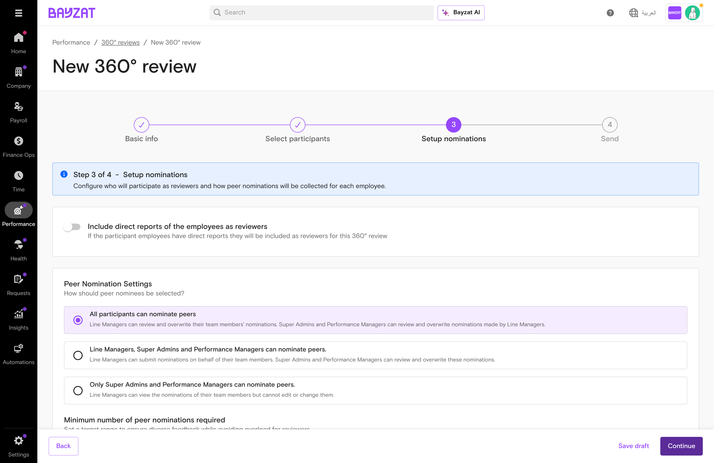
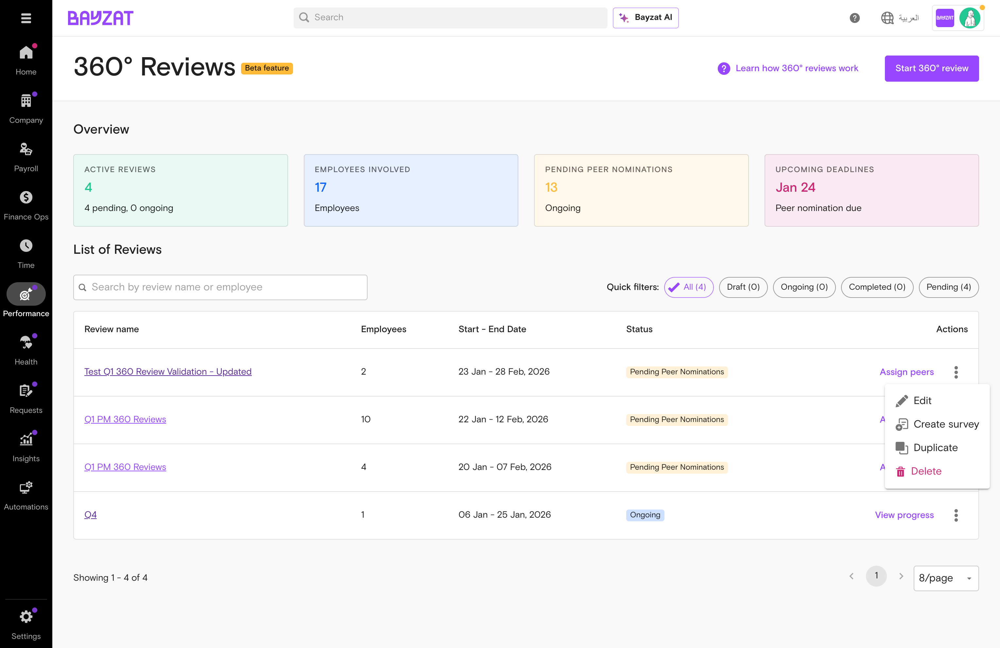
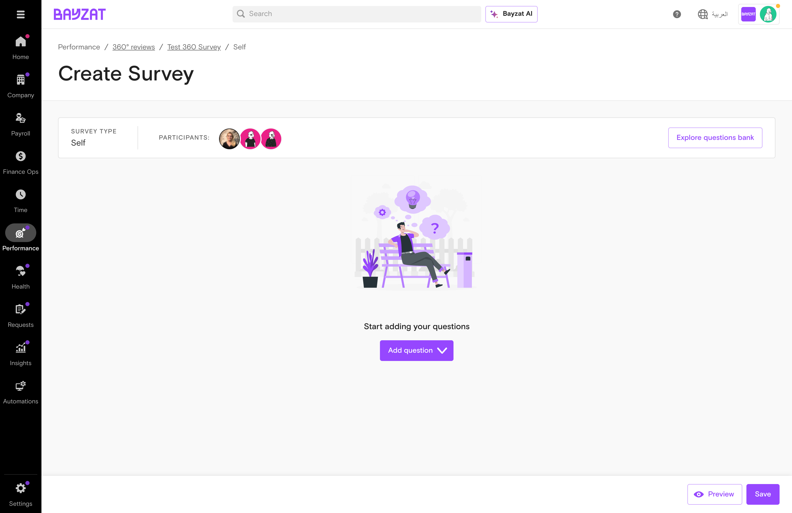
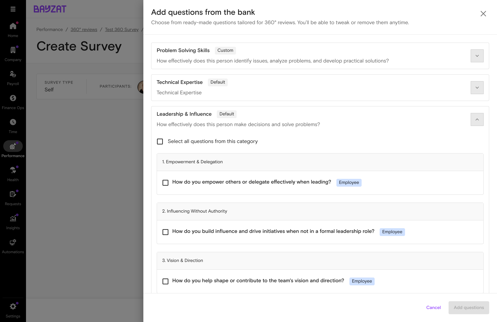
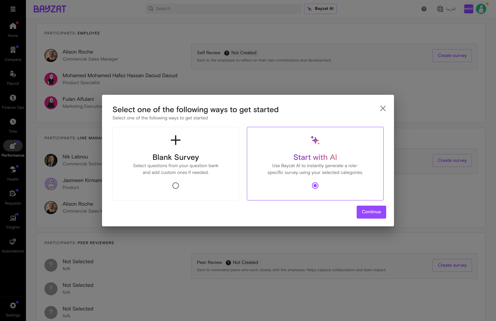
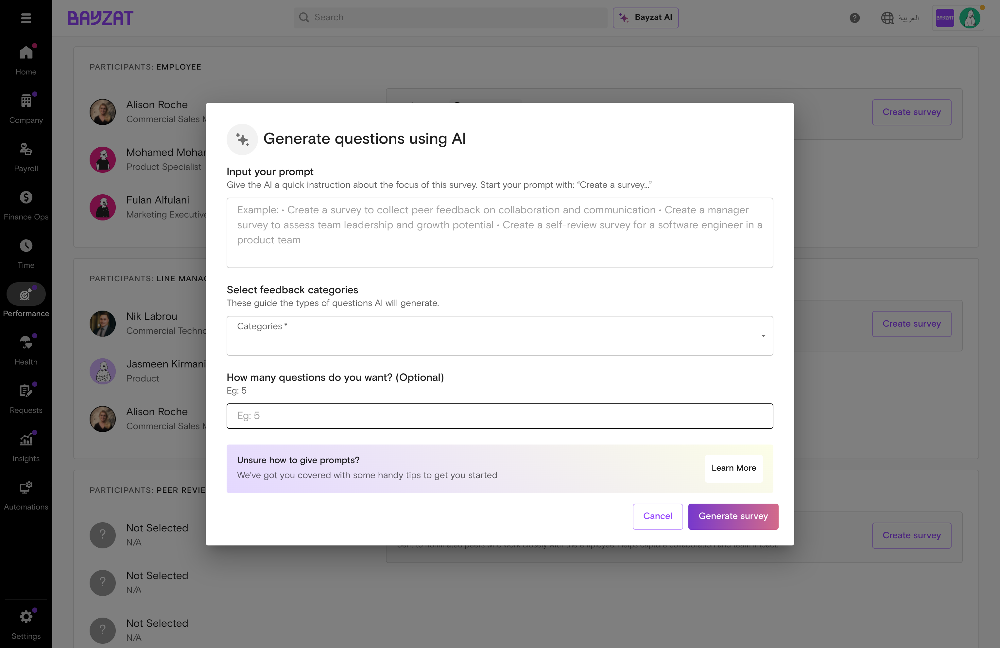
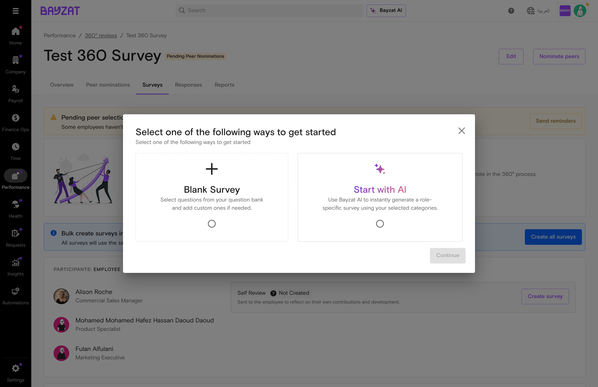
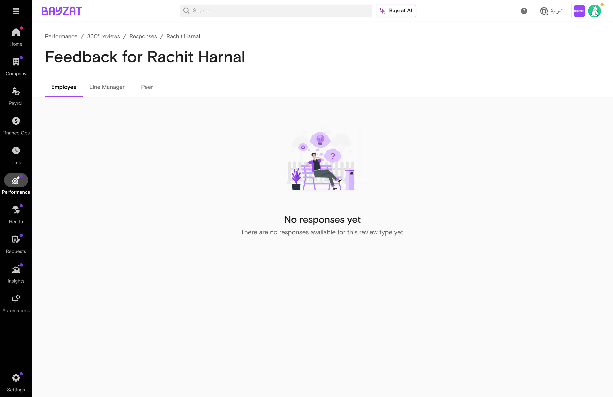

# 360° Feedback

Gather comprehensive feedback from peers, managers, and direct reports for holistic performance insights

📖 Quick Navigation

<a href="#feature-overview" class="nav-card">✨Feature Overview</a> <a href="#product-foundation" class="nav-card">🏗️Product Foundation</a> <a href="#user-journey" class="nav-card">🗺️User Journey</a> <a href="#feature-discovery" class="nav-card">🔍Feature Discovery</a> <a href="#setup-process" class="nav-card">⚙️Setup Process</a> <a href="#feature-usage" class="nav-card">📋Feature Usage</a> <a href="#troubleshooting" class="nav-card">🔧Troubleshooting</a> <a href="#support-resources" class="nav-card">💬Support Resources</a>

<figure>

<figcaption aria-hidden="true">360° Reviews management interface in Bayzat HR</figcaption>
</figure>

## What is 360° Reviews?

### Overview

360° Reviews is a comprehensive performance feedback system within Bayzat that enables organizations to collect multi-directional feedback about employees. Unlike traditional top-down performance reviews, 360° feedback gathers input from peers, direct reports, managers, and the employee themselves to provide a complete view of performance and development areas.

### Key Benefits

- Gather feedback from multiple perspectives for holistic performance insights
- Structured workflow ensures consistent feedback collection with clear timelines
- Employees nominate their own peers who work closely with them
- Customize feedback categories, questions, and rating scales to align with organizational values
- Real-time visibility into nomination status and survey completion

### Who Uses This Feature?

| User Role | What They Do | Value Proposition |
|----|----|----|
| **HR Administrators** | Create and manage 360° review cycles, configure feedback categories, and generate reports | Reduce feedback cycle coordination from weeks to days while ensuring every employee receives structured, unbiased developmental insights—eliminating spreadsheet chaos and manual follow-ups |
| **Performance Managers** | Oversee review cycles for their teams and access aggregated feedback reports | Make confident promotion, coaching, and development decisions backed by multi-perspective evidence rather than relying on single-source observations or gut instinct |
| **Employees** | Nominate peers for feedback, complete self-assessments, and view their feedback reports | Uncover blind spots and validate strengths through honest peer perspectives, giving you a clear roadmap for career growth that self-reflection alone cannot provide |
| **Peer Reviewers** | Provide confidential feedback on colleagues who nominated them | Help colleagues grow through honest, constructive observations in a safe, confidential format—contributing to team development without risking working relationships |

## Product Foundation Overview

### How 360° Feedback Fits

360° Reviews is a **multi-directional feedback system** within Bayzat's Performance suite that collects input from peers, managers, and direct reports. Each review cycle progresses through nomination, feedback collection, and report generation phases.

**Mental model:** Admin creates cycle → Employees nominate peers → Nominated peers provide feedback → System aggregates responses → Reports generated for holistic performance insights.

Properly configured 360° reviews provide comprehensive developmental insights that self-reflection or single-source evaluations cannot achieve.

### Key Decisions Before Setup

Answer these questions before creating a review cycle:

- **What competencies will you evaluate?** — Configure feedback categories (Technical Expertise, Leadership, Communication, Teamwork)
- **How many peers can employees nominate?** — Set nomination limits based on desired feedback breadth
- **What is the review timeline?** — Define nomination, feedback, and finalization periods
- **What rating scale will you use?** — Configure 3-10 point scales in Performance settings

### Related Features

- **Performance Reviews** — Standard review module that can incorporate 360° feedback results
- **Notifications** — System alerts for review invitations, nomination reminders, and deadlines
- **Employee Directory** — Source for participant selection and profile information
- **Organization Chart** — Defines reporting relationships for peer nomination eligibility

### Prerequisites & Requirements

| Requirement | Description | Status |
|----|----|----|
| Performance Module | 360° Reviews is part of the Performance management suite | Required |
| Employee Data | Employee profiles must exist with accurate reporting structures | Required |
| Feedback Categories | Define competency categories in Settings \> Performance \> 360° feedback | Required |

<figure>

<figcaption>Feedback categories (Technical Expertise, Leadership &amp; Influence, Values &amp; Culture Fit, etc.) available in 360° feedback settings</figcaption>
</figure>

**Known Gap:** Currently, the platform does not support viewing and managing 360 feedback reports for all participants in a consolidated manner. Users lack a unified interface to handle these reports efficiently. This functionality is planned for future releases. *(Reference: JRV-1932)*

## User Journey

### End-to-End Journey: 360° Feedback

From planning through feedback collection and review completion.

1

#### Planning & Setup

Create cycle → Define timeline → Select employees

<a href="#setup-process" class="phase-link">See setup →</a>

2

#### Peer Nomination

Invite participants → Nominate peers

<a href="#feature-usage" class="phase-link">See nominations →</a>

3

#### Survey Creation

Surveys tab → Design feedback forms → Add questions

<a href="#feature-usage" class="phase-link">See surveys →</a>

4

#### Feedback Collection

Survey invitations → Complete feedback

<a href="#feature-usage" class="phase-link">See collection →</a>

5

#### Review & Finalization

Reports tab → Generate reports

<a href="#feature-usage" class="phase-link">See reports →</a>

6

#### Post-Review Actions

Performance discussions → Development planning

<a href="#feature-usage" class="phase-link">See follow-up →</a>

### Decision Points in the Process

Administrators make several key decisions that shape the review experience:

| Decision Point | Options | Impact |
|----|----|----|
| Review Timeline | Duration for each phase (nomination, feedback, finalization) | Determines how much time participants have at each stage |
| Participant Selection | Which employees to include in the cycle | Defines scope and scale of the review |
| Nomination Settings | Number of peers, nomination criteria | Influences breadth and diversity of feedback |
| Survey Configuration | Question selection from question bank, feedback categories | Shapes the type and depth of feedback collected |

### Expected Outcomes at Each Stage

Each phase produces specific deliverables and status changes:

- **After Creation:** Review appears in list with "Pending Peer Nominations" status, participants receive invitation emails
- **After Nominations:** Peer reviewer list is finalized, status updates to reflect nomination completion
- **After Survey Creation:** Feedback surveys are configured for each participant group (Self, Manager, Peer, Direct Reports), surveys show "Ready" status in Surveys tab
- **After Feedback Collection:** Survey responses are captured in system, completion metrics are updated
- **After Finalization:** 360° reports are generated, review status changes to "Completed"

### Typical Use Case Scenarios

#### Scenario 1: Quarterly Performance Reviews

An organization runs 360° feedback cycles quarterly for all team leads and managers. The admin creates a review cycle named "Q1 2024 Leadership Review" with a 2-week nomination period, 3-week feedback period, and 1-week finalization period. Participants nominate 5-7 peers, and feedback focuses on leadership competencies from the question bank.

#### Scenario 2: Annual Comprehensive Assessment

For annual reviews, the admin launches a company-wide 360° cycle covering all employees. The timeline extends to 3 weeks for nominations and 4 weeks for feedback collection to accommodate the larger participant pool. The survey includes questions across all feedback categories: Technical Expertise, Leadership & Influence, Values & Culture Fit, Flexibility and Adaptability, Reliability and Dependability, Communication Skills, and Teamwork and Collaboration.

#### Scenario 3: New Manager Onboarding

When promoting employees to management roles, the admin creates targeted 360° reviews for new managers after their first 90 days. The review focuses on early leadership indicators and helps identify development areas. A shorter timeline (1 week nomination, 2 weeks feedback) keeps the process agile.

**Best Practice:** Monitor the "Overview" dashboard regularly during active review cycles. The cards showing "Active reviews," "Employees involved," "Pending peer nominations," and "Upcoming deadlines" provide at-a-glance status to keep cycles on track.

## How to Access 360° Reviews

The 360° Reviews feature is accessible through the Performance module. As a beta feature, it includes specific navigation indicators to help users identify its current development status.

### Primary Navigation Path

To access 360° Reviews:

**Performance** → **360° reviews Beta**

1.  Click on **Performance** in the main navigation menu
2.  Select **360° reviews** from the Performance submenu
3.  Note the **Beta** badge indicating the feature is in testing phase

<figure class="screenshot-container">

<figcaption aria-hidden="true">Accessing 360° Reviews from the Performance menu</figcaption>
</figure>

### Landing Page Overview

Upon accessing the feature, you arrive at the 360° Reviews dashboard, which displays:

- **Overview Cards:** Quick metrics showing active reviews, employees involved, pending peer nominations, and upcoming deadlines
- **Action Button:** "Start 360° review" button to create new review cycles
- **Help Resources:** "Learn how 360° reviews work" link to Zendesk documentation
- **Reviews List:** Table showing all review cycles with filters and search

<figure class="screenshot-container">

<figcaption aria-hidden="true">360° Reviews dashboard with overview cards and reviews list</figcaption>
</figure>

### Quick Access Methods

#### Starting a New Review

From the main dashboard, click the **"Start 360° review"** button in the top-right corner to immediately launch the review creation wizard.

#### Accessing Existing Reviews

Use the reviews list table to access existing cycles:

- **Quick Filters:** All, Draft, Ongoing, Completed, Pending
- **Search Bar:** Search by review name or employee name
- **Table Columns:** Review name, Employees, Start - End Date, Status, Actions
- **Action Menu:** Three-dot menu for Edit, Create survey, Duplicate, Delete

#### Review Detail Views

Click any review name in the list to open the detail page with five tabs:

- **Overview:** Review summary and timeline
- **Peer nominations:** Nomination status and management
- **Surveys:** Feedback survey configuration
- **Responses:** Collected feedback tracking
- **Reports:** Generated 360° reports

<figure class="screenshot-container">

<figcaption aria-hidden="true">Review detail page with navigation tabs</figcaption>
</figure>

### Settings and Configuration

To access 360° feedback system settings:

**Settings** → **Performance** → **360° feedback**

The settings area includes two configuration tabs:

- **Feedback categories:** Manage categories like Technical Expertise, Leadership & Influence, Values & Culture Fit, Flexibility and Adaptability, Reliability and Dependability, Communication Skills, Teamwork and Collaboration
- **Question bank:** Configure feedback questions used in surveys

<figure class="screenshot-container">

<figcaption aria-hidden="true">360° feedback settings with feedback categories and question bank</figcaption>
</figure>

### URL Patterns

While direct URL access depends on your Bayzat instance configuration, the typical pattern follows:

- **Main Dashboard:** `/performance/360-reviews`
- **Review Detail:** `/performance/360-reviews/[review-id]`
- **Settings:** `/settings/performance/360-feedback`

**Beta Feature Notice:** The Beta badge indicates this feature is actively being refined based on user feedback. Expect periodic updates and enhancements as the feature matures toward general availability.

## Initial Setup

Before launching your first 360° review cycle, complete the initial system configuration to ensure smooth operation and meaningful feedback collection.

### Prerequisites Checklist

Verify these items are in place before setup:

- Admin access to Performance module
- Employee records populated in Bayzat HR
- Clear understanding of your review objectives and timeline
- Defined feedback competencies relevant to your organization

### Step 1: Configure Feedback Categories

Feedback categories organize the competencies you'll assess in 360° reviews.

1.  Navigate to **Settings** → **Performance** → **360° feedback**
2.  Select the **Feedback categories** tab
3.  Review the default categories provided:
    - Technical Expertise
    - Leadership & Influence
    - Values & Culture Fit
    - Flexibility and Adaptability
    - Reliability and Dependability
    - Communication Skills
    - Teamwork and Collaboration
4.  Customize categories to align with your organization's competency framework
5.  Save your configuration

<figure class="screenshot-container">

<figcaption>Configuring feedback categories in settings</figcaption>
</figure>

**Recommendation:** Start with 4-6 core categories for your first review cycle. You can expand as you gain experience with the 360° process.

### Step 2: Build Your Question Bank

The Question Bank is a centralized repository where you create and store all the feedback questions used in 360° review surveys. Questions are organized by feedback category, allowing you to build a reusable library of questions that can be selected when creating surveys for different review cycles.

1.  In the 360° feedback settings, select the **Question bank** tab
2.  Create questions aligned to each feedback category
3.  Write clear, behavioral questions that prompt specific examples
4.  Consider using a mix of rating scales and open-ended questions
5.  Save questions to the bank for reuse across review cycles

**Best Practice:** Effective 360° questions focus on observable behaviors rather than personality traits. For example: "How effectively does this person communicate project updates to stakeholders?" rather than "Is this person a good communicator?"

### Step 3: Verify Employee Data

Ensure employee information is current and complete:

1.  Navigate to **HR** → **Employees**
2.  Verify that all employees who will participate in 360° reviews have:
    - Active employment status
    - Correct reporting relationships
    - Valid email addresses
    - Appropriate role/department assignments
3.  Update any outdated information before launching reviews

### Step 4: Plan Your First Review Cycle

Before creating your first review, document your plan:

<table>
<colgroup>
<col style="width: 50%" />
<col style="width: 50%" />
</colgroup>
<thead>
<tr>
<th>Planning Element</th>
<th>Considerations</th>
</tr>
</thead>
<tbody>
<tr>
<td><strong>Review Name</strong></td>
<td>Use a clear naming convention (e.g., "Q1 2024 Leadership 360")</td>
</tr>
<tr>
<td><strong>Timeline</strong></td>
<td>Nomination period: 1-2 weeks 
Feedback period: 2-3 weeks 
Finalization period: 1 week</td>
</tr>
<tr>
<td><strong>Participants</strong></td>
<td>Start with a pilot group (10-20 employees) for your first cycle</td>
</tr>
<tr>
<td><strong>Nomination Criteria</strong></td>
<td>How many peers should each participant nominate? (typically 3-7)</td>
</tr>
<tr>
<td><strong>Communication</strong></td>
<td>Prepare announcement and instructions for participants</td>
</tr>
</tbody>
</table>

### Recommended Default Values

For your first 360° review cycle, consider these starting points:

- **Nomination Period:** 2 weeks
- **Feedback Submission Period:** 3 weeks
- **Review Finalization Period:** 1 week
- **Peer Nominations:** 5-7 peers per participant
- **Feedback Categories:** 4-5 core competencies
- **Questions per Category:** 2-3 questions

### Verification Steps

Before launching your first review cycle, verify:

1.  Feedback categories are configured and relevant
2.  Question bank contains sufficient questions
3.  Rating scale is set up (if using rated questions)
4.  Employee data is current and complete
5.  Review timeline is planned and communicated
6.  Pilot participant group is identified

**Beta Feature Consideration:** As 360° Reviews is currently in beta, monitor for system updates and new features. Bayzat may release enhancements that improve functionality or add new capabilities during your review cycles.

### Next Steps

With initial setup complete, you're ready to create your first 360° review cycle. Proceed to the Core Tasks section for step-by-step instructions on creating, managing, and completing review cycles.

## Feature Usage with Common Workflows

This section covers the essential tasks for managing 360° review cycles in Bayzat. All operations follow a structured workflow using a multi-step wizard interface.

### Creating a 360° Review Cycle

To create a new 360° review cycle:

1.  Navigate to **Performance \> 360° reviews Beta**
2.  Click the **Start 360° review** button
3.  Complete the 4-step creation wizard:
    - **Step 1: Basic Info** - Enter review name and configure timeline periods
    - **Step 2: Select Participants** - Choose employees to include in the review cycle
    - **Step 3: Setup Nominations** - Configure peer nomination settings
    - **Step 4: Review and Send** - Review summary and send invitations

<figure class="screenshot-container">

<figcaption>360° Reviews dashboard with overview cards and reviews list</figcaption>
</figure>

#### Step 1: Basic Information

In the first step, provide the following details:

- **Review Name**: Enter a descriptive name for the review cycle (e.g., "Q1 2024 360° Review")
- **Peer Nomination Period**: Set start and end dates for when employees can nominate peers
- **Feedback Submission Period**: Define when feedback can be submitted
- **Review Finalization Period**: Set the deadline for completing all reviews

<figure class="screenshot-container">

<figcaption aria-hidden="true">Completed basic information form</figcaption>
</figure>

#### Step 2: Select Participants

Choose which employees will participate in this 360° review cycle. You can search for employees by name or select from the employee list.

<figure class="screenshot-container">

<figcaption aria-hidden="true">Participant selection interface</figcaption>
</figure>

<figure class="screenshot-container">

<figcaption aria-hidden="true">Employees selected for the review cycle</figcaption>
</figure>

#### Step 3: Setup Peer Nominations

Configure how peer nominations will work for this review cycle, including the number of peers each employee should nominate and any specific nomination rules.

<figure class="screenshot-container">

<figcaption aria-hidden="true">Peer nomination configuration</figcaption>
</figure>

#### Step 4: Review and Send

Review all settings and participant information before sending invitations. This step displays a summary of:

- Review name and timeline
- Number of participants
- Nomination settings
- Feedback submission details

<figure class="screenshot-container">

<figcaption aria-hidden="true">Final review summary before sending</figcaption>
</figure>

Click **Send** to create the review cycle and send invitations to participants. A success message will confirm: "360° review created and participants invited".

<figure class="screenshot-container">

<figcaption aria-hidden="true">Success confirmation after creating the review</figcaption>
</figure>

The newly created review will appear in the main list with status "Pending Peer Nominations".

<figure class="screenshot-container">

<figcaption aria-hidden="true">New review displayed in the reviews list</figcaption>
</figure>

### Viewing 360° Review Details

To view details of an existing 360° review cycle:

1.  Navigate to **Performance \> 360° reviews Beta**
2.  Locate the review in the **List of Reviews** table
3.  Click on the review name to open the detail view

The detail view provides multiple tabs for comprehensive review management:

- **Overview**: Summary of review timeline, participants, and current status
- **Peer nominations**: Track peer nomination progress
- **Surveys**: Manage feedback surveys
- **Responses**: View submitted feedback responses
- **Reports**: Access generated 360° feedback reports

<figure class="screenshot-container">

<figcaption aria-hidden="true">360° review detail page with multiple management tabs</figcaption>
</figure>

**Quick Filters:** Use the status filters (All, Draft, Ongoing, Completed, Pending) to quickly find reviews at specific stages. You can also search by review name or employee name.

### Editing a 360° Review Cycle

To modify an existing 360° review cycle:

1.  Navigate to the review in the **List of Reviews** table
2.  Click the three-dot action menu next to the review
3.  Select **Edit** from the dropdown menu
4.  The same 4-step wizard used for creation will open with pre-filled information
5.  Make your changes in any of the four steps
6.  Click through to the final step and save your changes

<figure class="screenshot-container">

<figcaption aria-hidden="true">Editing an existing 360° review using the wizard</figcaption>
</figure>

After saving, a success message confirms the changes have been applied. The updated information will be reflected in the main list view.

<figure class="screenshot-container">

<figcaption aria-hidden="true">Confirmation that changes were saved successfully</figcaption>
</figure>

**Note:** Changes to active review cycles may affect participants who have already started the nomination or feedback process. Consider the impact before making significant modifications to ongoing reviews.

### Deleting a 360° Review Cycle

To permanently remove a 360° review cycle:

1.  Navigate to the review in the **List of Reviews** table
2.  Click the three-dot action menu next to the review
3.  Select **Delete** from the dropdown menu

<figure class="screenshot-container">

<figcaption aria-hidden="true">Accessing the delete option from the action menu</figcaption>
</figure>

A confirmation dialog will appear with the warning:

> "Are you sure you want to delete this 360° review? This 360° review will be permanently deleted and cannot be recovered."

<figure class="screenshot-container">

<figcaption aria-hidden="true">Delete confirmation dialog</figcaption>
</figure>

Click **Confirm** to proceed with deletion. A success message will display: "360° review deleted successfully."

<figure class="screenshot-container">

<figcaption aria-hidden="true">Confirmation that the review was deleted</figcaption>
</figure>

**Permanent Deletion:** Deleted 360° reviews cannot be recovered. All associated data including peer nominations, feedback responses, and reports will be permanently removed. Ensure you have exported any necessary reports before deleting a review cycle.

### Additional Review Management Tasks

#### Duplicating a Review Cycle

To create a copy of an existing review cycle:

1.  Click the three-dot action menu next to the review
2.  Select **Duplicate**
3.  The creation wizard opens with pre-filled settings from the original review
4.  Modify the review name and dates as needed
5.  Complete the wizard to create the duplicate

This feature is useful for running recurring review cycles with similar settings.

#### Creating Surveys

Survey creation is a critical step in the 360° review process. After creating a review and inviting participants, you design tailored feedback forms for each participant group: employees (self-review), line managers, peers, and direct reports.

##### Post-Creation: Setting Up Surveys

Immediately after creating a 360° review and sending invitations, you'll see a success dialog with an option to set up surveys:

<figure class="screenshot-container">

<figcaption>Success dialog after creating a review - click "Set up surveys now" to proceed directly to survey configuration</figcaption>
</figure>

Click **Set up surveys now** to navigate directly to the Surveys tab, or access it later from the review detail page.

##### Surveys Tab Overview

The Surveys tab displays all participant groups that need survey configuration:

1.  Navigate to the review detail page by clicking the review name
2.  Click the **Surveys** tab
3.  You'll see survey cards for each participant group showing their readiness status

<figure class="screenshot-container">

<figcaption>Surveys tab showing participant groups (Employee Self Review, Manager Review, Peer Reviewers) with "Create survey" buttons and bulk "Create all surveys" option</figcaption>
</figure>

Each participant group card shows:

- **Group name:** Employee Self Review, Manager Review, Direct Reports Review, or Peer Reviewers
- **Status:** Whether a survey has been created for this group
- **Create survey button:** To create an individual survey for that group

At the top of the tab, you'll find the **Create all surveys** button to bulk-create surveys for all groups at once.

##### Survey Types

Each review cycle includes four survey types:

- **Self Review:** Sent to employees to reflect on their own contributions and development
- **Manager Review:** Sent to the employee's direct manager for performance feedback and development insights
- **Direct Reports Review:** Sent to employee's direct reports to capture leadership and coaching impact
- **Peer Review:** Sent to nominated peers who work closely with the employee to capture collaboration and team impact

##### Survey Creation Modes

When creating a survey (either individually or in bulk), you'll be presented with two creation modes:

<figure class="screenshot-container">

<figcaption>Choose between "Blank Survey" (build from scratch) or "Start with AI" (let Bayzat AI generate questions)</figcaption>
</figure>

1.  **Blank Survey:** Build your survey from scratch by selecting questions from the Question Bank or creating custom questions
2.  **Start with AI:** Let Bayzat AI generate role-specific survey questions based on your requirements

##### Option 1: Creating a Blank Survey

When you select "Blank Survey" and click Continue:

<figure class="screenshot-container">

<figcaption>Blank survey creation interface with "Explore questions bank" and "Add question" options</figcaption>
</figure>

The blank survey interface provides two ways to add questions:

- **Explore questions bank:** Browse and select from pre-built questions organized by category
- **Add question:** Create custom questions from scratch

###### Using the Question Bank

Click "Explore questions bank" to open the Question Bank dialog:

<figure class="screenshot-container">

<figcaption>Question Bank organized by 8 feedback categories - click any category to expand and view available questions</figcaption>
</figure>

The Question Bank includes questions organized by feedback categories:

- Problem Solving Skills
- Technical Expertise
- Leadership & Influence
- Values & Culture Fit
- Flexibility and Adaptability
- Reliability and Dependability
- Communication Skills
- Teamwork and Collaboration

Click on any category to expand it and see the available questions:

<figure class="screenshot-container">

<figcaption>Expanded "Leadership &amp; Influence" category showing individual questions with checkboxes for selection</figcaption>
</figure>

Select the questions you want to include by checking the boxes, then click "Add selected" to add them to your survey.

##### Option 2: Creating with AI

When you select "Start with AI" and click Continue:

<figure class="screenshot-container">

<figcaption>Selecting the "Start with AI" option to let Bayzat AI generate survey questions</figcaption>
</figure>

The AI generation interface opens with the following configuration options:

<figure class="screenshot-container">

<figcaption>AI survey generation form with prompt input, category selection, and question count configuration</figcaption>
</figure>

Configure the AI generation with:

- **Prompt:** Describe the role or context for which questions should be generated (e.g., "Generate questions for evaluating a software engineer's technical skills and collaboration")
- **Category selection:** Choose which feedback categories to include in the generated questions
- **Number of questions:** Specify how many questions you want AI to generate

Click "Generate" to have Bayzat AI create role-specific questions based on your input. You can review and edit the generated questions before saving.

##### Bulk Creating Surveys

To create surveys for all participant groups at once, click the **Create all surveys** button at the top of the Surveys tab:

<figure class="screenshot-container">

<figcaption>Bulk create also presents the same mode selection - choose Blank Survey or Start with AI for all groups</figcaption>
</figure>

The bulk create option presents the same two modes (Blank Survey or Start with AI), but applies your choice to all participant groups simultaneously. This is useful when you want consistent survey structure across all reviewer types.

**Tip:** Use the "Blank Survey" option with the Question Bank for maximum control over question selection. Use "Start with AI" when you want role-specific questions generated quickly and are open to reviewing AI suggestions.

##### Building Survey Questions

Whether you start with a blank survey or AI-generated questions, you can always:

- Add questions manually using the **Add question** button
- Select additional questions from the **Question Bank**
- Choose question types: Opinion scale, Multiple choice, or Free text
- Configure scale settings (3-10 points for rating questions)
- Set questions as required or optional
- Reorder questions by dragging
- Preview the survey before saving

**Important:** Surveys must be created and saved before participants can submit feedback. Monitor the Surveys tab to ensure all participant groups have surveys configured before the feedback submission period begins.

### Tracking Responses (Feedback Collection)

Once surveys are created and distributed, the Responses tab becomes your central hub for monitoring feedback collection progress. This phase is critical for ensuring high participation rates and timely feedback submission.

#### Admin View: Response Tracking Dashboard

To monitor feedback collection:

1.  Navigate to the review detail page by clicking the review name
2.  Click the **Responses** tab
3.  View the employee list showing completion status for each participant

The Responses tab displays:

- **Search:** Search by employee name to find specific participants
- **Quick Filters:** All, Not started, In progress, Completed - filter by response status
- **Employee List:** Shows each participant with their avatar, name, and job title
- **Responses Received:** Shows the count of responses received vs total expected (e.g., "0/6" means 0 of 6 expected responses received)
- **Status:** Current completion status (Not started, In progress, Completed)
- **Actions:** View individual feedback details or Send reminders to pending respondents

<figure class="screenshot-container">

<figcaption>Responses tab with employee list showing feedback collection progress and quick filters</figcaption>
</figure>

#### Viewing Individual Feedback

To view detailed feedback for a specific employee:

1.  In the Responses tab, locate the employee
2.  Click the **View** button in the Actions column
3.  The individual feedback page opens with tabs for each reviewer type

The individual feedback view includes:

- **Employee Tab:** Self-review responses (if self-review survey was included)
- **Line Manager Tab:** Feedback from the employee's direct manager
- **Peer Tab:** Feedback from nominated peers

<figure class="screenshot-container">

<figcaption>Individual feedback view showing Employee, Line Manager, and Peer tabs</figcaption>
</figure>

**Tip:** Use the "Send reminders" action to prompt employees who haven't submitted their feedback. This helps maintain high response rates without manual follow-up.

#### Employee View: Responding to Surveys

Employees access their 360° review surveys through a dedicated personal interface:

**Performance** → **My 360° reviews Beta**

The employee's "My 360° reviews" page includes:

- **Overview Tab:** Shows feedback shared about the employee once available
- **Peer nominations Tab:** Where employees nominate their peers for feedback
- **Surveys Tab:** Lists all surveys the employee needs to complete (feedback about colleagues)
- **Reports Tab:** Access to finalized 360° feedback reports

<figure class="screenshot-container">

<figcaption>Employee's "My 360° reviews" page with Overview, Peer nominations, Surveys, and Reports tabs</figcaption>
</figure>

When surveys are available, employees see them in the Surveys tab with clear calls to action to complete feedback for each colleague they've been asked to review.

<figure class="screenshot-container">

<figcaption>Surveys tab where employees find feedback surveys to complete</figcaption>
</figure>

#### Monitoring Review Progress

The Overview page provides real-time metrics:

- **Active reviews**: Number of currently running review cycles
- **Employees involved**: Total participants across all active reviews
- **Pending peer nominations**: Number of outstanding peer nominations
- **Upcoming deadlines**: Next important dates for review activities

Use these metrics to track overall 360° feedback program health and identify reviews requiring attention.

## Workflow Integration

**No Workflow Integration Available:** The 360° Feedback module does not currently integrate with Bayzat Workflows. No triggers or actions are available for automating 360° review processes. All review management must be done manually through the 360° Reviews interface.

### Potential Workflow Scenarios

While workflow integration is not currently available, the following scenarios illustrate how automation could add value to 360° feedback processes in future releases:

#### Scenario 1: Automated Review Cycle Notifications

**Potential Benefit:** Automatically notify managers and HR when key milestones occur in the review cycle.

- **Trigger:** 360° review cycle created
- **Action:** Send email to all participants with review timeline and expectations
- **Business Value:** Ensures all stakeholders are immediately informed when a new review cycle begins

#### Scenario 2: Peer Nomination Reminders

**Potential Benefit:** Send automated reminders to employees who haven't completed peer nominations.

- **Trigger:** Peer nomination deadline approaching (3 days before)
- **Action:** Send reminder notification to employees with pending nominations
- **Business Value:** Reduces administrative burden on HR and increases nomination completion rates

#### Scenario 3: Feedback Submission Follow-ups

**Potential Benefit:** Track and follow up on incomplete feedback submissions.

- **Trigger:** Feedback submission period halfway complete
- **Action:** Generate report of pending feedback submissions and notify HR
- **Business Value:** Enables proactive intervention to ensure high response rates

#### Scenario 4: Report Generation and Distribution

**Potential Benefit:** Automatically generate and distribute 360° feedback reports when reviews are finalized.

- **Trigger:** Review finalization period ends
- **Action:** Generate individual reports and notify employees and managers
- **Business Value:** Streamlines the final stage of the review process

#### Scenario 5: Integration with Performance Reviews

**Potential Benefit:** Connect 360° feedback results with formal performance review cycles.

- **Trigger:** 360° review completed
- **Action:** Update employee performance record with 360° feedback summary
- **Business Value:** Creates a comprehensive view of employee performance

## Business Rules and Limitations

### Business Rules

The 360° Feedback feature operates under the following business rules:

- **Review Lifecycle:** Reviews progress through defined stages: Draft → Ongoing → Completed. Each stage has specific actions available.
- **Participant Selection:** Only active employees can be selected as participants in a 360° review cycle.
- **Time Periods:** Three distinct time periods must be configured: Peer nomination period, Feedback submission period, and Review finalization period. These periods cannot overlap and must be sequential.
- **Peer Nominations:** Employees must nominate peers during the designated nomination period. The number of required nominations can be configured per review cycle.
- **Survey Configuration:** Feedback surveys use questions from the Question Bank and are organized by Feedback Categories (Technical Expertise, Leadership & Influence, Values & Culture Fit, Flexibility and Adaptability, Reliability and Dependability, Communication Skills, Teamwork and Collaboration).
- **Rating Scale:** Reviews use the organization's configured rating scale (3-10 points) as defined in Settings \> Performance \> Rating Scale.
- **Deletion Policy:** Deleted 360° reviews are permanently removed and cannot be recovered. All associated data including nominations, surveys, responses, and reports are deleted.
- **Beta Status:** This feature is currently in beta testing phase, indicated by the "Beta" badge in the navigation. Functionality may be subject to change based on user feedback.

### Known Limitations

**No Critical Limitations Identified:** During validation testing, no blocking limitations were discovered for this feature. All core CRUD operations (Create, Read, Update, Delete) functioned as expected.

#### Feature Gaps

The following enhancement has been identified and is tracked in Jira:

| Gap Description | Impact | Status | Reference |
|----|----|----|----|
| No consolidated view for managing all participants' 360 feedback reports | Users must navigate to individual employee records to view and manage 360 feedback reports. There is no unified interface to handle reports collectively across all participants in a review cycle. | Feature request under consideration | JRV-1932 |

#### Integration Limitations

**Workflow Integration:** The 360° Feedback feature does not currently support Bayzat Workflows. No triggers or actions are available for automation. All review processes must be managed manually through the 360° Reviews interface.

#### Best Practices

- **Plan Time Periods Carefully:** Ensure adequate time for each phase (nominations, feedback submission, finalization) based on your organization size and review complexity.
- **Communicate Deadlines:** Proactively notify participants about upcoming deadlines shown in the Overview dashboard.
- **Configure Question Bank First:** Set up your feedback questions and categories in Settings before creating review cycles to streamline the survey creation process.
- **Test with Small Groups:** Given the beta status, consider piloting with a small group before rolling out organization-wide.
- **Regular Monitoring:** Use the Overview cards to track Active reviews, Employees involved, Pending peer nominations, and Upcoming deadlines.

## Troubleshooting & Edge Cases

### Common Issues

| Issue | Cause | Resolution |
|----|----|----|
| Cannot find employee in participant selection | Only active employees appear in selection list | Verify employee status in directory; inactive employees cannot be added |
| Time period validation errors | Time periods must be sequential and non-overlapping | Ensure nomination ends before feedback begins, and feedback ends before finalization |
| "Start 360° review" button disabled | Insufficient permissions or missing prerequisites | Verify admin access to Performance module |
| Pending nominations not decreasing | Employees haven't received or understood nomination process | Check Peer nominations tab and send reminder communications |
| Cannot remove participant from ongoing review | Participant removal restricted after review starts | Edit if Draft status; otherwise wait for cycle completion |
| "Create survey" option not working | Missing configuration or wrong review status | Verify Question Bank and Feedback Categories are configured |
| Cannot view responses | Responses not submitted or permission issues | Check Responses tab for submission status and verify permissions |
| Reports tab shows no data | Review not completed or insufficient responses | Verify review has "Completed" status and response thresholds met |
| Accidentally deleted a review | Deletion is permanent and irreversible | Cannot recover; use Duplicate feature for backups before changes |

### Known Limitations

**Consolidated Reports:** No unified interface for viewing all participants' 360 feedback reports. Navigate to individual employee profiles or use the Reports tab within each review. (Reference: JRV-1932)

**Workflow Integration:** No 360° Feedback triggers or actions are available in Bayzat Workflows. All review processes must be managed manually.

### Edge Cases

- **Employee terminated mid-review:** Complete review cycle before processing termination, or document incomplete review
- **Overlapping review cycles:** System allows this; communicate clearly about which cycle each feedback request belongs to
- **Duplicate review names:** Use naming conventions with unique identifiers (e.g., "Q1 2024 Leadership 360")
- **Beta feature updates:** Stay informed via Bayzat release notes; document your workflows and configurations

## Support Resources

### Frequently Asked Questions

What is a 360° review?

A 360° review is a comprehensive performance evaluation method where an employee receives feedback from multiple sources: managers, peers, direct reports, and sometimes external stakeholders. This multi-directional feedback provides a holistic view of an employee's performance, skills, and behaviors.

Who can create 360° reviews?

Administrators with access to the Performance module can create and manage 360° reviews. The specific permission requirements depend on your organization's role configuration in Bayzat.

How many employees can be included in a single review cycle?

There is no hard limit on the number of participants. However, consider the administrative overhead and time required for larger groups. The interface supports searching and filtering for managing larger participant lists.

Can I edit a review after it has started?

Yes, you can edit reviews using the Edit option in the action menu. The edit functionality uses the same 4-step wizard as creation. Consider the impact on participants who may have already started providing nominations or feedback.

What happens if an employee doesn't submit peer nominations by the deadline?

The system tracks pending peer nominations in the Overview dashboard. Monitor the count regularly, send reminders before the deadline, and follow up individually with employees who haven't completed nominations.

Can I duplicate a review from a previous cycle?

Yes, the "Duplicate" option is available in the review action menu. This creates a copy of the review configuration, which you can then modify for a new cycle. This is useful for recurring reviews where the structure remains similar.

How do I configure the feedback questions?

Feedback questions are managed in Settings \> 360° feedback configurations. You can create and organize questions in the Question Bank, group them into Feedback Categories, and customize categories to match your organization's competency framework.

What rating scale is used for feedback?

360° reviews use your organization's configured rating scale, set up in Settings \> Performance \> Rating Scale. The scale can be 3-10 points with optional "Not Applicable" (N/A) option.

Can I export 360° review data?

The Reports tab provides access to generated reports for completed reviews. Individual reports can be accessed through the Reports tab or employee profiles.

Is this feature available on mobile devices?

The feature is optimized for desktop use. For the best experience, access 360° reviews through a desktop or laptop computer. Mobile access capabilities should be verified with Bayzat support.

What does the "Beta" badge mean?

The Beta badge indicates this feature is in active testing and development. While fully functional, the feature may receive updates or changes based on user feedback. Report any issues or suggestions to Bayzat support.

### Getting Help

- Contact your HR Administrator for review setup and participant management support
- Bayzat Support Team - Available for technical issues and feature questions
- Knowledge Base - Access articles at <a href="https://bayzathelp.zendesk.com" target="_blank">bayzathelp.zendesk.com</a>
- In-app Help - Click "Learn how 360° reviews work" for contextual guidance

## Glossary of Terms

| Term | Definition |
|----|----|
| **360° Review** | A comprehensive performance evaluation method where an employee receives feedback from multiple sources including managers, peers, direct reports, and sometimes external stakeholders. Also known as multi-rater feedback or multi-source assessment. |
| **360° Review Cycle** | A complete iteration of the 360° feedback process, from initial setup through peer nominations, feedback collection, and final report generation. Each cycle has defined start and end dates and progresses through specific stages. |
| **Active Review** | A review cycle that is currently in progress, with ongoing activities such as peer nominations or feedback submission. Displayed in the Overview dashboard and can be filtered in the reviews list. |
| **Beta Feature** | A feature that is in active testing and development phase. While fully functional, beta features may receive updates or changes based on user feedback. Indicated by a "Beta" badge in the navigation. |
| **Completed Review** | A review cycle that has finished all phases including peer nominations, feedback submission, and finalization. Reports become available for completed reviews. |
| **Draft Review** | A review cycle that has been created but not yet sent to participants. Draft reviews can be edited or deleted without impacting employees. |
| **Feedback Categories** | Organizational groupings for feedback questions, such as Technical Expertise, Leadership & Influence, Values & Culture Fit, Flexibility and Adaptability, Reliability and Dependability, Communication Skills, and Teamwork and Collaboration. Configured in Settings \> 360° feedback configurations. |
| **Feedback Submission Period** | The time window during which participants provide feedback responses about their peers. This is the second phase of a 360° review cycle, following the peer nomination period. |
| **Ongoing Review** | A review cycle that is actively in progress, with participants currently nominating peers or submitting feedback. One of the status options in the review lifecycle. |
| **Participant** | An employee who is being evaluated in a 360° review cycle. Participants are selected in Step 2 of the review creation wizard and must be active employees. |
| **Peer Nomination** | The process where employees select colleagues who will provide feedback about them. Nominations occur during the designated peer nomination period and are tracked in the "Pending peer nominations" count. |
| **Peer Nomination Period** | The first phase of a 360° review cycle, during which participants nominate peers who will provide feedback about them. This period must be completed before the feedback submission period begins. |
| **Question Bank** | A repository of feedback questions configured in Settings \> 360° feedback configurations. Questions are organized by Feedback Categories and used to create surveys for review cycles. |
| **Rating Scale** | A numerical scale (3-10 points) used to grade feedback responses. Configured globally in Settings \> Performance \> Rating Scale, with customizable labels and descriptions for each point. May include an optional "Not Applicable" (N/A) option. |
| **Review Finalization Period** | The third and final phase of a 360° review cycle, during which feedback is compiled, reports are generated, and results are finalized. This period begins after the feedback submission period ends. |
| **Review Status** | The current state of a review cycle in its lifecycle. Possible statuses include: Draft (not yet sent), Ongoing (in progress), Completed (finished), and Pending (awaiting action). Used for filtering and tracking in the reviews list. |

Generated by Bayzat Documentation System

Last updated: 2026-01-30
