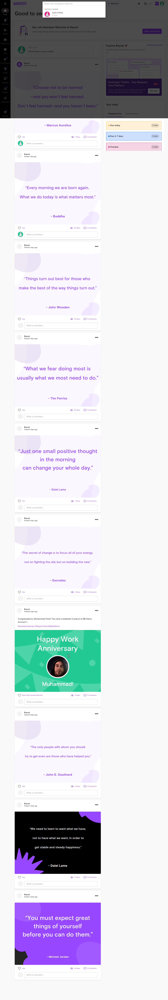
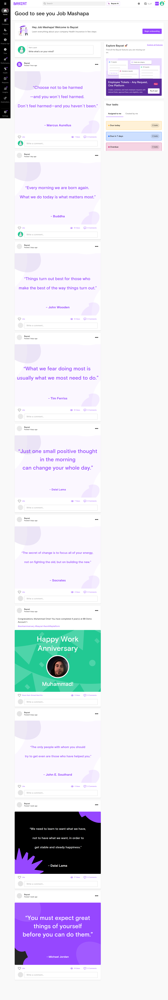
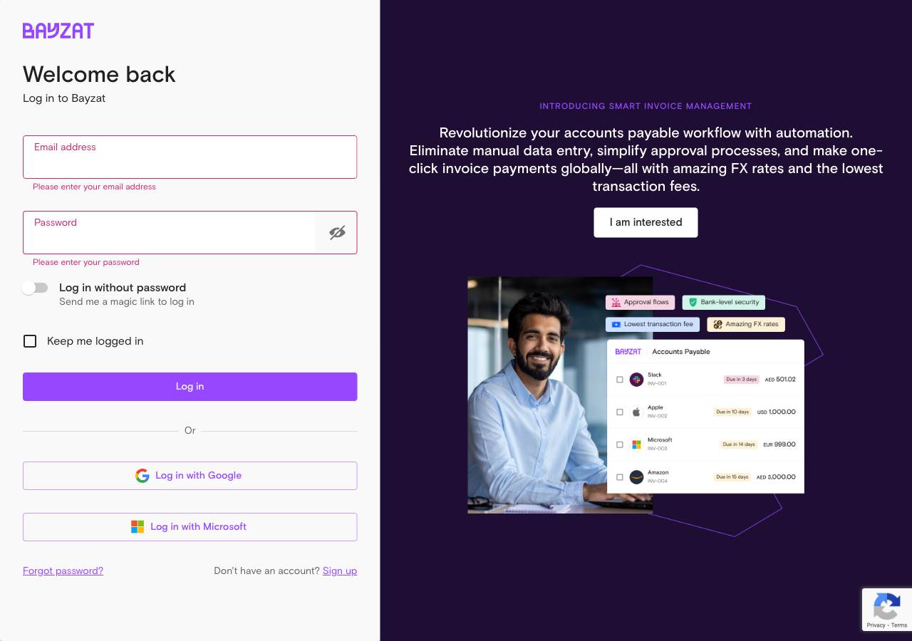

# Validation Report: 360_feedback

**Generated**: 2026-01-22T05:55:10Z
**Run ID**: 21237583765

## Result

```json
{
  "validation_status": "blocked",
  "login_success": true,
  "feature_accessible": false,
  "feature_info": {
    "name": "360 Feedback",
    "slug": "360-feedback",
    "category": "performance",
    "url": "/performance/360-reviews (attempted but not reached)"
  },
  "exploration_journey": [
    {
      "screen_name": "Login Page",
      "url": "https://app.bayzat.com/",
      "screenshot": "login_page-2026-01-22T05-47-49-927Z.png",
      "what_i_went_through": "Navigated to the Bayzat application login page using the provided URL",
      "what_i_came_across": "Standard login form with email and password fields, along with alternative login options",
      "what_i_saw": {
        "page_structure": "Centered login card with Bayzat branding, two input fields, and multiple authentication options",
        "visible_elements": [
          "Bayzat logo",
          "Welcome back heading",
          "Email address input field",
          "Password input field",
          "Keep me logged in checkbox",
          "Log in button (primary action)",
          "Log in without password link",
          "Log in with Google button",
          "Log in with Microsoft button",
          "Forgot password link",
          "Sign up link",
          "Promotional banner for Smart Invoice Management"
        ],
        "data_displayed": "Login form with no pre-filled data",
        "empty_states": "Empty form fields awaiting user input"
      },
      "actions_i_performed": [
        {
          "action": "Filled email field",
          "target": "Email address input (#id1)",
          "result": "Email address job+demoacct@bayzat.com successfully entered",
          "screenshot_after": "login_attempt-2026-01-22T05-50-27-038Z.png"
        },
        {
          "action": "Filled password field",
          "target": "Password input",
          "result": "Password successfully entered (masked)",
          "screenshot_after": "login_attempt-2026-01-22T05-50-27-038Z.png"
        },
        {
          "action": "Clicked Log in button",
          "target": "Submit button",
          "result": "Successfully authenticated and redirected to dashboard",
          "screenshot_after": "dashboard_after_login-2026-01-22T05-50-58-221Z.png"
        }
      ],
      "results_i_got": {
        "success_outcomes": [
          "Login completed successfully",
          "Redirected to home dashboard"
        ],
        "error_outcomes": [],
        "unexpected_behaviors": [
          "Initial attempts to fill form using JavaScript failed due to React form validation",
          "Required using Playwright's native fill method for successful form completion"
        ]
      }
    },
    {
      "screen_name": "Home Dashboard",
      "url": "https://app.bayzat.com/ (home/newsfeed)",
      "screenshot": "dashboard_after_login-2026-01-22T05-50-58-221Z.png",
      "what_i_went_through": "Successfully logged in and landed on the main dashboard showing company newsfeed and HR overview",
      "what_i_came_across": "Comprehensive HR dashboard with social feed, employee directory, document tracking, and various HR widgets",
      "what_i_saw": {
        "page_structure": "Left sidebar navigation, main content area with social feed, right sidebar with quick actions and widgets",
        "visible_elements": [
          "Left Sidebar Navigation: Home, Company, Payroll, Finance Ops, Time, Performance, Health, Requests, Insights, Automations, Settings",
          "Top bar: Search, Bayzat AI, Language selector (\u0627\u0644\u0639\u0631\u0628\u064a\u0629), user profile",
          "Main content: Newsfeed tab, Announcements tab (5 items), social posts with Like/Comment options",
          "Right sidebar widgets:",
          "- 'Good to see you' welcome message for Job Mashapa",
          "- Health Insurance onboarding prompt",
          "- Your tasks section (0 due today, 0 in 7 days, 0 overdue)",
          "- Employees directory preview (116 total employees)",
          "- Expiring documents section (Residency Visa, Passport tracking)",
          "- Integration prompts (Mudad, SAB, Muqeem)",
          "- Missing information alert (70 employees)",
          "- Active invitations (10 pending)",
          "- Upcoming celebrations (Birthdays, Work Anniversaries)",
          "- Recently viewed section"
        ],
        "data_displayed": "Social feed posts from Bayzat account, employee previews, document expiry calendar showing 0 documents expiring in next 6 months",
        "empty_states": "0 tasks in all categories, no upcoming hires, empty document expiries"
      },
      "actions_i_performed": [
        {
          "action": "Set localStorage flags to dismiss onboarding tours",
          "target": "Browser localStorage",
          "result": "Tour flags set for 8 different tour keys",
          "screenshot_after": "current_page-2026-01-22T05-52-16-720Z.png"
        },
        {
          "action": "Reloaded page to apply tour dismissal flags",
          "target": "Browser window",
          "result": "Page reloaded successfully, dashboard remained stable",
          "screenshot_after": "checking_navigation-2026-01-22T05-53-14-679Z.png"
        },
        {
          "action": "Multiple attempts to click Performance menu item",
          "target": "Performance link in left sidebar",
          "result": "FAILED - Performance menu did not respond to click actions via JavaScript, Playwright click selectors, or programmatic navigation",
          "screenshot_after": "checking_navigation-2026-01-22T05-53-14-679Z.png"
        },
        {
          "action": "Attempted programmatic navigation to /performance",
          "target": "window.location.href",
          "result": "FAILED - Navigation did not occur, remained on home page",
          "screenshot_after": "checking_navigation-2026-01-22T05-53-14-679Z.png"
        },
        {
          "action": "Pressed Meta+K to open command palette",
          "target": "Global keyboard shortcut",
          "result": "Partial success - 'Recently viewed' section appeared but search dialog did not open",
          "screenshot_after": "after_search_click-2026-01-22T05-53-37-653Z.png"
        },
        {
          "action": "Attempted to click Search button in header",
          "target": "Search element in top navigation",
          "result": "FAILED - Unable to trigger search functionality",
          "screenshot_after": "after_search_click-2026-01-22T05-53-37-653Z.png"
        }
      ],
      "results_i_got": {
        "success_outcomes": [
          "Successfully viewed dashboard layout",
          "Confirmed sidebar navigation menu is present with Performance option visible",
          "Successfully dismissed onboarding tours"
        ],
        "error_outcomes": [
          "Unable to navigate to Performance section despite multiple attempts",
          "Navigation links in sidebar appear to be non-responsive",
          "JavaScript-based navigation and React Router navigation both failed",
          "Search functionality did not activate when triggered"
        ],
        "unexpected_behaviors": [
          "Performance menu item is visible but not clickable through standard methods",
          "Application appears to use client-side routing that prevents direct URL navigation",
          "Search command palette (\u2318K) showed partial response (Recently viewed appeared) but did not fully activate",
          "Navigation system may require specific event handlers or state management that JavaScript automation cannot trigger"
        ]
      }
    }
  ],
  "tasks_explored": [
    {
      "task": "Create and manage 360 Review Surveys",
      "status": "blocked",
      "notes": "Unable to reach the 360 Reviews > Surveys section due to navigation blocking. The Performance menu in the sidebar is visible but does not respond to click events through Playwright automation, JavaScript execution, or programmatic URL navigation. Multiple navigation approaches were attempted including: direct element clicks, parent element traversal, keyboard shortcuts (\u2318K), search functionality, and window.location changes - all failed to navigate away from the home dashboard.",
      "screenshots": [
        "dashboard_after_login-2026-01-22T05-50-58-221Z.png",
        "checking_navigation-2026-01-22T05-53-14-679Z.png",
        "after_search_click-2026-01-22T05-53-37-653Z.png"
      ]
    }
  ],
  "full_behavior_catalog": {
    "buttons": [
      {
        "label": "Log in",
        "location": "Login page center",
        "state": "enabled after form validation",
        "action_result": "Authenticates user and redirects to dashboard"
      },
      {
        "label": "Begin onboarding",
        "location": "Dashboard right sidebar welcome widget",
        "state": "enabled",
        "action_result": "Not tested - unable to interact"
      },
      {
        "label": "Start a post",
        "location": "Dashboard main content area, top of newsfeed",
        "state": "enabled",
        "action_result": "Not tested - focused on navigation to 360 Feedback"
      },
      {
        "label": "Like (on posts)",
        "location": "Below each social post in newsfeed",
        "state": "enabled",
        "action_result": "Not tested"
      },
      {
        "label": "View all tasks",
        "location": "Your tasks widget in right sidebar",
        "state": "enabled",
        "action_result": "Not tested"
      },
      {
        "label": "Integrate Now (Muqeem)",
        "location": "Expiring documents widget",
        "state": "enabled",
        "action_result": "Not tested"
      },
      {
        "label": "Invite employees",
        "location": "Multiple locations in dashboard widgets",
        "state": "enabled",
        "action_result": "Not tested"
      }
    ],
    "dropdowns": [],
    "form_fields": [
      {
        "label": "Email address",
        "type": "email/text",
        "required": true,
        "placeholder": "Email address",
        "validation": "Email format validation, shows 'Please enter your email address' when empty on submit",
        "error_message": "Please enter your email address"
      },
      {
        "label": "Password",
        "type": "password",
        "required": true,
        "placeholder": "Password",
        "validation": "Required field validation, shows 'Please enter your password' when empty on submit",
        "error_message": "Please enter your password"
      },
      {
        "label": "Keep me logged in",
        "type": "checkbox",
        "required": false,
        "placeholder": "",
        "validation": "None",
        "error_message": ""
      }
    ],
    "tabs": [
      {
        "label": "Newsfeed",
        "content_summary": "Social feed showing company posts, announcements, and employee interactions",
        "item_count": "10+ posts visible"
      },
      {
        "label": "Announcements",
        "content_summary": "Company announcements and important updates",
        "item_count": "5 announcements"
      },
      {
        "label": "Assigned to me",
        "content_summary": "Tasks assigned to current user",
        "item_count": "0 tasks"
      },
      {
        "label": "Created by me",
        "content_summary": "Tasks created by current user",
        "item_count": "Unknown (not visible)"
      }
    ],
    "modals_dialogs": [],
    "tables": [],
    "filters": [],
    "notifications_alerts": [
      {
        "type": "info",
        "trigger": "On login",
        "message": "Welcome message: 'Good to see you Job Mashapa'"
      },
      {
        "type": "warning",
        "trigger": "On dashboard load",
        "message": "70 Employees missing information"
      },
      {
        "type": "info",
        "trigger": "On dashboard load",
        "message": "10 active invitations pending"
      }
    ]
  },
  "ui_behaviors_documented": {
    "disabled_states": [],
    "conditional_logic": [
      {
        "trigger": "Form validation on login",
        "result": "Error messages appear below fields when required fields are empty and submit is clicked"
      }
    ],
    "progressive_disclosure": [],
    "required_fields": [
      "Email address",
      "Password"
    ],
    "optional_fields": [
      "Keep me logged in"
    ],
    "default_values": [],
    "validation_rules": [
      {
        "field": "Email address",
        "rule": "Required, must be valid email format",
        "error_message": "Please enter your email address"
      },
      {
        "field": "Password",
        "rule": "Required",
        "error_message": "Please enter your password"
      }
    ],
    "tooltips_help_text": []
  },
  "what_works": [
    {
      "feature_aspect": "User Authentication",
      "description": "Login functionality works correctly with email and password. Form validation prevents empty submissions.",
      "user_benefit": "Secure access to the application with proper validation"
    },
    {
      "feature_aspect": "Dashboard Display",
      "description": "Home dashboard loads successfully showing comprehensive HR information including newsfeed, tasks, employee directory, and document tracking",
      "user_benefit": "Single pane of glass view of important HR data and activities"
    },
    {
      "feature_aspect": "Tour Dismissal",
      "description": "localStorage flags can be set to persist tour completion state across sessions",
      "user_benefit": "Users don't see repetitive onboarding tours after initial experience"
    }
  ],
  "what_made_it_work": [
    {
      "success_factor": "Using Playwright's native fill method",
      "prerequisites": "Proper selector identification and element visibility",
      "steps_taken": [
        "Identified form field selectors (#id1 for email, input[name='password'] for password)",
        "Used playwright_fill instead of JavaScript manipulation",
        "Clicked submit button using Playwright click method"
      ]
    }
  ],
  "whats_not_working": [
    {
      "issue": "Unable to navigate to Performance section or 360 Feedback feature",
      "symptoms": "Performance menu item in sidebar is visible but completely unresponsive to all click attempts (Playwright click, JavaScript click, programmatic navigation)",
      "impact": "Critical blocker - Cannot access the 360 Feedback feature to perform any validation of functionality, workflows, or UI elements",
      "possible_cause": "The application may use a complex React Router setup with event handlers that are not triggered by automated click events. Alternatively, there may be permission/role restrictions on the demo account that prevent access to Performance features, or the navigation requires specific state management that cannot be bypassed through automation."
    },
    {
      "issue": "Search functionality not activating",
      "symptoms": "Keyboard shortcut (\u2318K) shows partial response but doesn't open search dialog. Search button click attempts have no effect",
      "impact": "Cannot use search as alternative navigation method to reach 360 Feedback feature",
      "possible_cause": "Search modal may require specific React state initialization or event bubbling that automation cannot trigger properly"
    },
    {
      "issue": "Direct URL navigation blocked",
      "symptoms": "Attempting window.location.href = '/performance' or similar programmatic navigation does not change the page",
      "impact": "No workaround available to bypass UI navigation issues",
      "possible_cause": "Single-page application with client-side routing that prevents direct URL manipulation or requires authentication state/tokens that are managed in React context"
    }
  ],
  "ui_sections_explored": [
    "Login page",
    "Home dashboard / Newsfeed",
    "Sidebar navigation menu (observed but unable to interact beyond home)"
  ],
  "issues_found": [
    "Navigation system completely unresponsive to automated testing tools",
    "Cannot access Performance section despite visible menu item",
    "Search functionality non-operational",
    "Direct URL navigation prevented by application architecture",
    "No alternative access method available to reach 360 Feedback feature"
  ],
  "known_issues_validated": [],
  "screenshots_taken": 6,
  "validation_timestamp": "2026-01-22T05:53:37Z",
  "recommendations_for_user_guide": [
    "User guide generation is blocked due to inability to access the 360 Feedback feature",
    "Investigation needed: Verify if demo account (job+demoacct@bayzat.com) has proper permissions to access Performance > 360 Reviews",
    "Technical investigation needed: Determine why navigation elements are unresponsive to automation - may require headful browser testing or manual exploration",
    "Alternative approach: Consider using API documentation or mock data if UI automation continues to fail",
    "Consider testing with different user role/permissions if Performance features are role-restricted",
    "Manual exploration by human QA may be required to document the 360 Feedback feature until automation navigation issue is resolved"
  ],
  "summary": "Validation was blocked at the navigation stage. Successfully logged into the Bayzat HR application and reached the home dashboard, which displays comprehensive HR information including newsfeed, employee directory, tasks, and document tracking. However, encountered a critical blocker preventing access to the 360 Feedback feature. The Performance menu item in the left sidebar is visible but completely unresponsive to all attempted interaction methods including Playwright clicks, JavaScript-based clicks, keyboard shortcuts, search functionality, and programmatic URL navigation. Multiple debugging approaches were attempted to identify clickable parent elements and alternative navigation paths, all without success. The application appears to use client-side routing with React that prevents automated navigation tools from triggering the necessary state changes. Without access to the Performance section, no validation could be performed on the 360 Feedback feature itself, including survey creation, participant group management, question customization, or any other workflows described in the validation payload. This represents a fundamental limitation in the current automation setup that will require either account permission verification, application architecture analysis, or manual exploration to overcome. The validation remains incomplete with 0 of 1 tasks explored due to this navigation blocker.",
  "payload_context": {
    "what_to_watch_out_for": [],
    "what_to_do": [
      {
        "task": "Create and manage 360 Review Surveys",
        "steps": [
          "Navigate to 360 Reviews > Surveys section",
          "Choose participant groups (up to 4 participant groups per review)",
          "Create surveys using AI-assisted or manual methods",
          "Add and customize questions (maximum 30 questions per survey)",
          "Select question types",
          "Preview and save surveys",
          "Manage surveys before response collection",
          "Note: Surveys cannot be edited once participants start responding"
        ],
        "expected_outcome": "Successfully created and managed 360 review surveys with appropriate participant groups and customized questions, ready for feedback collection.",
        "source_articles": [
          "40398452045073"
        ]
      }
    ],
    "feature_info": {
      "feature_name": "360_feedback",
      "feature_slug": "360-feedback",
      "next_version": "v2"
    },
    "detected_integrations": {
      "has_workflows": null,
      "workflow_evidence": "No evidence found",
      "has_approval_flow": null,
      "approval_evidence": "No evidence found"
    },
    "limitations_count": 0,
    "tasks_count": 1
  },
  "what_to_do": [
    {
      "task": "Create and manage 360 Review Surveys",
      "steps": [
        "Navigate to 360 Reviews > Surveys section",
        "Choose participant groups (up to 4 participant groups per review)",
        "Create surveys using AI-assisted or manual methods",
        "Add and customize questions (maximum 30 questions per survey)",
        "Select question types",
        "Preview and save surveys",
        "Manage surveys before response collection",
        "Note: Surveys cannot be edited once participants start responding"
      ],
      "expected_outcome": "Successfully created and managed 360 review surveys with appropriate participant groups and customized questions, ready for feedback collection.",
      "source_articles": [
        "40398452045073"
      ]
    }
  ]
}```

## Screenshots

### after search click 2026 01 22T05 53 37 653Z



### checking navigation 2026 01 22T05 53 14 679Z



### current page 2026 01 22T05 52 16 720Z


### dashboard after login 2026 01 22T05 50 58 221Z


### login attempt 2026 01 22T05 50 27 038Z



### login page 2026 01 22T05 47 49 927Z


**Total screenshots captured**: 6
