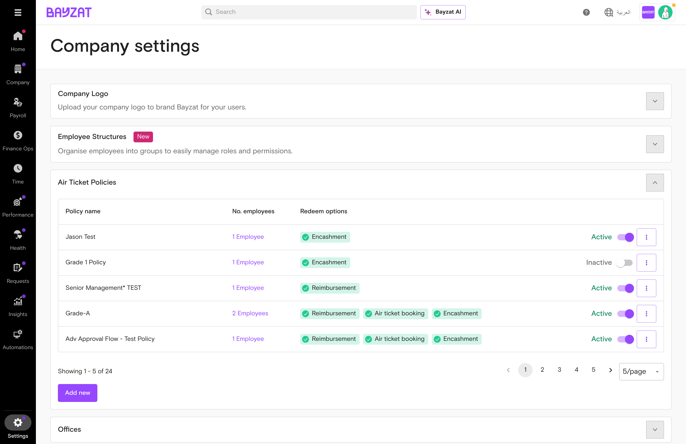
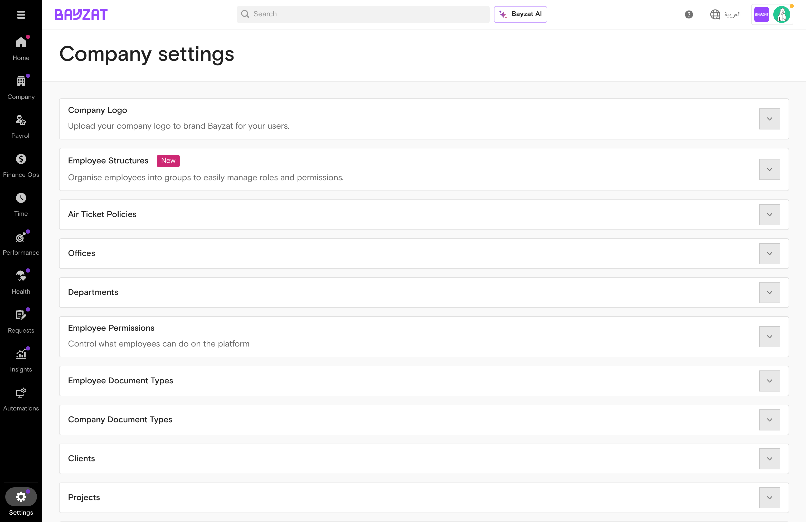
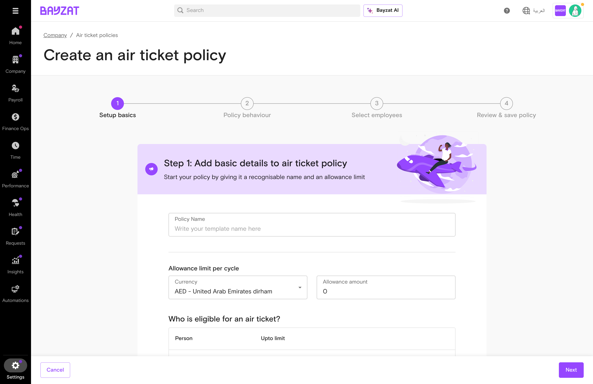
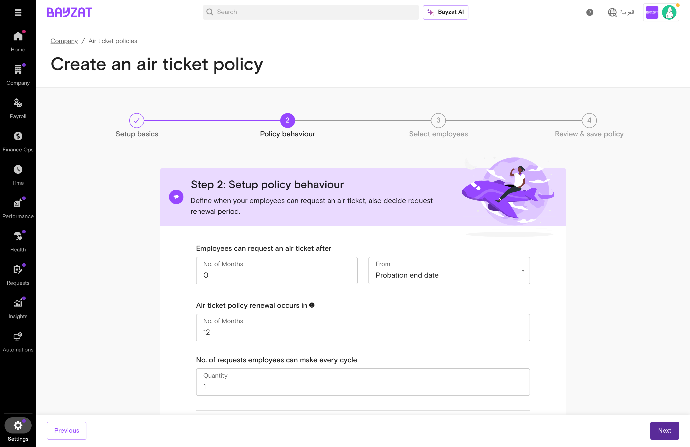
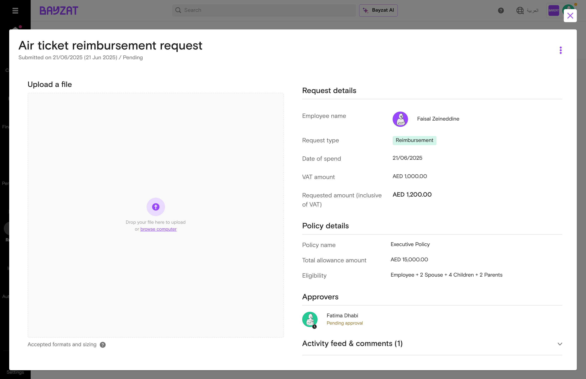
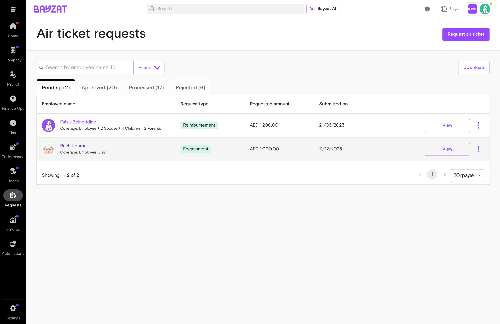
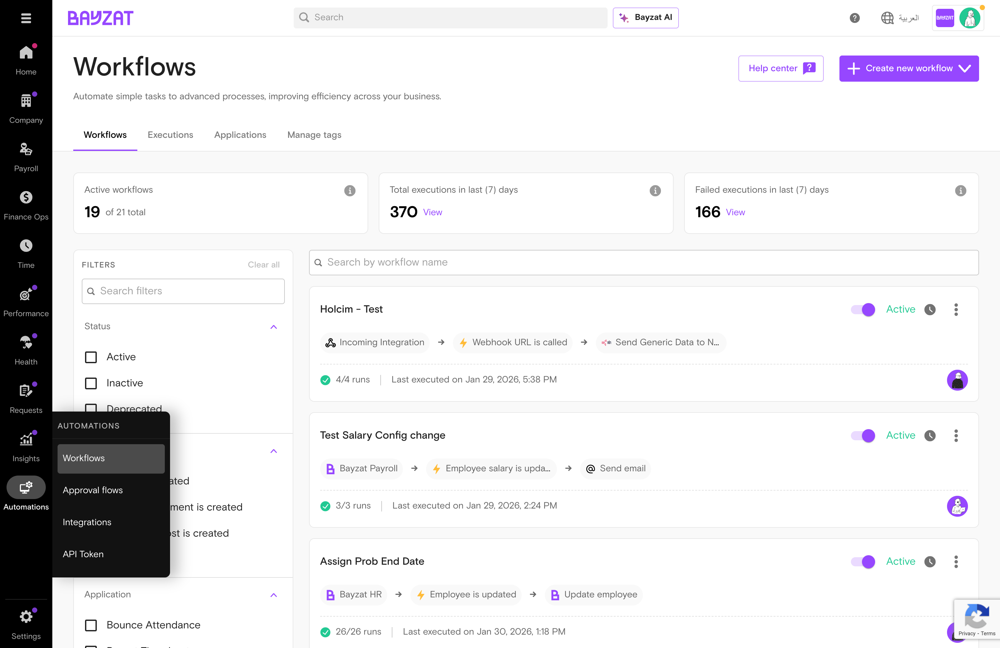

# Air Ticket

Manage employee air ticket allowances with flexible policies and multiple redemption options

<figure>

<figcaption>Air Ticket Policies management interface in Bayzat HR</figcaption>
</figure>

📖 Quick Navigation

<a href="#feature-overview" class="nav-card">✨ What is Air Ticket?</a> <a href="#product-foundation" class="nav-card">🏗️ Product Foundation</a> <a href="#user-journey" class="nav-card">🗺️ User Journey Guide</a> <a href="#feature-discovery" class="nav-card">🚀 How to Access</a> <a href="#setup-process" class="nav-card">⚙️ Setup Process</a> <a href="#feature-usage" class="nav-card">📋 Feature Usage</a> <a href="#workflow-integration" class="nav-card">🔄 Workflow Integration</a> <a href="#business-rules" class="nav-card">📏 Business Rules</a> <a href="#troubleshooting" class="nav-card">🔧 Troubleshooting</a> <a href="#support-resources" class="nav-card">💬 Support Resources</a> <a href="#glossary" class="nav-card">📚 Glossary</a>

## What is Air Ticket?

### Overview

Air Ticket is a comprehensive feature within Bayzat that enables organizations to manage employee air ticket allowances efficiently. Instead of manual tracking and paper-based requests, employees can submit structured air ticket requests through the Bayzat mobile app that follow defined approval workflows with complete audit trails.

### Key Benefits

- Centralize all air ticket allowances in one organized system
- Configure custom policies with specific eligibility criteria and allowance amounts
- Track request status from submission through approval and processing
- Maintain complete audit trail of all actions and communications

### Who Uses This Feature?

| User Role | What They Do | Value Proposition |
|----|----|----|
| **Employees** | Request air tickets through three methods (reimbursement, ticket booking, or encashment) | Access your travel benefits anytime through a simple mobile app—eliminating paperwork, email chains, and uncertainty about your remaining allowance |
| **Line Managers** | Review and approve/reject air ticket requests from their team members | Make informed approval decisions with complete visibility into request details and policy compliance—without chasing employees for missing information |
| **HR Administrators** | Configure air ticket policies, manage workflows, and process approved requests | Eliminate manual tracking spreadsheets and policy enforcement headaches by centralizing all air ticket management with automated compliance and audit trails |
| **Payroll Team** | Process encashment requests through payroll | Receive pre-approved, validated encashment requests ready for processing—eliminating manual calculations and reducing payroll errors |

## Product Foundation Overview

### How Air Ticket Fits

Air Ticket Policies are **configuration templates** that define travel allowances and redemption rules. Employees are assigned to one policy, then submit requests through the mobile app that flow through approval workflows.

**Mental model:** Air Ticket Policy (rules) → Employee Request → Approval Workflow → Reimbursement/Booking/Encashment

One policy can cover many employees. Each employee can only belong to one air ticket policy at a time.

### Key Decisions Before Setup

Answer these questions before configuring air ticket policies:

- **Allowance amount?** — Fixed amount per cycle or varies by employee level?
- **Eligible dependents?** — Include spouse and children in the policy?
- **Redemption methods?** — Reimbursement, ticket booking, encashment, or all three?
- **Cycle period?** — Annual, bi-annual, or custom cycle for allowance renewal?

### Related Features

- **My Air Tickets** — Employee self-service for submitting and tracking requests
- **Payroll Module** — Processes encashment payments
- **Leave Management** — Encashment blocked while employee is on leave
- **Bayzat Workflows** — Automate actions when cycles renew
- **Notifications** — Alerts for request status changes

### Prerequisites & Requirements

| Requirement | Description | Status |
|----|----|----|
| Air Ticket Policy | At least one policy configured by HR | Required |
| Employee Assignment | Employees assigned to an air ticket policy | Required |
| Bayzat Mobile App | Employees need the app to submit requests | Required |
| Approver Roles | Approvers with appropriate permissions | Required |
| Payroll Module | Required for encashment processing | Required for encashment |

## Complete User Journey Guide

### End-to-End Journey: Managing Air Ticket Allowances

From policy setup through employee requests and processing.

1

#### Configure Policy

Settings → Company → Air Ticket Policies

<a href="#setup-process" class="phase-link">See setup steps →</a>

2

#### Employee Submits Request

Employee uses mobile app to request reimbursement, booking, or encashment.

<a href="#feature-usage" class="phase-link">See request steps →</a>

3

#### Manager Approves

Approver reviews request details and approves or rejects.

<a href="#workflow-integration" class="phase-link">See workflow →</a>

4

#### Process Payment

Approved requests processed via reimbursement, booking, or payroll encashment.

<a href="#feature-usage" class="phase-link">See processing →</a>

## Feature Discovery

### How to Access

Air Ticket features are accessed through different interfaces based on user role. Employees use the mobile app for self-service, while managers and administrators use the web dashboard.

### Navigation Paths

<figure>

<figcaption>Accessing Air Ticket Policies through Company Settings</figcaption>
</figure>

E

#### Employee Self-Service (My Air Tickets)

Requests (left sidebar) → My requests → My air tickets → Request Air Ticket → Select redemption method → Fill form → Submit

M

#### Manager Request Queue

Requests → Air tickets → Use tabs to filter by status (Pending, Approved, Processed, Rejected) → Click request to review

A

#### Admin Policy Configuration

Settings → Company → Air ticket policies → Add New or edit existing policy → Configure allowance and redemption options

## Setup Process

### Configuring Air Ticket Policies (Admin)

Before employees can submit air ticket requests, HR administrators must configure air ticket policies. This is done through the Settings menu.

1

#### Navigate to Air Ticket Policy Settings

Go to Settings → Company → Air ticket policies. This opens the policy configuration page where you can manage all air ticket policies.

<figure>

<figcaption>Policy creation Step 1: Policy name, currency, allowance amount, and eligible persons</figcaption>
</figure>

2

#### Enter Basic Policy Details

Enter a policy name, select currency (default: AED), set allowance amount, and configure the eligible persons table (Employee, Spouse, Children, Parents).

3

#### Configure Policy Behavior

Set when employees can request (e.g., after X months of service), define renewal cycle (default: 12 months), and specify number of requests allowed per cycle.

<figure>

<figcaption>Policy creation Step 2: Request timing, renewal cycle, and redemption options</figcaption>
</figure>

4

#### Select Redemption Options

Enable the redemption methods employees can use. All three are available as toggle switches:

- **Reimbursement:** Employees submit receipts for tickets already purchased
- **Encashment:** Employees receive cash equivalent (must not be on leave)
- **Air ticket booking:** HR/Admin books tickets on behalf of employees

5

#### Assign Employees

Select which employees can use this policy. You can assign by department, location, or individual employees. Note: Each employee can only be assigned to one air ticket policy.

6

#### Save and Activate

Review all settings and click Save. The policy is now active and assigned employees will see the Request Air Ticket option in their mobile app.

**Tip:** Test your policy configuration by checking if a sample employee can see the Request Air Ticket option in the mobile app before full rollout.

## Feature Usage

### Common Workflows

#### Request Reimbursement

Employees who have purchased tickets submit details and receipts through the mobile app for reimbursement.

#### Request Ticket Booking

Employees request HR to book tickets on their behalf, sharing travel dates and destination details.

#### Request Encashment

Employees convert their allowance to cash, processed through payroll. Must confirm they are not on leave.

### Submitting a Request (Employee Flow)

Employees submit air ticket requests through the Bayzat mobile app. Follow these steps to create a new request.

1

#### Navigate to Air Tickets

Open the Bayzat mobile app and navigate to the Work section. Select 'My Air Tickets' from the menu.

2

#### Create New Request

Click the 'Request Air Ticket' button. A selection appears with three redemption options.

3

#### Select Redemption Method

Choose your preferred method: Reimbursement (if you've already purchased), Ticket Booking (HR books for you), or Encashment (receive cash).

4

#### Complete the Form

Fill in all required fields. For reimbursement, upload receipt. For booking, provide travel details. For encashment, confirm you're not on leave.

5

#### Review and Submit

Review all entered information for accuracy. Click 'Submit' to create the request. You'll receive confirmation and the status will show as 'Pending'.

### Tracking Your Requests

Open any request from your My Air Tickets list to view its full details and activity history.

<figure>

<figcaption>Request detail panel showing employee information, request type, amount, and approver status</figcaption>
</figure>

### Understanding Request Statuses

| Status | Meaning | Next Action |
|----|----|----|
| Pending | Awaiting approval | Wait for approver review |
| Approved | Request approved | Await processing (reimbursement, booking, or payroll) |
| Rejected | Request declined | Review rejection reason |
| Processed | Completed | No action needed |

### Processing Requests (Manager Flow)

1.  Navigate to Requests → Air tickets
2.  Click 'Pending' tab to view requests awaiting approval
3.  Click on a request row to open the detail panel
4.  Review all submitted information including coverage details
5.  Click 'Approve' or 'Reject' (add reason if rejecting)

<figure>

<figcaption>Air Ticket Requests view with tabs: Pending (2), Approved (20), Processed (17), Rejected (6)</figcaption>
</figure>

**Coverage Details:** Request details show employee coverage information (e.g., "Employee + 2 Spouse + 4 Children + 2 Parents") to help approvers understand the full scope of the request.

## Workflow Integration

### How Workflows Connect to Air Tickets

The **Bayzat Payroll** application provides workflow triggers for air ticket cycle renewals. This means cycle renewal events can initiate automated sequences of actions across the Bayzat platform.

Access: Automations (left sidebar) → Workflows

<figure>

<figcaption>Accessing Workflows through the Automations menu in the sidebar</figcaption>
</figure>

### Triggers and Actions

<table>
<colgroup>
<col style="width: 50%" />
<col style="width: 50%" />
</colgroup>
<thead>
<tr>
<th>Available Triggers</th>
<th>Available Actions</th>
</tr>
</thead>
<tbody>
<tr>
<td><strong>Air ticket cycle renewal is due</strong> 
Fires when an employee's air ticket cycle is approaching renewal (Bayzat Payroll)</td>
<td><strong>Send Email</strong> 
Notify employees, managers, or HR teams</td>
</tr>
<tr>
<td rowspan="3"><strong>Trigger Configuration:</strong> 
• Trigger timing: On the day / Relative to the date 
• Time of day selection 
• Employee/Policy filters</td>
<td><strong>Send Mobile Notification</strong> 
Push alerts to Bayzat mobile app</td>
</tr>
<tr>
<td><strong>Create Task</strong> 
Assign follow-up tasks to team members</td>
</tr>
<tr>
<td><strong>Create Pay Adjustment</strong> 
Add deductions or additions to payroll</td>
</tr>
</tbody>
</table>

<figure>

<figcaption>Air ticket cycle renewal trigger found in workflow creation under Bayzat Payroll</figcaption>
</figure>

<figure>

<figcaption>Trigger configuration showing timing options (On the day / Relative to the date)</figcaption>
</figure>

### Real-World Workflow Examples

The following workflows demonstrate how Air Ticket can be automated in your organization:

#### Example 1: Cycle Renewal Reminder Workflow

**Scenario:** Remind employees when their air ticket allowance cycle is about to renew so they can plan their travel or encashment.

|  |  |
|----|----|
| **Trigger** | Air ticket cycle renewal is due |
| **Timing** | 30 days before renewal date |
| **Action** | Send email to employee with remaining balance and renewal date |

*Result: Employees receive proactive reminders and can use their remaining allowance before it resets.*

#### Example 2: HR Notification Workflow

**Scenario:** Alert HR team when employee air ticket cycles are renewing so they can prepare for upcoming requests.

|             |                                                           |
|-------------|-----------------------------------------------------------|
| **Trigger** | Air ticket cycle renewal is due                           |
| **Timing**  | On the day of renewal                                     |
| **Action**  | Create task for HR to review employee's air ticket status |

*Result: HR stays informed about cycle renewals and can proactively reach out to employees.*

#### Example 3: Manager Alert Workflow

**Scenario:** Notify line managers when their team members' air ticket cycles renew for planning purposes.

|             |                                          |
|-------------|------------------------------------------|
| **Trigger** | Air ticket cycle renewal is due          |
| **Timing**  | 7 days before renewal                    |
| **Action**  | Send mobile notification to line manager |

*Result: Managers can anticipate potential leave requests or workflow approvals from team members.*

### Scenarios Solved by Workflows

Consider implementing workflows for these common automation opportunities:

| Scenario | Without Workflow | With Workflow |
|----|----|----|
| **Cycle approaching renewal** | Employees may forget about unused allowance | Automated reminder sent 30 days before renewal |
| **Unused allowance expiring** | HR manually tracks and reaches out to employees | System automatically notifies employees with balance |
| **Planning team travel** | Managers don't know who has available allowance | Manager receives notification of team member renewals |
| **Tracking renewal status** | HR maintains manual spreadsheets | Automated task creation for HR review |

**Note:** No air ticket-specific actions are available in the workflow system. Standard actions (Send email, Create task, etc.) can be used with the air ticket cycle renewal trigger.

### Approval Flow Configuration

Air Ticket requests follow configurable approval flows that route requests to the appropriate approvers based on defined criteria. Access approval flow configuration via **Automations → Approval flows → Air Ticket**.

<figure>

<figcaption>Air Ticket approval flows showing advanced flows and default flow configuration</figcaption>
</figure>

#### Approval Flow Types

| Flow Type | Description | When Used |
|----|----|----|
| **Advanced Approval Flow** | Conditional flows that route approvals based on specific criteria (e.g., amount thresholds, currency) | When request matches the defined criteria conditions |
| **Default Approval Flow** | Fallback flow used when no advanced flow criteria matches | All requests that don't match any advanced flow conditions |

#### Available Criteria for Advanced Flows

When creating advanced approval flows, you can filter requests based on the following data points:

<figure>

<figcaption>Data point options available when configuring approval flow criteria</figcaption>
</figure>

| Category | Available Fields |
|----|----|
| **Air Ticket Specific** | Policy, Redeem Option, Policy Allowance Amount → Currency, Policy Allowance Amount → Amount |
| **Employee Fields** | Department, Position, Nationality, Office, Direct Reports To, Roles, Employee Grade, and 50+ additional attributes |

#### Example: Amount-Based Approval Flow

The following example shows an advanced approval flow that routes high-value requests to the Line Manager:

<figure>

<figcaption>Advanced flow configured to route requests over 3000 AED to Line Manager</figcaption>
</figure>

| Configuration  | Value                                                   |
|----------------|---------------------------------------------------------|
| **Flow Name**  | Amount exceeding 3000                                   |
| **Criteria 1** | Policy Allowance Amount → Amount *is greater than* 3000 |
| **Criteria 2** | Policy Allowance Amount → Currency *is equal to* AED    |
| **Logic**      | Execute when ALL criteria match (AND)                   |
| **Approver**   | Line Manager (1 level)                                  |

#### Available Approver Types

| Approver Type | Description |
|----|----|
| **Line Manager** | Employee's direct manager (configurable levels: 1, 2, or more levels up) |
| **Super Admin** | Users with Super Admin role |
| **Payroll Table Admin** | Users with Payroll administration permissions |
| **Specific User/Role** | Named individuals or custom roles |

**Tip:** You can create multiple advanced flows with different criteria. The system evaluates flows in order and uses the first matching flow. If no advanced flow matches, the default flow is used.

## Business Rules & Limitations

### Core Business Rules

| Rule | Description | Impact |
|----|----|----|
| One policy per employee | Employees can only be assigned to one air ticket policy | Create separate policies for different hierarchy levels |
| Collective allowance | Allowance applies to employee and all listed dependents collectively | Plan allowance amounts to cover the full group |
| Encashment restrictions | Employees cannot encash if currently on leave | Complete or cancel leave before requesting encashment |
| Request limit enforcement | Employees limited to set number of requests per cycle | Configure limits based on organizational needs |
| Allowance limits | Employees cannot request amounts exceeding their allocated allowance | System enforces limits automatically |

### System Constraints

- Employees must be assigned to air ticket policies by HR before they can submit requests
- Each employee can only belong to one air ticket policy at a time
- Approvers must have appropriate role permissions
- Rejected requests cannot be reactivated by employees

## Troubleshooting & Edge Cases

### Common Issues

| Issue | Cause | Resolution |
|----|----|----|
| Request option not visible | Employee not assigned to any air ticket policy | Contact HR to verify policy assignment |
| Encashment request rejected | Employee has active or pending leave requests | Complete or cancel leave before requesting encashment |
| Request exceeds allowance | Requested amount exceeds allocated allowance | Reduce amount or contact HR for adjustments |
| Cannot edit policy | Policy has existing requests | Create new policy for changes; archive old policy |
| Request stuck in pending | Awaiting approver action | Check request details for current approver |

### Known Limitations

**Policy Editing:** Policies with existing requests cannot be modified. To make changes, create a new policy with desired modifications and assign employees going forward.

**Workflow Actions:** No air ticket-specific actions are available in the workflow system. The available trigger is "Air ticket cycle renewal is due" which can be combined with standard actions like Send email, Create task, etc.

### Edge Cases

- **Approver unavailable:** Contact HR to update the approval flow configuration
- **Multiple dependents:** Remember allowance is collective, not individual per dependent
- **Mid-cycle policy change:** Communicate changes clearly and plan transitions during renewal periods
- **New employee mid-cycle:** Assign to policy immediately; allowance available for remaining cycle

## Support Resources

### Frequently Asked Questions

What are the three ways employees can request air tickets?

Employees can request through: (1) Reimbursement - submit receipts for tickets already purchased, (2) Air ticket booking - HR books on their behalf, or (3) Encashment - receive cash equivalent of their allowance.

Can an employee be assigned to multiple air ticket policies?

No, each employee can only be assigned to one air ticket policy. To change an employee's policy, remove them from the current policy before assigning to a new one.

Why is my encashment request rejected?

Encashment is only possible if you are not currently on leave. Ensure no active or pending leave requests before submitting an encashment request.

How do I know when my cycle renews?

Check your air ticket request details in the mobile app. If your organization has workflows configured, you may also receive automated reminders before your cycle renews.

Can I edit a submitted request?

Contact your HR or approver if changes are needed. Depending on the request status, modifications may or may not be possible.

How do I set up automated air ticket workflows?

Navigate to **Automations → Workflows** and create a new workflow. Select the trigger "Air ticket cycle renewal is due" (under Bayzat Payroll), configure the timing, and add your desired actions like Send email or Create task.

### Getting Help

- Contact your HR Administrator for policy questions and request support
- Bayzat Support Team - Available for technical issues and feature questions
- Knowledge Base - Access additional articles and guides
- In-app Help - Contextual help available within the Bayzat platform

## Glossary of Terms

| Term | Definition |
|----|----|
| **Air Ticket Policy** | Organizational policy defining allowance amounts, eligibility criteria, and redemption options for air tickets. |
| **Allowance** | The monetary value allocated to an employee for air ticket benefits during one cycle. |
| **Redemption Method** | How employees use their allowance: Reimbursement, Ticket Booking, or Encashment. |
| **Renewal Cycle** | The time period (e.g., 12 months) after which an employee's allowance resets. |
| **Encashment** | Converting air ticket allowance to cash payment through payroll. |
| **Eligible Persons** | The people covered by an employee's air ticket allowance (employee, spouse, children, parents). |
| **Pending Status** | Request is waiting for approval from one or more approvers. |
| **Processed Status** | Approved request has been fully processed (reimbursed, booked, or added to payroll). |
| **My Air Tickets** | Employee self-service portal showing all their submitted air ticket requests. |
| **Workflow Trigger** | An event (like cycle renewal) that automatically starts a workflow action. |

Generated by Bayzat Documentation System

Last updated: 2026-01-16
