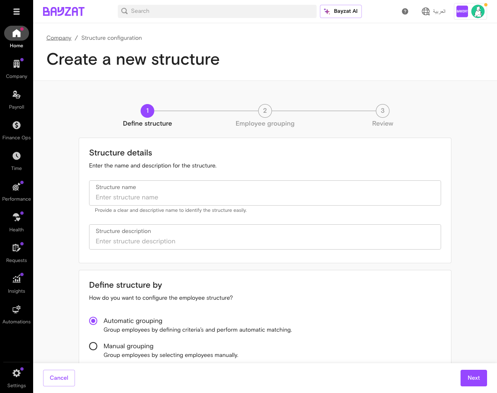
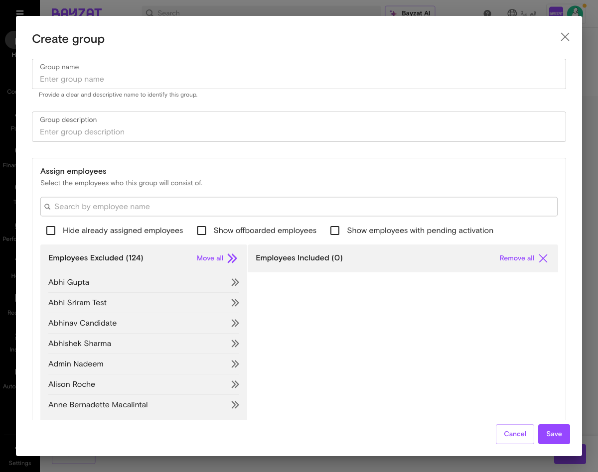
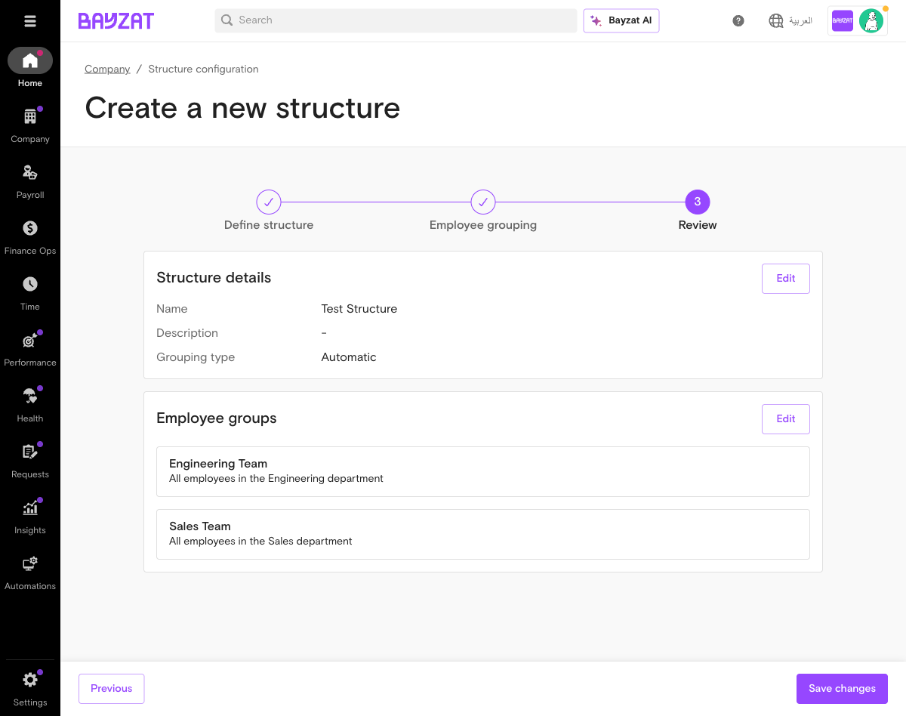
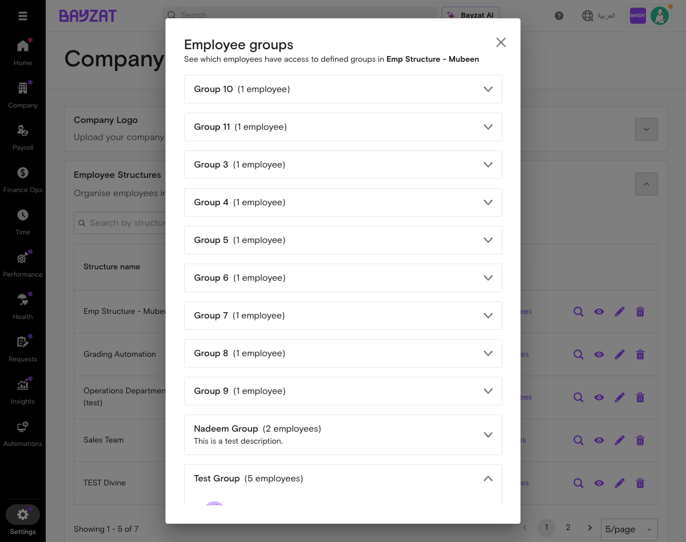
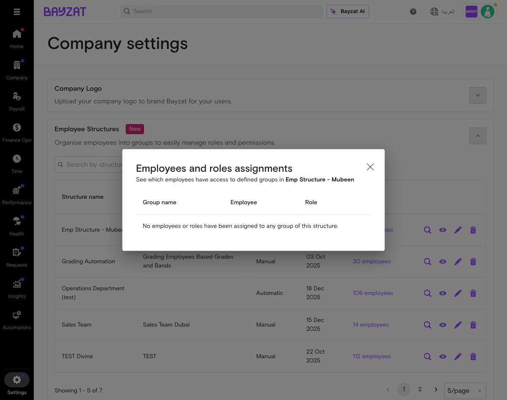

# Employee Structures - Validation Report

**Feature:** Employee Structures
**Version:** v1
**Validated:** 2026-02-25
**Status:** COMPLETED

---

## Navigation Path

**Confirmed:** Settings > Company > Employee Structures (accordion)
**URL:** `/enterprise/dashboard/settings/company`
**Audience:** Admin only

The Employee Structures section is located as an expandable accordion on the Company settings page, marked with a "New" badge.

---

## Feature Overview

Employee Structures allows administrators to create organizational groupings of employees for payroll data access control and role-based permission assignment. Structures can be created using either automatic criteria-based grouping or manual employee selection.

---

## UI Elements Discovered

### Main Table View
The Employee Structures accordion expands to show a table with the following columns:
- **Structure name** - Name of the employee structure
- **Description** - Description of the structure
- **Grouping type** - Either "Manual" or "Automatic"
- **Last updated** - Date of last modification
- **Unassigned employees** - Count of employees not assigned to any group

### Row Actions (4 icons per row)
- **Magnifying glass** - "View employees and roles assignments" - Opens dialog showing Group name, Employee, and Role columns
- **Eye icon** - "View groups" - Opens dialog with expandable list of groups showing employee counts
- **Pencil icon** - "Edit" - Opens edit flow for the structure
- **Trash icon** - "Delete" - Deletes the structure (with confirmation)

### Other Controls
- **Search field** - "Search by structure name" with "Clear search" link
- **Pagination** - "Showing X-Y of Z" with page navigation and configurable page size (5 per page default)
- **Add New button** (purple) - Creates a new employee structure

### Existing Data
7 structures found: 5 Manual, 2 Automatic

---

## Create Flow (3-Step Wizard)

The "Add New" button navigates to `/enterprise/dashboard/organization-structures/new` and opens a 3-step wizard:

### Step 1: Define Structure
- **Structure name** (text input, required)
- **Description** (text area)
- **Grouping type** (radio selection): Automatic or Manual

### Step 2: Employee Grouping

#### Automatic Grouping
Define criteria using employee data points. Each criterion consists of:
- **Data point** dropdown - 50+ employee attributes (Department, Office, Nationality, Position, Status, Employment type, Joining date, etc.)
- **Operation** dropdown - is equal to, is not equal to, exists, does not exist, is in, is not in
- **Value** dropdown - Context-sensitive values based on selected data point

Multiple criteria can be combined. Groups are automatically populated based on matching employees.

#### Manual Grouping
Uses a dual-list transfer interface:
- **Left panel (Excluded)** - Employees not in the group
- **Right panel (Included)** - Employees in the group
- **Move all / Remove all** buttons for bulk operations
- **Search** within each panel
- **Filter checkboxes**: Hide already assigned, Show offboarded, Show with pending activation

### Step 3: Review
Summary of the structure configuration before saving.

---

## CRUD Validation

| Operation | Status | Notes |
|-----------|--------|-------|
| **Create** | PASS | Add New button works, 3-step wizard confirmed |
| **Read** | PASS | View groups and View employees/roles dialogs work |
| **Update** | AVAILABLE | Edit icon present on each row |
| **Delete** | AVAILABLE | Delete icon present with confirmation dialog |

---

## View Dialogs

### View Groups
Expandable list showing all groups within a structure with employee counts per group.

### View Employees and Roles Assignments
Table view with columns: Group name, Employee, Role.

---

## Task Validation

### WTD-007: Create and manage custom employee groups
**Status: PASS**

All steps validated:
- Navigate to Settings > Company > Employee Structures - CONFIRMED
- Add New button present and functional - CONFIRMED
- Form fields (name, description, grouping type) - CONFIRMED
- Automatic grouping with criteria builder - CONFIRMED (50+ data points, 6 operations)
- Manual grouping with employee selection - CONFIRMED (dual-list transfer UI)
- Interaction with Role Management - CONFIRMED (View employees/roles assignments shows role column)

---

## Screenshots Index

| # | Filename | Description |
|---|----------|-------------|
| 1 | 01-settings-company-page.png | Company settings page overview |
| 2 | 02-employee-structures-accordion-expanded.png | Expanded accordion with table |
| 3 | 03-employee-structures-page2.png | Page 2 with remaining structures + Add New |
| 4 | 04-create-new-structure-step1.png | Step 1: Define structure form |
| 5 | 05-create-structure-step2-automatic-empty.png | Step 2: Automatic grouping empty state |
| 6 | 06-automatic-grouping-dialog.png | Edit automatic grouping dialog |
| 7 | 07-automatic-criteria-data-points.png | Data point dropdown (50+ options) |
| 8 | 08-criteria-operations-dropdown.png | Operation options |
| 9 | 09-criteria-value-departments.png | Value dropdown showing departments |
| 10 | 10-manual-grouping-selected.png | Manual grouping option selected |
| 11 | 11-manual-group-creation-dialog.png | Manual group creation with transfer UI |
| 12 | 12-abandon-unsaved-changes-dialog.png | Unsaved changes confirmation |
| 13 | 13-view-groups-dialog.png | View groups dialog |
| 14 | 14-view-groups-expanded-employees.png | Group expanded with employee list |
| 15 | 15-employees-roles-assignments-dialog.png | Employees and roles view |
| 16 | 16-search-filter-results.png | Search filtering |
| 17 | employee-structures-criteria-datapoints.png | Full criteria data points view |
| 18 | employee-structures-review-step.png | Review step of create wizard |
