

# Attendance Management

Count every hour, pay every employee right, stay compliant

📖 Quick Navigation

<a href="#feature-overview" class="nav-card">✨Feature Overview</a> <a href="#product-foundation" class="nav-card">🏗️Product Foundation</a> <a href="#user-journey" class="nav-card">🗺️User Journey</a> <a href="#feature-discovery" class="nav-card">🔍Feature Discovery</a> <a href="#setup-process" class="nav-card">⚙️Setup Process</a> <a href="#employee-views" class="nav-card">👤Employee Views</a> <a href="#admin-features" class="nav-card">👔Admin Features</a> <a href="#approval-flows" class="nav-card">🔄Approval Flows</a> <a href="#workflows" class="nav-card">⚙️Workflows</a> <a href="#troubleshooting" class="nav-card">🔧Troubleshooting</a> <a href="#support-resources" class="nav-card">💬Support &amp; FAQs</a>

<figure>

<figcaption>Employee Attendance Report - Track check-ins, check-outs, and hours worked across the organization</figcaption>
</figure>

## What is Attendance Management?

### Overview

The Attendance module is a comprehensive time and attendance tracking system that enables organizations to monitor employee work hours, manage shift schedules, and maintain accurate attendance records. The system supports mobile app-based check-ins, biometric device integrations, and geo-fencing for location verification.

### Key Benefits

- Real-time check-in/check-out tracking via mobile app with geo-fencing
- Flexible shift scheduling with static and dynamic shift support
- Automated notifications 10 minutes before check-in/out times
- Comprehensive attendance reports with daily, custom, and location views
- Attendance regularization workflow for correcting missed entries

### Who Uses This Feature?

| User Role | What They Do | Value Proposition |
|----|----|----|
| **Employees** | Check in/out via mobile app, view attendance history, request attendance regularization | Clock in from anywhere with GPS verification and track their own attendance history—eliminating manual timesheets and disputes about working hours |
| **Line Managers** | Monitor team attendance, approve regularization requests, edit attendance records | Get real-time visibility into team attendance and handle exceptions quickly—rather than chasing late arrivals or reconciling timesheets at month-end |
| **Shift Schedulers** | Create and manage weekly shift schedules, assign employees to work centers | Build and publish shift schedules with drag-and-drop simplicity—ensuring coverage while respecting employee availability and labor rules |
| **HR Administrators** | Configure work timings, set up geo-fencing, manage attendance policies | Define attendance rules once and have them enforced automatically across the organization—eliminating manual policy enforcement and inconsistent treatment |
| **Time Off Managers** | Review attendance data, manage overlapping requests | See attendance and leave data together in one view—making informed decisions without switching between systems |

## Product Foundation Overview

### How Attendance Fits

Attendance is a **transactional tracking system** that records employee check-ins/check-outs and validates them against configured work timings. Daily attendance feeds into payroll calculations, overtime, and leave records.

**Mental model:** Work Timing (rules) → Employee Check-in → Validation → Attendance Record → Payroll/Reports

Attendance records are the source of truth for working hours. Changes to work timings affect how future check-ins are validated.

### Key Decisions Before Setup

Answer these questions before configuring attendance:

- **Check-in method?** — Mobile app, biometric devices, or both?
- **Location verification?** — Enable geo-fencing? What radius?
- **Identity verification?** — Require facial recognition with liveness detection?
- **Work centers needed?** — Single office or multiple locations with different shifts?

### Related Features

- **Work Timings** — Define schedules, thresholds, and overtime rules that validate check-ins
- **Work Centers** — Physical locations with their own shift schedulers
- **Biometric Integration** — Physical devices for attendance tracking via API/CAMS
- **Payroll** — Attendance data feeds into salary calculations
- **Leave Management** — Approved leave affects expected attendance

### Prerequisites & Requirements

| Requirement | Description | Status |
|----|----|----|
| Bayzat Mobile App | Required for employee check-in/check-out | Required |
| Location Services | Must be enabled on mobile devices for geo-fencing | Required |
| Work Timings | At least one work timing configuration | Required |
| Offices | Office locations configured with coordinates | Required |
| Biometric Devices | Optional integration for physical attendance tracking | Optional |

## Complete User Journey Guide

### Journey Overview

The Attendance journey involves administrators configuring the system, schedulers managing shifts, employees marking attendance, and managers reviewing and approving records.

1

#### System Setup

Settings → Attendance → Configure

HR configures work timings, offices, work centers, and geo-fencing settings

<a href="#setup-process" class="phase-link">See setup →</a>

2

#### Check-In / Check-Out

Mobile App → Attendance

Employee checks in at shift start and checks out at end; system calculates hours worked

<a href="#mobile-features" class="phase-link">See attendance →</a>

3

#### Visits & Breaks

Mobile App → Breaks / Visits

Track breaks and multiple visits to client locations throughout the work day

<a href="#mobile-features" class="phase-link">See tracking →</a>

4

#### Review & Reports

Time → Employee Attendance

Manager reviews attendance, approves regularization and overtime requests

<a href="#admin-features" class="phase-link">See reports →</a>

## Feature Discovery

### How to Access

Attendance features are accessed through different menus based on the task. The Time menu provides reports and scheduling, while Settings contains configuration options.

### Navigation Paths

1

#### Employee Attendance Reports

Time → Employee Attendance → View Daily Report, Custom Report, or Location Report tabs

<figure>
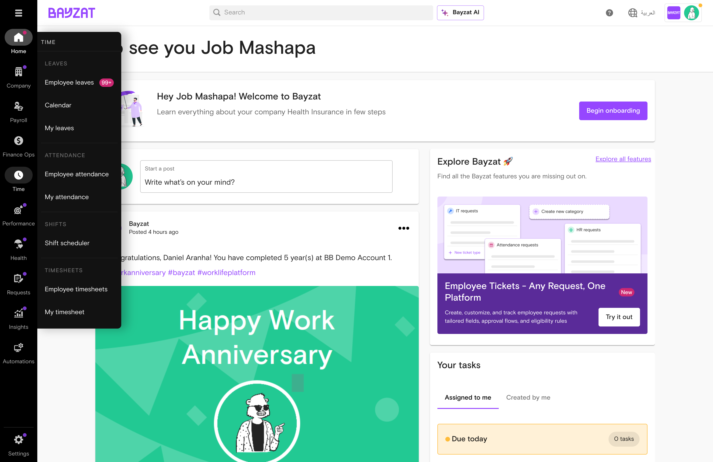
<figcaption>Accessing the Time menu for attendance reports</figcaption>
</figure>

<figure>

<figcaption>Employee Attendance Report with columns for ID, Name, Schedule, Date, Status, Check In/Out times, and Hours Worked</figcaption>
</figure>

2

#### Attendance Settings

Settings → Attendance → Configure general settings, work timings, work centers, and geo-fencing

<figure>
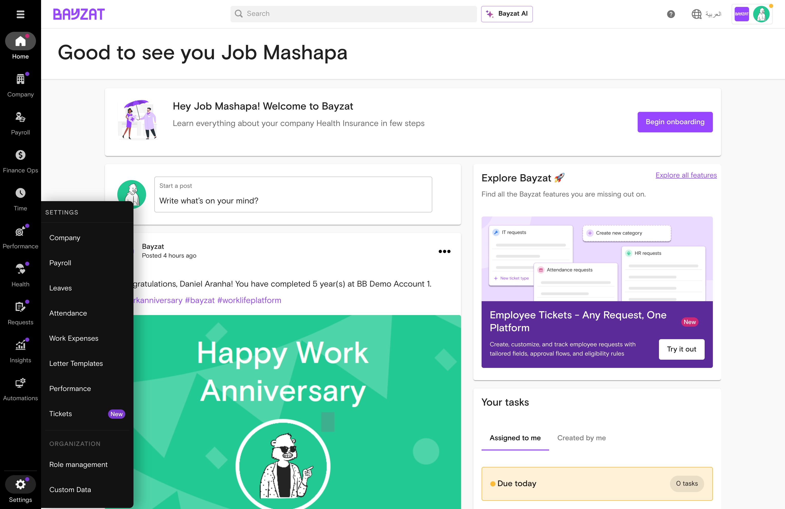
<figcaption>Accessing Attendance settings through the Settings menu</figcaption>
</figure>

## Setup Process

### Configuring Attendance Settings

Before employees can use attendance tracking, administrators must configure the core settings.

1

#### Configure General Attendance Settings

Navigate to Settings → Attendance → General Settings. Configure check-in/out methods including mobile app, facial recognition, and biometric options.

<figure>

<figcaption>General Attendance Settings showing 6 configuration options including facial recognition and biometric integration</figcaption>
</figure>

<figure>

<figcaption>Expanded General Settings showing Enable Image Capture and Enable Facial Recognition toggles for identity verification during check-in/out</figcaption>
</figure>

2

#### Set Up Work Timings

Go to Settings → Attendance → Work Timings. Create timing schedules defining start/end times, break duration, and overtime thresholds.

<figure>

<figcaption>Work Timings list showing 77 configured timing schedules with detailed settings</figcaption>
</figure>

<figure>

<figcaption>Work Timings expanded view showing name, working hours, late arrival/early departure thresholds, absent after, breaks, outside office, and extra hours calculation settings</figcaption>
</figure>

**Flexible Work Timings:** To allow employees control over their daily hours, enable the "Flexible work timing" toggle when creating a work timing. Employees can choose when to start/end their workday as long as they complete required hours. Flexible timings show a green badge and disable late arrival/early departure thresholds.

3

#### Set Up Overtime Policies

Navigate to Settings → Attendance → Overtime Policies. Create policies defining rate calculation (single or custom), employee eligibility, and compensation rules for extra hours.

<figure>

<figcaption>Overtime Policies showing policy name, rate calculation basis (Single/Custom Rate), employee extra hours requests toggle, number of employees included, and active/inactive status</figcaption>
</figure>

4

#### Configure Days In Lieu Policies

Go to Settings → Attendance → Days In Lieu Policies. Set up policies for granting time off instead of monetary compensation for extra hours worked.

<figure>
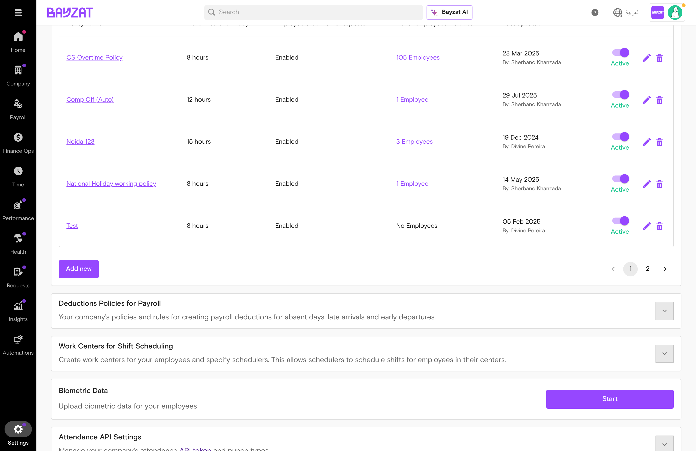
<figcaption>Days In Lieu Policies showing policy name, hours required for 1 day off, employee requests toggle, and assigned employees</figcaption>
</figure>

5

#### Set Up Deductions Policies

Navigate to Settings → Attendance → Deductions Policies for Payroll. Configure rules for payroll deductions based on absences, late arrivals, and early departures.

<figure>

<figcaption>Deductions Policies showing policy name, employees included, time to action window, work disruptions toggle, attendance violation tracking (Standard/Advanced), and status</figcaption>
</figure>

6

#### Configure Geo-fencing (Multiple Visits)

Navigate to Settings → Attendance → Multiple Visits. Enable location tracking and set the check-in radius (default 100m).

<figure>

<figcaption>Multiple Visits settings with geo-fencing radius configuration and location tracking options</figcaption>
</figure>

<figure>
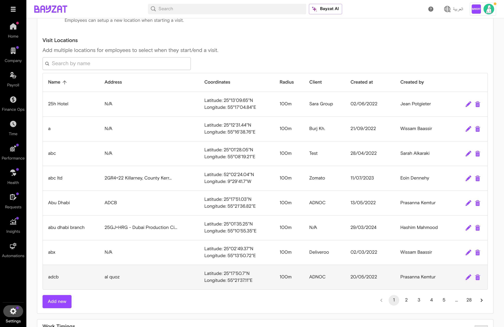
<figcaption>Visit Locations table showing configured locations with name, address, coordinates, radius (100m default), client association, and edit/delete actions</figcaption>
</figure>

7

#### Create Work Centers

Go to Settings → Attendance → Work Centers. Add locations with schedulers, work timings, offices, and employee assignments.

<figure>

<figcaption>Work Centers configuration with shift scheduling and employee assignments</figcaption>
</figure>

8

#### Configure Biometric Devices (Optional)

Navigate to Settings → Attendance → Biometric Devices. Add physical biometric devices (fingerprint scanners, facial recognition terminals) for attendance tracking at office locations.

<figure>

<figcaption>Biometric Devices settings showing device brand, model, serial number, office assignment, data structure, and threshold configuration</figcaption>
</figure>

**Tip:** Ensure office locations have accurate GPS coordinates for geo-fencing to work correctly. Test check-in from the actual location before rolling out to employees.

## Feature Usage

### Employee Views

This section covers all attendance features available to employees through the Bayzat mobile app and web portal.

#### Check In / Check Out

Employees check in at their required work start time and check out when finished. The system tracks work start time, finish time, breaks taken, and any sites visited during working hours. Multiple check-in methods are available:

#### Standard Check-In

**Mobile** - Tap check-in button on the Bayzat app. System validates location via geo-fencing.

#### Facial Recognition

**Mobile** - Scan face during check-in. System verifies identity against reference photo with liveness detection.

#### Kiosk Mode

**Mobile** - Manager marks attendance for multiple employees using a shared device. Ideal for employees without smartphones.

#### Biometric Devices

**Physical Device** - Fingerprint or facial recognition terminals integrated with the attendance system.

#### How to Check In / Check Out (Mobile App)

1

#### Open Bayzat App

Launch the Bayzat mobile app on their smartphone.

2

#### Navigate to Attendance

Access attendance from either:

- Attendance widget on the **Home** page
- Attendance widget on the **Work** tab

3

#### Tap Check In or Check Out

Tap the **Check In** button at shift start or **Check Out** at shift end. The system validates the location against the configured office geo-fence.

4

#### View Confirmation

Once validated, the time and location are recorded. After check-out, the system calculates total hours worked, break time, and any extra hours.

**Location Validation:** The user must be within the configured geo-fence radius of their assigned office to check in/out. If outside, an "Out of Office" option may appear if enabled by the company.

#### Taking Breaks

If the work timing includes break allowances, employees can record their breaks during the workday.

1

#### Start Break

From the attendance widget, tap the **More** button and select **Start Break**.

2

#### End Break

When returning from the break, tap **End Break** to resume tracking work hours.

**Break Duration:** The company may configure paid or unpaid break durations. Exceeding the allowed break time may result in deductions based on the company's policies.

#### Multiple Visits

For employees who visit multiple locations during their workday (field workers, sales representatives), track each visit separately.

1

#### Start a Visit

From the attendance widget, tap **More** → **Start Visit**. Select the location from the map view showing nearby visit locations.

2

#### End Visit

When leaving the location, tap **End Visit**. Repeat for each location visited during the day.

3

#### Add New Location (Optional)

If the location isn't listed, tap **Add visit location** to register a new location with name, address, and radius.

#### Viewing Attendance Report

Employees can view their attendance history and details through the mobile app or web portal.

1

#### Open My Attendance

**Mobile:** In the Bayzat app, navigate to **Work** → **Attendance** → **My Attendance**.

**Web:** Navigate to **Time** → **My Attendance**.

2

#### View Daily Records

See attendance records showing check-in time, check-out time, hours worked, breaks, extra hours, and status for each day.

3

#### View Details

Click on any attendance record to see the full breakdown including:

- Check-in and check-out times with location
- Break duration
- Visit locations and timings
- Extra hours worked

<figure>
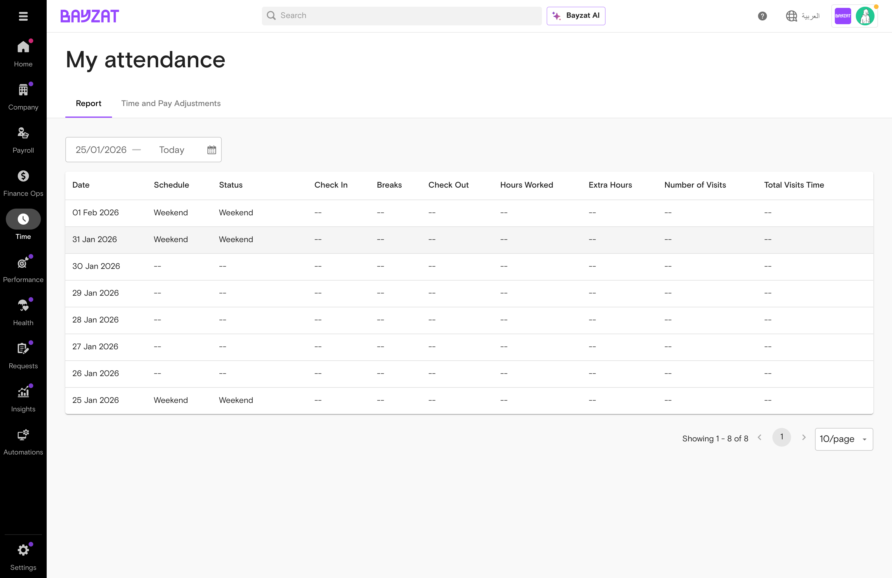
<figcaption>My Attendance Report tab showing attendance records with date, schedule, status, check-in/out times, hours worked, and extra hours</figcaption>
</figure>

#### Viewing Time and Pay Adjustments

View any adjustments made to attendance that affect pay through the mobile app or web portal.

1

#### Navigate to Time and Pay Adjustments

**Mobile:** In the Bayzat app, go to **Work** → **Attendance** → **Time and Pay Adjustments**.

**Web:** Navigate to **Time** → **My Attendance** → **Time and Pay Adjustments** tab.

2

#### Review Adjustments

View a list of adjustments including:

- **Overtime payments** - Extra hours approved for pay
- **Deductions** - Late arrivals, early departures, or absences
- **Days in lieu** - Time off granted for extra hours worked

<figure>
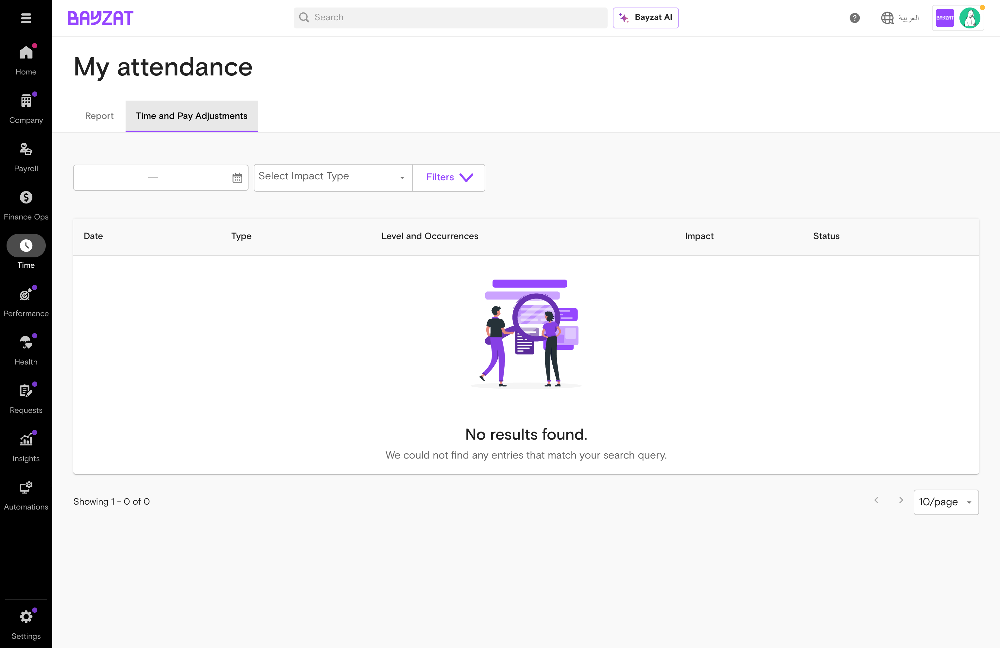
<figcaption>Time and Pay Adjustments tab showing date, type, level and occurrences, impact, and status columns</figcaption>
</figure>

**Payroll Impact:** These adjustments are automatically included in payroll calculation for the relevant pay period.

#### Requesting Overtime Compensation

Employees assigned to an Overtime policy or Days in Lieu policy can request compensation for extra hours worked during checkout.

1

#### Check Out with Extra Hours

When checking out on the Bayzat app after working extra hours, a message will appear asking if compensation should be requested.

2

#### Choose Compensation Option

Select **Send Request and Checkout** to request compensation, or simply **Checkout** to skip the request.

3

#### Enter Extra Hours

Enter the number of extra hours for compensation. Note: The number can only be decreased from the system-calculated amount, not increased.

4

#### Submit Request

Click **Send Request**. The request goes to the line manager and/or other admins in the approval hierarchy.

**Policy Required:** The employee must be assigned to an Overtime policy or Days in Lieu policy to request compensation. Check with the HR administrator if this option is not available.

#### Viewing Request Status

View the status of overtime requests in **My Attendance → Time and Pay Adjustments**:

- **Yellow flag:** Pending Review, Reviewed, Assigned to payroll/time off, Added to payroll table
- **Green flag:** Added to time off, Added to payroll (processed)
- **Red flag:** Rejected

#### Requesting Attendance Regularization

If an employee missed a check-in or check-out, they can request a correction through attendance regularization via the mobile app or web portal.

1

#### Navigate to Requests

**Mobile:** Go to **Work** → **Requests** → **My Tickets**.

**Web:** Navigate to **Requests** → **My Tickets**.

2

#### Create New Ticket

Tap/Click **Create Ticket** and select **Attendance Regularization** from the Category \> Ticket type dropdown under the Attendance category.

3

#### Fill in Details

Enter the following information:

- **Priority** - Set the urgency level (Low, Medium, High)
- **Check In Date** - The date requiring correction
- **Check In Time** - The actual check-in time
- **Check Out Date** - The date of check-out
- **Check Out Time** - The actual check-out time
- **Notes** - Reason for missing the original check-in/out (optional)

4

#### Add Attachments (Optional)

Attach any supporting documents if required by company policy.

5

#### Submit Request

Review the details and click **Submit**. The manager will review and approve or reject the request.

<figure>

<figcaption>Attendance Regularization form on web portal showing ticket details including Priority, Check In Date/Time, Check Out Date/Time, and Notes fields</figcaption>
</figure>

**Policy Dependent:** Attendance regularization must be enabled by the company. If this option is not visible, contact the HR administrator.

**Important Limitations:**

- **Days Off:** You cannot submit attendance regularization requests for days that are configured as days off (weekends, public holidays, or personal off days). The system will display an error: "Attendance cannot be recorded as this is a day off for the employee."
- **Half Days:** You cannot record attendance for periods covered by approved half-day leave. The system prevents duplicate or conflicting attendance entries.

<figure>

<figcaption>System validation prevents regularization requests for days off</figcaption>
</figure>

## Admin Features

This section covers attendance management features available to Line Managers, Attendance Managers, and Super Admins.

#### [Viewing Employee Attendance Reports](#viewing-attendance-reports)

Access Daily Reports, Custom Reports (with drill-down), and Location Reports. Filter by department, office, status, and more. Download as Excel (Cumulative or Breakdown).

#### [Time and Pay Adjustments](#time-pay-adjustments)

Process overtime requests and attendance violations (late arrivals, early departures, absences). Review, approve, reject, or assign adjustments to payroll or time-off.

#### [Reviewing Attendance Regularization Requests](#reviewing-regularization)

Review and approve employee requests to correct missed check-ins or check-outs. Verify details and update attendance records accordingly.

### Viewing Employee Attendance Reports

Managers and administrators can view and manage employee attendance records through the Employee Attendance Report. Access levels determine which employees' data is visible.

### Who Can View Reports?

| Role                   | Access Level                               |
|------------------------|--------------------------------------------|
| **Super Admin**        | All employees across the organization      |
| **Attendance Manager** | All employees across the organization      |
| **Line Manager**       | Only employees who report directly to them |

Time → Employee Attendance

### Daily Report

The Daily Report shows attendance for a single day with detailed information for each employee.

<figure>

<figcaption>Daily Report view showing employee attendance with status, check-in/out times, hours worked, and actions</figcaption>
</figure>

The Daily Report displays each employee's attendance for the selected day, including their schedule, check-in/out times, hours worked, extra hours, and locations visited. Click any employee name to view their profile, or click "View Task" in the Hours Worked column to see the full attendance breakdown.

#### Row Actions

Click the kebab menu (three dots) on any row to access quick actions:

<figure>

<figcaption>Row actions menu with Edit attendance, Clear attendance, Delete attendance, and Create leave request options</figcaption>
</figure>

- **Edit attendance** - Modify check-in/out times and visit details
- **Clear attendance** - Remove all attendance data for this record
- **Delete attendance** - Permanently delete the attendance entry
- **Create leave request** - Submit a leave request for this employee on this date

#### View Task Dialog

Click "View Task" in the Hours Worked column to see the full attendance breakdown:

<figure>
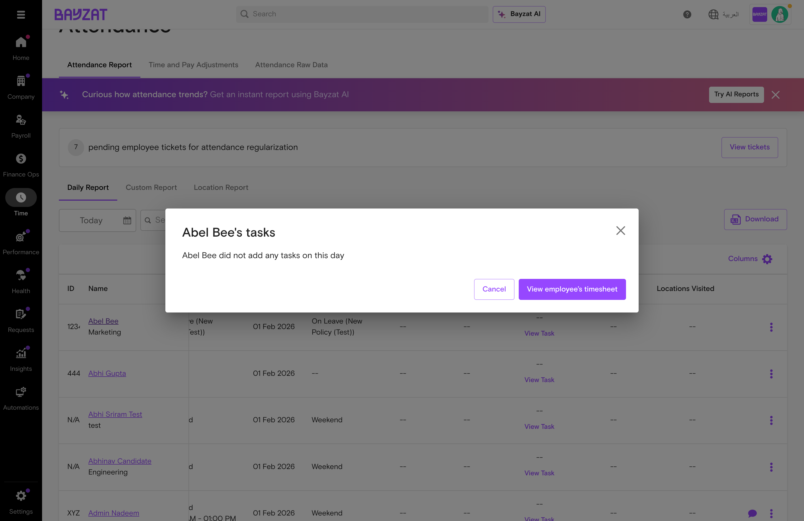
<figcaption>View Task dialog showing work start time, finish time, break taken, sites visited, and detailed timeline</figcaption>
</figure>

#### Activities/Comments Panel

Click the comment count button to open the Activities panel where admins can add notes about attendance records:

<figure>

<figcaption>Activities panel showing comment input for adding notes about employee attendance records</figcaption>
</figure>

- **Comment count** - Shows the number of existing comments/activities
- **Activities panel** - Opens on click to show all activities
- **Add comment** - Type in the input field to add new comments or notes

**Use Case:** The Activities feature is useful for documenting conversations with employees about attendance issues, tracking follow-ups on discrepancies, and maintaining an audit trail of attendance-related communications.

#### Downloading Daily Report

Click the **Download** button to export the Daily Report as an Excel file. The file is named with the date (e.g., "Attendance_Daily_View_Table_2026_02_01.xlsx").

<figure>

<figcaption>Download dialog showing Excel file export with date-stamped filename</figcaption>
</figure>

### Custom Report

The Custom Report provides attendance data over a selected date range (up to 1 year) with aggregate statistics and drill-down capabilities.

<figure>

<figcaption>Custom Report with date range picker showing aggregate attendance data including Days Present, Days Absent, and Days on Leave</figcaption>
</figure>

The Custom Report shows aggregate attendance statistics for each employee over the selected date range, including days present, days absent, days on leave, total hours worked, and extra hours. Click on any count to drill down and see the specific dates.

#### Drill-Down Feature

Click on any number in the Days Present, Days Absent, or Days on Leave columns to see the detailed day-by-day breakdown:

<figure>

<figcaption>Days Present drill-down showing each day the employee was present with check-in time, check-out time, and hours worked</figcaption>
</figure>

<figure>

<figcaption>Days Absent drill-down showing specific dates when the employee was absent</figcaption>
</figure>

<figure>

<figcaption>Days on Leave drill-down showing leave dates and leave type (e.g., "New Policy (Test)")</figcaption>
</figure>

#### Download Options

Click the **Download** button dropdown to choose the export format:

<figure>
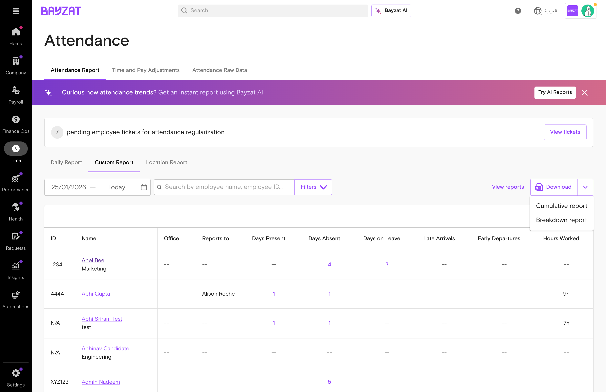
<figcaption>Download dropdown with Cumulative report and Breakdown report options</figcaption>
</figure>

| Report Type | Description | Best For |
|----|----|----|
| **Cumulative Report** | One row per employee with aggregated totals for the entire date range | High-level summaries, month-end reviews, comparing employees |
| **Breakdown Report** | Multiple rows per employee, one for each day, with detailed check-in/out times | Detailed audits, investigating specific dates, day-by-day analysis |

#### View Reports

Click **View Reports** to see previously generated reports that are available for download:

<figure>

<figcaption>View Reports panel displaying previously generated reports with timestamps and download buttons</figcaption>
</figure>

- Reports are listed with generation timestamp
- Click the download icon to retrieve any previously generated report
- Useful for accessing reports without regenerating them

### Location Report

The Location Report analyzes attendance by physical location rather than by employee, showing visit patterns across different work sites.

<figure>
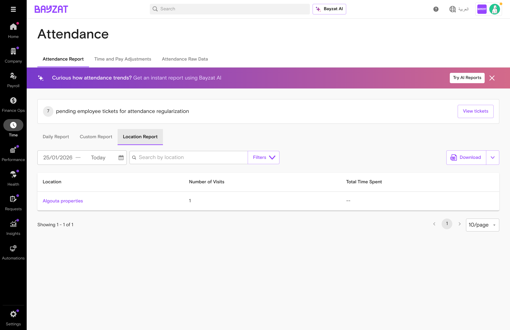
<figcaption>Location Report view showing locations, total visits, total hours spent, and visit details</figcaption>
</figure>

#### Location Report Features

- **Location name** - Physical location or work site name
- **Total visits** - Number of employee visits to this location
- **Total hours** - Aggregate time spent at this location
- **Employee breakdown** - Click to see which employees visited and when

**Use Case:** Location Reports are valuable for field workforce management, understanding client site coverage, and analyzing travel patterns for employees who visit multiple locations.

### Filtering Reports

Use the **Filters** button to narrow down results by various criteria:

<figure>
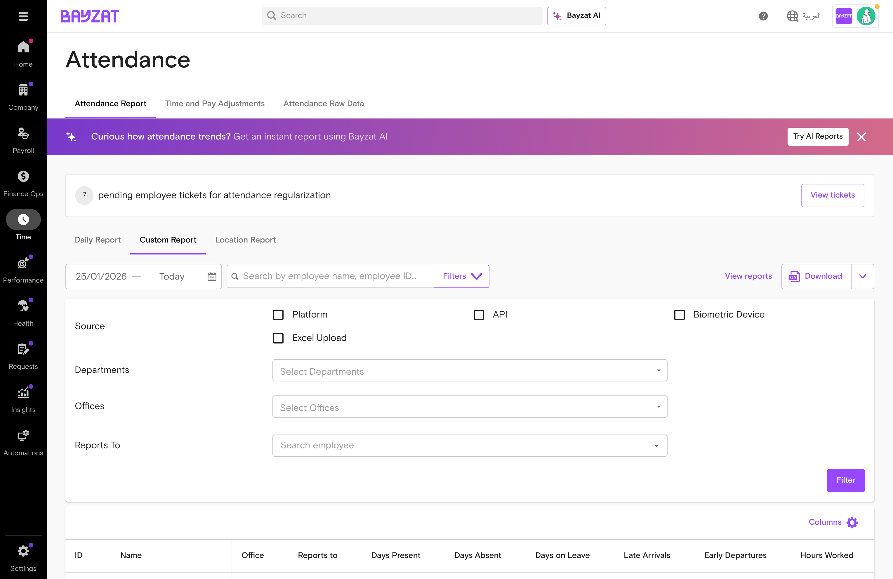
<figcaption>Filter panel with options for Status, Department, Office, Work Center, and more</figcaption>
</figure>

- **Status** - Filter by Present, Absent, On Leave, Weekend, Holiday
- **Department** - Filter by organizational department
- **Office** - Filter by office location
- **Work Center** - Filter by assigned work center
- **Reports to** - Filter by line manager

### Mobile Daily Attendance Report

Managers can view and edit attendance reports on the Bayzat mobile app.

1

#### View Employee Attendance

Tap on a specific employee's attendance card to see the detailed view including check-in time, check-out time, location, hours worked, break hours, total visit hours, and extra hours.

2

#### View Full Breakdown

Tap **Full Breakdown** to see a timeline of all attendance actions for that employee, including visits, breaks, and check-in/out events.

## Time and Pay Adjustments (Admin)

### Overview

Time and Pay Adjustments is where Line Managers and HR Managers process entries for extra hours and attendance violations (late arrivals, early departures, absences). The interface is organized into 5 tabs that represent the workflow stages.

Time → Employee Attendance → Time and Pay Adjustments

### Related Policies

- **Overtime Policy** - For compensating extra hours via payroll
- **Day in Lieu Policy** - For compensating extra hours via time off
- **Deduction Policy** - For handling attendance violations

### Workflow Overview

Entries flow through these stages: **Scheduled** (advance overtime planning) → **Pending** (awaiting review) → **Approved** (ready for payroll) → **Processed** (included in payroll) or **Rejected** (declined).

### 1. Scheduled Tab

The Scheduled tab shows pre-planned overtime that has been scheduled in advance. Admins can plan overtime before it happens using the **Schedule Extra Hours** button.

<figure>
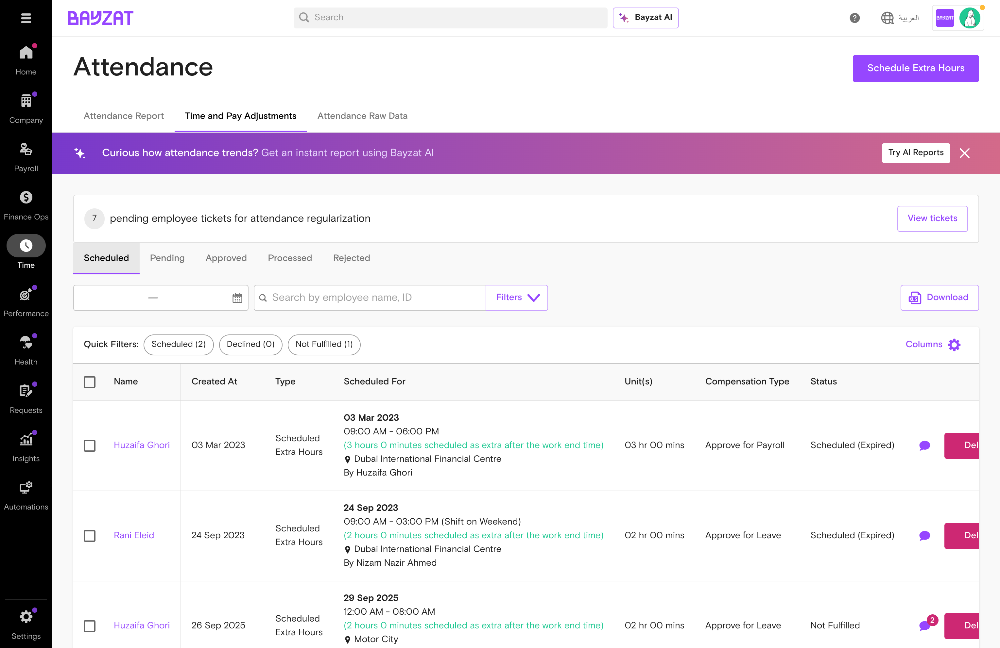
<figcaption>Scheduled tab with Schedule Extra Hours button and quick filters for Scheduled, Declined, and Not Fulfilled statuses</figcaption>
</figure>

#### Scheduled Tab Quick Filters

- **Scheduled** - Overtime that has been scheduled and accepted
- **Declined** - Overtime requests that the employee declined
- **Not Fulfilled** - Scheduled overtime that was not worked

The table shows each scheduled overtime entry with the employee name, scheduled date, number of hours, compensation type (Payroll or Time Off), and current status.

#### Schedule Extra Hours Dialog

Click the **Schedule Extra Hours** button to plan overtime in advance for employees.

<figure>

<figcaption>Schedule Extra Hours dialog with employee dropdown and Create Extra Hours Instruction button</figcaption>
</figure>

**Prerequisite:** Only employees assigned to an Overtime Policy or Days in Lieu Policy appear in the dropdown. For shift workers, they must have a shift scheduled on the target date.

#### Scheduling Permissions

| Role | Can Assign to Payroll/Time Off? |
|----|----|
| Line Manager with compensation permission | Yes - can choose payroll or time off |
| Line Manager without compensation permission | No - cannot assign compensation type |

**Note:** On weekends and public holidays, the whole day is considered as extra hours.

### 2. Pending Tab

The Pending tab contains all entries awaiting review and approval. This includes attendance violations (absences, late arrivals, early departures) and extra hours requests.

<figure>
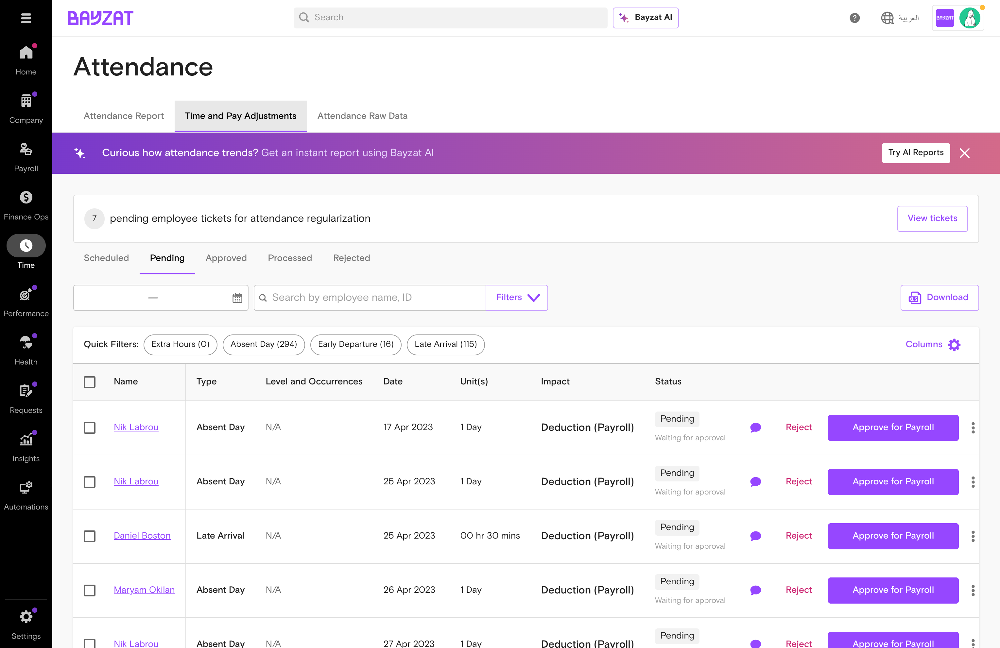
<figcaption>Pending tab with quick filters showing entry counts by type and Reject/Approve for Payroll action buttons</figcaption>
</figure>

#### Pending Tab Quick Filters

- **Extra Hours** - Overtime hours awaiting approval
- **Absent Day** - Unexcused absences pending review
- **Early Departure** - Employees who left before shift end
- **Late Arrival** - Employees who arrived after shift start

The table displays each entry with the employee name, violation type, level and occurrence count, date, units affected, impact amount (deduction in AED), and review status.

#### Pending Tab Actions

- **Reject** - Decline the entry, moving it to the Rejected tab
- **Approve for Payroll** - Approve for inclusion in payroll (for HR managers)
- **Review** - Mark as reviewed (for Line Managers)

### 3. Approved Tab

The Approved tab shows entries that have been approved and are ready for payroll processing. Entries here display the deduction or compensation amount in AED.

<figure>
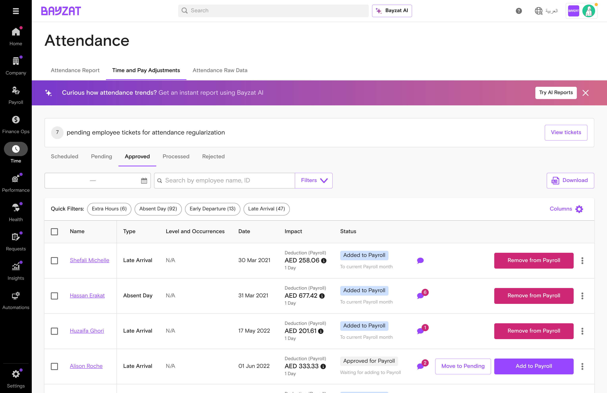
<figcaption>Approved tab showing approved entries with AED deduction amounts and Add to Payroll/Remove from Payroll actions</figcaption>
</figure>

#### Approved Tab Status Values

- **Approved for Payroll** - Entry approved but not yet added to payroll
- **Added to Payroll** - Entry has been added to payroll table for processing

#### Approved Tab Actions

- **Add to Payroll** - Add the entry to the payroll table for the pay period
- **Remove from Payroll** - Remove from payroll table (available after adding)
- **Move to Pending** - Return to Pending tab for re-review (via kebab menu)

### 4. Processed Tab

The Processed tab contains entries that have been included in a completed payroll run. These entries are read-only and show which payroll month they were processed with.

<figure>
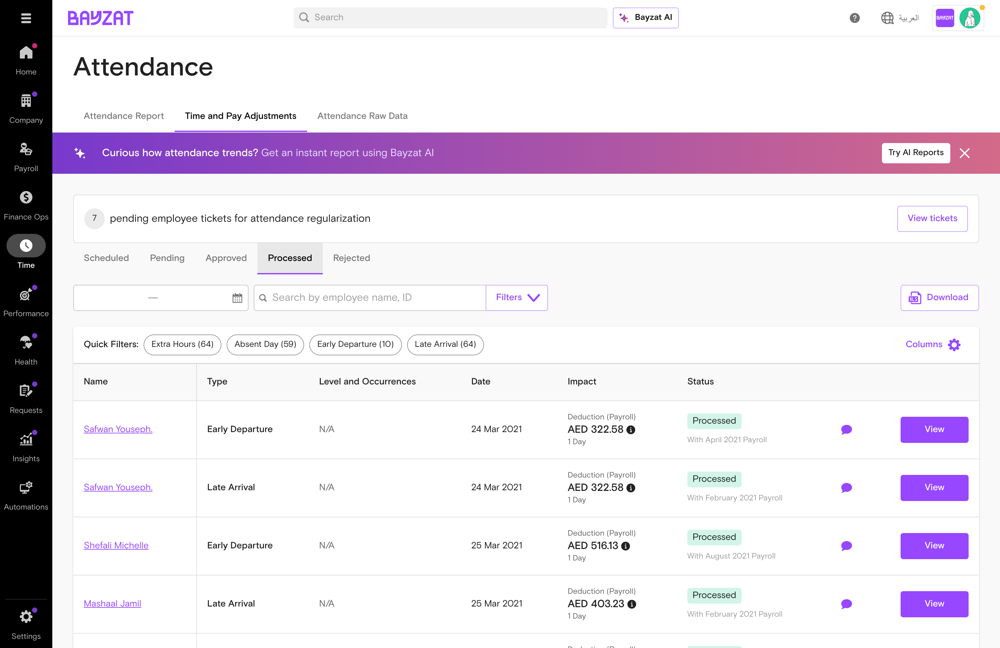
<figcaption>Processed tab showing finalized entries with status indicating the payroll month (e.g., "Processed With November 2024 Payroll")</figcaption>
</figure>

#### Processed Tab Status Values

- **Processed With \[Month Year\] Payroll** - Entry was included in the specified payroll run
- **Added to leave balance** - Extra hours converted to time off (days in lieu)

#### Processed Tab Actions

- **View** - View the entry details (read-only, no modifications allowed)

**Finalized Records:** Processed entries cannot be modified as they have already been included in completed payroll. Contact your HR administrator if corrections are needed.

### 5. Rejected Tab

The Rejected tab contains entries that were declined by managers. Entries can be moved back to Pending for reconsideration if needed.

<figure>

<figcaption>Rejected tab showing declined entries with the rejecting manager's name and Move to Pending action</figcaption>
</figure>

#### Rejected Tab Status

The Status column shows **Rejected By \[Manager Name\]**, indicating who declined the entry.

#### Rejected Tab Actions

- **Move to Pending** - Return the entry to Pending tab for reconsideration

### Actions for Line Managers

| Action | Description |
|----|----|
| **Review** | Review violation entries (Late arrival, Early departure, Absent) and extra hours entries. Status changes to 'Reviewed' in Pending Tab. |
| **Unreview** | Revert a reviewed decision using the kebab menu (three dots) |
| **Reject** | Move entry to Rejected tab. Can be moved back to Pending using 'Move to Pending' action. |

**Work Disruption:** When reviewing violation entries under the advanced tracking method, Line Managers must select 'Yes' or 'No' for work disruption.

### Actions for HR Managers (Super Admin)

| Action | Description |
|----|----|
| **Approve for Payroll** | Approve violation entries and extra hours (overtime) for payroll processing |
| **Approve for Time Off** | Approve extra hour entries (days in lieu) as time off |
| **Review & Approve** | For entries requiring work disruption selection that haven't been reviewed by Line Manager |

### Entry Movement Rules (Advanced Tracking)

**Forward movement** (Pending → Approved/Rejected → Processed):

- Entries must be moved from smaller occurrence to higher occurrence in order
- Example: If there are occurrences 1, 2, 3 in Pending Tab, approve them in order 1 → 2 → 3

**Backward movement** (Approved/Rejected → Pending):

- Entries must be moved from higher occurrence to smaller occurrence in order
- Example: If there are occurrences 1, 2, 3 in Approved Tab, move to Pending in order 3 → 2 → 1

**Exception:** REJECT can be performed on entries in the Pending Tab in any order.

### Split Shifts and Extra Hours

For employees with split shifts (e.g., Morning 9 AM - 2 PM and Evening 7 PM - 11 PM):

- Extra hour entries are created for each individual shift
- Both entries must be processed to pay overtime for that day
- Scheduling extra hours from Time and Pay Adjustments is restricted if there is more than one shift in a day

### Deductions for Split Shifts

When calculating deductions for split shift employees:

- The final deduction is halved and distributed evenly across shifts
- This prevents double deductions for split shift employees

## Attendance Raw Data (Admin)

### Overview

The Attendance Raw Data section provides access to unprocessed punch data from various sources before it's evaluated and converted into attendance records. This is useful for troubleshooting, auditing, and verifying data from biometric devices and API integrations.

Time → Employee Attendance → Attendance Raw Data

### 1. API Data Tab

Shows punch data received through API integrations. This includes data from third-party systems that send attendance information via API calls.

<figure>

<figcaption>API Data tab displaying punch records received via API with date range filter and employee search</figcaption>
</figure>

The table displays each API punch record with the employee details, punch timestamp, punch type (Check In, Check Out, Break Start, Break End), and how the system evaluated it for attendance calculation.

### 2. Device Data Tab

Shows raw punch data received directly from biometric devices (fingerprint scanners, facial recognition terminals). This data is mapped to employees based on device configurations.

<figure>

<figcaption>Device Data tab showing punch records from biometric devices with device serial number and office mapping</figcaption>
</figure>

The table shows each device punch with the device serial number, input method (Fingerprint, Face, Card), mapped employee, office location, punch date/time, and how the system evaluated it.

**Device Mapping:** For device data to appear, the biometric device must be configured in Settings → Attendance → Biometric Devices with the correct serial number and office assignment.

### 3. Legacy Raw Data Tab

Shows historical attendance data from legacy systems or older integrations. This tab preserves data from previous attendance tracking methods.

<figure>
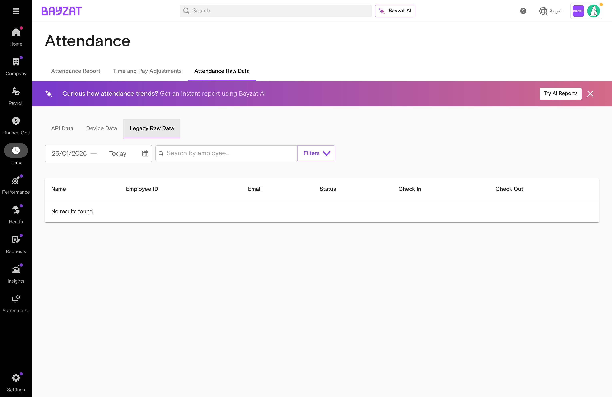
<figcaption>Legacy Raw Data tab displaying historical attendance records with simplified check-in/check-out format</figcaption>
</figure>

The table displays legacy attendance records with employee details, processing status, and check-in/check-out timestamps in a simplified format.

### Common Features Across All Tabs

- **Date Range Filter** - Select a date range to view raw data for specific periods
- **Search by Employee** - Find records for a specific employee by name or ID
- **Filters** - Additional filters to narrow down results by status, punch type, etc.

**Use Case:** The Attendance Raw Data section is primarily used for troubleshooting when attendance records don't match expected values. Administrators can verify if punch data was received from devices/APIs and how it was evaluated by the system.

## Reviewing Attendance Regularization Requests (Admin)

### Overview

When employees submit attendance regularization requests to correct missed check-ins or check-outs, designated approvers review and approve or reject these requests through the Employee Tickets system. A notification banner on the Attendance Report page alerts admins to pending regularization tickets.

**Tip:** Admins can also raise attendance regularization requests on behalf of employees by navigating to **Requests → Employee tickets → Create ticket** and selecting the employee from the dropdown.

Time → Employee Attendance → View pending tickets banner → View tickets

**Alternative path:** Requests → Employee tickets

### Accessing Pending Regularization Requests

There are two ways to access attendance regularization requests:

1

#### Via Attendance Report Banner

Navigate to **Time → Employee Attendance**. A banner at the top shows the count of pending employee tickets for attendance regularization. Click **View tickets** to go directly to the pending requests.

2

#### Via Requests Menu

Navigate to **Requests → Employee tickets** to view all employee tickets including attendance regularization requests.

### Employee Tickets Interface

The Employee Tickets page organizes requests into three tabs based on their status.

<figure>

<figcaption>Employee Tickets page showing the Pending tab with ticket list, including Attendance Regularization requests</figcaption>
</figure>

#### Tab Overview

| Tab          | Description                          | Actions Available |
|--------------|--------------------------------------|-------------------|
| **Pending**  | Tickets awaiting review and approval | Approve, Reject   |
| **Approved** | Tickets that have been approved      | View details      |
| **Rejected** | Tickets that were declined           | View details      |

### Reviewing a Regularization Request

Click on any ticket row to view the full details in a side panel or click the ticket ID to open the dedicated ticket page.

<figure>

<figcaption>Attendance Regularization details page showing ticket info, historical info, and request details</figcaption>
</figure>

#### Ticket Information

The ticket details include:

- **Ticket info** - Notes, requested check-in date/time, and check-out date/time
- **Historical info** - The employee's work timing schedule and current attendance record before correction
- **Details** - Ticket ID, category, status, priority, ticket type, requester, created date, approvers, and employee info
- **Activities and comments** - Audit trail of all actions taken on the ticket

### Approving or Rejecting Requests

If you are a designated approver for the ticket, you will see **Approve** and **Reject** buttons in the Actions column on the pending tickets list.

1

#### Review the Request

Click the ticket to review the requested check-in/out times against the historical info showing what was originally recorded.

2

#### Take Action

Click **Approve** to accept the regularization (this updates the attendance record) or **Reject** to decline the request.

3

#### Add Comments (Optional)

Use the "Write a comment..." field in the Activities section to add notes explaining the decision.

### Approved Requests

The Approved tab shows all tickets that have been approved. The table includes an "Approved date" column showing when the request was approved.

<figure>
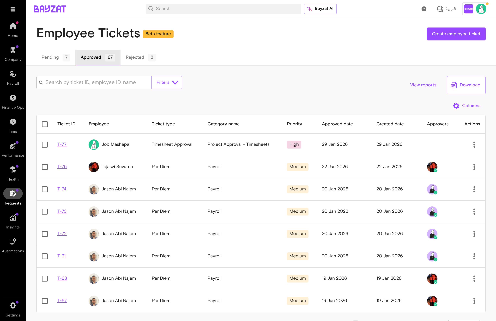
<figcaption>Approved tab showing completed requests with approved date and approver information</figcaption>
</figure>

### Rejected Requests

The Rejected tab shows all tickets that were declined. The table includes a "Rejected date" column.

<figure>
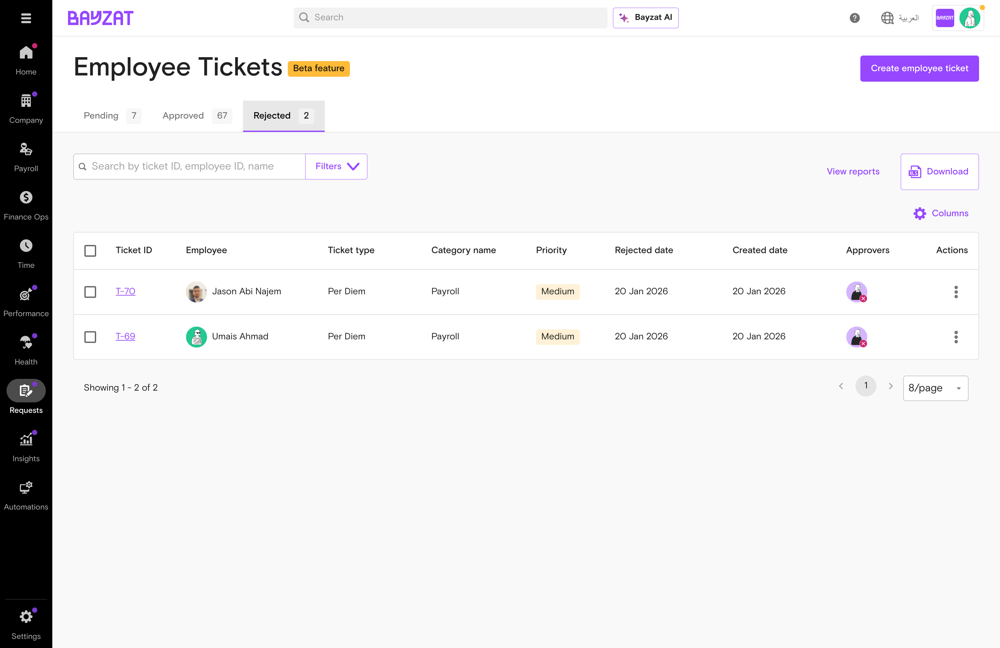
<figcaption>Rejected tab showing declined requests with rejected date</figcaption>
</figure>

**Approver Assignment:** Only users designated as approvers for the specific ticket type can approve or reject requests. The approvers are determined by the company's ticket workflow configuration.

### Filtering and Searching

Use the search bar to find tickets by ticket ID, employee ID, or employee name. Click **Filters** to filter by ticket type, category, priority, or date range.

### Downloading Reports

Click the **Download** button to export the ticket list as a report. Click **View reports** to access previously generated reports.

## Approval Flows for Attendance

### Overview

Approval flows determine who reviews and approves attendance-related requests. Navigate to **Automations → Approval flows** to configure how attendance regularization requests are routed for approval.

Automations → Approval flows → Attendance Regularization

<figure>
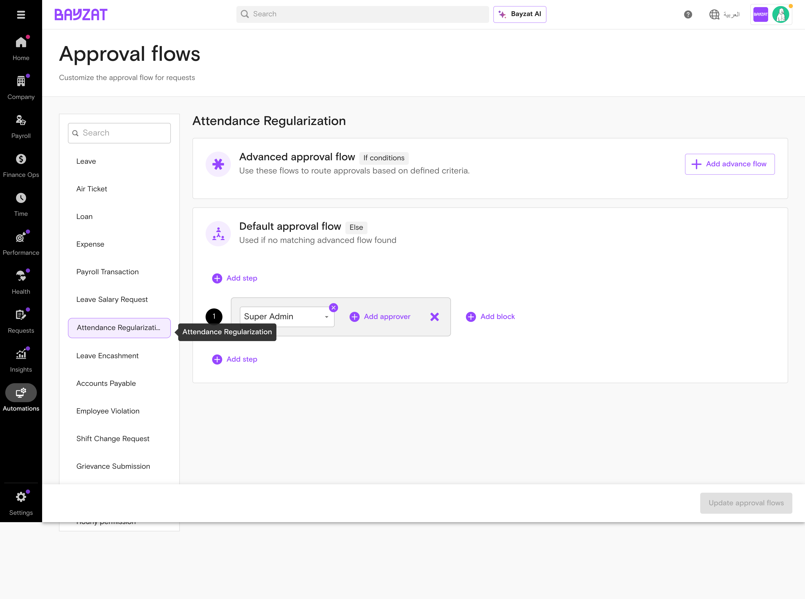
<figcaption>Configuring the approval flow for Attendance Regularization requests</figcaption>
</figure>

### Flow Types

The Attendance Regularization approval flow supports two types of routing:

| Flow Type | Description | When Used |
|----|----|----|
| **Advanced Approval Flow** | Conditional routing based on defined criteria (If conditions) | When different departments, roles, or conditions require different approvers |
| **Default Approval Flow** | Fallback flow when no advanced conditions match (Else) | Standard approval path for all requests not matching advanced criteria |

### Configuring Advanced Approval Flows

Click **Add advance flow** to create conditional approval routing. Advanced flows allow you to route requests to different approvers based on specific criteria.

<figure>

<figcaption>Creating an advanced approval flow with custom criteria</figcaption>
</figure>

#### Available Criteria for Routing

When defining advanced approval flow conditions, you can use the following data points:

<figure>
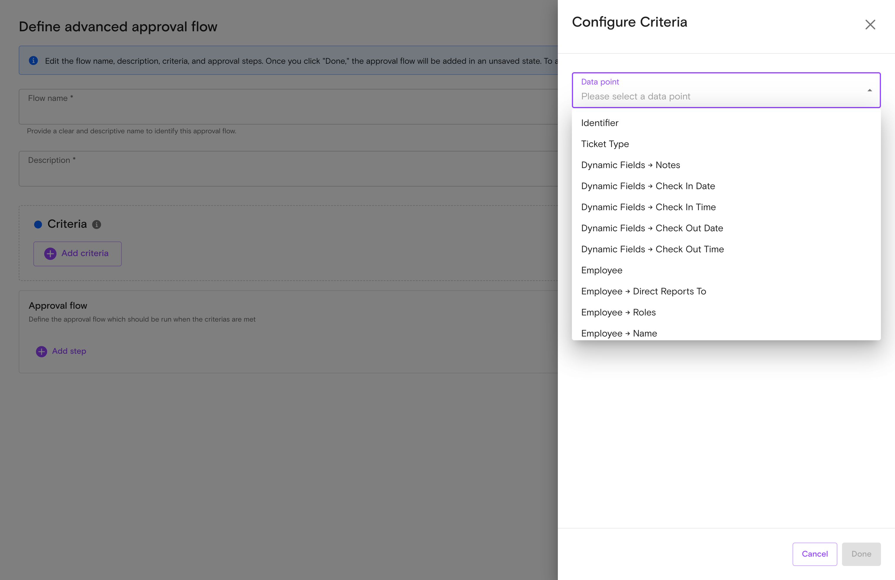
<figcaption>Data points available for defining approval criteria</figcaption>
</figure>

| Category | Data Points | Use Case |
|----|----|----|
| **Dynamic Fields** | Notes, Check In Date, Check In Time, Check Out Date, Check Out Time | Route based on request-specific information |
| **Employee** | Department, Office, Position, Roles, Employee Grade, Direct Reports To, Nationality, Status | Route based on the employee who the request is for |
| **Creator Employee** | Same fields as Employee | Route based on who submitted the request |

### Default Approval Flow Configuration

The default approval flow is used when no advanced flow conditions match. You can configure:

- **Approval Steps** - Add sequential approval stages (Step 1, Step 2, etc.)
- **Approvers** - Assign roles (e.g., Super Admin, Line Manager) or specific users
- **Approval Blocks** - Group multiple approvers for parallel approval

**Save Changes:** After configuring approval flows, click **Update approval flows** to save your changes. Unsaved changes will not take effect.

### Use Case Examples

#### Example 1: Department-Based Routing

Route IT department regularization requests to the IT Manager, while Finance department requests go to the Finance Director.

**Criteria:** Employee → Department equals "IT"  
**Approver:** IT Manager

#### Example 2: Grade-Based Escalation

Senior employees (Grade A) require Director approval, while junior employees need only Manager approval.

**Criteria:** Employee → Employee Grade equals "Grade A"  
**Approver:** Director

#### Example 3: Multi-Step Approval

All requests first go to the Line Manager, then to HR for final verification.

**Step 1:** Direct Reports To (Line Manager)  
**Step 2:** HR Admin

## Workflows for Attendance Automation

Workflows enable automated responses to attendance events, helping organizations streamline notifications, reporting, and schedule management. Access workflows via **Automations → Workflows**.

<figure>

<figcaption>Workflows page - filter by Bayzat Attendance or Bayzat Timesheet to view attendance-related automations</figcaption>
</figure>

### Attendance Automation Use Cases

#### Schedule Change Notifications

When shifts are created, updated, or deleted, workflows can automatically notify affected employees via email, mobile push notification, or Slack message. This ensures employees are always aware of their current schedule without manual communication from managers.

#### Absence Alerts

When an employee is marked as absent (either manually by an admin or automatically by the system), workflows can alert the relevant manager, post to a team channel, or create a follow-up task. This enables immediate awareness and response to unexpected absences.

#### Automated Report Generation

Attendance reports can be automatically generated and distributed on a schedule (daily, weekly, monthly) using the **Generate Attendance Report** action. Reports can be sent to managers, HR, or finance teams without manual intervention.

#### Calendar Synchronization

Shift assignments can automatically sync with Google Calendar, keeping employee calendars up-to-date with their work schedules. When shifts change, calendar events update accordingly.

#### Timesheet Validation

When timesheets are created or updated, workflows can trigger validation checks, notify approvers, or send data to external systems for payroll processing.

### Available Attendance Triggers

The following events can trigger attendance-related workflows:

| Application | Event Trigger | Automation Scenario |
|----|----|----|
| Bayzat Attendance | Employee shift is created | Notify employee of new schedule assignment |
| Bayzat Attendance | Employee shift is updated | Alert employee when schedule changes |
| Bayzat Attendance | Employee shift is deleted | Notify employee of cancelled shift |
| Bayzat Attendance | Mark as absent button clicked | Alert manager when admin marks employee absent |
| Bayzat Attendance | Employees marked absent for past day | Generate daily absence summary for managers |
| Bayzat Timesheet | Timesheet is created | Notify approver of pending timesheet |
| Bayzat Timesheet | Timesheet is updated | Track timesheet modifications for audit |

### Available Attendance Actions

When attendance events occur, the following actions can be automated:

| Application | Action | Purpose |
|----|----|----|
| Bayzat Attendance | Create schedule cell | Auto-create shifts based on rules or external triggers |
| Bayzat Attendance | Update schedule cell | Modify schedules programmatically |
| Bayzat Attendance | Delete schedule cell | Remove shifts automatically when conditions are met |
| Bounce Attendance | Generate Attendance Report | Auto-generate and distribute attendance reports |
| Email | Send email | Notify employees or managers of attendance events |
| Mobile Notification | Send push notification | Real-time alerts to employee mobile devices |
| Slack | Post message | Team channel notifications for absences or schedule changes |
| Google Calendar | Create/Update event | Sync shifts to employee calendars |

### Custom Variables for Advanced Automation

Custom variables allow you to create dynamic values that can be used throughout your workflow logic. These variables enable sophisticated automation scenarios by combining event data with functions for calculations, lookups, and conditional logic.

**Why Custom Variables Matter:** Custom variables transform basic "if this, then that" workflows into intelligent automation that can calculate, compare, and make decisions based on dynamic data.

#### Basic Workflows vs Custom Variables

| Capability | Basic Workflow | With Custom Variables |
|----|----|----|
| **Data Access** | Only direct event fields (employee name, shift date, check-in time) | Look up related data from any Bayzat domain (department info, work timing details, manager email) |
| **Comparisons** | Static values only (e.g., "department equals Sales") | Dynamic calculations (e.g., "check-in time \> shift start + 15 minutes") |
| **Notifications** | Fixed message content | Computed values in messages (e.g., "Employee is 23 minutes late") |
| **Criteria Logic** | Simple field matching | Conditional logic with AND/OR/IF to handle complex rules |
| **Date Handling** | Cannot calculate date differences | Calculate days until deadline, add/subtract periods, detect weekends |

#### What You Can Achieve with Custom Variables

##### Calculate Derived Values

Compute values that don't exist in the raw event data:

- `minutesLate = checkInTime - (shiftStartTime + gracePeriod)`
- `daysUntilProbationEnds = DATE_DIFF_DAYS(TODAY(), probationEndDate)`
- `weeklyOvertimeHours = SUM(dailyExtraHours)`

##### Look Up Related Information

Access data from other Bayzat domains to enrich your workflow:

- `DEPARTMENT_BY_NAME(employee.department)` → Get department manager's email for notifications
- `WORK_TIMING(shiftType)` → Get shift start/end times and break durations
- `EMPLOYEE_BY_BIOMETRICS_ID(deviceId)` → Match biometric clock data to employees

##### Apply Conditional Logic

Make smart decisions based on multiple conditions:

- `IF_STRING(department = "Operations", "ops-manager@company.com", "hr@company.com")`
- `IF_NUMBER(hoursWorked > 8, hoursWorked - 8, 0)` → Calculate overtime only if exceeded
- `AND(isWeekend, shiftAssigned)` → Detect weekend work assignments

<figure>

<figcaption>Custom variables can be created using functions from six categories: Mathematics, Lookup, Text, Date &amp; Time, Logic, and Operator</figcaption>
</figure>

#### Function Categories

| Category | Functions | Attendance Use Cases |
|----|----|----|
| **Lookup** | 21 functions | Look up work timings, schedule cell types, employees by biometrics ID, departments, offices |
| **Date & Time** | 27 functions | Calculate shift durations, determine weekdays, add/subtract days from dates, get current time |
| **Logic** | 8 functions | Create conditional workflows based on shift type, department, or time of day |
| **Mathematics** | 21 functions | Calculate overtime hours, sum attendance data, compute averages |
| **Text** | 17 functions | Format employee names for notifications, create custom message templates |
| **Operator** | 17 functions | Compare values, check equality, evaluate conditions for workflow criteria |

#### Key Lookup Functions for Attendance

<figure>
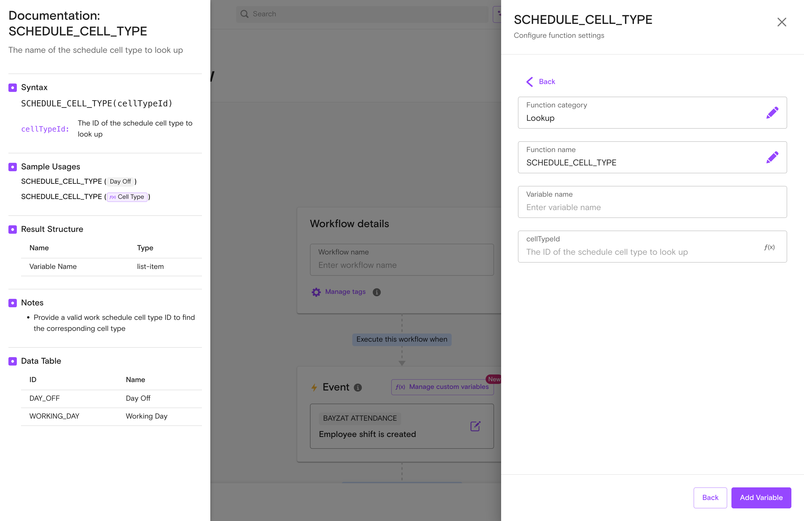
<figcaption>SCHEDULE_CELL_TYPE function - look up schedule cell types like "Day Off" or "Working Day"</figcaption>
</figure>

| Function | Syntax | Purpose |
|----|----|----|
| `WORK_TIMING` | `WORK_TIMING(workTimingName)` | Look up a work timing by name (e.g., "Morning Shift", "Night Shift") |
| `SCHEDULE_CELL_TYPE` | `SCHEDULE_CELL_TYPE(cellTypeId)` | Look up schedule cell type: DAY_OFF or WORKING_DAY |
| `EMPLOYEE_BY_BIOMETRICS_ID` | `EMPLOYEE_BY_BIOMETRICS_ID(id)` | Find employee attributes using their biometrics ID |
| `DEPARTMENT_BY_NAME` | `DEPARTMENT_BY_NAME(name)` | Look up department details for filtering or notifications |
| `OFFICE_BY_NAME` | `OFFICE_BY_NAME(name)` | Find office information for location-based workflow logic |

#### Example Workflow Scenarios Using Variables

The following scenarios are based on real business requirements. They demonstrate how custom variables eliminate manual HR work by automating complex calculations and policy enforcement.

##### Scenario 1: Monthly Overtime Capping with Auto-Conversion to Leave

**The Manual Pain Point:**

HR currently checks overtime for 330+ employees every month to ensure no one exceeds 100 hours. Overtime above the cap must be excluded from payroll and converted to lieu days (time-off in lieu). This manual verification is extremely time-consuming and error-prone.

**The Automated Solution:**

A workflow that tracks cumulative monthly overtime per employee, alerts when approaching the 100-hour cap, and automatically triggers the conversion process when exceeded.

**Variables Used:**

| Variable Name | Function | Purpose |
|----|----|----|
| `monthStart` | `DATE(YEAR(TODAY()), MONTH(TODAY()), 1)` | Get first day of current month for period calculation |
| `monthlyOTHours` | `SUM(employee.overtimeHours, monthStart, TODAY())` | Calculate cumulative overtime hours for the month |
| `remainingCap` | `IF_NUMBER(100 - monthlyOTHours > 0, 100 - monthlyOTHours, 0)` | Calculate how many OT hours remain before hitting 100-hour cap |
| `excessHours` | `IF_NUMBER(monthlyOTHours > 100, monthlyOTHours - 100, 0)` | Calculate hours to be converted to lieu days |
| `lieuDays` | `DIVIDE(excessHours, 8)` | Convert excess hours to leave days (8 hours = 1 day) |

**Workflow Configuration:**

- **Event:** Timesheet is updated (overtime recorded)
- **Criteria:** `monthlyOTHours >= 80` (trigger at 80% of cap)
- **Actions:**
  - **At 80 hours:** Send warning to employee and manager: "You have used 80 of 100 overtime hours this month. Remaining: \[remainingCap\] hours."
  - **At 100+ hours:** Send alert to HR and payroll: "OVERTIME CAP REACHED: \[employee.name\] has \[excessHours\] hours to convert to \[lieuDays\] lieu days. Exclude from payroll processing."

**Business Impact:** Eliminates monthly manual checks for 330+ employees. Payroll receives automatic notifications for exclusions. Employees and managers get proactive warnings before hitting caps.

##### Scenario 2: Hourly Leave Request Blocking with Monthly Limits

**The Manual Pain Point:**

The company offers a special hourly leave type for late arrivals or early departures with strict rules: maximum 4 hours per month, maximum 2 hours per request, and only 2 requests allowed per month. HR must manually verify whether an employee has already used their 2 requests before approving—leading to delays and occasional policy violations.

**The Automated Solution:**

A workflow that automatically calculates the employee's monthly usage and blocks the request at submission if limits are exceeded—preventing the 3rd request entirely.

**Variables Used:**

| Variable Name | Function | Purpose |
|----|----|----|
| `monthStart` | `DATE(YEAR(TODAY()), MONTH(TODAY()), 1)` | First day of current month for counting requests |
| `requestsThisMonth` | `COUNT(employee.hourlyLeaveRequests, monthStart, TODAY())` | Count how many hourly leave requests submitted this month |
| `hoursUsedThisMonth` | `SUM(employee.hourlyLeaveHours, monthStart, TODAY())` | Total hourly leave hours used this month |
| `remainingRequests` | `IF_NUMBER(2 - requestsThisMonth > 0, 2 - requestsThisMonth, 0)` | Calculate remaining request allowance (max 2) |
| `remainingHours` | `IF_NUMBER(4 - hoursUsedThisMonth > 0, 4 - hoursUsedThisMonth, 0)` | Calculate remaining hours allowance (max 4) |
| `canSubmit` | `AND(requestsThisMonth < 2, hoursUsedThisMonth < 4, requestedHours <= 2)` | Validate all three rules: requests, total hours, per-request limit |

**Workflow Configuration:**

- **Event:** Hourly leave request is submitted
- **Criteria:** `canSubmit = FALSE`
- **Actions:**
  - **Block submission** and notify employee: "Request cannot be submitted. You have used \[requestsThisMonth\] of 2 allowed requests and \[hoursUsedThisMonth\] of 4 allowed hours this month."
  - If `requestedHours > 2`: "Maximum 2 hours per request. Please reduce your request."

**Approval Flow Integration:** When `canSubmit = TRUE`, route to: Department Head → HR → Copy to Security/Gate for exit control.

**Business Impact:** Policy violations blocked at source. HR no longer manually verifies request counts. Security receives automatic notification for gate access.

##### Scenario 3: Comp-Off Expiry Tracking Based on Work Date

**The Manual Pain Point:**

For non-overtime employees (e.g., admin staff), extra work results in comp-off leave. These comp-offs must expire exactly 365 days from the actual work date—not based on leave year or employee anniversary. HR struggles to track individual expiry dates, leading to either premature forfeiture or employees using expired comp-offs.

**The Automated Solution:**

A workflow that calculates the exact expiry date for each comp-off based on when the extra work occurred, sends proactive reminders before expiry, and automatically expires unused balances.

**Variables Used:**

| Variable Name | Function | Purpose |
|----|----|----|
| `workDate` | `compOff.earnedDate` | The date the extra work was performed |
| `expiryDate` | `DATE_ADD_DAYS(workDate, 365)` | Calculate exact expiry: 365 days from work date |
| `daysUntilExpiry` | `DATE_DIFF_DAYS(TODAY(), expiryDate)` | Calculate remaining days before comp-off expires |
| `isExpiringSoon` | `AND(daysUntilExpiry <= 30, daysUntilExpiry > 0)` | Flag comp-offs expiring within 30 days |
| `isExpired` | `daysUntilExpiry <= 0` | Flag comp-offs that have passed expiry date |
| `employeeType` | `EMPLOYEE_STATUS_BY_ID(employee.statusId)` | Verify employee is non-OT eligible for comp-off rules |

**Workflow Configuration:**

- **Event:** Daily scheduled check (Custom Recurring Event)
- **Criteria:** `employeeType = "Non-OT"` AND comp-off balance exists
- **Actions:**
  - **30 days before expiry:** Send reminder to employee: "Your comp-off earned on \[workDate\] will expire on \[expiryDate\]. You have \[daysUntilExpiry\] days to use it."
  - **7 days before expiry:** Send urgent reminder to employee and manager
  - **On expiry:** Automatically forfeit comp-off and notify: "Comp-off from \[workDate\] has expired and been removed from your balance."

**Example:** Employee worked extra on 27 Jan 2026. The system calculates expiry as 26 Jan 2027. Reminders sent on 27 Dec 2026 (30 days) and 19 Jan 2027 (7 days). Auto-expired on 27 Jan 2027 if unused.

**Business Impact:** No more manual expiry tracking. Employees receive timely reminders. Automatic forfeiture ensures policy compliance. HR has accurate comp-off balance reporting.

<figure>

<figcaption>Date &amp; Time functions enable calculations for shift scheduling, overtime, and period-based automation</figcaption>
</figure>

**Note:** These scenarios represent real business requirements. The specific thresholds (100 hours, 4 hours, 365 days) can be configured to match your organization's policies. Workflows are set at company level and combine multiple variables to replace manual HR processes.

## Business Rules & Limitations

### Core Business Rules

| Rule | Description | Impact |
|----|----|----|
| Shift publication required | Shifts must be published as working days before check-ins are accepted | Early or late check-ins on unpublished days are rejected |
| Location validation | Geo-fencing validates employee location against office coordinates | Check-ins outside radius may be flagged or rejected |
| Leave approval impact | Approved leave requests delete existing attendance records | Historical attendance data is not preserved when leave is approved |
| Configuration lock | Attendance records locked to work timing at check-in | Cannot retroactively update records after configuration changes |

### System Constraints

- Employees cannot record attendance for half-day leave periods
- Attendance regularization requests cannot be submitted for days off (weekends, public holidays, or employee-specific off days)
- No bulk status change functionality for attendance adjustments
- Approved extra hours automatically add to leave balance without reversal option
- Custom roles require explicit policy assignment to appear in approval flows

## Troubleshooting & Edge Cases

### Common Issues

| Issue | Cause | Resolution |
|----|----|----|
| Check-in rejected | Shift not published or outside threshold time | Verify shift is published; use regularization for corrections |
| Location validation failed | Employee outside geo-fence radius | Check office coordinates; adjust radius if needed |
| Hours not calculated | Missing check-out entry | Employee must check out; manager can edit record |
| Cannot edit historical record | Work timing configuration changed after check-in | Records locked to original config; use regularization |
| Overtime not showing | Employee not assigned to overtime policy | Assign employee to overtime policy before shift |

### Known Limitations

**Half-Day Leave Check-in:** Employees cannot check in on the same day they have taken a half-day leave. The system prevents attendance recording during half-day leave periods.

**Single Check-in/Check-out Per Shift:** The system only supports a single check-in and check-out per shift. Multiple check-ins/outs during a single shift (e.g., for complex operational hours) are not supported.

**Leave Approval Overwrites Attendance:** When leave requests are approved, existing attendance records for those dates are automatically deleted. Historical attendance data is not preserved when leave is approved.

**Attendance Record Download:** Employees cannot directly download their personal attendance records from the platform. Attendance data export requires administrative access.

**Extra Hours Reversal:** Once an extra hours request is approved and days are added to leave balance, there is no built-in mechanism to reverse or edit the transaction.

**Line Manager Edit Access:** Line managers have default edit access to attendance records that cannot be disabled or restricted by super admins. There are no configurable permission settings to create view-only access.

**Extra Hours Display:** Extra hours are calculated based on work timing configuration regardless of overtime policy settings. There is no option to hide or suppress the display of extra hours in attendance records.

**Attendance Audit Trail:** The system lacks comprehensive audit logging for attendance record modifications. Changes to attendance entries (who edited, when, and what was changed) are not fully tracked.

**Attendance Variance Reporting:** Cannot export or display pre-edit attendance values in reports, limiting tracking of attendance modifications and historical timing before edits.

**Overtime Validation:** Hours worked are calculated automatically without validating checkout legitimacy or indicating missing/manipulated records.

**Bulk Shift Upload:** The platform does not support direct Excel-based bulk upload for shift scheduling. Use the Schedule Planner feature as an alternative.

**Bulk T&P Rejection:** Mass rejection of Time and Pay adjustment records is not available through the standard user interface. Large volumes of historical records must be processed individually.

**Retroactive Shift Scheduling:** Shifts cannot be scheduled or attendance records updated for dates before an employee's work center assignment date.

**Days Off in Cumulative Report:** The Cumulative Attendance Report displays days present, absent, and on leave but does not account for scheduled days off or weekends for different shift configurations.

**Biometric High Volume Processing:** The system may struggle with high-volume biometric log ingestion (100,000+ records). Large batches of attendance data from third-party biometric devices may require throttling.

### Edge Cases

| Scenario | Behavior | Recommended Action |
|----|----|----|
| 24-hour shifts crossing midnight | Day boundary resets at midnight, complicating shift configurations | Configure shift end time as 11:59 PM or use custom timing rules |
| Multiple location visits in one day | Standard check-in/out doesn't track multiple sites | Enable Multiple Visits feature for field employees |
| Biometric and app used simultaneously | May create duplicate or conflicting records | Ensure device serial numbers are correctly mapped to offices |
| Employee removed from deduction policy | No automatic alert to administrators | Regularly audit policy assignments to prevent missed violations |
| Work timing changed after check-in | Records locked to original configuration | Use regularization request to correct historical records |
| Attendance times in UTC | System logs times in UTC internally | Verify office timezone configuration for correct display |
| Bulk office assignment | No bulk mechanism for check-in/out office assignment | Assign offices individually or contact support for bulk updates |
| People manager editing office location | Role restricted from editing office locations | Request Attendance Manager or Super Admin to make changes |

## Support Resources

### Frequently Asked Questions

Why is my check-in being rejected?

Check-ins are rejected if the shift is not published, the employee is outside the geo-fence radius, or checking in outside the allowed time threshold. Contact the manager or HR for assistance.

How do I correct a missed check-in or check-out?

Submit an Attendance Regularization request through Requests → My Tickets → Create Ticket → Select "Attendance Regularization". The manager will review and approve the correction.

Can I check in from home or a remote location?

This depends on the company's geo-fencing policy. If remote work is allowed, the HR administrator may configure specific locations or disable geo-fencing for the employee's profile.

Why don't I see my overtime hours?

Overtime tracking requires the employee to be assigned to an overtime policy. Contact the HR administrator to verify policy assignment.

How do notifications work?

The system sends push notifications 10 minutes before scheduled check-in and check-out times. Ensure notifications are enabled for the Bayzat app on the device.

How do I track visits to multiple locations during the day?

Use the Multiple Visits feature in the Bayzat mobile app. After checking in for the day, go to the Attendance widget and select "Start Visit". Choose the location from the map, and when done, select "End Visit". Repeat for each location visited. The complete visit timeline can be viewed in Attendance → My Attendance.

What if my visit location doesn't appear in the list?

If the company allows it, employees can add their current location by selecting "Add current location" when starting a visit. The employee should be at the actual meeting spot first, as only locations within the configured radius will appear. Enter the location name and details, then save it for future use.

### Getting Help

- Contact the HR Administrator for policy questions and configuration support
- Submit support tickets through the Requests system for technical issues
- Bayzat Support Team - Available for platform-wide technical issues

## Glossary of Terms

| Term | Definition |
|----|----|
| **Work Timing** | Configuration defining standard working hours, start/end times, break duration, and overtime thresholds. |
| **Work Center** | Physical location where employees work, with assigned schedulers, timings, and employee groups. |
| **Shift Scheduler** | Weekly view interface for creating and assigning employee shifts to work centers. |
| **Geo-fencing** | Location-based boundary that validates employee check-ins occur within a specified radius of the office. |
| **Attendance Regularization** | Process for employees to request corrections to missed or incorrect check-in/check-out entries. |
| **Multiple Visits** | Feature allowing tracking of employee attendance at multiple client or office locations in a single day. |
| **Time & Pay Adjustments** | Records tracking late arrivals, early departures, absences, and extra hours for payroll integration. |
| **Kiosk Mode** | Bulk attendance marking feature for employees without smartphones or email access. |
| **Biometric Integration** | Physical attendance tracking using fingerprint or facial recognition devices connected to the system. |
| **Check-in Threshold** | Time window before/after scheduled shift start when check-ins are accepted. |
| **Flexible Work Timing** | Work arrangement allowing employees to choose their start/end times within a defined window, as long as they complete required hours. |
| **Overtime Policy** | Company policy defining how extra hours worked are compensated through payroll, including rate multipliers and salary components. |
| **Days in Lieu Policy** | Policy allowing employees to receive vacation days instead of monetary compensation for extra hours worked. |
| **Deduction Policy** | Rules for creating payroll deductions based on attendance violations such as absences, late arrivals, and early departures. |
| **Extra Hours** | Hours worked beyond the scheduled work timing, which can be compensated via overtime pay or days in lieu. |
| **Work Breaks** | Designated rest periods during the workday that employees can check in/out of via the mobile app. |
| **Facial Recognition Check-in** | Biometric verification using face scanning with image comparison and liveness detection to securely mark attendance, available on mobile app and kiosk mode. |
| **Out of Office Check-in** | Feature allowing employees to mark attendance from remote locations outside the configured office geo-fence. |
| **Split Shift** | Work schedule divided into two or more separate shifts in a single day, such as morning and evening shifts. |

Generated by Bayzat Documentation System

Last updated: 2026-02-01
