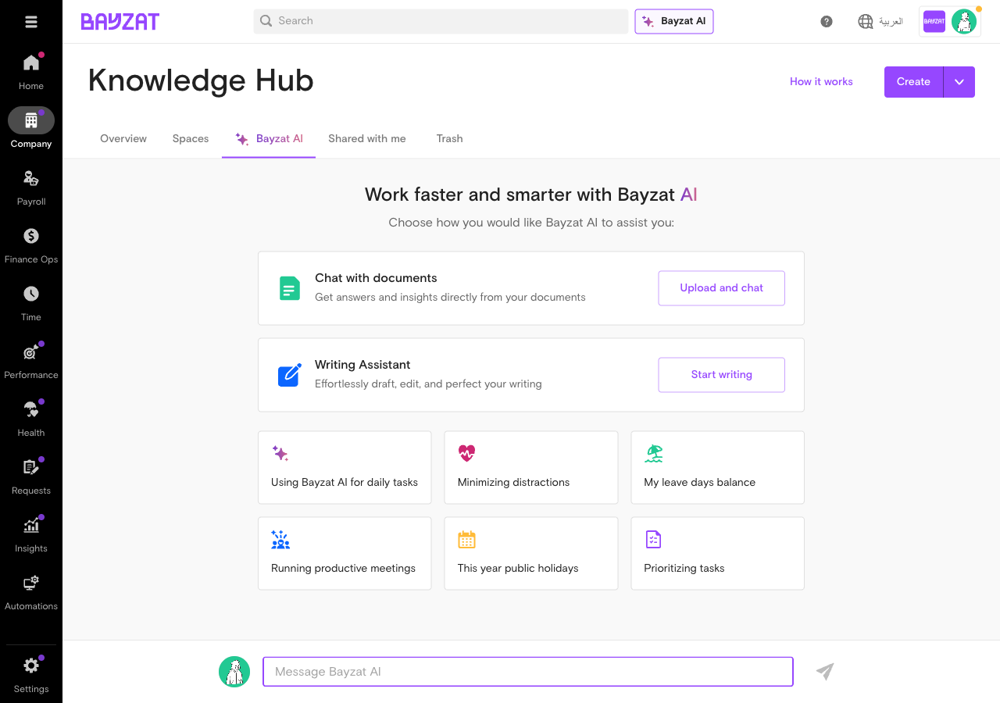
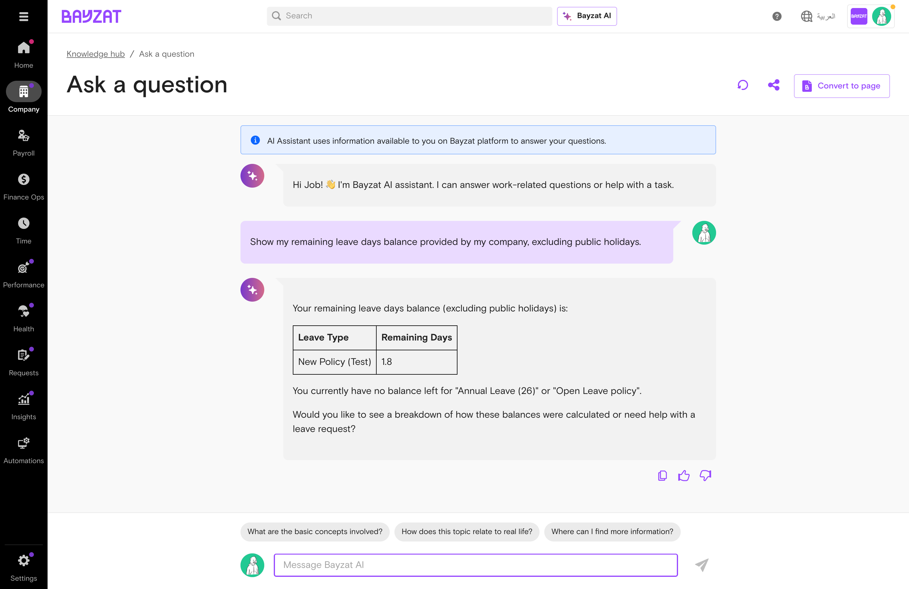
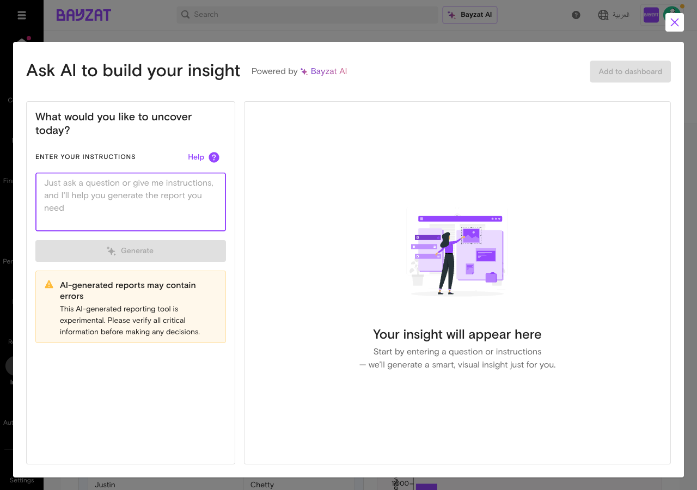
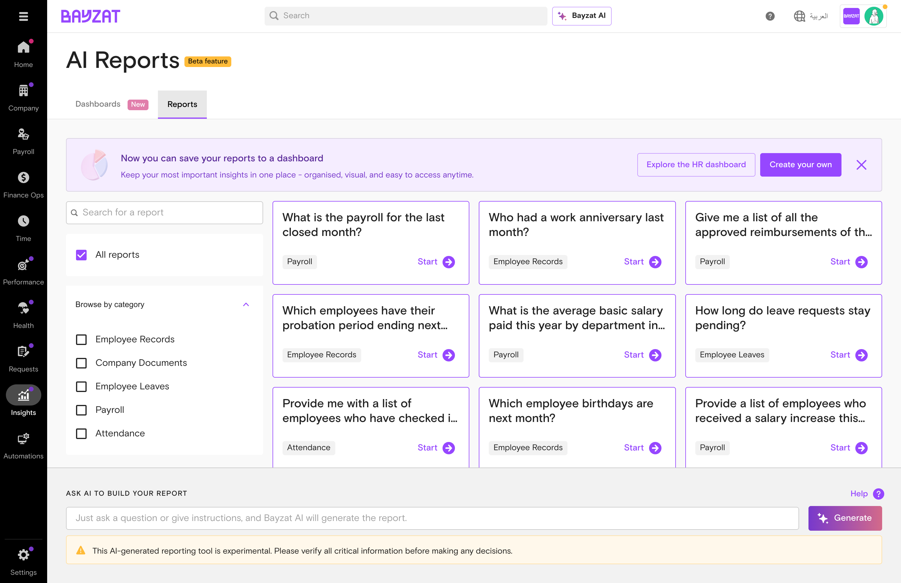

# Bayzat AI

Transform your company data into actionable insights using natural language queries

📖 Quick Navigation

<a href="#feature-overview" class="nav-card">✨Feature Overview</a> <a href="#product-foundation" class="nav-card">🏗️Product Foundation</a> <a href="#user-journey" class="nav-card">🗺️User Journey</a> <a href="#feature-entry-points" class="nav-card">🚪Entry Points</a> <a href="#initial-setup" class="nav-card">⚙️Setup Process</a> <a href="#core-tasks" class="nav-card">📋Feature Usage</a> <a href="#workflow-integration" class="nav-card">🔄Workflow Integration</a> <a href="#business-rules-limitations" class="nav-card">📜Business Rules</a> <a href="#troubleshooting-edge-cases" class="nav-card">🔧Troubleshooting</a> <a href="#support-resources" class="nav-card">💬Support Resources</a> <a href="#glossary" class="nav-card">📚Glossary</a>

## What is Bayzat AI?

### Overview

Bayzat AI is an intelligent assistant that transforms how you interact with your company data and content. It combines powerful analytics with AI-driven productivity tools to help you make faster, smarter decisions.

With Bayzat AI, you can:

- **Generate reports and dashboards** using natural language - simply ask questions and get instant visual insights
- **Chat with your documents** to search, summarize, and extract information from uploaded files
- **Create and improve content** with the Writing Assistant for emails, announcements, and policies
- **Access quick prompts** for common tasks like checking leave balances or viewing public holidays

Whether you're an HR professional analyzing workforce trends, a manager tracking team performance, or an administrator creating company communications, Bayzat AI provides the tools to work more efficiently.

**Beta Feature:** AI Reporting (AI Reports and AI Dashboards) is currently in beta stage with ongoing enhancements. The experience and capabilities are being actively improved based on user feedback.

### Key Benefits

- Save hours on manual reporting - get insights in seconds, not days
- Focus on decisions, not data wrangling - let AI handle the number-crunching
- Empower your entire team to access data without technical expertise
- Make smarter, data-driven decisions with real-time insights
- Boost productivity with AI-powered writing, editing, and translation
- Streamline workflows and reduce administrative overhead effortlessly

### Who Uses This Feature?

| User Role | What They Do | Value Proposition |
|----|----|----|
| **Employees** | Check leave balances using Quick Prompts, draft and improve written content with the Writing Assistant, and find information in uploaded company documents | Get instant answers to HR questions and polish your communications in seconds—without waiting for HR responses or struggling with writer's block |
| **Line Managers** | Review team data through dashboards, generate reports for their department, and use AI tools for team communications | Access real-time team insights and generate professional reports on demand—eliminating manual data gathering and freeing time for actual people management |
| **HR Administrators** | Create workforce analytics dashboards, generate HR reports using natural language queries, and manage organization-wide data insights | Transform complex workforce data into actionable insights using plain English queries—no technical skills required, no waiting for IT support |
| **Payroll Team** | Generate payroll-related reports and queries, access compensation data through dashboards, and analyze salary trends | Pull compensation reports and trend analyses instantly through conversation—replacing hours of spreadsheet work with seconds of AI-powered queries |
| **Executive Decision Makers** | Access high-level dashboards for strategic workforce insights, review organization-wide metrics, and make data-driven decisions using AI-generated analytics | Make strategic workforce decisions backed by real-time analytics and AI-generated insights—without relying on delayed reports or incomplete data |

## Product Foundation Overview

### How Bayzat AI Fits

Bayzat AI is an **intelligent analytics and productivity suite** that transforms how you interact with company data. It combines natural language querying with AI-powered writing tools to deliver insights and content assistance.

**Mental model:** Enter natural language query → AI interprets request → System queries connected data modules → Results displayed as dashboards, reports, or text → Save, export, or refine as needed.

Properly utilized AI features eliminate manual data gathering and enable data-driven decisions without technical expertise.

### Key Decisions Before Setup

Answer these questions before using Bayzat AI:

- **What data modules are active?** — AI queries Leave, Attendance, Payroll, and Employee data when available
- **What insights do you need regularly?** — Create dashboard tiles for recurring metrics
- **Who needs AI access?** — Ensure appropriate permissions are assigned
- **What documents need AI chat?** — Upload policies and procedures for natural language querying

### Related Features

- **AI-Powered Knowledge Hub** — Upload and query company documents using natural language
- **AI Surveys** — Create employee surveys using AI-generated questions
- **Leave Management** — Query leave balances, requests, and patterns
- **Attendance Tracking** — Analyze work hours, overtime, and attendance trends
- **Payroll** — Access compensation data and analyze payroll costs

### Prerequisites & Requirements

| Requirement | Description | Status |
|----|----|----|
| Active Bayzat Account | Valid login credentials with appropriate permissions | Required |
| HR Module Data | Active data in modules you want to query (leave, attendance, payroll) | Required |
| AI Feature Access | Permissions to access AI Dashboards and AI Reports | Required |

## Getting Started

### End-to-End Journey: Bayzat AI

Follow these steps to start using Bayzat AI for dashboards and reports:

1

#### Access Bayzat AI

Bayzat AI button (top bar) or Insights → AI Reports

<a href="#feature-entry-points" class="phase-link">See entry points →</a>

2

#### Select Module

Dashboards for visual metrics or Reports for detailed analysis

<a href="#core-tasks" class="phase-link">See feature usage →</a>

3

#### Enter Your Query

Natural language query or select pre-built template

<a href="#core-tasks" class="phase-link">See query examples →</a>

4

#### Review Results

Charts, tables, or summaries in your preferred format

<a href="#core-tasks" class="phase-link">See visualization options →</a>

5

#### Save or Export

Save dashboard tiles or download reports

<a href="#core-tasks" class="phase-link">See export options →</a>

## Feature Discovery

### How to Access

Click the **Bayzat AI** button located next to the search bar in the top header to access all AI features.

<figure>

<figcaption>Bayzat AI main interface</figcaption>
</figure>

### Navigation Paths

<figure>

<figcaption>AI Reports and Dashboards navigation tab</figcaption>
</figure>

**E** Employee \| **M** Manager \| **A** Admin

- **AI Dashboards (E, M, A):** Insights → AI Reports → Dashboards
- **AI Reports (E, M, A):** Insights → AI Reports → Reports
- **Chat with Documents (E, M, A):** Bayzat AI → Chat with Documents
- **Writing Assistant (E, M, A):** Bayzat AI → Writing Assistant
- **Quick Prompts (E, M, A):** Bayzat AI → Quick Prompts

## Setup Process

Bayzat AI is designed to work immediately upon access with minimal configuration required. The AI leverages existing data from connected modules, eliminating the need for extensive setup. However, understanding the initial configuration options ensures optimal use of the feature.

### Prerequisites Verification

Before using Bayzat AI, verify the following prerequisites are met:

1.  **Data Availability:** Ensure data exists in connected modules (Leave Management, Attendance, Employee Records, Payroll, etc.)
2.  **User Permissions:** Confirm your user role has access to AI features and the data modules you wish to query
3.  **Browser Compatibility:** Use a modern browser with JavaScript enabled (Chrome, Firefox, Safari, Edge)

**Note:** Bayzat AI requires JavaScript to be enabled in your browser. If you see a message stating "You need to enable JavaScript to run this app," check your browser settings.

### First-Time Configuration Steps

#### Step 1: Access Pre-built Dashboard

Navigate to AI Dashboards from the dashboard menu. The system automatically displays a pre-built HR dashboard with example insights. This serves as your configuration template.

#### Step 2: Review Available Data Categories

Examine the pre-built dashboard to understand which data categories are available for querying:

- Leave management data
- Attendance tracking data
- Employee records
- Payroll information

**Beta Note:** Bayzat AI Reports is currently in beta. Additional data categories will be added as the feature evolves.

#### Step 3: Test Natural Language Queries

Navigate to AI Reports and test the query input bar with a simple question to verify data connectivity:

1.  Enter a basic query such as "Show me total employee count"
2.  Click "Generate Report"
3.  Verify the AI returns accurate data from your system

#### Step 4: Configure First Custom Dashboard

Create your first custom dashboard tile to establish your preferred visualization settings:

1.  Click "New Dashboard" in the AI Dashboards section
2.  Enter a natural language query for a metric you monitor regularly
3.  Select your preferred visualization format when prompted
4.  Save the dashboard tile
5.  Verify the tile displays correctly and refreshes as expected

### Recommended Default Settings

| Setting | Recommended Value | Rationale |
|----|----|----|
| Dashboard Refresh | Weekly (automatic) | Balances data currency with system performance |
| Query Specificity | Include date ranges and filters | Improves accuracy and relevance of results |
| Visualization Format | Auto-select (AI determines best format) | Leverages AI intelligence for optimal data presentation |
| Report Output | Table format for data export | Provides maximum flexibility for further analysis |

### Verification Steps

After completing initial setup, verify the configuration is working correctly:

#### Dashboard Verification

1.  Confirm pre-built dashboard displays data from your organization
2.  Verify custom dashboard tiles show current data
3.  Test dashboard search functionality to locate saved dashboards
4.  Confirm dashboard tiles can be renamed, rearranged, and deleted

#### Reports Verification

1.  Generate a pre-built report and verify data accuracy
2.  Create a custom query and confirm the AI interprets it correctly
3.  Apply filters (date range, department, employee) and verify they affect results
4.  Download a report to confirm export functionality works

### Common Setup Issues and Solutions

| Issue | Possible Cause | Solution |
|----|----|----|
| No data appears in dashboard | Insufficient data in connected modules | Ensure employee records, leave, attendance, or payroll data exists in the system |
| Query returns no results | Query too vague or references unavailable data | Add specific date ranges, departments, or employee filters to narrow the query |
| Cannot create new dashboard | Permission restrictions | Verify your user role has access to AI Dashboard creation features |
| JavaScript error message | Browser JavaScript disabled | Enable JavaScript in browser settings and refresh the page |

### Post-Setup Best Practices

- **Start Simple:** Begin with basic queries and gradually increase complexity as you learn the AI's interpretation patterns
- **Use Filters:** Always include date ranges and department filters for more accurate results
- **Save Frequently Used Queries:** Convert recurring report queries into dashboard tiles for quick access
- **Review Pre-built Options:** Check pre-built reports regularly as new templates are added during the beta phase
- **Provide Feedback:** As a beta feature, user feedback helps improve AI accuracy and functionality

**⚠️ Known Configuration Limitation**

**Impact:** The AI report builder cannot generate complex, multi-field reports that aggregate data across different platform modules such as Payroll and Leave Management.

**Workaround:** Users must manually compile reports by extracting data separately from multiple sources.

Reference: TSSD-4906

### Setup Completion Checklist

- [x] Accessed pre-built HR dashboard successfully
- [x] Verified data displays from connected HR modules
- [x] Tested natural language query in AI Reports
- [x] Created first custom dashboard tile
- [x] Downloaded a sample report to verify export functionality
- [x] Reviewed known limitations and workarounds
- [x] Bookmarked AI Reports URL for quick access

Once all checklist items are complete, Bayzat AI is fully configured and ready for daily use.

## Feature Usage

### Chat with Documents

Upload documents and have AI-powered conversations about their content. The system can search for information, generate key points, summarize content, and provide translations.

Navigation: Bayzat AI button (top bar) → Upload and chat

<figure>

<figcaption>Bayzat AI Knowledge Hub with Chat with documents and Writing Assistant</figcaption>
</figure>

<figure>

<figcaption>Document viewer with Chat with document feature - Ask Bayzat AI to search, summarize, or translate your documents</figcaption>
</figure>

When viewing any document in the Knowledge Hub, you can:

- **Mark as favourite:** Save documents for quick access later
- **Chat with document:** Ask questions about the document content, generate summaries, or request translations
- **Edit:** Make changes to the document
- **More options (three-dot menu):** Access additional actions like download, move, or delete

### Writing Assistant

The Writing Assistant helps you create, improve, and translate written content effortlessly.

Navigation: Bayzat AI button (top bar) → Start writing

<figure>

<figcaption>Writing Assistant options - Choose how Bayzat AI can help with your writing tasks</figcaption>
</figure>

The Writing Assistant offers three modes:

- **Write for me:** Simply tell the AI what you want to create, and get your polished writing in seconds. Perfect for drafting emails, announcements, policies, or any written content.
- **Improve my content:** Easily rewrite any written content to high quality, shorten it, adjust the tone of voice, or check the grammar. Great for refining existing documents.
- **Translate:** Rewrite content from another language to get a perfectly worded translation. Supports multiple languages for seamless communication.

When you select "Write for me", you'll see a simple interface to describe your writing needs:

<figure>

<figcaption>Write for me interface - Enter your topic, provide details, and select your preferred tone</figcaption>
</figure>

The interface includes:

- **Writing topic:** Enter a brief description of what you want to write (e.g., "Welcome email for new employee")
- **Details:** Provide additional context or specific points to include in your content
- **Tone:** Select the writing style that matches your audience and purpose

The tone selector offers six options to match your communication style:

<figure>

<figcaption>Choose from six tone options to match your communication needs</figcaption>
</figure>

Available tones:

- **Default:** Balanced, neutral tone suitable for general communication
- **Friendly:** Warm and approachable, ideal for team announcements or casual updates
- **Professional:** Formal and polished, perfect for executive communications or client-facing content
- **Confident:** Assertive and decisive, great for announcements or policy communications
- **Inspirational:** Motivating and uplifting, suited for team motivation or company updates
- **Direct:** Clear and concise, best for instructions or urgent communications

### Quick Prompts

Bayzat AI provides pre-built quick prompts to help you get started immediately with common tasks:

Navigation: Bayzat AI button (top bar) → Select a quick prompt card

<figure>

<figcaption>Bayzat AI quick prompts for instant assistance with daily tasks</figcaption>
</figure>

Available quick prompts include:

- **Using Bayzat AI for daily tasks:** Learn how to leverage AI for routine HR activities
- **Minimizing distractions:** Get tips for staying focused and productive
- **My leave days balance:** Quickly check your available leave balance
- **Running productive meetings:** Get advice for effective meeting management
- **This year public holidays:** View the list of public holidays for the current year
- **Prioritizing tasks:** Get help with task management and prioritization

Simply click any quick prompt card to start a conversation with Bayzat AI on that topic, or use the message input field to ask your own custom questions.

When you click a quick prompt, Bayzat AI responds with personalized information based on your actual company data. For example, clicking "My leave days balance" instantly shows your real leave balance:

<figure>

<figcaption>Bayzat AI provides instant, personalized responses with your actual data - here showing leave balance by type</figcaption>
</figure>

### AI-Powered Knowledge Hub

The AI-Powered Knowledge Hub allows you to upload company documents and query them using natural language. Chat with your documents to find policies, procedures, and information instantly.

Navigation: Top Menu → Bayzat AI → Knowledge Hub

<figure>

<figcaption>AI-Powered Knowledge Hub - Chat with documents and Writing Assistant</figcaption>
</figure>

From the Knowledge Hub, you can:

- **Chat with documents:** Upload documents and get answers and insights directly from their content
- **Writing Assistant:** Effortlessly draft, edit, and perfect your writing with AI assistance
- **Quick Prompts:** Use pre-built prompts for common tasks like checking leave balance or finding public holidays

### AI Surveys

Create employee surveys using AI to generate questions and analyze responses. The AI can create a complete survey on any topic with just a few inputs.

Navigation: Insights → Engagement → Surveys → New survey

<figure>

<figcaption>AI Surveys - Create a survey with AI in seconds</figcaption>
</figure>

To create an AI-powered survey:

1.  Navigate to **Insights** from the main menu
2.  Select **Surveys** under the Engagement section
3.  Click **New survey**
4.  Select **Get started** under "Create a survey with AI in seconds"
5.  Describe your survey topic and the AI will generate relevant questions

### AI Dashboards

Create and customize visual dashboards with interactive tiles showing key metrics and insights.

Navigation: Insights (side menu) → AI Reports → Dashboards tab

**Note:** AI Reporting is currently in beta. The feature is being actively enhanced with new capabilities and data sources.

<figure>

<figcaption>HR Dashboard overview with insight tiles</figcaption>
</figure>

#### Accessing the Pre-Built HR Dashboard

1.  Navigate to the Bayzat AI section from the main menu
2.  The default HR dashboard displays automatically with pre-configured insights
3.  Review the dashboard tiles showing key HR metrics and visualizations

#### Creating a New Dashboard

<figure>

<figcaption>AI Reports Dashboards page with available dashboards</figcaption>
</figure>

1.  Click the **New Dashboard** button
2.  Enter a descriptive name for your dashboard
3.  Click **Create** to initialize the empty dashboard

**Note:** Bayzat AI does not support traditional CRUD operations for creating, reading, updating, or deleting individual data items. Instead, it provides AI-powered dashboards and reports that query existing data across modules.

#### Adding Insights to a Dashboard

<figure>

<figcaption>Add Insight dialog for creating new dashboard tiles</figcaption>
</figure>

1.  Within your dashboard, locate the input bar or **Add Insight** button
2.  Enter a natural language query describing the insight you want to visualize. Examples:
    - "Show me leave balance trends for the last 6 months"
    - "Display attendance rate by department"
    - "What is the average salary by job title?"
3.  Choose your preferred visualization format:
    - Bar chart
    - Pie chart
    - Line graph
    - Table
    - Text summary
4.  Click **Generate** or **Add** to create the dashboard tile
5.  The system automatically arranges the tile in the dashboard layout
6.  Click **Save** to persist the dashboard tile

#### Managing Dashboard Tiles

<figure>

<figcaption>HR Dashboard with saved insights including charts and data tables</figcaption>
</figure>

**Dashboard Tile Action Buttons:**

Each dashboard tile includes quick action buttons in the top-right corner for easy management:

<figure>

<figcaption>Dashboard tile action buttons - Download, Explore, and More Options</figcaption>
</figure>

- **Download (arrow down icon):** Export the tile data to a file format for offline use or sharing. Click to download the insight data as a report.
- **Explore (sparkle icon):** Open the insight in an expanded view to explore the data in more detail. This allows you to drill down into specific metrics or filter the visualization.
- **More Options (three-dot menu):** Access additional actions including:
  - Rename the tile
  - Delete the tile
  - Duplicate the insight
  - Move to another dashboard

**Renaming a Tile:**

1.  Hover over the dashboard tile
2.  Click the three-dot menu icon
3.  Select **Rename**
4.  Enter the new name and click **Save**

**Deleting a Tile:**

1.  Hover over the dashboard tile
2.  Click the three-dot menu icon
3.  Select **Delete**
4.  Confirm the deletion when prompted

**Rearranging Tiles:**

1.  Click and hold on a dashboard tile
2.  Drag the tile to the desired position
3.  Release to drop the tile in the new location
4.  The dashboard auto-saves the new layout

#### Searching Dashboards

1.  Use the search bar at the top of the dashboard list
2.  Enter keywords from the dashboard name or description
3.  Results filter in real-time as you type

#### Refreshing Dashboard Data

Dashboards refresh automatically on a weekly schedule. To manually refresh:

1.  Click the **Refresh** button at the top of the dashboard
2.  Wait for the system to update all tiles with the latest data
3.  A confirmation message appears when the refresh is complete

### AI Reports

Navigation: Insights (side menu) → AI Reports → Reports tab

<figure>

<figcaption>AI Reports page with report generation interface</figcaption>
</figure>

#### Using Pre-Built Reports

<figure>

<figcaption>AI Reports page with pre-built report templates</figcaption>
</figure>

1.  Browse the list of available pre-built reports
2.  Click on a report template that matches your needs
3.  The report generates automatically with default parameters
4.  Review the results in the selected visualization format

#### Creating Custom Reports

1.  Locate the input bar in the AI Reports section
2.  Enter a specific, detailed natural language query. Best practices:
    - Include date ranges: "Show me leave requests from January to March 2024"
    - Specify employee filters: "Display attendance for the Engineering department"
    - Define departments or teams: "What is the turnover rate in Sales?"
    - Request specific output format: "Generate a table showing payroll costs by month"
3.  Click **Generate Report**
4.  Wait for the AI to process the query and retrieve data

**Tip:** The more specific and detailed your query, the more accurate the report results. Include date ranges, employee filters, or departments for best results.

#### Applying Filters to Reports

After generating a report, refine the results using filters:

1.  Locate the filter panel on the report page
2.  Select from available filter options:
    - **Date Range:** Choose start and end dates
    - **Employee Filters:** Select specific employees or groups
    - **Departments:** Filter by organizational units
    - **Other criteria:** Depending on the report type
3.  Click **Apply Filters**
4.  The report updates to reflect the filtered data

#### Reviewing Report Results

Reports display in multiple formats based on the query or your selection:

- **Text Summary:** Narrative description of insights
- **Bar Chart:** Comparative data across categories
- **Pie Chart:** Proportional breakdowns
- **Line Graph:** Trends over time
- **Table:** Detailed data in rows and columns

#### Downloading and Saving Reports

**Download Report Data:**

1.  Click the **Download** button on the report page
2.  Select the desired format (CSV, Excel, PDF)
3.  The file downloads to your default download location

**Save Report Image:**

1.  Click the **Save Image** button
2.  Choose the image format (PNG, JPG)
3.  The visualization saves as an image file

**Save Report Configuration:**

1.  Click **Save Report**
2.  Enter a name for the saved report
3.  The report configuration saves for future reuse
4.  Access saved reports from the **My Reports** section

### Data Sources and Modules

Bayzat AI queries data from the following HR modules:

- **Leave Management:** Leave balances, requests, approvals, trends
- **Attendance Tracking:** Check-in/out times, attendance rates, patterns
- **Employee Records:** Demographics, job titles, departments, tenure
- **Payroll Systems:** Salary data, compensation trends, cost analysis

**Coming Soon:** Additional data categories and modules are being added to expand AI reporting capabilities.

## Workflow Integration

**Note:** Bayzat AI does not currently have dedicated workflow triggers or actions in the Bayzat Workflows system. The feature operates independently as a reporting and analytics tool.

### Potential Workflow Scenarios

While Bayzat AI doesn't integrate directly with Bayzat Workflows at this time, there are potential scenarios where workflow automation could enhance AI-powered reporting in the future:

#### Scenario 1: Automated Dashboard Refresh Notifications

**Potential Benefit:** HR teams could receive automated notifications when critical dashboard metrics exceed defined thresholds, enabling proactive management of HR issues.

**Example Use Case:** When the AI dashboard detects that leave balance utilization drops below 50% company-wide, trigger a workflow to notify the HR manager to review leave policies or encourage employees to take time off.

#### Scenario 2: Scheduled Report Generation and Distribution

**Potential Benefit:** Automate the generation and distribution of recurring AI reports to stakeholders, reducing manual effort and ensuring consistent reporting cadence.

**Example Use Case:** Every Monday morning, automatically generate a weekly attendance report for each department head and send it via email, allowing managers to review team attendance patterns without manual report creation.

#### Scenario 3: Data-Driven Approval Workflows

**Potential Benefit:** Use AI-generated insights to inform approval decisions in other Bayzat modules, creating intelligent, data-driven workflows.

**Example Use Case:** When an employee submits a leave request, trigger a workflow that checks the AI-generated department leave coverage report. If coverage falls below a threshold, route the request to a senior manager for additional approval.

#### Scenario 4: Anomaly Detection Alerts

**Potential Benefit:** Automatically alert teams when AI reports detect unusual patterns or anomalies in company data, enabling rapid response to potential issues.

**Example Use Case:** If the AI detects a sudden spike in leave requests within a specific department (e.g., 30% increase over the previous month), trigger a workflow to notify the department head and HR business partner to investigate potential team issues.

### Current Workaround for Workflow-Like Automation

Until direct workflow integration is available, consider these manual processes:

1.  **Schedule Regular Dashboard Reviews:** Set calendar reminders to review AI dashboards weekly or monthly
2.  **Export and Share Reports:** Download AI reports and manually distribute them to stakeholders via email or collaboration tools
3.  **Create Report Templates:** Save frequently used AI report queries for quick regeneration
4.  **Combine with Other Tools:** Use AI report data as input for decision-making in other Bayzat workflows (e.g., reviewing attendance reports before approving shift changes)

**Future Enhancement:** As Bayzat AI evolves from beta to full release, workflow integration capabilities may be added. Check the Bayzat release notes for updates on workflow triggers and actions related to AI reporting.

## Business Rules & Limitations

### Core Business Rules

| Rule | Description |
|----|----|
| Data Access | Users can only query data from modules they have permission to access |
| Dashboard Refresh | AI Dashboards refresh automatically on a weekly basis; manual refresh available |
| Report Generation | AI Reports pull real-time data at the time of generation |
| Query Specificity | Detailed queries with date ranges and filters produce more accurate results |
| Beta Status | AI Reporting is in beta; interface and capabilities may change with updates |

### System Constraints

- **Cross-module Reports:** Cannot generate reports combining data from multiple modules (e.g., Payroll + Leave). Generate separate reports and compile manually.
- **Module Coverage:** Limited to leave management, attendance, employee records, and payroll. More modules coming in future releases.
- **Query Interpretation:** Vague queries may produce incomplete results. Be specific with date ranges, departments, and output format.
- **Desktop Optimized:** Best experience on desktop browsers; mobile access available but limited for complex visualizations.

<figure>

<figcaption>Report generation error when attempting complex multi-field queries</figcaption>
</figure>

## Troubleshooting & Edge Cases

### Common Issues

| Problem | Possible Cause | Solution |
|----|----|----|
| Report returns incomplete data | Query is too vague | Add specific date ranges, departments, or employee filters to your query |
| Cannot generate cross-module report | System limitation (TSSD-4906) | Generate separate reports for each module and compile manually |
| Dashboard shows outdated data | Waiting for weekly refresh | Click the refresh button to manually update data |
| Cannot find saved dashboard | Search term doesn't match | Use keywords from the dashboard name in search |
| Cannot access AI features | Permission or subscription issue | Contact your system administrator to verify access |

### Known Limitations

- **Cross-module Aggregation:** Cannot combine data from Payroll and Leave Management in a single report
- **Pre-built Dashboard Tiles:** Default HR dashboard tiles may be view-only and cannot be deleted
- **AI Reporting Beta Status:** Interface may change as improvements are implemented

### Edge Cases

- **Incomplete Data Sets:** Reports for new employees or departments may return limited results. Adjust date ranges to periods where data exists.
- **Special Characters:** Avoid special symbols in queries. Use "employees in Sales" instead of "employees in Sales/Marketing & Support".
- **Large Data Sets:** Reports covering extensive date ranges may take longer to generate. Break into smaller, focused queries.

## Support Resources

### Frequently Asked Questions

What is Bayzat AI?

Bayzat AI is an intelligent reporting and analytics tool that allows you to explore and analyze your company data using simple, natural language queries.

What's the difference between AI Dashboards and AI Reports?

AI Dashboards provide visual insights with customizable tiles that refresh weekly. AI Reports generate on-demand analysis with specific queries and can be downloaded.

How do I write effective queries?

Be specific and include date ranges, departments, and output format. Example: "Show me attendance trends for Engineering in Q4 2023 as a line graph."

Why can't I generate a cross-module report?

This is a current limitation (TSSD-4906). Generate separate reports for each module and compile manually.

How often do dashboards refresh?

Dashboards refresh weekly automatically. Click the refresh button for immediate updates.

What should I do if my query returns no results?

Verify data exists for your parameters. Try broadening your query or check if data has been entered in the system.

### Getting Help

- **Help Center:** <a href="https://bayzathelp.zendesk.com" target="_blank">bayzathelp.zendesk.com</a>
- **AI Reports Guide:** <a href="https://bayzathelp.zendesk.com/hc/en-gb/articles/36719362970257" target="_blank">Zendesk Article</a>
- **AI Dashboards Guide:** <a href="https://bayzathelp.zendesk.com/hc/en-gb/articles/36749794201617" target="_blank">Zendesk Article</a>
- **In-App Support:** Click the help icon within Bayzat for contextual assistance
- **Feature Feedback:** Share suggestions through the in-app feedback mechanism

## Glossary of Terms

| Term | Definition |
|----|----|
| **AI Dashboard** | A customizable visual interface that displays HR insights through tiles with charts, graphs, and metrics. Dashboards refresh automatically on a weekly basis and can be manually refreshed as needed. |
| **AI Reports** | On-demand analytical reports generated using natural language queries. Reports can be customized with filters and downloaded in various formats including text, charts, and tables. |
| **Auto-arrange** | The system's automatic organization of dashboard tiles into a clean, optimized layout. Users can manually rearrange tiles after auto-arrangement. |
| **Beta Feature** | A feature that is available for use but is still being actively developed and refined. Beta features may receive updates, improvements, or changes based on user feedback and testing. |
| **Cross-module Report** | A report that attempts to aggregate data from multiple Bayzat modules (e.g., combining Payroll and Leave Management data). Currently limited due to technical constraints (TSSD-4906). |
| **Dashboard Tile** | An individual visualization component within a dashboard that displays a specific insight or metric. Tiles can be created, renamed, deleted, and rearranged within the dashboard layout. |
| **Manual Refresh** | The action of updating dashboard data immediately rather than waiting for the automatic weekly refresh cycle. |
| **Multi-field Aggregation** | The combination of data from multiple fields or modules into a single report. Currently limited for complex cross-module scenarios. |
| **Natural Language Query** | A request written in everyday language rather than technical code or syntax. Example: "Show me leave trends for Sales in Q1 2024" instead of a database query. |
| **Output Format** | The final presentation style of a generated report, which can be specified in the query or automatically selected by the AI based on the data type and query structure. |
| **Pre-built Report** | A ready-made report template designed for common HR analysis scenarios. Pre-built reports can be used as-is or serve as starting points for custom queries. |
| **Query Filter** | A parameter that narrows down the data included in a report, such as date ranges, departments, employee groups, or locations. |
| **Report Generation** | The process of creating a report based on a natural language query and any applied filters. The AI interprets the query and produces results in the most appropriate format. |
| **Visualization Format** | The way data is displayed in reports and dashboards. Available formats include text summaries, bar charts, pie charts, line graphs, and tables. |

Generated by Bayzat Documentation System

Last updated: 2026-01-19T13:49:53.290Z
