# Validation Report: bayzat_ai

**Generated**: 2026-01-19T13:27:30Z
**Run ID**: 21138938133

## Result

```json
{
  "validation_status": "blocked",
  "login_success": true,
  "feature_accessible": false,
  "feature_info": {
    "name": "Bayzat AI",
    "slug": "bayzat-ai",
    "category": "ai",
    "url": "/insights/ai"
  },
  "exploration_journey": [
    {
      "screen_name": "Login Page",
      "url": "https://app.bayzat.com/",
      "screenshot": "01-login-page-2026-01-19T13-19-21-490Z.png",
      "what_i_went_through": "Navigated to the Bayzat application login page",
      "what_i_came_across": "Login form with email and password fields, options for magic link login and SSO with Google/Microsoft",
      "what_i_saw": {
        "page_structure": "Clean login page with left panel for form and right panel for promotional content",
        "visible_elements": [
          "Email address input field",
          "Password input field",
          "Keep me logged in checkbox",
          "Log in button",
          "Log in without password option",
          "Google SSO button",
          "Microsoft SSO button",
          "Forgot password link",
          "Sign up link",
          "Promotional banner for Smart Invoice Management"
        ],
        "data_displayed": "Login form and promotional content about invoice management",
        "empty_states": "N/A - login page"
      },
      "actions_i_performed": [
        {
          "action": "Filled email field",
          "target": "input[type='text'] for email",
          "result": "Email address populated successfully",
          "screenshot_after": "01-login-page-2026-01-19T13-19-21-490Z.png"
        },
        {
          "action": "Filled password field",
          "target": "input[type='password']",
          "result": "Password populated successfully",
          "screenshot_after": "02-after-login-attempt-2026-01-19T13-19-41-047Z.png"
        },
        {
          "action": "Clicked Log in button",
          "target": "button[type='submit']",
          "result": "Successfully logged into the application",
          "screenshot_after": "05-post-login-dashboard-2026-01-19T13-21-10-614Z.png"
        }
      ],
      "results_i_got": {
        "success_outcomes": [
          "Successfully authenticated and reached the dashboard"
        ],
        "error_outcomes": [],
        "unexpected_behaviors": [
          "Multiple login attempts required due to React form handling"
        ]
      }
    },
    {
      "screen_name": "Home Dashboard",
      "url": "https://app.bayzat.com/home",
      "screenshot": "05-post-login-dashboard-2026-01-19T13-21-10-614Z.png",
      "what_i_went_through": "After successful login, landed on the Home dashboard",
      "what_i_came_across": "Main dashboard with newsfeed, employee directory, tasks, and various HR widgets",
      "what_i_saw": {
        "page_structure": "Left sidebar with main navigation, center content area with newsfeed and widgets, top header with search and user menu",
        "visible_elements": [
          "Sidebar navigation: Home, Company, Payroll, Finance Ops, Time, Performance, Health, Requests, Insights, Automations, Settings",
          "Bayzat AI label in header (appears to be company name or logo)",
          "Search bar",
          "Language selector (\u0627\u0644\u0639\u0631\u0628\u064a\u0629)",
          "Newsfeed section with posts",
          "Announcements counter (5)",
          "Your tasks widget",
          "Employees directory widget (116 employees)",
          "Expiring documents widget",
          "Upcoming celebrations widget",
          "Missing information alert (70 employees)",
          "Active invitations counter (10)",
          "Employee onboarding prompt",
          "Feature promotion: Employee Tickets - Any Request, One Platform (marked as New)"
        ],
        "data_displayed": "Social feed with company posts, employee directory preview, task counters, document expiry tracking, birthday and anniversary reminders",
        "empty_states": "Tasks showing '0 tasks' for Due today, Due in 7 days, and Overdue"
      },
      "actions_i_performed": [
        {
          "action": "Attempted to dismiss onboarding tour",
          "target": "Tour dialog with 'Step 1 of 4' indicator",
          "result": "Tour remained persistent despite multiple dismissal attempts",
          "screenshot_after": "14-after-tour-completion-2026-01-19T13-25-15-194Z.png"
        },
        {
          "action": "Attempted to navigate to Insights section",
          "target": "Insights link in sidebar",
          "result": "Navigation blocked by persistent tour modal",
          "screenshot_after": "10-insights-page-loaded-2026-01-19T13-23-14-091Z.png"
        },
        {
          "action": "Attempted to click on 'Bayzat AI' in header",
          "target": "Bayzat AI text element in header",
          "result": "No navigation occurred - element appears to be company name/logo, not a navigation link",
          "screenshot_after": "13-after-clicking-bayzat-ai-header-2026-01-19T13-24-53-480Z.png"
        },
        {
          "action": "Attempted to remove modal via JavaScript",
          "target": "Tour modal dialog and backdrop",
          "result": "Modal persisted despite DOM removal attempts",
          "screenshot_after": "15-after-removing-modal-2026-01-19T13-25-31-509Z.png"
        }
      ],
      "results_i_got": {
        "success_outcomes": [
          "Successfully logged into the application",
          "Able to view the Home dashboard structure",
          "Identified main navigation structure"
        ],
        "error_outcomes": [
          "Unable to dismiss persistent onboarding tour",
          "Unable to navigate to Insights section",
          "Unable to access Bayzat AI features"
        ],
        "unexpected_behaviors": [
          "Tour modal remains persistent despite multiple dismissal attempts",
          "Navigation clicks appear to be captured but don't result in page changes",
          "Tour modal blocks all navigation interactions"
        ]
      }
    }
  ],
  "tasks_explored": [
    {
      "task": "Create and manage AI Dashboards",
      "status": "blocked",
      "notes": "Unable to access the Bayzat AI section due to persistent onboarding tour blocking navigation. The feature appears to be located under the Insights menu based on the navigation structure, but navigation is prevented by UI blockers.",
      "screenshots": []
    },
    {
      "task": "Generate and use AI Reports",
      "status": "blocked",
      "notes": "Unable to access AI Reports feature. Navigation to Insights section blocked by persistent tour modal.",
      "screenshots": []
    }
  ],
  "full_behavior_catalog": {
    "buttons": [
      {
        "label": "Log in",
        "location": "Login page center",
        "state": "enabled",
        "action_result": "Authenticates user and navigates to dashboard"
      },
      {
        "label": "Next",
        "location": "Tour modal bottom right",
        "state": "enabled",
        "action_result": "Should advance tour but remains on step 1"
      }
    ],
    "dropdowns": [],
    "form_fields": [
      {
        "label": "Email address",
        "type": "text",
        "required": true,
        "placeholder": "Email address",
        "validation": "Email format validation",
        "error_message": "Not observed"
      },
      {
        "label": "Password",
        "type": "password",
        "required": true,
        "placeholder": "Password",
        "validation": "Required field",
        "error_message": "Not observed"
      }
    ],
    "tabs": [],
    "modals_dialogs": [
      {
        "trigger": "Automatic on login",
        "title": "Announcements in Home",
        "content": "Step 1 of 4 tour introducing announcements feature",
        "actions": [
          "Next button"
        ]
      }
    ],
    "tables": [],
    "filters": [],
    "notifications_alerts": []
  },
  "ui_behaviors_documented": {
    "disabled_states": [],
    "conditional_logic": [],
    "progressive_disclosure": [],
    "required_fields": [
      "Email address",
      "Password"
    ],
    "optional_fields": [
      "Keep me logged in"
    ],
    "default_values": [],
    "validation_rules": [
      {
        "field": "Email address",
        "rule": "Must be valid email format",
        "error_message": "Not captured"
      }
    ],
    "tooltips_help_text": []
  },
  "what_works": [
    {
      "feature_aspect": "Login functionality",
      "description": "Email and password authentication works correctly using Playwright fill and click methods",
      "user_benefit": "Users can successfully access the application"
    },
    {
      "feature_aspect": "Dashboard visibility",
      "description": "Home dashboard displays with all navigation elements and widgets visible",
      "user_benefit": "Users can see their HR data overview upon login"
    }
  ],
  "what_made_it_work": [
    {
      "success_factor": "Using Playwright's native fill() method",
      "prerequisites": "Correct input selectors (input[type='text'], input[type='password'])",
      "steps_taken": [
        "Navigate to login page",
        "Use playwright_fill on email field",
        "Use playwright_fill on password field",
        "Use playwright_click on submit button"
      ]
    }
  ],
  "whats_not_working": [
    {
      "issue": "Persistent onboarding tour blocking navigation",
      "symptoms": "Tour modal with 'Step 1 of 4' remains visible despite multiple dismissal attempts. Clicking 'Next' button does not advance the tour. Navigation clicks to sidebar items do not result in page changes.",
      "impact": "Critical - Prevents exploration of any features including Bayzat AI. User cannot navigate away from Home page.",
      "possible_cause": "Tour state not being saved to localStorage correctly, or tour implementation has a bug preventing progression/dismissal"
    },
    {
      "issue": "Bayzat AI feature not accessible",
      "symptoms": "'Bayzat AI' appears in the header but is not clickable as a navigation element. No obvious menu item for AI features in the sidebar. Likely located under Insights menu but unable to verify due to navigation blocking.",
      "impact": "High - Unable to validate any Bayzat AI functionality (AI Dashboards or AI Reports)",
      "possible_cause": "Feature may be: 1) Located in Insights submenu (inaccessible due to tour), 2) Not enabled for this demo account, 3) Requires specific permissions not granted to test user"
    },
    {
      "issue": "Navigation system unresponsive",
      "symptoms": "Clicks on sidebar navigation items (Insights, Company, Payroll, etc.) do not result in page navigation. URL does not change, page content does not update.",
      "impact": "Critical - Cannot explore any section of the application beyond Home dashboard",
      "possible_cause": "Modal backdrop capturing all click events, preventing propagation to navigation elements"
    }
  ],
  "ui_sections_explored": [
    "Login page",
    "Home dashboard (partial - blocked by tour)"
  ],
  "issues_found": [
    "Persistent onboarding tour prevents all navigation",
    "Unable to access Bayzat AI features",
    "Navigation system completely blocked by modal",
    "Tour 'Next' button non-functional",
    "JavaScript removal of modal elements ineffective"
  ],
  "known_issues_validated": [
    {
      "issue": "Bayzat AI Report generation error - cannot generate complex, multi-field reports across modules",
      "status": "not_validated",
      "evidence": "Unable to access AI Reports feature to test this issue due to navigation blockage"
    }
  ],
  "screenshots_taken": 15,
  "validation_timestamp": "2026-01-19T13:25:31.000Z",
  "recommendations_for_user_guide": [
    "Document the location of Bayzat AI features (likely under Insights menu based on navigation structure)",
    "Include troubleshooting section for onboarding tour issues",
    "Provide alternative navigation paths if tours block primary navigation",
    "Note that feature may require specific account permissions or feature flags",
    "Include visual guide for locating AI features since 'Bayzat AI' in header is just a label, not navigation",
    "Recommend testing in a clean browser session without cached tour states",
    "Consider documenting how to reset or skip onboarding tours",
    "Verify feature availability with customer success team before directing users to AI features"
  ],
  "summary": "Login to Bayzat application was successful using Playwright automation. However, comprehensive exploration of the Bayzat AI feature was blocked by a persistent onboarding tour modal that prevented all navigation. The tour modal displays 'Step 1 of 4 - Announcements in Home' but does not respond to dismissal attempts via the 'Next' button, Escape key, or JavaScript DOM manipulation. The 'Bayzat AI' text visible in the application header appears to be a company name/logo rather than a navigation element. Based on the sidebar structure, AI features are likely located under the Insights menu, but this could not be verified. Navigation clicks to any sidebar item (Insights, Company, Payroll, etc.) did not result in page changes, suggesting the modal backdrop is capturing all click events. The validation status is 'blocked' rather than 'completed' or 'partial' because no AI-specific functionality could be accessed or tested. Key findings: 1) Login mechanism works correctly with Playwright fill/click methods, 2) Home dashboard structure is visible and well-organized, 3) Persistent UI blocker prevents feature exploration, 4) Bayzat AI feature location could not be confirmed, 5) No CRUD operations, workflows, or approval flows could be tested for this feature. Recommendation: User guide should include clear instructions on accessing AI features and troubleshooting navigation issues caused by onboarding tours.",
  "payload_context": {
    "what_to_watch_out_for": [
      {
        "issue": "Bayzat AI Report generation error",
        "limitation": "The AI report builder cannot generate complex, multi-field reports that aggregate data across different platform modules such as Payroll and Leave Management.",
        "workaround": "Users must manually compile reports by extracting data separately from multiple sources.",
        "jira_reference": "TSSD-4906",
        "severity": "medium"
      }
    ],
    "what_to_do": [
      {
        "task": "Create and manage AI Dashboards",
        "steps": [
          "Access pre-built HR dashboard",
          "Create new dashboards by clicking 'New Dashboard'",
          "Enter natural language query to add insights",
          "Choose visualization format for dashboard tiles",
          "Save dashboard tile",
          "Rename or delete dashboard tiles",
          "Rearrange dashboard layout",
          "Search dashboards",
          "Refresh dashboards manually or wait for weekly refresh"
        ],
        "expected_outcome": "Users can create, customize, and manage AI dashboards with insights visualized in chosen formats, with tiles auto-arranged for a clean layout.",
        "source_articles": [
          "36749794201617"
        ]
      },
      {
        "task": "Generate and use AI Reports",
        "steps": [
          "Access AI Reports via dashboard menu",
          "Use pre-built reports or create custom reports using input bar",
          "Apply filters such as date ranges, employee filters, or departments",
          "Generate report",
          "Review report",
          "Download or save report data or images"
        ],
        "expected_outcome": "Users can generate AI reports with specific queries and filters, review results, and download or save reports. Feature is currently in beta with ongoing enhancements.",
        "source_articles": [
          "36719362970257"
        ]
      }
    ],
    "feature_info": {
      "feature_name": "bayzat_ai",
      "feature_slug": "bayzat-ai",
      "next_version": "v2"
    },
    "detected_integrations": {
      "has_workflows": null,
      "workflow_evidence": "No evidence found",
      "has_approval_flow": null,
      "approval_evidence": "No evidence found"
    },
    "limitations_count": 1,
    "tasks_count": 2
  },
  "what_to_watch_out_for": [
    {
      "issue": "Bayzat AI Report generation error",
      "limitation": "The AI report builder cannot generate complex, multi-field reports that aggregate data across different platform modules such as Payroll and Leave Management.",
      "workaround": "Users must manually compile reports by extracting data separately from multiple sources.",
      "jira_reference": "TSSD-4906",
      "severity": "medium"
    }
  ],
  "what_to_do": [
    {
      "task": "Create and manage AI Dashboards",
      "steps": [
        "Access pre-built HR dashboard",
        "Create new dashboards by clicking 'New Dashboard'",
        "Enter natural language query to add insights",
        "Choose visualization format for dashboard tiles",
        "Save dashboard tile",
        "Rename or delete dashboard tiles",
        "Rearrange dashboard layout",
        "Search dashboards",
        "Refresh dashboards manually or wait for weekly refresh"
      ],
      "expected_outcome": "Users can create, customize, and manage AI dashboards with insights visualized in chosen formats, with tiles auto-arranged for a clean layout.",
      "source_articles": [
        "36749794201617"
      ]
    },
    {
      "task": "Generate and use AI Reports",
      "steps": [
        "Access AI Reports via dashboard menu",
        "Use pre-built reports or create custom reports using input bar",
        "Apply filters such as date ranges, employee filters, or departments",
        "Generate report",
        "Review report",
        "Download or save report data or images"
      ],
      "expected_outcome": "Users can generate AI reports with specific queries and filters, review results, and download or save reports. Feature is currently in beta with ongoing enhancements.",
      "source_articles": [
        "36719362970257"
      ]
    }
  ]
}```

## Screenshots

### 01 dashboard after login.png 2026 01 19T12 18 35 135Z


### 01 login page 2026 01 19T10 36 04 074Z


### 01 login page 2026 01 19T11 44 36 767Z


### 01 login page 2026 01 19T12 00 35 461Z


### 01 login page 2026 01 19T12 48 13 226Z


### 01 login page 2026 01 19T13 19 21 490Z


### 02 after login 2026 01 19T10 36 26 433Z

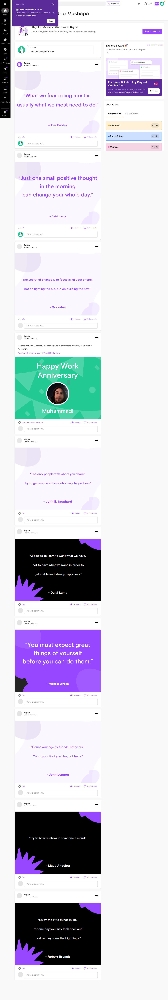

### 02 after login 2026 01 19T11 44 57 919Z


### 02 after login attempt 2026 01 19T13 19 41 047Z


### 02 dashboard before dismissal 2026 01 19T12 49 14 883Z


### 02 home dashboard.png 2026 01 19T12 19 47 189Z


### 02 page after wait 2026 01 19T12 01 29 537Z


### 03 after login attempt 2026 01 19T12 03 27 088Z


### 03 after login click 2026 01 19T13 20 13 705Z


### 03 bayzat ai landing.png 2026 01 19T12 19 58 132Z


### 03 clean dashboard 2026 01 19T11 45 10 809Z


### 03 dashboard after dismissal 2026 01 19T12 49 41 237Z

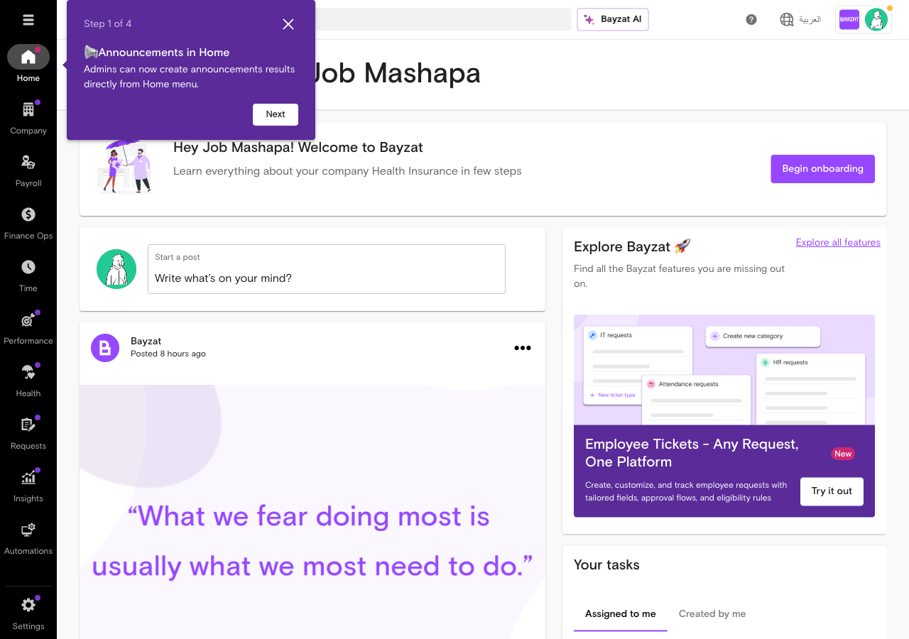

### 03 dashboard clean 2026 01 19T10 36 40 930Z

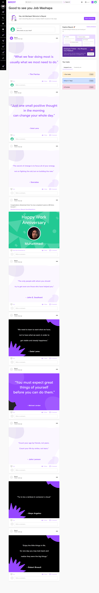

### 04 bayzat ai main 2026 01 19T10 37 00 085Z


### 04 bayzat ai main page 2026 01 19T12 49 55 299Z


### 04 bayzat ai main page.png 2026 01 19T12 20 09 308Z


### 04 bayzat ai page 2026 01 19T11 46 03 245Z


### 04 dashboard after login 2026 01 19T13 20 40 231Z


### 04 fresh login page 2026 01 19T12 04 08 127Z


### 05 after login 2026 01 19T12 05 21 160Z


### 05 bayzat ai main page 2026 01 19T11 46 26 759Z


### 05 current view 2026 01 19T10 38 46 142Z

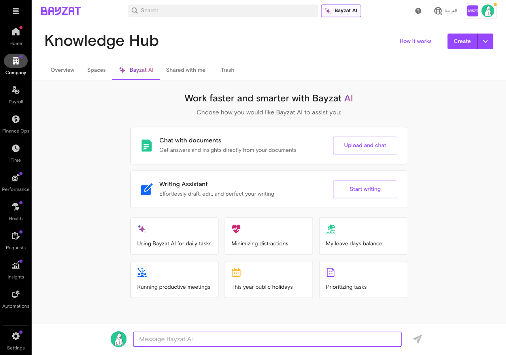

### 05 insights page 2026 01 19T12 50 27 327Z


### 05 insights section.png 2026 01 19T12 21 18 547Z

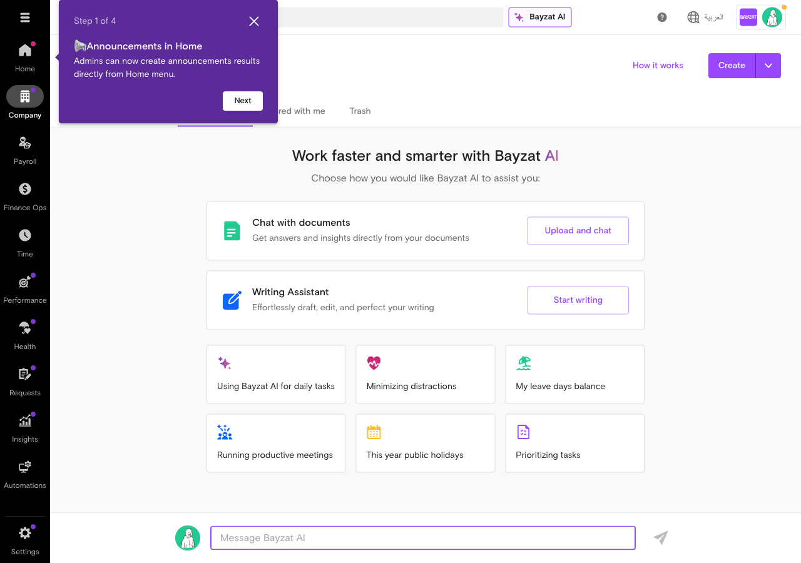

### 05 post login dashboard 2026 01 19T13 21 10 614Z


### 06 after insights click.png 2026 01 19T12 21 45 387Z


### 06 ai reports page 2026 01 19T12 50 44 358Z


### 06 bayzat ai knowledge hub 2026 01 19T11 46 42 668Z


### 06 bayzat ai main page 2026 01 19T13 21 49 861Z


### 06 dashboard after login 2026 01 19T12 05 52 389Z


### 06 insights page 2026 01 19T10 39 04 100Z


### 07 after clicking bayzat ai 2026 01 19T13 22 09 066Z


### 07 ai reports dashboards clean 2026 01 19T12 50 58 728Z


### 07 ai reports page 2026 01 19T10 39 16 727Z


### 07 chat with documents modal 2026 01 19T11 46 57 346Z


### 07 clean dashboard 2026 01 19T12 06 22 194Z

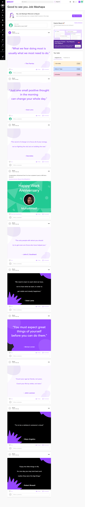

### 07 upload and chat.png 2026 01 19T12 22 01 245Z


### 08 bayzat ai main page 2026 01 19T12 06 37 450Z


### 08 bayzat ai scrolled.png 2026 01 19T12 22 13 521Z


### 08 hr dashboard view 2026 01 19T12 51 08 280Z


### 08 insights menu 2026 01 19T11 47 19 713Z


### 08 insights page 2026 01 19T13 22 31 001Z


### 08 new dashboard modal 2026 01 19T10 40 03 876Z

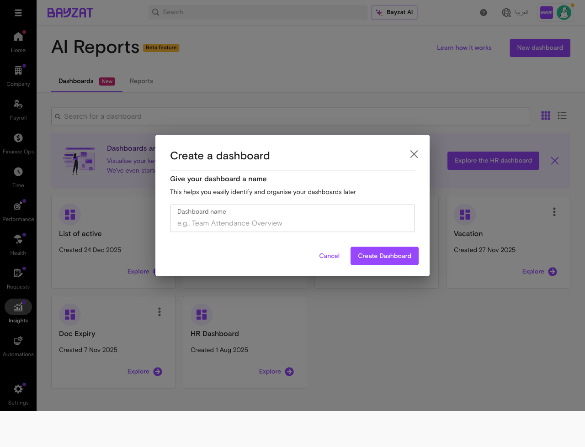

### 09 add insight modal 2026 01 19T12 51 24 770Z

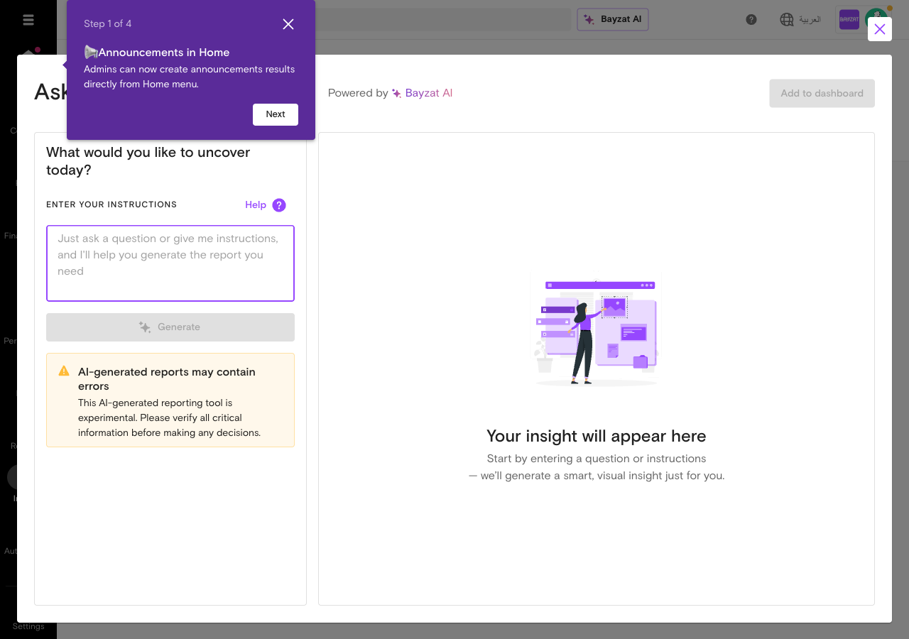

### 09 after closing popup 2026 01 19T13 22 53 093Z


### 09 dashboard name filled 2026 01 19T10 41 25 787Z


### 09 insights menu 2026 01 19T12 07 04 519Z


### 09 insights menu.png 2026 01 19T12 22 36 247Z


### 09 insights submenu 2026 01 19T11 47 31 054Z


### 10 ai reports page 2026 01 19T11 47 44 836Z


### 10 daily tasks clicked.png 2026 01 19T12 23 29 571Z


### 10 dashboard created 2026 01 19T10 41 37 195Z

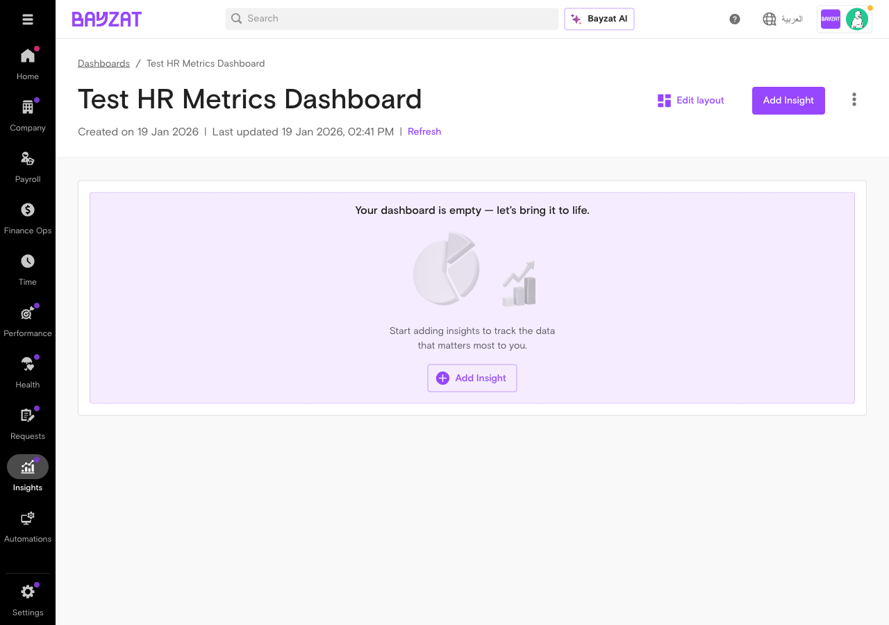

### 10 insights page 2026 01 19T12 07 47 048Z


### 10 insights page loaded 2026 01 19T13 23 14 091Z

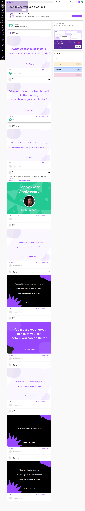

### 11 add insight modal 2026 01 19T10 41 49 370Z


### 11 after backdrop click 2026 01 19T13 23 36 732Z


### 11 hr dashboard view 2026 01 19T11 48 09 275Z

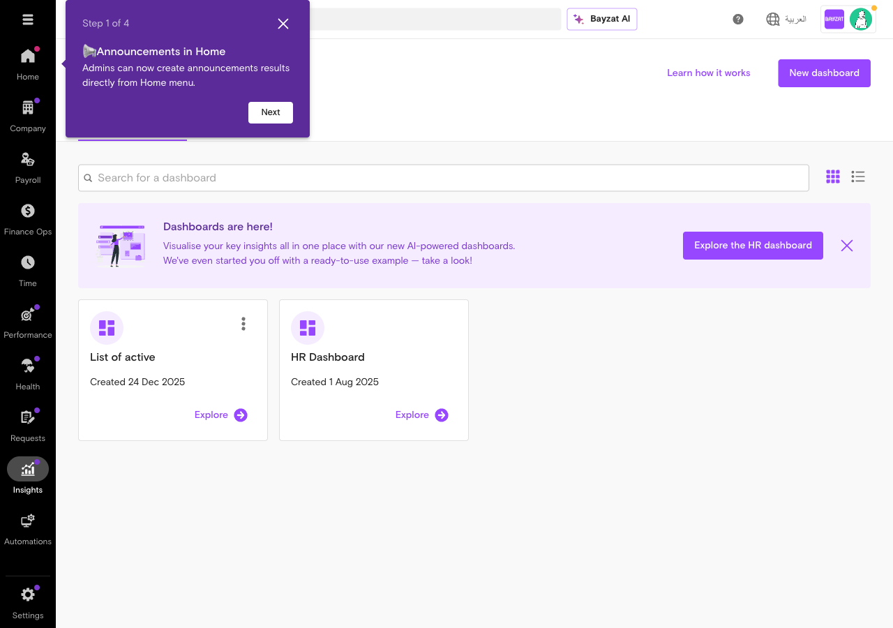

### 11 insights main page 2026 01 19T12 08 09 872Z


### 11 spaces section.png 2026 01 19T12 23 46 598Z


### 12 after escape keys 2026 01 19T13 24 28 241Z


### 12 back to bayzat ai 2026 01 19T12 08 28 917Z


### 12 final bayzat ai view.png 2026 01 19T12 24 03 322Z


### 12 help dialog 2026 01 19T10 43 11 535Z

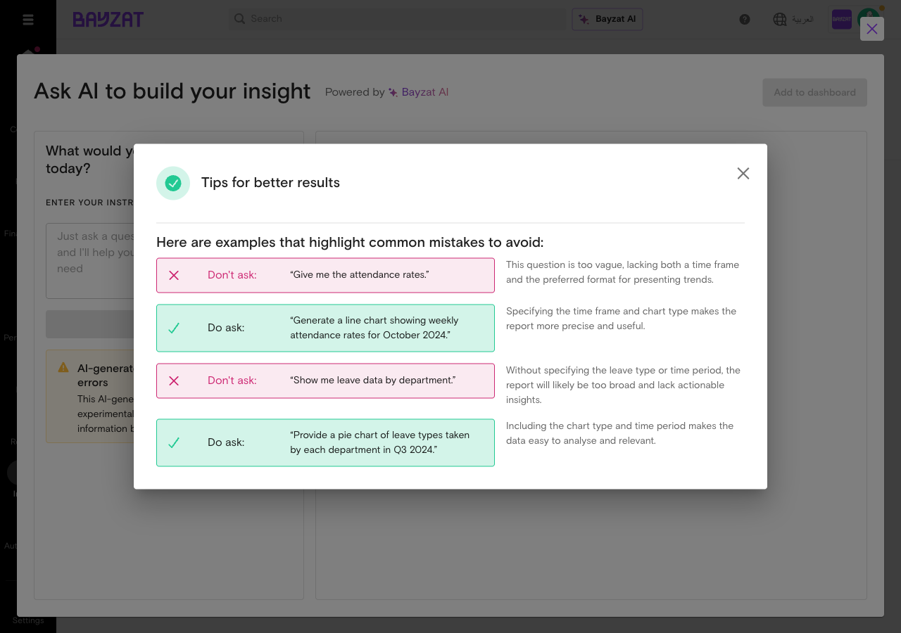

### 12 hr dashboard detail 2026 01 19T11 48 21 528Z


### 13 add insight modal 2026 01 19T11 48 39 700Z


### 13 after clicking bayzat ai header 2026 01 19T13 24 53 480Z


### 13 back to dashboard 2026 01 19T10 43 26 328Z

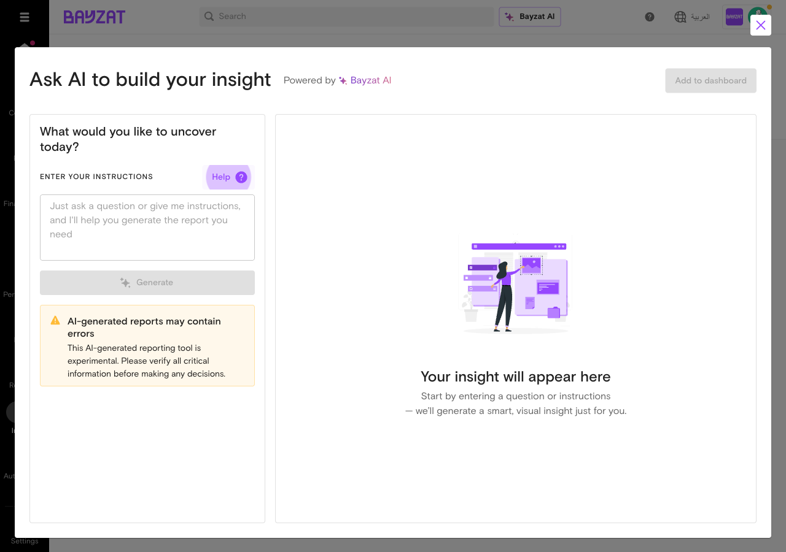

### 13 upload chat interface 2026 01 19T12 08 50 913Z


### 14 after closing modal 2026 01 19T11 49 36 431Z


### 14 after tour completion 2026 01 19T13 25 15 194Z


### 14 back to ai reports main 2026 01 19T10 45 27 135Z


### 14 search opened 2026 01 19T12 09 12 793Z


### 15 after removing modal 2026 01 19T13 25 31 509Z

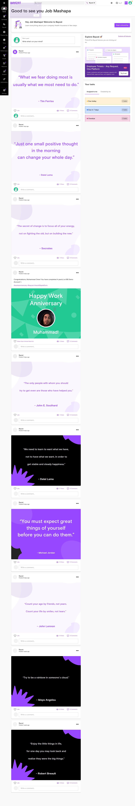

### 15 final bayzat ai view 2026 01 19T12 09 39 636Z


### 15 reports tab 2026 01 19T10 45 41 378Z

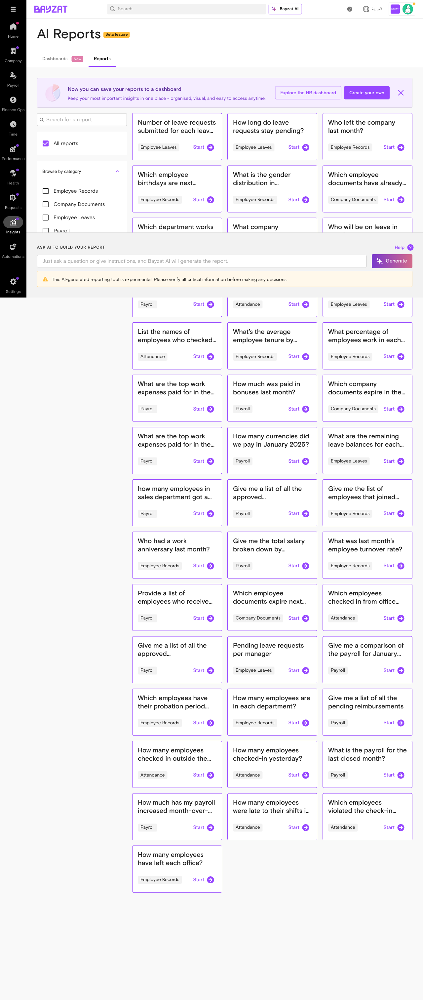

### 15 reports tab 2026 01 19T11 49 54 738Z


### 16 report generated 2026 01 19T10 45 57 413Z


### 16 report generation complete 2026 01 19T11 50 09 886Z

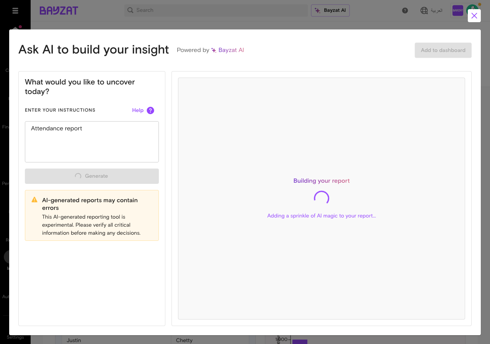

### 17 report complete 2026 01 19T10 46 08 093Z


### 18 report loading status 2026 01 19T10 46 21 035Z


### after login attempt 2026 01 19T13 01 35 338Z


### current state 2026 01 19T13 03 32 565Z

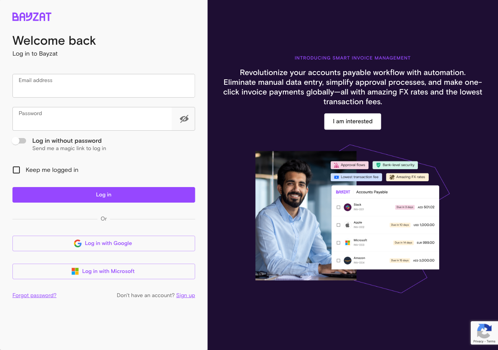

### fresh login page 2026 01 19T13 04 24 853Z


### login page 2026 01 19T12 59 57 422Z


### login status check 2026 01 19T13 01 54 505Z


**Total screenshots captured**: 90
