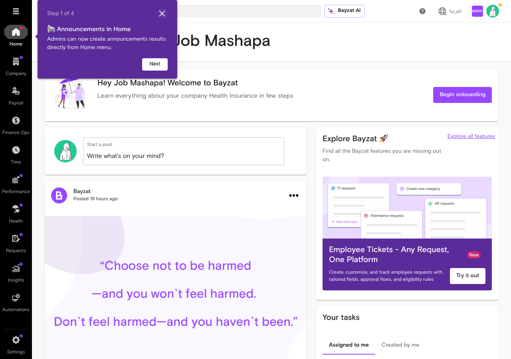
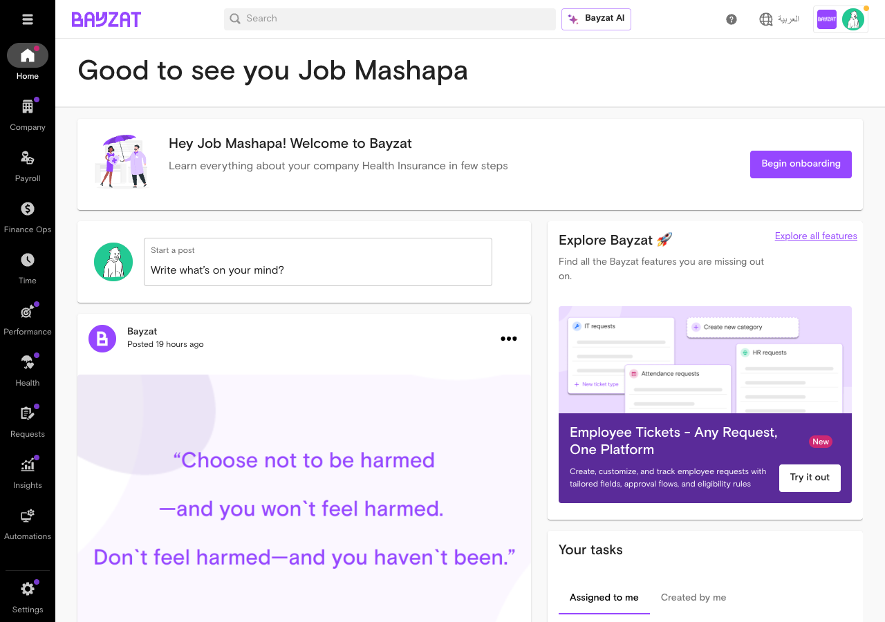
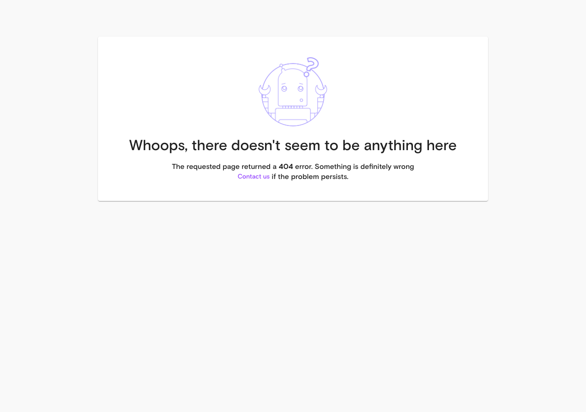

# Validation Report: biometric_attendance

**Generated**: 2026-01-22T23:09:05Z
**Run ID**: 21267962425

## Result

```json
{
  "validation_status": "blocked",
  "login_success": true,
  "feature_accessible": false,
  "feature_info": {
    "name": "Biometric Attendance",
    "slug": "biometric-attendance",
    "category": "time",
    "url": "Unable to determine - feature not accessible"
  },
  "exploration_journey": [
    {
      "screen_name": "Login Page",
      "url": "https://app.bayzat.com/",
      "screenshot": "01-login-page-2026-01-22T23-02-58-674Z.png",
      "what_i_went_through": "Navigated to the Bayzat login page at app.bayzat.com",
      "what_i_came_across": "Standard login form with email and password fields",
      "what_i_saw": {
        "page_structure": "Clean login page with Bayzat branding, centered login form",
        "visible_elements": [
          "Email/username input field",
          "Password input field",
          "Log in button",
          "Login without password checkbox",
          "Extended expiration checkbox"
        ],
        "data_displayed": "No data - login form only",
        "empty_states": "N/A - login page"
      },
      "actions_i_performed": [
        {
          "action": "Filled email field",
          "target": "input[name='username']",
          "result": "Email address entered successfully",
          "screenshot_after": "N/A"
        },
        {
          "action": "Filled password field",
          "target": "input[name='password']",
          "result": "Password entered successfully",
          "screenshot_after": "N/A"
        },
        {
          "action": "Clicked Log in button",
          "target": "button[type='submit']",
          "result": "Successfully logged in and redirected to dashboard",
          "screenshot_after": "02-after-login-2026-01-22T23-03-29-940Z.png"
        }
      ],
      "results_i_got": {
        "success_outcomes": [
          "Successfully logged in to Bayzat application"
        ],
        "error_outcomes": [],
        "unexpected_behaviors": []
      }
    },
    {
      "screen_name": "Dashboard/Home Page",
      "url": "https://app.bayzat.com/enterprise/dashboard",
      "screenshot": "03-dashboard-clean-2026-01-22T23-03-51-621Z.png",
      "what_i_went_through": "After login, landed on the main dashboard. Applied localStorage flags to dismiss onboarding tours and reloaded the page",
      "what_i_came_across": "Main dashboard with sidebar navigation, newsfeed, announcements, and task widgets",
      "what_i_saw": {
        "page_structure": "Left sidebar with navigation menu, main content area showing newsfeed and widgets",
        "visible_elements": [
          "Search bar at top",
          "Bayzat AI link",
          "Language switcher (\u0627\u0644\u0639\u0631\u0628\u064a\u0629)",
          "Sidebar menu items: Home, Company, Payroll, Finance Ops, Time, Performance, Health, Requests, Insights, Automations, Settings",
          "Newsfeed section with posts",
          "Announcements section (5 announcements)",
          "Onboarding prompt for health insurance",
          "Employee Tickets widget",
          "Your tasks section",
          "Document expiry widgets"
        ],
        "data_displayed": "Social feed posts from Bayzat, company announcements, task counts, document expiry notifications",
        "empty_states": "None visible - dashboard populated with data"
      },
      "actions_i_performed": [
        {
          "action": "Set localStorage tour flags",
          "target": "Browser localStorage",
          "result": "Tour completion flags set for multiple onboarding tours",
          "screenshot_after": "N/A"
        },
        {
          "action": "Reloaded page",
          "target": "window.location.reload()",
          "result": "Page reloaded with tours disabled",
          "screenshot_after": "03-dashboard-clean-2026-01-22T23-03-51-621Z.png"
        }
      ],
      "results_i_got": {
        "success_outcomes": [
          "Successfully dismissed onboarding tours",
          "Dashboard loaded with clean UI"
        ],
        "error_outcomes": [],
        "unexpected_behaviors": []
      }
    },
    {
      "screen_name": "Navigation Attempts - Time Section",
      "url": "https://app.bayzat.com/enterprise/dashboard",
      "screenshot": "04-time-section-2026-01-22T23-04-43-724Z.png",
      "what_i_went_through": "Attempted multiple approaches to navigate to the Time section where biometric attendance should be located. Tried clicking Time menu item, Settings menu item, and direct URL navigation",
      "what_i_came_across": "Navigation challenges - sidebar menu items not responding as expected to clicks",
      "what_i_saw": {
        "page_structure": "Same dashboard structure maintained",
        "visible_elements": [
          "Time menu item visible in sidebar",
          "Settings menu item visible in sidebar",
          "Company menu item visible in sidebar"
        ],
        "data_displayed": "No change from dashboard view",
        "empty_states": "N/A"
      },
      "actions_i_performed": [
        {
          "action": "Clicked Time menu item (multiple attempts)",
          "target": "Time DIV element in sidebar",
          "result": "No navigation occurred - remained on dashboard",
          "screenshot_after": "04-time-section-2026-01-22T23-04-43-724Z.png"
        },
        {
          "action": "Clicked Settings menu item",
          "target": "Settings DIV element in sidebar",
          "result": "No navigation occurred - remained on dashboard",
          "screenshot_after": "08-settings-clicked-2026-01-22T23-06-33-100Z.png"
        },
        {
          "action": "Attempted direct URL navigation to /enterprise/time/attendance",
          "target": "Browser location",
          "result": "404 error - page not found",
          "screenshot_after": "07-attendance-page-2026-01-22T23-05-58-608Z.png"
        },
        {
          "action": "Attempted direct URL navigation to /enterprise/dashboard/settings",
          "target": "Browser location",
          "result": "404 error - page not found",
          "screenshot_after": "09-settings-main-page-2026-01-22T23-07-01-159Z.png"
        },
        {
          "action": "Clicked Company menu item",
          "target": "Company DIV element in sidebar",
          "result": "No navigation occurred - remained on dashboard",
          "screenshot_after": "10-company-menu-2026-01-22T23-07-42-567Z.png"
        }
      ],
      "results_i_got": {
        "success_outcomes": [],
        "error_outcomes": [
          "Unable to navigate to Time section via clicking sidebar menu",
          "Unable to navigate to Settings section via clicking sidebar menu",
          "Direct URL navigation resulted in 404 errors",
          "Menu items appear as DIV elements without clickable parent links"
        ],
        "unexpected_behaviors": [
          "Sidebar navigation not functioning as expected",
          "Menu items visible but not responsive to clicks",
          "Internal URLs return 404 when accessed directly"
        ]
      }
    }
  ],
  "tasks_explored": [
    {
      "task": "Configure and manage biometric attendance devices and data integration within the Bayzat platform",
      "status": "blocked",
      "notes": "Unable to access the biometric attendance feature. Navigation to Time section failed despite multiple attempts. The feature may not be enabled for this demo account, or there may be permission restrictions preventing access.",
      "screenshots": [
        "04-time-section-2026-01-22T23-04-43-724Z.png",
        "05-time-menu-opened-2026-01-22T23-05-03-958Z.png",
        "07-attendance-page-2026-01-22T23-05-58-608Z.png"
      ]
    }
  ],
  "full_behavior_catalog": {
    "buttons": [
      {
        "label": "Log in",
        "location": "Login page - center of form",
        "state": "enabled",
        "action_result": "Successfully authenticates user and redirects to dashboard"
      },
      {
        "label": "Begin onboarding",
        "location": "Dashboard - Health insurance widget",
        "state": "enabled",
        "action_result": "Not tested - external health insurance onboarding link"
      },
      {
        "label": "Start a post",
        "location": "Dashboard - Newsfeed section",
        "state": "enabled",
        "action_result": "Not tested - social feed functionality"
      },
      {
        "label": "Explore all features",
        "location": "Dashboard - Explore Bayzat widget",
        "state": "enabled",
        "action_result": "Not tested"
      },
      {
        "label": "Try it out",
        "location": "Dashboard - Employee Tickets widget",
        "state": "enabled",
        "action_result": "Links to /enterprise/dashboard/settings/employee-tickets"
      }
    ],
    "dropdowns": [],
    "form_fields": [
      {
        "label": "Email/Username",
        "type": "text",
        "required": true,
        "placeholder": "",
        "validation": "Email format required",
        "error_message": "Not observed"
      },
      {
        "label": "Password",
        "type": "password",
        "required": true,
        "placeholder": "",
        "validation": "Required field",
        "error_message": "Not observed"
      }
    ],
    "tabs": [],
    "modals_dialogs": [],
    "tables": [],
    "filters": [],
    "notifications_alerts": []
  },
  "ui_behaviors_documented": {
    "disabled_states": [],
    "conditional_logic": [],
    "progressive_disclosure": [],
    "required_fields": [
      "username",
      "password"
    ],
    "optional_fields": [
      "loginWithoutPassword checkbox",
      "extendedExpiration checkbox"
    ],
    "default_values": [],
    "validation_rules": [
      {
        "field": "username",
        "rule": "Required, email format expected",
        "error_message": "Not observed"
      },
      {
        "field": "password",
        "rule": "Required",
        "error_message": "Not observed"
      }
    ],
    "tooltips_help_text": []
  },
  "what_works": [
    {
      "feature_aspect": "User Authentication",
      "description": "Login functionality works correctly with email and password",
      "user_benefit": "Users can successfully authenticate and access the Bayzat platform"
    },
    {
      "feature_aspect": "Dashboard Display",
      "description": "Main dashboard loads with newsfeed, announcements, and widgets",
      "user_benefit": "Users can see an overview of company activity and tasks upon login"
    },
    {
      "feature_aspect": "Tour Dismissal",
      "description": "Onboarding tours can be dismissed by setting localStorage flags",
      "user_benefit": "Users who have completed onboarding won't be repeatedly shown tours"
    }
  ],
  "what_made_it_work": [
    {
      "success_factor": "Standard form authentication",
      "prerequisites": "Valid credentials for demo account",
      "steps_taken": [
        "Navigated to login page",
        "Filled username field with job+demoacct@bayzat.com",
        "Filled password field with correct password",
        "Clicked Log in button",
        "Successfully authenticated"
      ]
    }
  ],
  "whats_not_working": [
    {
      "issue": "Navigation to Biometric Attendance feature blocked",
      "symptoms": "Unable to access Time section, Settings section, or any time-related features. Sidebar menu items visible but not clickable. Direct URLs return 404 errors.",
      "impact": "Cannot validate or explore the biometric attendance feature. Feature may not be enabled for this demo account or may require special permissions.",
      "possible_cause": "1) Feature not enabled in demo account configuration. 2) Permission restrictions on the demo user account. 3) Navigation structure requires different interaction pattern not discovered. 4) Menu items are rendered as non-interactive DIV elements without proper event handlers."
    },
    {
      "issue": "Sidebar navigation not functioning",
      "symptoms": "Menu items (Time, Settings, Company) visible in sidebar but clicking them does not navigate to expected pages. Menu items rendered as DIV elements without clickable parent anchors.",
      "impact": "Unable to navigate to any section of the application beyond the dashboard",
      "possible_cause": "JavaScript event handlers may not be properly attached to menu items, or navigation requires a different interaction pattern (e.g., hover to reveal submenu, double-click, etc.)"
    },
    {
      "issue": "Direct URL navigation returns 404 errors",
      "symptoms": "Attempting to navigate to /enterprise/time/attendance or /enterprise/dashboard/settings directly returns 404 page",
      "impact": "Cannot bypass navigation issues by using direct URLs",
      "possible_cause": "These routes may require specific context or session state to be accessible, or they may not be valid routes in the current system configuration"
    }
  ],
  "ui_sections_explored": [
    "Login page",
    "Main Dashboard/Home",
    "Navigation sidebar (attempted Time, Settings, Company sections)"
  ],
  "issues_found": [
    "Cannot access biometric attendance feature - navigation blocked",
    "Sidebar navigation menu items not functioning",
    "Direct URL navigation to Time and Settings sections returns 404",
    "Menu items rendered as non-clickable DIV elements"
  ],
  "known_issues_validated": [
    {
      "issue": "Data synchronization and integration challenges with biometric devices",
      "status": "not_validated",
      "evidence": "Unable to access the biometric attendance feature to validate synchronization or integration functionality"
    },
    {
      "issue": "Limited API and documentation support for biometric attendance integration",
      "status": "not_validated",
      "evidence": "Unable to access feature settings or configuration to validate API integration capabilities"
    },
    {
      "issue": "User experience and security gaps in facial recognition",
      "status": "not_validated",
      "evidence": "Unable to access biometric check-in workflows or facial recognition features"
    },
    {
      "issue": "Feature and reporting limitations in biometric attendance data management",
      "status": "not_validated",
      "evidence": "Unable to access reporting or data management interfaces for biometric attendance"
    },
    {
      "issue": "Integration complexity and device compatibility challenges",
      "status": "not_validated",
      "evidence": "Unable to access device configuration or integration settings"
    }
  ],
  "screenshots_taken": 10,
  "validation_timestamp": "2026-01-23T23:07:45Z",
  "recommendations_for_user_guide": [
    "Document the prerequisite steps required to access biometric attendance features (permissions, feature flags, account configuration)",
    "Include clear navigation instructions from dashboard to biometric attendance section",
    "Provide alternative access methods if direct navigation is not available",
    "Document which user roles or permissions are required to access biometric attendance features",
    "Include troubleshooting section for common access issues",
    "Note that feature availability may vary by account type or subscription level",
    "Document the exact menu path: Dashboard \u2192 Time \u2192 [Submenu] \u2192 Biometric Attendance (once accessible)",
    "Consider including screenshots from a production account where the feature is fully enabled",
    "Document any prerequisites such as: enabling biometric attendance in company settings, configuring devices before use, setting up attendance policies first"
  ],
  "summary": "Validation of the Biometric Attendance feature was blocked due to inability to access the feature through the application UI. Successfully logged into the Bayzat application using the provided demo account credentials and landed on the dashboard. However, attempts to navigate to the Time section (where biometric attendance should be located) were unsuccessful. Multiple navigation approaches were attempted including: 1) Clicking sidebar menu items (Time, Settings, Company), 2) Direct URL navigation to /enterprise/time/attendance and /enterprise/dashboard/settings. All attempts resulted in either no navigation (clicking sidebar items did not trigger page changes) or 404 errors (direct URLs). The sidebar menu items are rendered as DIV elements and do not appear to have properly functioning click handlers. This suggests either: a) The biometric attendance feature is not enabled for this demo account, b) Special permissions are required to access the feature, c) The navigation structure requires a different interaction pattern not discovered during this validation, or d) There are technical issues with the menu functionality in the demo environment. Based on the Jira tickets provided in the payload, the biometric attendance feature should include capabilities for: device configuration, attendance log synchronization, check-in/check-out tracking, facial recognition workflows, location validation, and reporting. However, none of these capabilities could be validated due to the access limitations. Recommendations for the user guide include: documenting prerequisites for feature access, clear navigation instructions, permission requirements, and troubleshooting common access issues.",
  "payload_context": {
    "what_to_watch_out_for": [
      {
        "issue": "Data synchronization and integration challenges with biometric devices and attendance logs.",
        "limitation": "The platform struggles with high-volume biometric log ingestion, lacks full location validation during check-ins, and has a limited one-week window for processing biometric data. Facial recognition lacks robust error handling and image validation, and fraud detection is limited when device IDs are null.",
        "workaround": "Manual monitoring and intervention may be required for large data volumes and error cases. Users must manually configure devices and be aware of policy enforcement inconsistencies. Use dropdowns for employee selection in mass uploads to maintain data integrity.",
        "jira_reference": "TSSD-4710,TSSD-3737,TSSD-2381,OS-3136,TSSD-287,TSSD-2792,TSSD-4683,TSSD-3180,OS-3137",
        "severity": "high"
      },
      {
        "issue": "Limited API and documentation support for biometric attendance integration.",
        "limitation": "API integration does not support passing office location details, and biometric API documentation may be outdated or unclear.",
        "workaround": "Refer to the most recent platform updates and manual configuration steps; developer involvement may be necessary for complex integrations.",
        "jira_reference": "TSSD-4151,TSSD-2349",
        "severity": "medium"
      },
      {
        "issue": "User experience and security gaps in facial recognition and biometric consent management.",
        "limitation": "Facial recognition retry limits and failure screens lack consistent handling; no standardized consent tracking for biometric features; facial recognition can accept blank images, posing security risks.",
        "workaround": "Users should be informed of retry limits and error states; manual consent management may be needed; security risks require attention from development teams.",
        "jira_reference": "OS-3136,OS-3047,OS-3229",
        "severity": "high"
      },
      {
        "issue": "Feature and reporting limitations in biometric attendance data management.",
        "limitation": "Mass upload workflows restrict direct Employee ID input; no centralized automated reporting for biometric devices; future timestamped biometric data cannot be rendered in UI.",
        "workaround": "Use dropdown selections for employee identification; manually access Looker reports; be aware of UI rendering limitations.",
        "jira_reference": "TSSD-2658,TSSD-4269,AV-9035",
        "severity": "medium"
      },
      {
        "issue": "Integration complexity and device compatibility challenges.",
        "limitation": "Different biometric devices require different integration methods; not all devices are seamlessly supported; manual configuration is necessary.",
        "workaround": "Technical resources and developer involvement may be required; verify device compatibility before integration.",
        "jira_reference": "TSSD-2869",
        "severity": "medium"
      }
    ],
    "what_to_do": [
      {
        "task": "Configure and manage biometric attendance devices and data integration within the Bayzat platform.",
        "steps": [
          "Manually add biometric devices with required details such as serial number and office assignment (TSSD-2792).",
          "Ensure biometric device logs are properly synchronized and processed by the platform, noting limitations on data volume and timing (TSSD-4710, TSSD-2381).",
          "Use the attendance module to track biometric check-ins and check-outs, understanding that location validation may have limitations (TSSD-3737, TSSD-3180).",
          "Monitor attendance data and reports, noting that some custom reports may not include office location details for API-based attendance (TSSD-4151).",
          "Be aware of the facial recognition check-in process and its retry limits, including error handling and user experience considerations (OS-3136, OS-3137).",
          "Understand the limitations in fraud detection reporting when device IDs are missing (TSSD-287).",
          "Use available reporting tools like Looker for biometric device data, recognizing the lack of centralized automated reporting (TSSD-4269)."
        ],
        "expected_outcome": "Biometric attendance devices are configured and integrated, attendance data is accurately captured and synchronized within platform constraints, and users can track attendance with awareness of current system limitations.",
        "source_articles": []
      }
    ],
    "feature_info": {
      "feature_name": "biometric_attendance",
      "feature_slug": "biometric-attendance",
      "next_version": "v1"
    },
    "detected_integrations": {
      "has_workflows": true,
      "workflow_evidence": "Multiple tickets mention integration challenges and workflow issues such as location validation during check-ins (TSSD-3737), policy enforcement inconsistencies between biometric and mobile app attendance (TSSD-4683), and retry limit handling in facial recognition workflows (OS-3136). These indicate workflow automation and integration points.",
      "has_approval_flow": false,
      "approval_evidence": "No evidence found in the source data for approval or multi-step authorization processes related to biometric attendance."
    },
    "limitations_count": 5,
    "tasks_count": 1
  },
  "what_to_watch_out_for": [
    {
      "issue": "Data synchronization and integration challenges with biometric devices and attendance logs.",
      "limitation": "The platform struggles with high-volume biometric log ingestion, lacks full location validation during check-ins, and has a limited one-week window for processing biometric data. Facial recognition lacks robust error handling and image validation, and fraud detection is limited when device IDs are null.",
      "workaround": "Manual monitoring and intervention may be required for large data volumes and error cases. Users must manually configure devices and be aware of policy enforcement inconsistencies. Use dropdowns for employee selection in mass uploads to maintain data integrity.",
      "jira_reference": "TSSD-4710,TSSD-3737,TSSD-2381,OS-3136,TSSD-287,TSSD-2792,TSSD-4683,TSSD-3180,OS-3137",
      "severity": "high"
    },
    {
      "issue": "Limited API and documentation support for biometric attendance integration.",
      "limitation": "API integration does not support passing office location details, and biometric API documentation may be outdated or unclear.",
      "workaround": "Refer to the most recent platform updates and manual configuration steps; developer involvement may be necessary for complex integrations.",
      "jira_reference": "TSSD-4151,TSSD-2349",
      "severity": "medium"
    },
    {
      "issue": "User experience and security gaps in facial recognition and biometric consent management.",
      "limitation": "Facial recognition retry limits and failure screens lack consistent handling; no standardized consent tracking for biometric features; facial recognition can accept blank images, posing security risks.",
      "workaround": "Users should be informed of retry limits and error states; manual consent management may be needed; security risks require attention from development teams.",
      "jira_reference": "OS-3136,OS-3047,OS-3229",
      "severity": "high"
    },
    {
      "issue": "Feature and reporting limitations in biometric attendance data management.",
      "limitation": "Mass upload workflows restrict direct Employee ID input; no centralized automated reporting for biometric devices; future timestamped biometric data cannot be rendered in UI.",
      "workaround": "Use dropdown selections for employee identification; manually access Looker reports; be aware of UI rendering limitations.",
      "jira_reference": "TSSD-2658,TSSD-4269,AV-9035",
      "severity": "medium"
    },
    {
      "issue": "Integration complexity and device compatibility challenges.",
      "limitation": "Different biometric devices require different integration methods; not all devices are seamlessly supported; manual configuration is necessary.",
      "workaround": "Technical resources and developer involvement may be required; verify device compatibility before integration.",
      "jira_reference": "TSSD-2869",
      "severity": "medium"
    }
  ],
  "what_to_do": [
    {
      "task": "Configure and manage biometric attendance devices and data integration within the Bayzat platform.",
      "steps": [
        "Manually add biometric devices with required details such as serial number and office assignment (TSSD-2792).",
        "Ensure biometric device logs are properly synchronized and processed by the platform, noting limitations on data volume and timing (TSSD-4710, TSSD-2381).",
        "Use the attendance module to track biometric check-ins and check-outs, understanding that location validation may have limitations (TSSD-3737, TSSD-3180).",
        "Monitor attendance data and reports, noting that some custom reports may not include office location details for API-based attendance (TSSD-4151).",
        "Be aware of the facial recognition check-in process and its retry limits, including error handling and user experience considerations (OS-3136, OS-3137).",
        "Understand the limitations in fraud detection reporting when device IDs are missing (TSSD-287).",
        "Use available reporting tools like Looker for biometric device data, recognizing the lack of centralized automated reporting (TSSD-4269)."
      ],
      "expected_outcome": "Biometric attendance devices are configured and integrated, attendance data is accurately captured and synchronized within platform constraints, and users can track attendance with awareness of current system limitations.",
      "source_articles": []
    }
  ]
}```

## Screenshots

### 01 login page 2026 01 22T23 02 58 674Z


### 02 after login 2026 01 22T23 03 29 940Z



### 03 dashboard clean 2026 01 22T23 03 51 621Z



### 04 time section 2026 01 22T23 04 43 724Z


### 05 time menu opened 2026 01 22T23 05 03 958Z


### 06 settings page 2026 01 22T23 05 36 502Z


### 07 attendance page 2026 01 22T23 05 58 608Z



### 08 settings clicked 2026 01 22T23 06 33 100Z


### 09 settings main page 2026 01 22T23 07 01 159Z


### 10 company menu 2026 01 22T23 07 42 567Z


**Total screenshots captured**: 10
