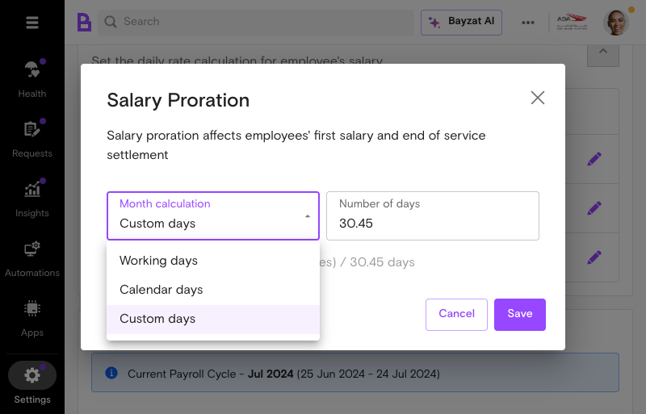
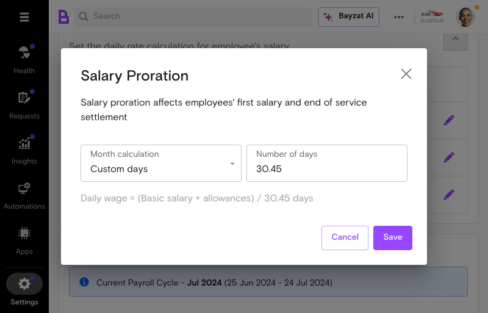
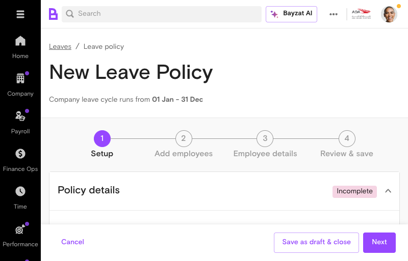
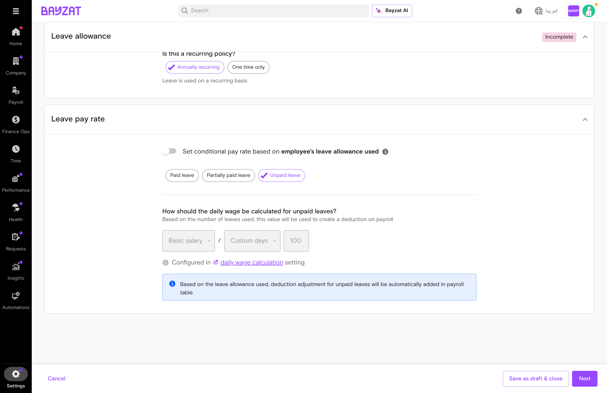

# Daily Wage Calculator

Configure flexible daily wage calculations for salary proration, leave encashment, and unpaid leave deductions

📖 Quick Navigation

<a href="#feature-overview" class="nav-card">✨ What is Daily Wage Calculator?</a> <a href="#product-foundation" class="nav-card">🏗️ Product Foundation</a> <a href="#user-journey" class="nav-card">🗺️ User Journey Guide</a> <a href="#feature-discovery" class="nav-card">🚀 How to Access</a> <a href="#setup-process" class="nav-card">⚙️ Setup Process</a> <a href="#feature-usage" class="nav-card">📋 Feature Usage</a> <a href="#leave-pay-rate" class="nav-card">📊 Leave Pay Rate</a> <a href="#business-rules" class="nav-card">📏 Business Rules</a> <a href="#troubleshooting" class="nav-card">🔧 Troubleshooting</a> <a href="#glossary" class="nav-card">📚 Glossary</a>

## What is Daily Wage Calculator?

### Overview

The Daily Wage Calculator is a flexible and customizable method for calculating daily wages, including salary proration, leave encashment, and unpaid leave deductions. This feature enables HR teams and payroll administrators to accurately determine employee compensation adjustments based on actual days worked and leave taken.

<figure class="screenshot-container">

<figcaption>Accessing the Daily Wage Calculator from Settings &gt; Payroll menu</figcaption>
</figure>

### Who Uses This Feature?

| User Role | What They Do | Value Proposition |
|----|----|----|
| **Super Admins** | Configure organization-wide daily wage calculation methods and salary component settings | Set up compliant calculation rules once and apply them consistently across the organization—ensuring labor law compliance without manual policy enforcement |
| **Payroll Table Managers** | Manage payroll calculations and apply daily wage settings to employee groups | Process accurate salary deductions and adjustments automatically—eliminating spreadsheet calculations and reducing payroll disputes |
| **Transaction Processors** | Execute payroll transactions using configured daily wage calculations | Apply pre-configured calculation rules with confidence—without needing to manually verify formulas or worry about calculation errors |
| **HR Personnel** | Manage employee leave records and coordinate with payroll for salary adjustments | Connect leave management directly to accurate salary calculations—eliminating manual handoffs and ensuring employees are paid correctly |

### Key Benefits

- Flexible calculation methods that align with your company's labor law requirements
- Automatic daily wage calculations for unpaid leave deductions and salary adjustments
- Customizable salary components (Basic salary or Basic salary + allowances)
- Support for multiple calculation bases including calendar days, working days, and custom days
- Accurate end-of-service calculations based on configured leave encashment policies
- Reduced manual calculation errors through automated daily rate determination

## Product Foundation Overview

### How Daily Wage Calculator Fits

Daily Wage Calculator is a **configuration setting** that determines how daily rates are computed for payroll scenarios. It provides the calculation base for salary proration, leave encashment, and unpaid leave deductions.

**Mental model:** Daily Wage Settings (formula) → Applied to Transactions → Proration/Encashment/Deduction Amounts

One configuration applies organization-wide. Changes affect all future calculations but not historical transactions.

### Key Decisions Before Setup

Answer these questions before configuring daily wage calculation:

- **Calculation base?** — Calendar days (30/365), working days, or custom days?
- **Salary components?** — Basic salary only or basic + allowances?
- **Same for all services?** — Use same formula for proration, encashment, and deductions?
- **Labor law compliance?** — Which formula aligns with your jurisdiction?

### Related Features

- **Salary Proration** — Calculates partial salary for mid-month joins/exits
- **Leave Encashment** — Determines daily rate for end-of-service settlements
- **Unpaid Leave Deductions** — Calculates daily deduction amounts
- **Leave Management** — Integrates with leave policies and approvals
- **Payroll Processing** — Applies daily rates to monthly payroll

### Prerequisites & Requirements

| Requirement | Description | Status |
|----|----|----|
| User Role | Super Admin or Payroll Manager access level | Required |
| Employee Data | Total salary (basic + allowance), working days, leave records | Required |
| Public Holiday Calendar | Company-specific public holiday calendar configured | Required |
| Leave Policies | Leave types and policies configured in system | Required |
| Payroll Module Access | Active Bayzat payroll module subscription | Required |

## Complete User Journey Guide

### End-to-End Journey: Configuring Daily Wage Calculator

From settings access through payroll application.

1

#### Access Settings

Settings → Payroll → Daily Wage Calculation

<a href="#feature-discovery" class="phase-link">See navigation →</a>

2

#### Select Calculation Base

Calendar days, working days, or custom days

<a href="#setup-process" class="phase-link">See configuration →</a>

3

#### Configure Salary Components

Basic Only or Basic + Allowances

<a href="#setup-process" class="phase-link">See options →</a>

4

#### Apply to Leave Policies

Unpaid leave deductions & encashment

<a href="#leave-pay-rate" class="phase-link">See leave settings →</a>

5

#### Process Payroll

Apply rates to transactions

<a href="#feature-usage" class="phase-link">See processing →</a>

6

#### Review & Finalize

Verify and finalize pay runs

<a href="#business-rules" class="phase-link">See rules →</a>

### Success Indicators

- Daily wage calculation method is configured and saved in payroll settings
- All leave policies reflect the selected calculation base and salary components
- Payroll transactions show accurate daily rate deductions for unpaid leave
- End-of-service calculations reflect configured leave encashment policies
- Salary proration amounts align with actual days worked
- No calculation errors or discrepancies in monthly payroll processing

## Pre-Implementation

### Prerequisites Table

Before configuring daily wage calculations and leave deductions, ensure your organization meets these requirements:

| Requirement | Description | Status |
|----|----|----|
| User Role | Super admin or Payroll table manager access | Required |
| Payroll Module Access | Active Payroll module enabled in your Bayzat account | Required |
| Employee Records | Employee master data with salary information configured | Required |
| Leave Policies | Leave policy framework established in the system | Required |
| Public Holiday Calendar | Company-specific public holiday calendar configured | Required |
| Salary Components | Basic salary and allowance components defined in payroll settings | Required |

### Required Permissions and Roles

The Daily Wage Calculator is accessible to Superadmin, Payroll table managers, and transaction processors. Ensure your user account has one of these roles:

- Super Admin - Full access to all payroll settings and configurations
- Payroll Manager - Access to payroll settings and daily wage calculation configuration
- Transaction Processor - Access to process payroll transactions using configured daily wage calculations

### System Requirements

Your Bayzat account must have the following systems active and configured:

- Payroll module enabled and initialized
- Leave Management system configured with leave types
- Employee database with current salary information
- Public holiday calendar for your operating country (UAE/KSA)
- Active payroll periods or pay cycles defined

## Feature Discovery

### How to Access

Access Daily Wage Calculator from Settings → Payroll → Daily Wage Calculation. This is the central location for configuring how daily wages are calculated across your organization.

### Navigation Path

Follow these steps to navigate to the Daily Wage Calculator:

1.  Log in to your Bayzat account as Super Admin or Payroll Manager
2.  Click the Settings icon (gear icon) in the main navigation
3.  Select Payroll from the settings menu
4.  Choose Daily Wage Calculation from the payroll options

<figure class="screenshot-container">

<figcaption>Navigation Path - Accessing the Payroll settings from the main menu</figcaption>
</figure>

### Interface Overview

The Daily Wage Calculator interface displays a configuration table with three service types, each with independent settings. This per-service structure allows different calculation methods for different payroll scenarios:

#### Service Configuration Table

The interface presents a table with columns for Service, Daily Wage Calculation (showing the current formula), and an Edit button. Three service types are configured independently: Salary proration, EOS leave encashment, and Unpaid leave deduction.

#### Calculation Base Selection

Select calculation base (calendar days, working days, or custom days). Each service type can have its own calculation base configured independently.

#### Salary Components

Choose salary components to factor into calculations: Basic salary or Basic salary + allowances. The formula displays dynamically (e.g., "Basic salary + allowances / 30 days").

<figure class="screenshot-container">

<figcaption>Interface Overview - Calculation basis selection options available in the Daily Wage Calculator</figcaption>
</figure>

## Setup Process

### Initial Configuration

The Daily Wage Calculator requires initial setup to establish how your organization calculates daily wages. Most UAE and KSA companies use 30 custom days to align with labor law. This initial configuration affects salary proration, leave encashment, and unpaid leave deductions across your entire payroll system.

**Note:** Changes to daily wage calculation settings will affect all active (unpaid) amounts in the payroll table. Plan configuration changes during periods when no payroll is in process.

### Step-by-Step Setup

1

#### Navigate to Daily Wage Calculation Settings

From the main Settings menu, select Payroll, then expand the Daily Wage Calculation section. You will see a configuration table displaying three service types (Salary proration, EOS leave encashment, Unpaid leave deduction), each showing its current daily wage formula and an edit button (pencil icon) to configure settings.

<figure class="screenshot-container">

<figcaption>Step 1 - The Daily Wage Calculation configuration interface</figcaption>
</figure>

2

#### Select Calculation Base

Select calculation base (calendar days, working days, or custom days). Your choice determines the denominator for daily wage calculations:

- **Calendar Days:** Uses the actual number of days in the month (28-31 days)
- **Working Days:** Uses only business days, excluding weekends and public holidays
- **Custom Days:** Uses a fixed number (typically 30 days for UAE/KSA compliance)

<figure class="screenshot-container">

<figcaption>Step 2 - Select your calculation base from the available options</figcaption>
</figure>

3

#### Choose Salary Components

Choose salary components to factor into calculations. Select which salary elements are included in daily wage calculations from the Salary Component dropdown:

- **Basic salary:** Uses only the employee's basic salary
- **Basic salary + allowances:** Includes basic salary and all allowances

<figure class="screenshot-container">

<figcaption>Step 3 - Select which salary components to include in calculations</figcaption>
</figure>

4

#### Configure Public Holiday Handling

Can exclude weekends and public holidays. If you selected Working Days as your calculation base, ensure your public holiday calendar is properly configured. Public holidays are deducted from working days.

5

#### Save Configuration Changes

Click the Save button to apply your daily wage calculation settings. The system will confirm the changes and apply them to all future payroll calculations.

6

#### Handle Existing Transactions (If Applicable)

When payroll month is open, super admin must reject existing prorated salary transactions before saving new proration settings. If you have active payroll in process, you may need to reject and resave affected transactions.

### Verification Steps

After completing the setup, verify your configuration is correct:

1.  Confirm the calculation base is displayed correctly on the Daily Wage Calculation page
2.  Check that salary components selected match your organization's payroll policy
3.  Review a sample payroll transaction to ensure daily wage calculations are accurate
4.  Verify that any existing prorated salary transactions have been updated if you made changes during an open payroll period
5.  Test with a small group of employees before applying to full payroll

**Important:** Configuration changes affect all payroll calculations immediately. Ensure you have tested changes thoroughly and communicated any impacts to your payroll team before applying to live payroll.

## Feature Usage

### Common Workflows

The Daily Wage Calculator supports several key payroll workflows. Once configured, it automatically calculates daily wages for multiple scenarios:

#### Unpaid Leave Deductions

Calculate and manage unpaid leave deductions on a daily basis for employee payroll. When an employee takes unpaid leave, the system automatically calculates the daily deduction based on your configured calculation base. The configuration dialog displays all eligible unpaid leave types with their individual calculations, and includes an "Overwrite calculation in policies" toggle to apply settings across multiple leave policies.

#### Salary Proration

Adjust and calculate an employee's salary proportionally based on the actual days worked, affecting their first salary and end-of-service settlement. This applies when employees join mid-month or leave before month-end.

#### Leave Encashment

Configure and customize leave encashment policies for end-of-service calculations. The daily wage rate is used to calculate the value of unused leave at employee separation. The EOS leave encashment configuration displays all eligible paid leave types with their individual daily wage calculations. The "Overwrite calculation in policies" toggle allows bulk updates across multiple leave policies simultaneously.

### Usage Examples

#### Example 1: Processing Unpaid Leave

To calculate and deduct daily pay for employees taking unpaid leave by determining the appropriate salary reduction based on the number of working or calendar days:

1.  Employee submits unpaid leave request for 2 days
2.  HR approves the unpaid leave request
3.  System calculates daily pay rate using your configured calculation base (e.g., Basic Salary ÷ 30 days = Daily Rate)
4.  Deduction is automatically applied: Daily Rate × 2 days = Total Deduction
5.  Deduction appears in the payroll table and is reflected in the employee's salary

<figure class="screenshot-container">

<figcaption>Usage Example - Unpaid leave deduction configuration interface</figcaption>
</figure>

#### Example 2: Configuring Unpaid Leave Policy

When creating a new leave policy for unpaid leave:

1.  Navigate to Settings \> Leaves \> Leave Policies
2.  Click Add New Policy
3.  Select Unpaid Leave as the leave type
4.  Choose calculation method: Basic Only or Basic + Allowances
5.  Select day calculation type: Calendar Days, Working Days, or Custom Days
6.  Save the policy

<figure class="screenshot-container">

<figcaption>Usage Example - Leave policies table with existing configurations</figcaption>
</figure>

<figure class="screenshot-container">

<figcaption>Usage Example - Creating a new leave policy</figcaption>
</figure>

<figure class="screenshot-container">

<figcaption>Usage Example - Configuring leave policy settings</figcaption>
</figure>

#### Example 3: End-of-Service Leave Encashment

Configure and customize leave encashment policies for end-of-service calculations:

1.  Navigate to Settings \> Payroll \> End of Service Eligibility
2.  Select salary components (Basic Only or Basic + Allowances)
3.  Choose calculation method (Calendar Days, Working Days, or Custom Days)
4.  Configure which leave types are eligible for encashment
5.  Save configuration

<figure class="screenshot-container">

<figcaption>Usage Example - End-of-service eligibility configuration</figcaption>
</figure>

<figure class="screenshot-container">

<figcaption>Usage Example - Configuring specific leave types for end-of-service encashment</figcaption>
</figure>

### Best Practices

- **Align with Labor Law:** Most UAE and KSA companies use 30 custom days to align with labor law. Ensure your calculation base matches your country's labor regulations.
- **Consistent Configuration:** Use the same calculation base across all payroll operations (salary proration, leave encashment, and unpaid leave deductions) to ensure consistency.
- **Public Holiday Management:** Public holidays must be considered and subtracted from working days when calculating daily pay. Keep your public holiday calendar current.
- **Test Before Implementation:** Test your daily wage calculation configuration with a sample of employees before applying to full payroll.
- **Document Your Settings:** Keep records of your calculation base, salary components, and any special configurations for audit and compliance purposes.
- **Monitor Month-End Processing:** When payroll month is open and prorated salary transactions exist, super admin must manually reject and resave transactions if you need to change settings.
- **Review Calculation Variations:** Calculation varies depending on month length (e.g., 31 days in January, 28 days in February), and different calculation methods can impact final wage calculations. Review payroll reports monthly to ensure accuracy.

<figure class="screenshot-container">

<figcaption>Best Practices - Understanding the daily wage calculation formula</figcaption>
</figure>

## Leave Pay Rate — How Leave Types Control Daily Wage Calculations

### Understanding the Connection

The **Leave pay rate** section in leave policy configuration is the critical junction where Daily Wage Calculator settings are applied. This section determines whether and how payroll deductions are calculated when employees take leave.

**Key Concept:** The Daily Wage Calculator is only invoked when there is an unpaid component to the leave. For fully paid leave, no daily wage calculation is needed because no deduction occurs.

### When Does Daily Wage Calculator Apply?

| Leave Type | Daily Wage Calculator Used? | Business Logic |
|----|----|----|
| **Paid leave** | No | Employee receives 100% salary — no deduction to calculate |
| **Partially paid leave** | Yes | Calculates deduction for the unpaid percentage of salary |
| **Unpaid leave** | Yes | Calculates full deduction for all leave days taken |

### Navigation Path

Settings → Leaves → Leave Policies → \[Create/Edit Policy\] → Leave pay rate section

### Option 1: Paid Leave

<figure class="screenshot-container">

<figcaption>Paid Leave tab - No daily wage formula section appears</figcaption>
</figure>

#### What Appears in the Interface

- "Paid leave" button selected with checkmark
- **NO daily wage formula section** - it is completely hidden
- "Leave salary settings" section appears instead

#### Business Logic Explained

When an employee takes **Paid leave**:

1.  **Compensation:** Employee receives **100% of their regular salary** for the leave period
2.  **Payroll Impact:** **No deduction** is created because the employee is fully compensated
3.  **Daily Wage Relevance:** The Daily Wage Calculator is **NOT used** — there is no unpaid portion requiring calculation
4.  **What Gets Recorded:** Leave days are tracked for balance purposes only; no monetary adjustment appears in payroll table

#### Additional Option: Leave Salary

When Paid leave is selected, a **"Leave salary settings"** section appears with an **"Enable leave salary"** toggle. This is for UAE labor law compliance where employees may receive an additional payment before their annual leave (a common practice in the region).

#### Example Scenario

**Scenario:** Employee takes 5 days of annual leave (Paid leave policy).  
  
**Result:** They receive their normal monthly salary with no deductions. The 5 leave days are deducted from their balance for tracking purposes only. No deduction line item appears in the payroll table.

### Option 2: Partially Paid Leave

<figure class="screenshot-container">

<figcaption>Partially Paid Leave tab - Shows percentage field and disabled daily wage formula</figcaption>
</figure>

#### What Appears in the Interface

- "Partially paid leave" button selected with checkmark
- **"Percentage paid"** field (0-100%) — this is the key control
- Daily wage formula section with **disabled/greyed-out fields**
- Question: "How should the daily wage be calculated for unpaid percentage of leaves?"
- Alert message about automatic deduction adjustment

#### Business Logic Explained

When an employee takes **Partially paid leave**:

1.  **Compensation:** Employee receives a **specified percentage** of their daily wage for each leave day
2.  **The Percentage Field:** Determines the split between paid and unpaid portions
    - Set to 75% = employee receives 75% pay, 25% is deducted
    - Set to 50% = employee receives 50% pay, 50% is deducted
    - Set to 25% = employee receives 25% pay, 75% is deducted
3.  **Daily Wage Relevance:** The Daily Wage Calculator determines the value of the **UNPAID PORTION**
4.  **Formula Applied:** `Daily Wage × (100% - Percentage Paid) × Number of Leave Days = Deduction`

#### Calculation Example

| Parameter           | Value            |
|---------------------|------------------|
| Basic salary        | 10,000 AED/month |
| Custom days divisor | 30               |
| Percentage paid     | 50%              |
| Leave days taken    | 3 days           |

**Step-by-step calculation:**  
  
1. **Daily wage** = 10,000 ÷ 30 = **333.33 AED**  
2. **Paid portion** = 333.33 × 50% × 3 = **500.00 AED** (employee receives this)  
3. **Unpaid portion** = 333.33 × 50% × 3 = **500.00 AED** (payroll deduction)  
4. **Net effect:** Employee's monthly salary reduced by **500.00 AED**

### Option 3: Unpaid Leave

<figure class="screenshot-container">

<figcaption>Unpaid Leave tab - Shows disabled daily wage formula for full deduction</figcaption>
</figure>

#### What Appears in the Interface

- "Unpaid leave" button selected with checkmark
- **NO percentage field** — because it's implicitly 0%
- Daily wage formula section with **disabled/greyed-out fields**
- Question: "How should the daily wage be calculated for unpaid leaves?"
- Alert: "Based on the leave allowance used, deduction adjustment for unpaid leaves will be automatically added in payroll table"

#### Business Logic Explained

When an employee takes **Unpaid leave**:

1.  **Compensation:** Employee receives **0% salary** for leave days — no pay at all
2.  **Payroll Impact:** **Full daily wage deduction** for each leave day
3.  **Daily Wage Relevance:** The Daily Wage Calculator is **FULLY applied** to calculate the total deduction
4.  **Formula Applied:** `Daily Wage × Number of Leave Days = Total Deduction`

#### Calculation Example

| Parameter           | Value            |
|---------------------|------------------|
| Basic salary        | 10,000 AED/month |
| Custom days divisor | 30               |
| Leave days taken    | 2 days           |

**Step-by-step calculation:**  
  
1. **Daily wage** = 10,000 ÷ 30 = **333.33 AED**  
2. **Deduction** = 333.33 × 2 = **666.67 AED**  
3. **Net effect:** Employee's monthly salary reduced by **666.67 AED**

**Important:** Unpaid leave is conceptually equivalent to Partially paid leave at 0%. The only difference is the UI doesn't show a percentage field because the value is always 0%.

### Why Are Formula Fields Disabled at Policy Level?

When configuring leave policies, you'll notice the daily wage formula fields (Salary component, Day calculation type, Divisor) are **greyed out and disabled**. This is intentional.

#### Configuration Hierarchy

The Daily Wage Calculator uses a **three-level configuration hierarchy**:

| Level | Location | What You Can Control |
|----|----|----|
| **Level 1: Global** | Settings → Payroll → Daily Wage Calculation | Salary component, day calculation type, divisor value |
| **Level 2: Service** | Same page, per-service rows | Per-service formula (Salary proration, EOS, Unpaid leave) |
| **Level 3: Policy** | Settings → Leaves → Leave Policies | **Leave type ONLY** (Paid/Partially paid/Unpaid) |

**Key restriction:** At Level 3 (policy level), you can only choose the **leave type**. You **CANNOT edit** the daily wage formula — it is inherited from Level 1 and displayed as read-only.

#### Visual Indicators of This Restriction

- Greyed-out dropdown fields
- Disabled text inputs
- Message: "Configured in daily wage calculation setting"
- Clickable link to navigate to the global settings

#### Why This Design?

This centralized approach ensures:

- **Organizational consistency:** All leave policies use the same daily wage formula
- **Reduced errors:** No risk of individual policies having conflicting calculation methods
- **Easier auditing:** One place to verify and document calculation settings
- **Simplified maintenance:** Changes to global settings automatically apply to all policies

### Conditional Pay Rate Option

Above the three leave type tabs, there's a toggle:

**Toggle:** "Set conditional pay rate based on **employee's leave allowance used**"

**Purpose:** Allows different pay rates based on how much leave the employee has already taken in the cycle.

#### Example Use Case

A company might configure a policy where:

- First 10 days of leave: Fully paid (100%)
- Days 11-15: Partially paid (50%)
- Days 16 and beyond: Unpaid (0%)

This enables progressive deduction policies where employees exhaust their paid allowance before moving to partially paid or unpaid leave.

### Summary: Leave Pay Rate Impact on Daily Wage

| Selection | Daily Wage Formula | Deduction Created | Payroll Table Impact |
|----|----|----|----|
| **Paid leave** | Not shown | None | No deduction line |
| **Partially paid (X%)** | Shown (disabled) | `Daily Rate × (100-X)% × Days` | Deduction for unpaid % |
| **Unpaid leave** | Shown (disabled) | `Daily Rate × Days` | Full deduction |

## Feature Maintenance

### Ongoing Maintenance Tasks

The Daily Wage Calculator and related payroll features require regular maintenance to ensure accurate calculations and compliance with labor regulations. Key maintenance activities include:

- Reviewing and updating public holiday calendars annually
- Validating salary component configurations after organizational changes
- Monitoring payroll calculations for accuracy and consistency
- Updating leave policies to reflect changes in company leave entitlements
- Reconciling prorated salary transactions when payroll settings change

### Review Schedule

Establish a regular review schedule to maintain the integrity of wage calculations:

| Task | Frequency | Responsibility |
|----|----|----|
| Public holiday calendar review | Annually (before new calendar year) | Super Admin / Payroll Manager |
| Salary component validation | Quarterly or after organizational changes | Payroll Administrator |
| Leave policy audit | Annually or when policies change | HR Manager / Super Admin |
| Calculation method verification | Semi-annually | Payroll Manager |
| End-of-service configuration review | Annually before year-end | Super Admin |

### Best Practices

- Document all configuration changes with dates and reasons for audit trails
- Test calculation changes in a non-live environment before applying to active payroll
- Maintain backup copies of calculation settings before making updates
- Communicate any changes to leave policies or calculation methods to affected employees
- Review rejected prorated salary transactions promptly to prevent payroll delays
- Ensure public holiday calendars align with UAE labor law requirements

## Business Rules & Limitations

### Core Business Rules

The Daily Wage Calculator operates on three primary calculation bases: calendar days, working days, or custom days. Understanding these rules ensures accurate payroll processing:

| Rule | Description | Impact |
|----|----|----|
| Daily pay calculation formula | Daily pay is calculated by dividing total salary by the number of actual working days | Determines deduction amounts for unpaid leave and salary proration |
| Public holiday deduction | Public holidays must be deducted from working days when calculating daily pay | Reduces the denominator in daily wage calculations, increasing daily rate |
| Salary component selection | Can choose between Basic salary or Basic salary + allowances for calculations | Affects the numerator in daily wage calculations; impacts leave encashment and unpaid leave deductions |
| Per-service configuration | Daily wage settings are configured independently for each service type: Salary proration, EOS leave encashment, and Unpaid leave deduction | Allows different calculation methods for different payroll scenarios; each service displays its own formula (e.g., "Basic salary + allowances / 30 days") |
| Calculation base consistency | Changes to calculation basis affect all active (unpaid) amounts in the payroll table | Requires manual rejection and resaving of prorated salary transactions when payroll month is open |
| Leave encashment eligibility | Super admins can configure which specific leave types are eligible for end-of-service encashment | Determines which leave balances are converted to cash at employee separation |
| Unpaid leave daily deduction | Unpaid leave deductions must be calculated daily and set off against the employee's monthly pay | Reduces monthly salary proportionally based on unpaid leave days taken |
| UAE/KSA labor law alignment | Most UAE and KSA companies use 30 custom days to align with labor law requirements | Ensures compliance with local labor regulations and standard industry practice |

### System Constraints

- Calculation varies depending on month length (e.g., 31 days in January, 28 days in February), which can impact final wage calculations
- When payroll month is open and prorated salary transactions exist, super admin must manually reject and resave transactions before applying new proration settings
- Daily wage calculations are applied retroactively to all affected leave types and salary adjustments
- Configuration changes cannot be applied selectively to individual employees; they affect all employees in the organization
- Public holiday calendars must be maintained separately and updated before they impact calculations
- The "Overwrite calculation in policies" toggle, when enabled, applies configuration changes across all eligible leave policies simultaneously. Use with caution as this can affect numerous policies at once
- Individual leave types within EOS leave encashment may have different calculation methods (e.g., some using Calendar days, others using Working days) - review each policy's settings before making bulk changes

### Compliance Requirements

- Ensure all calculations comply with UAE Federal Labor Law No. 8 of 1980 (or applicable local labor laws)
- Maintain accurate records of all calculation method changes for audit purposes
- Verify that leave encashment policies comply with local gratuity and end-of-service regulations
- Document the rationale for selecting specific calculation bases (calendar days vs. working days)
- Ensure salary components used in calculations are consistently defined across the payroll system

### Validated Interface Features

The following features have been validated through interface testing:

| Feature | Status | Notes |
|----|----|----|
| Impact messaging for policy changes | Confirmed Working | EOS leave Encashment dialog displays "This change will affect X eligible paid leave - leave policies" when the Overwrite toggle is enabled |
| Decimal precision in calculations | Confirmed Working | All monetary values display correct 2 decimal place formatting (e.g., 36,083.33, 15,250.00) |
| Remarks column in payroll detail | Present | Shows transaction dates and pay periods (e.g., "23RD DEC - 23RD DEC", "PAY PERIOD - OCTOBER, 2025") |
| Month length documentation | Not Available in UI | No explicit documentation in the Calendar days option about handling varying month lengths (28-31 days) |
| Transaction-level warnings | Requires Active Transactions | Warnings for open payroll with existing transactions only appear when such transactions exist |

## Troubleshooting & Edge Cases

### Common Issues

| Issue | Cause | Resolution |
|----|----|----|
| Incorrect daily wage calculation | Public holidays not properly deducted from working days, or wrong salary component selected | Verify public holiday calendar is current and salary component selection (Basic Only vs. Basic + Allowances) matches policy |
| Prorated salary transactions not updating | Payroll month is open with existing prorated transactions; system requires manual rejection before new settings apply | Reject existing prorated salary transactions, then resave new proration settings |
| Leave encashment not calculated at end-of-service | Leave type not configured as eligible for encashment in End of Service settings | Access Settings \> Payroll \> End of Service Eligibility and configure the specific leave type for encashment |
| Unpaid leave deductions not appearing on payroll | Leave policy not configured with unpaid leave deduction calculation method | Navigate to Settings \> Leaves \> Leave Policies, select the policy, and configure unpaid leave deduction settings |
| Discrepancy between expected and actual daily rate | Calculation base mismatch (calendar days vs. working days) or month-length variation not accounted for | Confirm calculation base selection and verify the number of working days for the specific month |
| Configuration changes affecting wrong employees | Changes to calculation settings apply organization-wide, not to individual employees | Understand that all configuration changes affect all employees; create separate leave policies if different calculation methods are needed |

### Edge Cases

**Important:** Calculation varies depending on month length (e.g., 31 days in January, 28 days in February). When using calendar days as the calculation base, ensure your system accounts for these variations to prevent calculation errors.

- **February calculations:** When using calendar days, February has 28 or 29 days instead of 30, which increases the daily wage rate. Verify that your payroll system correctly handles this variation.
- **Mid-month policy changes:** If leave policies or calculation methods change mid-month, determine whether changes apply retroactively to the entire month or only to future dates.
- **Employees with partial months:** Salary proration adjusts employee compensation proportionally based on actual days worked, which is critical for new hires and separated employees.
- **Multiple leave types with different calculation methods:** If your organization uses different calculation bases for different leave types, ensure each leave policy is configured separately to avoid calculation conflicts.
- **Public holiday overlapping with leave:** When an employee takes unpaid leave that includes a public holiday, clarify whether the public holiday is deducted from the unpaid leave balance or calculated separately.
- **Payroll month closure with pending transactions:** When payroll month is open, super admin must reject existing prorated salary transactions before saving new proration settings. Ensure this is completed before closing the payroll month.

### Resolution Steps

1

#### Identify the Issue

Determine which calculation is incorrect by reviewing the payroll table and comparing expected vs. actual amounts. Note the specific employee, leave type, or salary component affected.

2

#### Review Configuration Settings

Navigate to Settings \> Payroll and verify the Daily Wage Calculation base, salary component selection, and public holiday calendar are correct and current.

3

#### Check Leave Policy Configuration

For leave-related issues, access Settings \> Leaves \> Leave Policies and confirm the specific leave type is configured with the correct calculation method and day type (calendar, working, or custom days).

4

#### Verify Public Holiday Calendar

Ensure the public holiday calendar is up-to-date and includes all applicable holidays for the calculation period. Public holidays must be deducted from working day counts.

5

#### Reject and Resave if Needed

If payroll month is open and configuration changes are required, reject existing prorated salary transactions before saving new settings to ensure calculations update correctly.

6

#### Validate Corrected Calculations

After making corrections, review the payroll table to confirm the daily wage calculations now match expected amounts. Verify the change applies to all affected employees.

## Support Resources

### Frequently Asked Questions

How is the daily wage calculated?

Daily wage is calculated by dividing the selected salary component (Basic Salary or Basic + Allowances) by the configured number of days (calendar days, working days, or custom days). The formula is: Daily Wage = Salary Component ÷ Days in Calculation Base.

What's the difference between calendar days and working days?

Calendar days uses 30 or 365 days regardless of actual work schedule. Working days uses the actual number of scheduled work days per month (typically 22-26 days). Working days results in a higher daily rate since the divisor is smaller.

Can I use different calculation methods for different purposes?

Yes. You can configure separate calculation methods for unpaid leave deductions, leave encashment at end-of-service, and salary proration. Each can use different salary components and day bases.

Why do my calculations differ from expected amounts?

Check three things: (1) Verify which salary component is selected - Basic only vs. Basic + Allowances, (2) Confirm the days calculation base matches your policy, (3) Ensure employee salary data is up-to-date in the system.

How do I change the daily wage calculation method?

Navigate to Settings → Payroll → Daily Wage Calculator. Select the calculation type you want to modify (Unpaid Leave, Leave Encashment, or Proration) and update the salary component and days basis. Changes apply to future calculations only.

### Getting Help

If you encounter issues with the Daily Wage Calculator or related payroll features, the following resources are available:

- Bayzat Help Center - Access comprehensive guides and FAQs for payroll and leave management features
- In-app Support - Use the help icon within the Bayzat platform to access contextual support for specific screens
- Customer Support Team - Contact Bayzat support for complex issues or configuration assistance

### Documentation Links

The following Bayzat knowledge base articles provide detailed information on related features:

- How is daily pay calculated - Explains the formula and methodology for calculating daily wages
- Introduction to daily wage calculator - Overview of the Daily Wage Calculator feature and configuration options
- Leave encashment for End-of-service - Guide to configuring leave encashment policies for end-of-service calculations
- Unpaid Leave deductions - Instructions for configuring unpaid leave deduction calculations
- Salary Proration - Guide to adjusting salary calculations based on actual days worked

**Note:** For UAE-specific labor law guidance, consult the UAE Federal Labor Law No. 8 of 1980 or contact your local labor department. Bayzat support can assist with platform configuration but cannot provide legal advice.

### Contact Information

For additional support or to report issues:

- Email: support@bayzat.com
- In-app Chat: Available during business hours through the Bayzat platform
- Help Center: Visit help.bayzat.com for self-service resources

## Glossary of Terms

| Term | Definition |
|----|----|
| **Allowances** | Additional compensation beyond basic salary, such as housing, transportation, or performance bonuses. Can be included or excluded from daily wage calculations based on Salary Component configuration (Basic salary vs. Basic salary + allowances). |
| **Basic Salary** | The fixed monthly compensation paid to an employee, excluding allowances and bonuses. Used as the base for daily wage calculations. |
| **Calendar Days** | A calculation base using all days in a month (28-31 days) regardless of weekends or public holidays. Commonly used in UAE and KSA payroll. |
| **Custom Days** | A flexible calculation base where organizations define a fixed number of working days per month (e.g., 30 days). Most UAE and KSA companies use 30 custom days to align with labor law. |
| **Daily Wage Calculator** | A Bayzat payroll feature that calculates daily wage rates for salary proration, leave encashment, and unpaid leave deductions based on selected calculation bases and salary components. |
| **Daily Wage Rate** | The calculated daily compensation amount, derived by dividing total salary by the number of working or calendar days. Used to calculate deductions for unpaid leave and prorated salaries. |
| **End-of-Service (EOS)** | The process and calculations performed when an employee separates from the organization, including final salary settlement, leave encashment, and gratuity calculations. |
| **Gratuity** | A lump-sum payment provided to employees at the end of service, calculated based on tenure and final salary. Governed by UAE labor law. |
| **Leave Encashment** | The conversion of unused leave balance to cash payment, typically at end-of-service. Calculated using the daily wage rate and configured eligible leave types. |
| **Leave Policy** | A set of rules defining how a specific leave type is managed, including accrual, eligibility, encashment, and deduction calculation methods. |
| **Overwrite calculation in policies** | A toggle in the Daily Wage Calculator configuration dialogs that, when enabled, applies the selected calculation settings across all eligible leave policies simultaneously. Use with caution as changes affect multiple policies at once. |
| **Payroll Table** | The Bayzat interface displaying all salary components, deductions, and adjustments for employees in a given pay period. Shows calculated daily wage impacts. |
| **Public Holiday** | A nationally recognized day off that is excluded from working day calculations. Must be deducted from working days when calculating daily wage rates. |
| **Salary Proration** | The proportional adjustment of an employee's salary based on actual days worked, affecting first salary and end-of-service settlements. Calculated using the daily wage rate. |
| **Unpaid Leave** | Leave taken by an employee without pay. Daily deductions are calculated based on the daily wage rate and number of unpaid leave days. |
| **Working Days** | A calculation base using only weekdays (excluding weekends and public holidays). Varies by month and requires public holiday calendar maintenance. |

Generated by Bayzat Documentation System

Last updated: 2026-01-16
