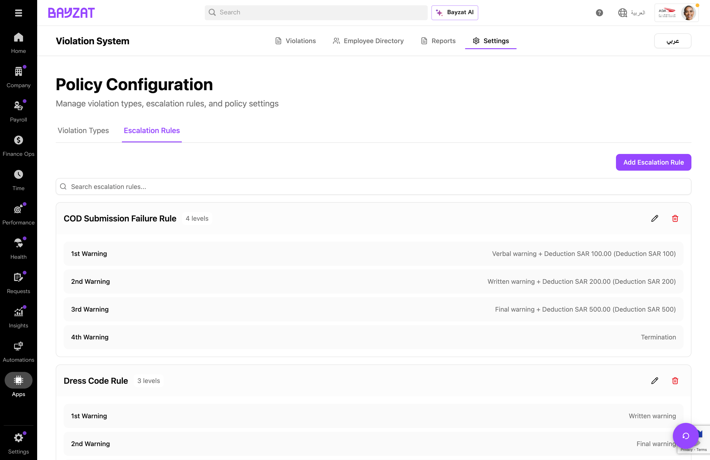

# Employee Violation Beta

Track employee violations, manage disciplinary actions, and enforce progressive discipline policies

📖 Quick Navigation

<a href="#feature-overview" class="nav-card">✨Feature Overview</a> <a href="#product-foundation" class="nav-card">🏗️Product Foundation</a> <a href="#user-journey" class="nav-card">🗺️User Journey</a> <a href="#feature-entry-points" class="nav-card">🚪Entry Points</a> <a href="#core-tasks" class="nav-card">📋Managing Violations</a> <a href="#violation-types" class="nav-card">📑Violation Types</a> <a href="#escalation-rules" class="nav-card">⚡Escalation Rules</a> <a href="#business-rules-limitations" class="nav-card">📜Business Rules</a> <a href="#troubleshooting-edge-cases" class="nav-card">🔧Troubleshooting</a> <a href="#support-resources" class="nav-card">💬Support Resources</a> <a href="#glossary" class="nav-card">📚Glossary</a>

<figure>

<figcaption>Employee Violation Dashboard - Track and manage employee violations with status filtering and ticket integration</figcaption>
</figure>

## What is Employee Violation?

### Overview

Employee Violation is a comprehensive disciplinary management system within the Bayzat HR platform that enables HR managers and supervisors to track, document, and manage employee violations. The feature is currently in Beta and supports progressive discipline with configurable escalation rules, validity periods, and integration with the Employee Tickets system for approval workflows.

### Key Benefits

- Centralized tracking of all employee violations with complete audit trails
- Progressive discipline enforcement with automated escalation rules
- 26 pre-configured violation types with customizable validity periods
- Integration with Employee Tickets for approval workflows
- Comprehensive analytics and reporting on violation trends

### Who Uses This Feature?

| User Role | What They Do | Value Proposition |
|----|----|----|
| **HR Administrators** | Configure violation types, escalation rules, and manage overall compliance | Standardize disciplinary processes with consistent violation categories and escalation paths—ensuring fair treatment while maintaining complete audit trails |
| **Line Managers** | Log violations for their team members and track disciplinary history | Document performance issues with proper context and history—rather than relying on memory or scattered notes when addressing recurring problems |
| **Supervisors** | Review and approve violation records through the ticketing system | Review violations with full context and previous history before taking action—ensuring proportionate responses and reducing wrongful escalations |
| **Compliance Officers** | Monitor violation trends and ensure policy enforcement | Identify patterns across departments and time periods with comprehensive analytics—enabling proactive intervention before issues escalate |

## Product Foundation Overview

### How Employee Violation Fits

Employee Violation is a **disciplinary management system** that tracks, documents, and escalates workplace infractions. It supports progressive discipline with 26 pre-configured violation types and integrates with Employee Tickets for approval workflows.

**Mental model:** Manager logs violation → System creates ticket → Approver reviews → Violation recorded → System checks escalation rules → Progressive discipline applied based on frequency and validity periods.

Properly configured violation tracking ensures fair, consistent discipline with complete audit trails for compliance.

### Key Decisions Before Setup

Answer these questions before configuring violations:

- **Which violation types apply to your organization?** — Review 26 pre-configured types and enable relevant ones
- **What validity periods suit your policies?** — Configure 30, 180, 365 days, or permanent tracking
- **How should escalation work?** — Define progressive discipline rules (verbal → written → suspension → termination)
- **Who can log and approve violations?** — Assign appropriate permissions to managers and HR

### Related Features

- **Employee Tickets** — Violations create tickets for approval workflow and audit trails
- **Employee Directory** — View individual violation histories and patterns
- **Reports** — Analytics showing violation trends and employees requiring attention
- **Settings** — Configure violation types and escalation rules

### Prerequisites & Requirements

| Requirement | Description | Status |
|----|----|----|
| Bayzat HR Platform | Active account with appropriate subscription plan | Required |
| User Roles | HR Admin or Manager role with violation management permissions | Required |
| Employee Records | Active employee profiles in the system | Required |
| Escalation Rules | Pre-configured in Settings for progressive discipline | Recommended |

## Complete User Journey Guide

### End-to-End Journey: Employee Violation

The Employee Violation journey involves managers logging violations, the system creating tickets for approval, and progressive discipline being applied based on configured escalation rules.

1

#### Log Violation

Apps → Employee Violation → Log Violation

<a href="#core-tasks" class="phase-link">See how to log →</a>

2

#### Ticket Created

System creates Employee Ticket automatically

<a href="#core-tasks" class="phase-link">See ticket integration →</a>

3

#### Pending Review

Violations → Pending tab

<a href="#feature-entry-points" class="phase-link">See status tabs →</a>

4

#### Approval Decision

Approver reviews and approves/rejects

<a href="#core-tasks" class="phase-link">See approval workflow →</a>

5

#### Escalation Check

System checks progressive discipline rules

<a href="#escalation-rules" class="phase-link">See escalation rules →</a>

6

#### Action Applied

Disciplinary action recorded on employee file

<a href="#feature-entry-points" class="phase-link">See employee directory →</a>

## Feature Discovery

### How to Access

Employee Violation is accessed through the Apps menu in the main navigation. The feature is marked as Beta indicating ongoing enhancements.

### Navigation Paths

1

#### Access Employee Violation

Apps → Employee Violation → View Violations, Employee Directory, Reports, or Settings

<figure>

<figcaption>Main violations page with status tabs (All, Pending, Approved, Rejected) and Log Violation button</figcaption>
</figure>

2

#### View Employee Directory

Click Employee Directory tab to browse employees and view their violation histories

<figure>

<figcaption>Employee profile displaying violation history with dates, types, and statuses</figcaption>
</figure>

3

#### Access Reports

Click Reports tab to view analytics dashboard with violation statistics and trends

<figure>

<figcaption>Analytics dashboard showing total violations, employee metrics, and trend charts</figcaption>
</figure>

## Managing Violations

### Logging a New Violation

Click the "Log Violation" button to record a new violation against an employee.

1

#### Open Log Violation Dialog

Click the purple "Log Violation" button in the top-right corner of the Violations page

<figure>

<figcaption>Log Violation dialog with fields for Employee, Violation Type, Date, and Notes</figcaption>
</figure>

2

#### Select Employee

Choose the employee from the dropdown list of active employees

3

#### Choose Violation Type

Select from 26 pre-configured violation types based on the infraction

<figure>

<figcaption>Violation Types dropdown with comprehensive list of infraction categories</figcaption>
</figure>

4

#### Set Date and Submit

Enter the violation date, add any notes, and click "Log Violation" to submit

### Viewing Violation Details

Click on any violation row to view the associated Employee Ticket with full details and activity history.

<figure>

<figcaption>Violation ticket showing complete details, status, and approval information</figcaption>
</figure>

**Ticket Integration:** Every violation automatically creates an Employee Ticket. Click the Ticket ID to view full details, add comments, and track the approval workflow.

## Violation Types

### Understanding Validity Periods

Each violation type has a validity period that determines how long it counts toward escalation calculations:

#### 30 Days

Minor infractions like lateness or dress code violations that reset quickly.

#### 180 Days

Moderate violations like unauthorized absence or poor performance.

#### 365 Days

Serious violations like negligence, insubordination, or safety breaches.

#### No Validity

Permanent records for severe violations like harassment, theft, or fraud.

<figure>

<figcaption>Settings page showing all 26 violation types with their configured validity periods</figcaption>
</figure>

### Available Violation Types

| Violation Type | Validity | Description |
|----|----|----|
| Lateness | 30 Days | Arriving after scheduled work time |
| Leaving Work Early | 30 Days | Departing before end of shift without approval |
| Dress Code Violation | 30 Days | Non-compliance with dress standards |
| Unauthorized Absence | 180 Days | Missing work without proper notification |
| Poor Performance | 180 Days | Failure to meet job standards |
| Misuse of Company Property | 180 Days | Improper use of company resources |
| Negligence/Carelessness | 365 Days | Failure to exercise proper care in duties |
| Insubordination | 365 Days | Refusal to follow legitimate instructions |
| Safety Violation | 365 Days | Breach of workplace safety protocols |
| Harassment | No Validity | Unwanted behavior toward colleagues |
| Theft/Fraud | No Validity | Stealing or deceptive practices |
| Confidentiality Breach | No Validity | Unauthorized disclosure of sensitive information |

**Validity Impact:** When a violation's validity period expires, it no longer counts toward escalation thresholds. For example, a lateness violation (30-day validity) logged on January 1st would not trigger escalation after January 31st.

## Escalation Rules

### Progressive Discipline

Escalation rules define automatic disciplinary actions based on accumulated violations within validity periods. A typical progression follows:

1st - Verbal Warning → 2nd - Written Warning → 3rd - Final Warning → 4th - Termination

<figure>

<figcaption>Escalation Rules configuration showing progressive discipline levels for violation types</figcaption>
</figure>

### Configuring Escalation Rules

1

#### Navigate to Settings

Go to Settings tab and select Escalation Rules section

2

#### Add Escalation Rule

Click "Add Escalation Rule" to configure a new progressive discipline rule

<figure>

<figcaption>Add Escalation Rule dialog with violation type, occurrence count, and action configuration</figcaption>
</figure>

### Deduction Types

When configuring escalation rules, you can specify financial penalties:

<figure>

<figcaption>Deduction Type options: No Deduction, Percentage of Monthly Salary, Custom Amount</figcaption>
</figure>

| Deduction Type | Description | Use Case |
|----|----|----|
| No Deduction | No financial penalty applied | Verbal and written warnings |
| Percentage of Monthly Salary | Deduct a percentage from pay | Moderate penalties (5%, 10%) |
| Custom Amount | Fixed monetary deduction | Specific fines per company policy |

**Legal Compliance:** Ensure all escalation rules and deductions comply with UAE labor law and employment contracts. Consult with your legal team before implementing financial penalties.

## Business Rules & Limitations

### Core Business Rules

| Rule | Description | Impact |
|----|----|----|
| Ticket Integration | Every violation creates an Employee Ticket | Approval workflow required for all violations |
| Validity-Based Escalation | Only active violations count toward escalation | Expired violations don't trigger progressive discipline |
| Immutable Records | Violations cannot be deleted once logged | Only rejection through approval workflow |
| Status Workflow | Violations progress through Pending → Approved/Rejected | Complete audit trail maintained |

### System Constraints

- Custom violation types cannot be added (26 pre-configured types only)
- Violations cannot be deleted, only rejected through workflow
- Bulk operations on violations are not yet available
- Export functionality may have limited format options
- Mobile app access may have reduced functionality

**Beta Limitations:** As a Beta feature, some functionality is still being developed. Report any issues through Bayzat support for prioritization.

## Troubleshooting & Edge Cases

### Common Issues

| Issue | Cause | Resolution |
|----|----|----|
| Cannot log violation | Missing required fields or permissions | Ensure all fields are filled and you have appropriate role |
| Employee not in dropdown | Employee not active in system | Verify employee status in HR system |
| Violation not appearing | Filter settings or loading delay | Check filter is set to "All" and refresh page |
| Escalation not triggering | Previous violations expired | Check if violations are within validity period |
| Ticket link not working | Pop-up blocked or session expired | Allow pop-ups for Bayzat and re-authenticate |

### Best Practices

#### Document Thoroughly

Always include detailed notes when logging violations for future reference and legal compliance.

#### Act Promptly

Log violations as soon as they occur to maintain accurate records and timestamps.

#### Configure First

Set up escalation rules before actively logging violations to ensure consistent discipline.

#### Review Regularly

Check pending violations daily to avoid approval backlogs and ensure timely processing.

## Support Resources

### Frequently Asked Questions

How do I log a violation for an employee?

Navigate to Apps → Employee Violation → Click "Log Violation" → Select the employee, violation type, date, and add notes → Click "Log Violation" to submit.

Why isn't escalation being applied?

Escalation only applies to violations within their validity period. Check if previous violations have expired based on their configured validity (30, 180, or 365 days).

Can I delete a violation?

No, violations cannot be deleted once logged. If a violation was logged in error, it must be rejected through the approval workflow.

How do I view an employee's violation history?

Go to the Employee Directory tab, find the employee, and click "View Profile" to see their complete violation history.

### Getting Help

- Contact your HR Administrator for policy questions and escalation rule configuration
- Submit support tickets through the platform for technical issues
- Bayzat Support Team - Available for platform-wide technical issues

## Glossary of Terms

| Term | Definition |
|----|----|
| **Violation** | A documented instance of employee misconduct or policy breach recorded in the system. |
| **Violation Type** | Category classification of the misconduct (e.g., Lateness, Insubordination, Harassment). |
| **Validity Period** | Duration for which a violation remains active for escalation calculations (30, 180, 365 days, or permanent). |
| **Escalation Rule** | Configuration that triggers automatic disciplinary actions based on violation count within validity period. |
| **Progressive Discipline** | System of increasingly severe penalties (verbal → written → final warning → termination). |
| **Verbal Warning** | Initial documented warning given verbally to an employee for first offense. |
| **Written Warning** | Formal written notice documenting misconduct and expectations for improvement. |
| **Final Warning** | Last warning before termination, indicating serious consequences for further violations. |
| **Deduction** | Financial penalty applied to employee salary as part of disciplinary action. |
| **Employee Ticket** | Associated record in the ticketing system created for each violation for approval workflow. |

Generated by Bayzat Documentation System

Last updated: 2026-01-13
