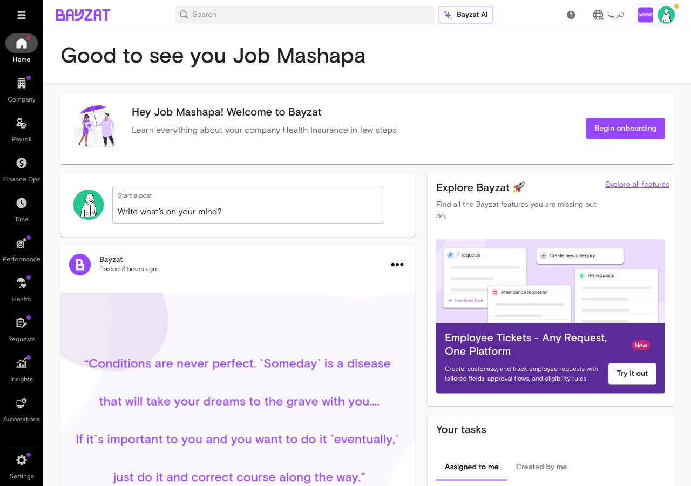
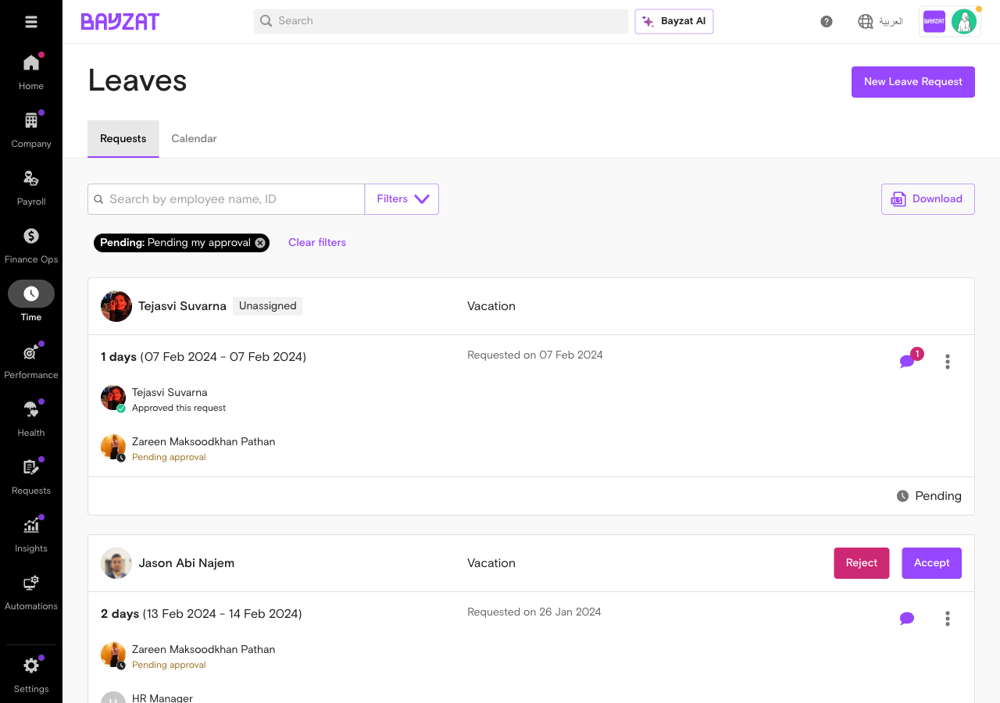
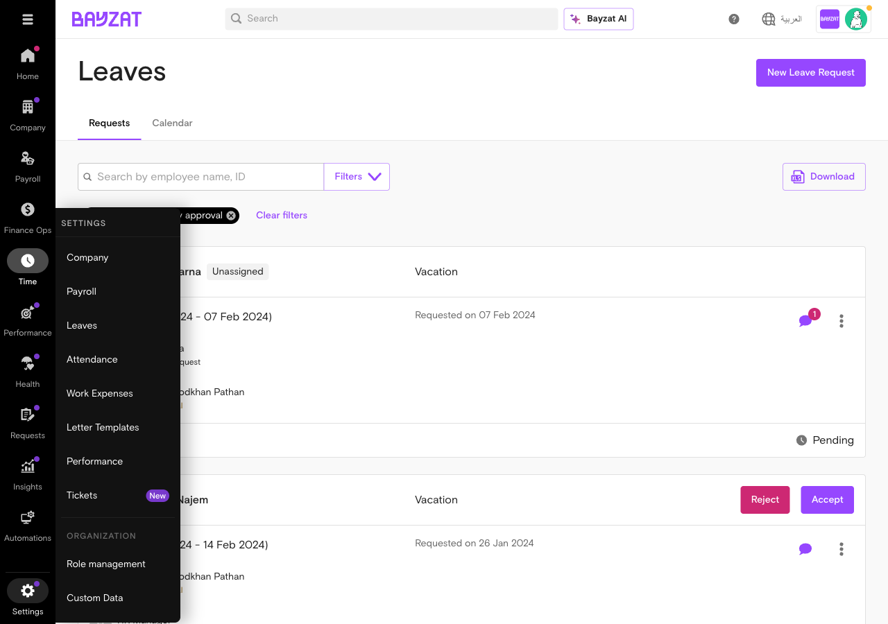

# Validation Report: leave_management

**Generated**: 2026-01-23T07:38:00Z
**Run ID**: 21278196391

## Result

```json
{
  "error": "Could not extract valid JSON from output",
  "raw_length": 1302,
  "json_blocks_found": 0,
  "hint": "The Claude output may not have included a properly formatted JSON result",
  "payload_context": {
    "what_to_watch_out_for": [
      {
        "issue": "Limitations in leave approval workflows and role configurations.",
        "limitation": "The system only supports predefined roles for leave approval and enforces a strict sequential approval flow without flexible routing or custom role support.",
        "workaround": "Use predefined system roles and linear approval sequences; custom role workflows are not supported.",
        "jira_reference": "TSSD-1432,TSSD-3805,TSSD-1406",
        "severity": "high"
      },
      {
        "issue": "Lack of comprehensive audit logs and leave request history visibility.",
        "limitation": "The platform lacks clear, user-friendly audit trails for leave request changes, deletions, and status modifications.",
        "workaround": "Manual backend log searches and database queries are required to verify leave request histories.",
        "jira_reference": "TSSD-4901,TSSD-2247,TSSD-4800,TSSD-4315",
        "severity": "medium"
      },
      {
        "issue": "Inability to process leave requests spanning multiple leave cycles.",
        "limitation": "Leave requests overlapping two leave cycles cause incorrect leave balance calculations and require manual intervention.",
        "workaround": "Split leave requests manually or avoid cross-cycle leave requests.",
        "jira_reference": "AV-755",
        "severity": "medium"
      },
      {
        "issue": "Automatic email notifications lack configurability.",
        "limitation": "Administrators cannot disable or configure automatic leave expiry and other notification emails.",
        "workaround": "No current workaround; notifications are sent automatically.",
        "jira_reference": "TSSD-1699,TSSD-3054",
        "severity": "high"
      },
      {
        "issue": "Attendance logging for half-day leave is not supported.",
        "limitation": "Employees cannot record attendance during half-day leaves, and HR cannot manage these entries.",
        "workaround": "Manual attendance adjustments outside the system may be required.",
        "jira_reference": "TSSD-4174",
        "severity": "high"
      },
      {
        "issue": "Restricted leave request modifications for historical leave cycles.",
        "limitation": "Users can only modify leave requests for current, last, and upcoming leave cycles.",
        "workaround": "Plan leave modifications within allowed cycles; historical changes require backend support.",
        "jira_reference": "AV-318",
        "severity": "low"
      }
    ],
    "what_to_do": [
      {
        "task": "Configure and manage leave encashment and leave policies for end-of-service and payroll processing.",
        "steps": [
          "Access Payroll Settings and navigate to End of Service eligibility.",
          "Select salary components for leave encashment (Basic Only or Basic + Allowances).",
          "Choose calculation method (calendar days, working days, or custom days).",
          "Configure individual leave types for end-of-service calculations.",
          "Upload trade license for payroll processing if required.",
          "Submit leave requests and manage leave balances within allowed cycles."
        ],
        "expected_outcome": "Leave encashment and payroll processing are configured correctly, leave requests are submitted and managed within system constraints, and payroll is processed with accurate leave balances.",
        "source_articles": [
          "14243768433425",
          "14244169734033"
        ]
      }
    ],
    "feature_info": {
      "feature_name": "leave_management",
      "feature_slug": "leave-management",
      "next_version": "v1"
    },
    "detected_integrations": {
      "has_workflows": true,
      "workflow_evidence": "Tickets TSSD-702, TSSD-3805, and TSSD-755 reveal leave management workflow constraints and approval flow design, including lack of flexible routing and handling of pending requests when reporting structures change.",
      "has_approval_flow": true,
      "approval_evidence": "Multiple tickets (TSSD-1432, TSSD-1406, TSSD-3805) discuss leave approval flow issues including custom role limitations, feature activation requirements, and rigid sequential approval workflows."
    },
    "limitations_count": 6,
    "tasks_count": 1
  },
  "what_to_watch_out_for": [
    {
      "issue": "Limitations in leave approval workflows and role configurations.",
      "limitation": "The system only supports predefined roles for leave approval and enforces a strict sequential approval flow without flexible routing or custom role support.",
      "workaround": "Use predefined system roles and linear approval sequences; custom role workflows are not supported.",
      "jira_reference": "TSSD-1432,TSSD-3805,TSSD-1406",
      "severity": "high"
    },
    {
      "issue": "Lack of comprehensive audit logs and leave request history visibility.",
      "limitation": "The platform lacks clear, user-friendly audit trails for leave request changes, deletions, and status modifications.",
      "workaround": "Manual backend log searches and database queries are required to verify leave request histories.",
      "jira_reference": "TSSD-4901,TSSD-2247,TSSD-4800,TSSD-4315",
      "severity": "medium"
    },
    {
      "issue": "Inability to process leave requests spanning multiple leave cycles.",
      "limitation": "Leave requests overlapping two leave cycles cause incorrect leave balance calculations and require manual intervention.",
      "workaround": "Split leave requests manually or avoid cross-cycle leave requests.",
      "jira_reference": "AV-755",
      "severity": "medium"
    },
    {
      "issue": "Automatic email notifications lack configurability.",
      "limitation": "Administrators cannot disable or configure automatic leave expiry and other notification emails.",
      "workaround": "No current workaround; notifications are sent automatically.",
      "jira_reference": "TSSD-1699,TSSD-3054",
      "severity": "high"
    },
    {
      "issue": "Attendance logging for half-day leave is not supported.",
      "limitation": "Employees cannot record attendance during half-day leaves, and HR cannot manage these entries.",
      "workaround": "Manual attendance adjustments outside the system may be required.",
      "jira_reference": "TSSD-4174",
      "severity": "high"
    },
    {
      "issue": "Restricted leave request modifications for historical leave cycles.",
      "limitation": "Users can only modify leave requests for current, last, and upcoming leave cycles.",
      "workaround": "Plan leave modifications within allowed cycles; historical changes require backend support.",
      "jira_reference": "AV-318",
      "severity": "low"
    }
  ],
  "what_to_do": [
    {
      "task": "Configure and manage leave encashment and leave policies for end-of-service and payroll processing.",
      "steps": [
        "Access Payroll Settings and navigate to End of Service eligibility.",
        "Select salary components for leave encashment (Basic Only or Basic + Allowances).",
        "Choose calculation method (calendar days, working days, or custom days).",
        "Configure individual leave types for end-of-service calculations.",
        "Upload trade license for payroll processing if required.",
        "Submit leave requests and manage leave balances within allowed cycles."
      ],
      "expected_outcome": "Leave encashment and payroll processing are configured correctly, leave requests are submitted and managed within system constraints, and payroll is processed with accurate leave balances.",
      "source_articles": [
        "14243768433425",
        "14244169734033"
      ]
    }
  ]
}```

## Screenshots

### 01 dashboard home 2026 01 23T07 31 16 768Z



### 02 employee leaves main 2026 01 23T07 33 01 875Z


### 03 leaves calendar view 2026 01 23T07 34 03 014Z



### 04 leave request detail 2026 01 23T07 34 19 557Z


### 05 settings main 2026 01 23T07 34 41 493Z



### 06 leaves settings 2026 01 23T07 35 00 344Z


### 07 leaves settings page 2026 01 23T07 35 24 161Z


### 08 payroll settings 2026 01 23T07 35 42 971Z


**Total screenshots captured**: 8
