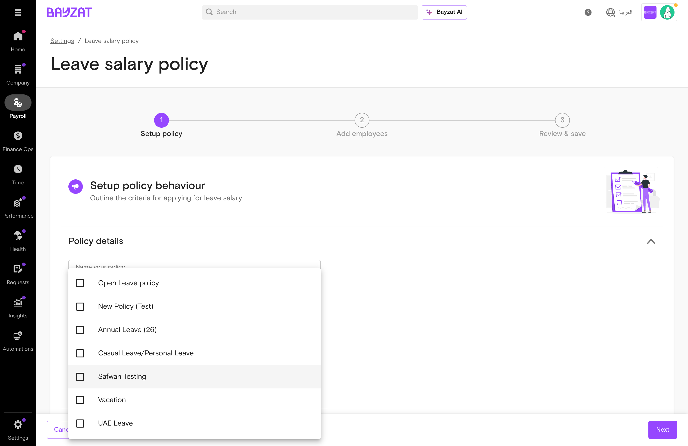

# Leave Salary

Automate paid leave compensation with flexible calculation policies

📖 Quick Navigation

<a href="#feature-overview" class="nav-card">✨ Feature Overview</a> <a href="#product-foundation" class="nav-card">🏗️ Product Foundation</a> <a href="#user-journey" class="nav-card">🗺️ User Journey</a> <a href="#feature-discovery" class="nav-card">🔍 Feature Discovery</a> <a href="#setup-process" class="nav-card">⚙️ Setup Process</a> <a href="#feature-usage" class="nav-card">📋 Feature Usage</a> <a href="#troubleshooting" class="nav-card">🔧 Troubleshooting</a> <a href="#support-resources" class="nav-card">💬 Support Resources</a>

## What is Leave Salary?

### Overview

Leave Salary enables organizations to compensate employees for approved paid leave periods by calculating salary amounts based on configurable policies. The feature automates the entire lifecycle from policy configuration through payroll processing.

<figure class="screenshot-container">

<figcaption>Leave Salary landing page - Managing leave salary requests</figcaption>
</figure>

### Who Uses This Feature?

The primary users of Leave Salary include:

| User Role | What They Do | Value Proposition |
|----|----|----|
| **Super Admins** | Configure leave salary policies and system-wide settings | Define organization-wide leave salary rules once and have them applied consistently—ensuring policy compliance without manual enforcement |
| **Payroll Managers** | Process leave salary transactions and manage payroll integration | Process leave salary payments with pre-calculated, policy-compliant amounts—eliminating manual calculations and reducing payroll errors |
| **Leave Managers** | Review and approve leave salary requests | Approve requests with full visibility into employee eligibility and calculated amounts—rather than manually verifying balances and entitlements |
| **HR Administrators** | Monitor leave salary accruals and generate reports | Track leave salary liabilities and accruals in real-time—providing accurate data for budgeting and compliance reporting without spreadsheet reconciliation |

### Key Benefits

- Automatically calculate and process leave salary based on customizable policies
- Support multiple salary components including basic salary and allowances
- Streamline approval workflows with multi-stage request management
- Generate comprehensive reports for payroll reconciliation and compliance
- Reduce manual calculation errors through automated daily rate determination

## Product Foundation Overview

### How Leave Salary Fits

Leave Salary is a **transaction processor** that calculates and pays employees for approved paid leave. When employees take leave with leave salary enabled, the system generates a request that flows through approval to payroll.

**Mental model:** Leave Policy (rules) → Approved Leave → Leave Salary Request → Approval → Payroll

Leave salary uses daily wage settings for calculations. Policy changes affect future requests but not pending ones.

### Key Decisions Before Setup

Answer these questions before configuring leave salary:

- **Which leave types?** — Enable leave salary for which leave categories?
- **Calculation formula?** — Based on basic salary or basic + allowances?
- **Approval workflow?** — Who approves leave salary requests?
- **Advance payment?** — Pay before or after leave period?

### Related Features

- **Leave Management** — Triggers leave salary when approved leave is taken
- **Payroll Processing** — Receives approved amounts for payment
- **Daily Wage Calculator** — Determines daily rate for calculations
- **Employee Profiles** — Stores leave salary history and records

### Prerequisites & Requirements

| Requirement | Description | Status |
|----|----|----|
| User Role | Super Admin, Payroll Manager, or Leave Manager access | Required |
| Payroll Module | Active Bayzat Payroll subscription | Required |
| Leave Policies | Leave types with leave salary enabled | Required |
| Employee Data | Complete profiles with salary information | Required |
| Daily Wage Settings | Daily wage calculation configured | Required |

## Complete User Journey Guide

### End-to-End Journey: Leave Salary

From policy configuration through payroll processing.

1

#### Configure Policy

Settings → Payroll → Leave Salary Policy

<a href="#setup-process" class="phase-link">See configuration →</a>

2

#### Employee Takes Leave

Auto-generated leave salary request

<a href="#feature-usage" class="phase-link">See trigger →</a>

3

#### Review Requests

Payroll → Leave Salary → Pending

<a href="#feature-usage" class="phase-link">See review →</a>

4

#### Approve/Reject

Individual or bulk approval

<a href="#feature-usage" class="phase-link">See approval →</a>

5

#### Add to Payroll

Move to payroll table

<a href="#feature-usage" class="phase-link">See payroll →</a>

6

#### Process Payment

Complete pay cycle

<a href="#feature-usage" class="phase-link">See processing →</a>

### Success Indicators

- Leave salary policy is configured and active with employees assigned
- Requests flow through Pending \> Approved \> At Payroll \> Processed stages
- Calculated amounts match expected values based on policy formula
- Leave salary appears in employee payroll table and pay slip
- Reports accurately reflect all leave salary transactions

## Feature Discovery

### How to Access

Access Leave Salary from the main navigation: **Payroll \> Leave Salary**. This is the primary interface for managing all leave salary requests and transactions.

### Navigation Paths

| Destination | Path | URL |
|----|----|----|
| Leave Salary Management | Payroll \> Leave Salary | `/enterprise/payroll/leave-salary` |
| Policy Settings | Settings \> Payroll \> Leave salary policy | `/enterprise/dashboard/settings/payroll` |
| Create New Policy | Settings \> Payroll \> Leave salary policy \> Add new | `/enterprise/payroll/leave-salary-policy/new` |

<figure class="screenshot-container">

<figcaption>Leave Salary main interface with tabs for different request states</figcaption>
</figure>

### Interface Overview

The Leave Salary landing page contains the following key components:

#### Summary Cards

Display count of pending leave salary requests and total amount requested. Provides quick overview of processing queue.

#### Tab Navigation

Switch between request states: Pending, Approved, Rejected, At Payroll, and Processed. Each tab shows badge count.

#### Search and Filters

Search by employee name or ID. Filter by currency, amount range, and request date.

#### Actions

Create leave salary request button and download options for accrual and leave salary reports.

## Setup Process

### Initial Configuration

Leave Salary requires a 3-step policy configuration wizard to establish calculation rules and employee assignments.

**Note:** Employees must be assigned to a leave salary policy BEFORE creating leave requests to be eligible for automatic leave salary generation.

### Step-by-Step Setup

1

#### Navigate to Policy Settings

Go to Settings \> Payroll \> Leave salary policy and click the "Add new" button to open the policy creation wizard.

<figure class="screenshot-container">

<figcaption>Leave salary policy settings showing existing policies</figcaption>
</figure>

2

#### Configure Policy Details (Step 1)

Enter policy name and description. Select eligible leave types from the dropdown (required field).

<figure class="screenshot-container">

<figcaption>Policy creation wizard - Step 1: Setup Policy</figcaption>
</figure>

<figure class="screenshot-container">

<figcaption>Selecting eligible leave types for the policy</figcaption>
</figure>

3

#### Configure Leave Salary Formula

The formula is: `(Salary component / Working days) * number of leaves`

- **Salary Component:** Basic salary OR Basic salary + allowances
- **Working Days:** Calendar days, Working days, or Custom days
- **Allowances:** Select specific allowances when using Basic + allowances option

<figure class="screenshot-container">

<figcaption>Selecting salary component for calculation</figcaption>
</figure>

<figure class="screenshot-container">

<figcaption>Working days calculation method options</figcaption>
</figure>

<figure class="screenshot-container">

<figcaption>Selecting allowances when using Basic salary + allowances option</figcaption>
</figure>

**Warning:** When selecting "Custom days" for working days, the system displays: "Total net pay for the leave month may differ when using this setting"

<figure class="screenshot-container">

<figcaption>Custom days field with warning message</figcaption>
</figure>

4

#### Configure Optional Settings

Enable minimum leave days requirement if needed. Toggle probation restriction to prevent leave salary during probation period.

<figure class="screenshot-container">

<figcaption>Configuring minimum leave days requirement</figcaption>
</figure>

5

#### Add Employees (Step 2)

Select employees to assign to this policy. Employees can only be assigned to one leave salary policy at a time.

6

#### Review and Save (Step 3)

Review all settings and employee assignments. Click Save to activate the policy.

### Verification Steps

1.  Confirm policy appears in the policy list with Active status
2.  Verify assigned employees count matches expectations
3.  Test by creating a leave request for an assigned employee
4.  Check that leave salary request is automatically generated

## Feature Usage

### Common Workflows

Leave Salary supports several key workflows for managing employee leave compensation:

#### Create Leave Salary Request

Requests are automatically generated when eligible employees submit approved leave. Admins can also manually create requests using the "Create leave salary request" button.

<figure class="screenshot-container">

<figcaption>Creating a leave salary request - Employee search dialog</figcaption>
</figure>

#### Eligibility Validation

The system validates that employees have approved paid leave eligible for leave salary. If not eligible, an error message is displayed.

<figure class="screenshot-container">

<figcaption>Error when employee has no eligible leave for leave salary</figcaption>
</figure>

#### Approve and Process Requests

Review pending requests, approve individually or in bulk, optionally override amounts with remarks, then add to payroll table.

<figure class="screenshot-container">

<figcaption>Approved requests ready to be added to payroll</figcaption>
</figure>

### Using Search and Filters

The Leave Salary interface provides powerful search and filter capabilities:

<figure class="screenshot-container">

<figcaption>Filter panel with Currency, Amount, and Date filters</figcaption>
</figure>

<figure class="screenshot-container">

<figcaption>Currency filter dropdown</figcaption>
</figure>

### Download Reports

Generate leave salary reports using the download dropdown:

<figure class="screenshot-container">

<figcaption>Download options - Accrual report and Leave salary report</figcaption>
</figure>

### Best Practices

- **Policy Assignment Timing:** Always assign employees to leave salary policy before they create leave requests
- **Consistent Calculation Method:** Use custom days (30) for consistent calculations across all months
- **Document Overrides:** Always add remarks when manually overriding calculated amounts
- **Regular Processing:** Process leave salary requests regularly to prevent backlog
- **Verify Calculations:** Spot-check calculations against expected values periodically

## Business Rules & Limitations

### Core Business Rules

| Rule | Description | Impact |
|----|----|----|
| Policy Eligibility Timing | Eligibility determined at leave request creation based on policy assignment | Employee must be assigned to policy BEFORE creating leave request |
| Single Policy Assignment | Employees can be in only one leave salary policy at a time | Multiple policy assignments not supported |
| Probation Restrictions | Policy can restrict leave salary during probation | Probationary employees excluded from leave salary |
| Payroll Cycle Constraints | Requests cannot have start date before active payroll cycle | Prevents processing of closed period requests |
| Amount Override Lock | Once approved with override, amount cannot be changed | Must move back to pending to modify |

### System Constraints

- Cross-cycle leave requests require manual splitting into separate requests
- Retroactive policy assignments are not supported
- Currency label on landing page displays hardcoded AED
- Leave salary accrual report has limited customization options

**Important:** Changes to policy settings apply only to future leave requests. Existing requests maintain their original calculation parameters.

## Troubleshooting & Edge Cases

### Common Issues

| Issue | Cause | Resolution |
|----|----|----|
| Leave salary request not generated | Employee not assigned to policy before leave request creation | Assign employee to policy, delete leave request, recreate |
| No eligible leave error | No approved paid leave or leave type not in policy | Verify leave is approved and leave type is included in policy |
| Incorrect calculation amount | Wrong salary component or working days setting | Review policy configuration and verify formula settings |
| Cannot approve request | Insufficient permissions or payroll cycle closed | Verify role permissions and payroll cycle status |
| Request not in payroll table | Request not moved from Approved to At Payroll | Click "Add to Payroll Table" for approved requests |

### Edge Cases

**Cross-Cycle Leave:** When leave spans multiple payroll cycles, the system generates separate requests for each cycle. Each request must be approved and processed independently.

### Resolution Steps

1

#### Identify the Issue

Check request status in Leave Salary tabs. Verify employee is in policy and has eligible leave.

2

#### Review Configuration

Navigate to Settings \> Payroll \> Leave salary policy. Verify policy settings and employee assignments.

3

#### Check Policy Assignment Date

Compare leave request creation date with policy assignment date. Employee must be assigned BEFORE creating leave.

4

#### Verify Payroll Cycle

Ensure the target payroll cycle is open. Leave salary cannot be processed in closed cycles.

5

#### Contact Support if Needed

If issues persist after checking configuration, contact Bayzat support with employee ID, dates, and error details.

## Support Resources

### Frequently Asked Questions

What is leave salary and when does it apply?

Leave salary is monetary compensation paid to employees for approved paid leave periods. It applies when an employee takes leave types that have leave salary enabled in the policy configuration, such as annual vacation leave.

How is the leave salary amount calculated?

Leave salary is calculated by multiplying the number of approved leave days by the daily wage rate. The daily wage is determined by the Leave Salary Policy settings, which specify the salary component and days calculation method.

Can I pay leave salary in advance?

Yes. The Leave Salary Policy can be configured to process payments either before the leave period starts (advance payment) or after the leave is completed. Check your policy settings to verify the payment timing.

Why isn't leave salary generating for an employee?

Verify: (1) The leave type has leave salary enabled, (2) The employee is assigned to a Leave Salary Policy, (3) The leave request is approved, (4) The employee meets any eligibility criteria defined in the policy.

How do I approve leave salary requests?

Navigate to the Leave Salary section and check the Pending tab. Review the request details including leave dates and calculated amount, then use the Approve or Reject actions. Approved amounts are automatically added to the payroll table.

### Getting Help

If you encounter issues with Leave Salary, the following resources are available:

- Bayzat Help Center - Comprehensive guides and FAQs
- In-app Support - Contextual help within the platform
- Customer Support Team - For complex issues or configuration assistance

### Contact Information

- Email: support@bayzat.com
- In-app Chat: Available during business hours
- Help Center: help.bayzat.com

**Note:** When contacting support, include: feature name, steps to reproduce, screenshots, employee IDs, and relevant dates.

## Glossary of Terms

| Term | Definition |
|----|----|
| **Leave Salary** | Monetary compensation provided to employees for approved paid leave days, calculated based on configured salary components and working days. |
| **Leave Salary Policy** | Configuration defining eligible employees, leave types, and calculation formula for leave salary. |
| **Daily Wage** | Per-day salary rate calculated by dividing salary components by configured working days. |
| **Salary Component** | Elements of compensation (basic salary, allowances) included in leave salary calculations. |
| **Working Days** | Divisor used in daily wage calculation. Can be calendar days, actual working days, or custom fixed number. |
| **Payroll Cycle** | Recurring period for salary processing. Leave salary requests must align with open cycles. |
| **At Payroll** | Request status indicating amount has been added to payroll table for processing. |
| **Override Amount** | Manually entered amount that replaces system-calculated value, requiring documented remarks. |
| **Accrual Report** | Report showing cumulative leave salary amounts calculated over a specified period. |
| **Probation Period** | Initial employment period during which leave salary may be restricted based on policy settings. |

**Leave Salary** User Guide

Version v6 \| Last Updated: 2026-01-13

Generated by Bayzat Documentation System
