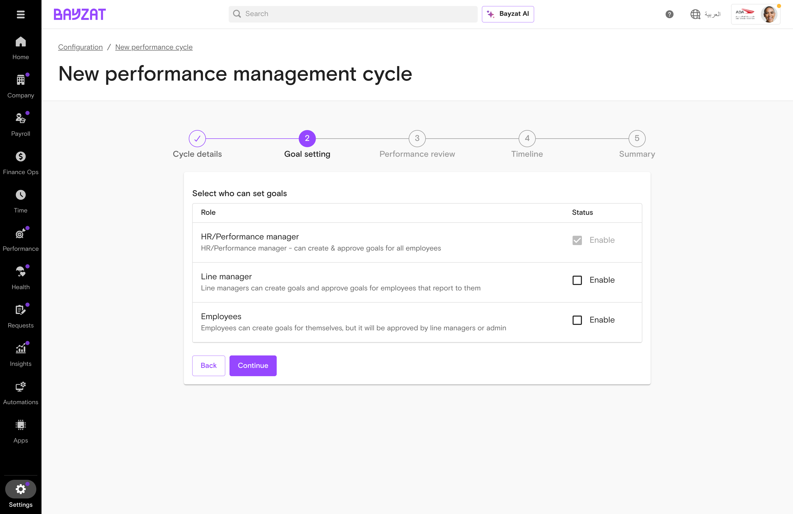
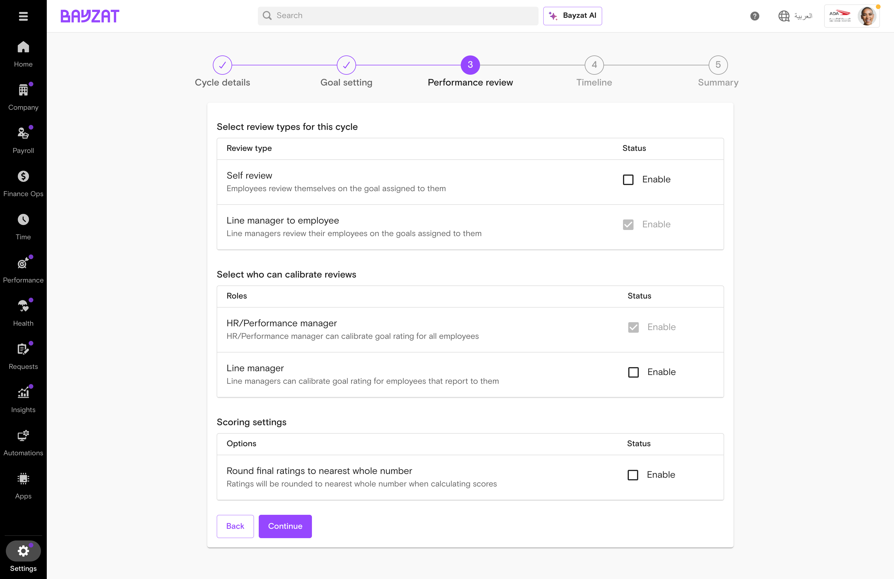
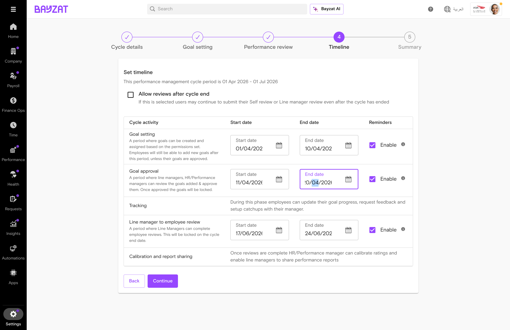
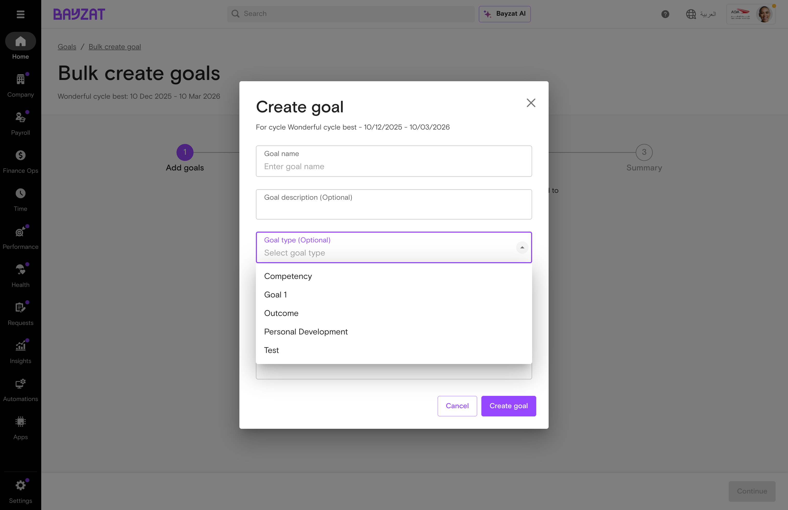
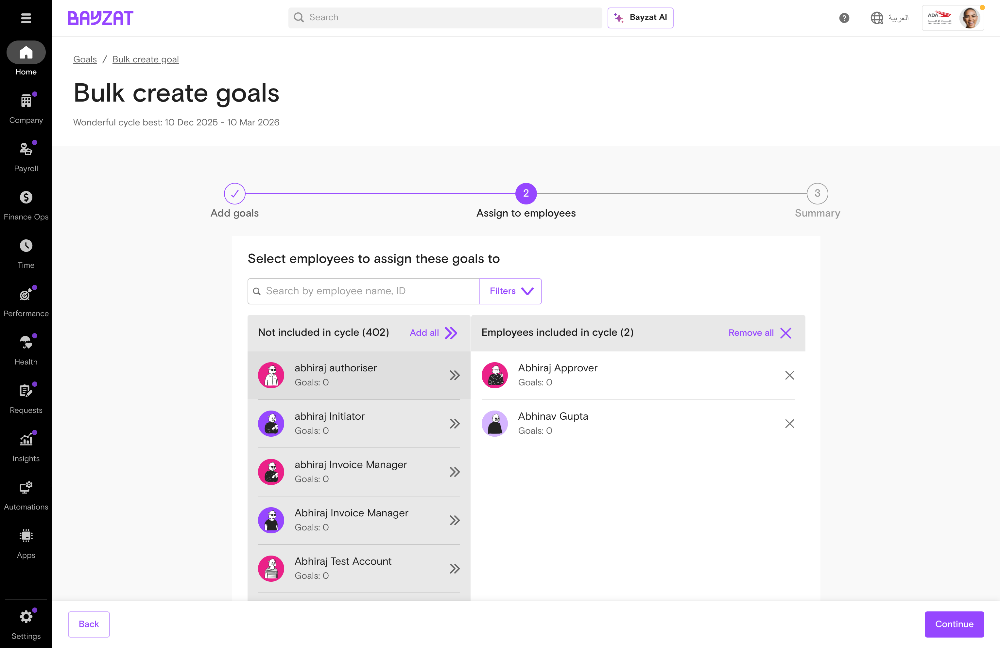
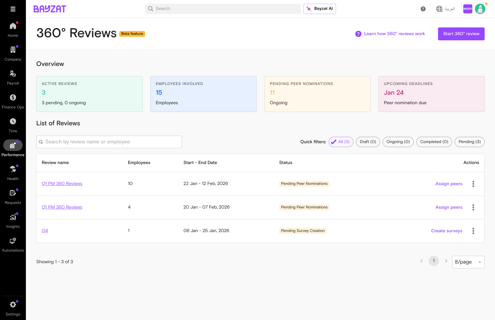
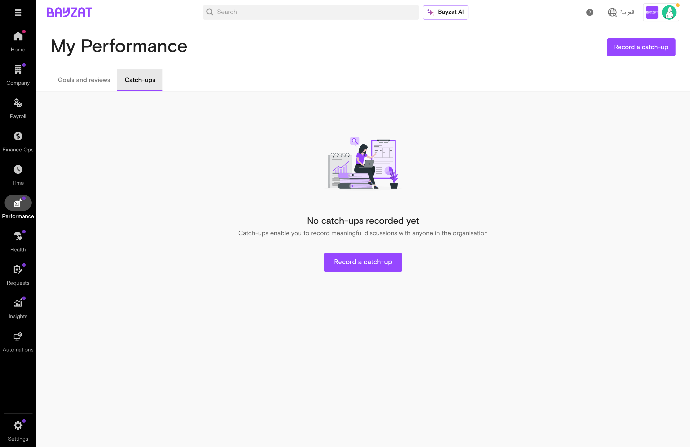
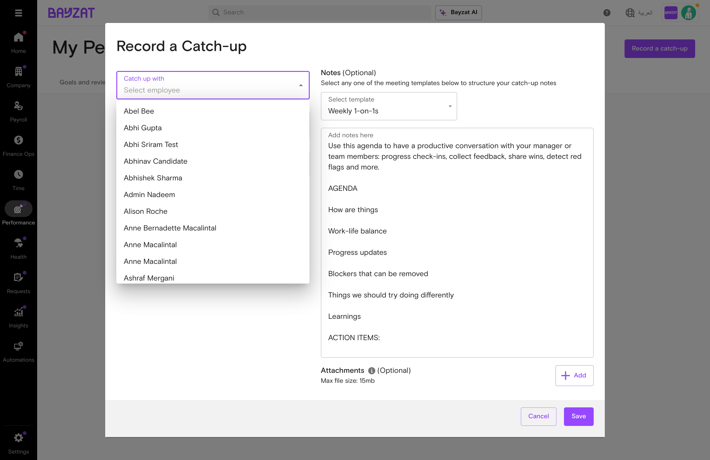
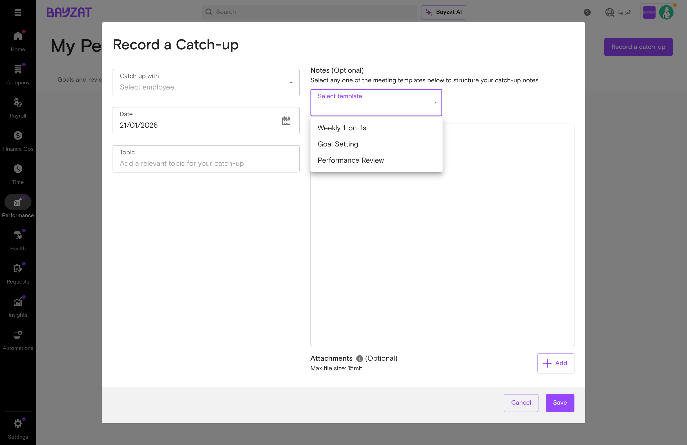
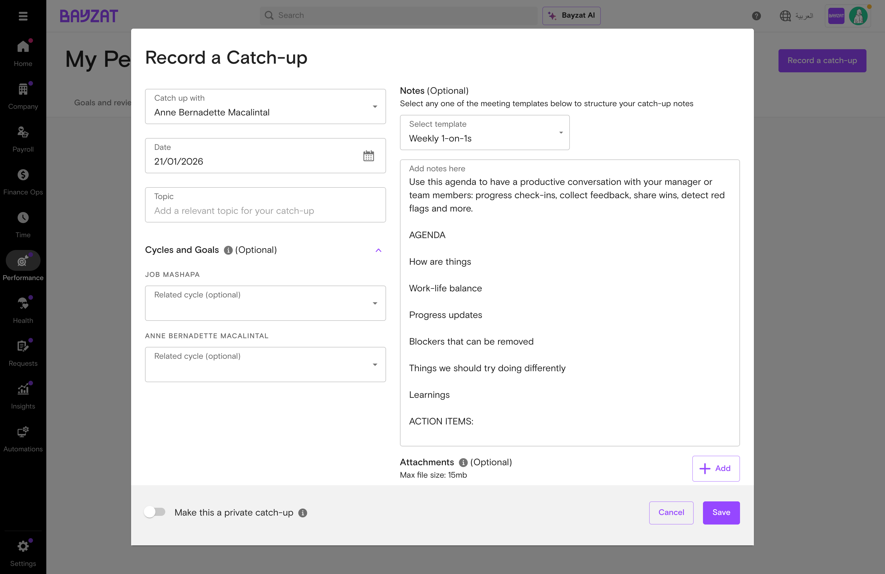

# Performance Management

Drive employee growth and align individual performance with organizational success

📖 Quick Navigation

<a href="#feature-overview" class="nav-card">✨Feature Overview</a> <a href="#product-foundation" class="nav-card">🏗️Product Foundation</a> <a href="#user-journey" class="nav-card">🗺️User Journey</a> <a href="#feature-discovery" class="nav-card">🔍Feature Discovery</a> <a href="#setup-process" class="nav-card">⚙️Setup Process</a> <a href="#feature-usage" class="nav-card">📋Feature Usage</a> <a href="#troubleshooting" class="nav-card">🔧Troubleshooting</a> <a href="#support-resources" class="nav-card">💬Support Resources</a>

<figure class="screenshot-container">

<figcaption>Performance Management cycles overview in Bayzat HR</figcaption>
</figure>

## What is Performance Management?

### Overview

Bayzat Performance Management offers **two distinct approaches** to evaluating and developing employees, each designed for different organizational needs:

#### 1. Goals-Based Performance

A structured, cycle-based system for setting, tracking, and reviewing employee goals. Performance Cycles define specific periods for goal setting, tracking, reviews, and calibration.

**Navigation:** Performance → Goals \| Reviews \| My Performance

**Best for:** Structured annual/quarterly reviews tied to measurable objectives

#### 2. 360° Reviews (Beta)

A standalone feedback system for gathering multi-directional input. Collect feedback from managers, peers, and direct reports independently of performance cycles.

**Navigation:** Performance → 360° Reviews \| My 360° Reviews

**Best for:** Comprehensive feedback on competencies and behaviors from multiple perspectives

### Key Differences

| Aspect | Goals-Based Performance | 360° Reviews |
|----|----|----|
| **Structure** | Tied to Performance Cycles with defined phases | Independent review cycles, can run anytime |
| **Primary Focus** | Goal achievement and tracking | Multi-directional feedback collection |
| **Workflow** | Goal Setting → Tracking → Review → Calibration | Create Review → Peer Nominations → Collect Feedback → Reports |
| **Feedback Sources** | Self-assessment + Manager review | Self + Manager + Peers + Direct Reports |
| **Statuses** | Draft → Pending Approval → Approved | Draft → Pending Peer Nominations → Ongoing → Completed |
| **Feature Status** | Full release | Beta |

### Key Benefits

- Create and manage comprehensive performance review cycles with structured phases
- Set and track employee goals with approval workflows and weight balancing
- Conduct 360° feedback reviews for holistic performance insights from multiple perspectives
- Configure custom rating scales and goal types to match your organization's methodology
- Record catch-ups to document one-on-one meetings and ongoing feedback

### Who Uses This Feature?

| User Role | What They Do | Value Proposition |
|----|----|----|
| **HR Administrators** | Configure performance cycles, rating scales, and goal types. Manage organization-wide performance settings and monitor cycle progress across the company. | Run structured performance cycles that complete on time with full participation—eliminating manual tracking and last-minute review scrambles |
| **Managers** | Conduct performance reviews, provide feedback on employee goals, and participate in calibration sessions. Write evaluations and track team member development. | Give meaningful feedback with full context on goals and achievements—rather than scrambling to recall a year's worth of performance at review time |
| **Employees** | Set personal goals, complete self-assessments, view performance feedback, and participate in 360° reviews as nominees or reviewers. | Own your career development with clear goals and regular feedback—understanding exactly where you stand and what growth looks like |

## Product Foundation Overview

### How Performance Management Fits

Performance Management provides **two complementary evaluation systems** that can be used independently or together based on your organization's needs.

**Goals-Based Mental Model:** HR creates cycle → Employees set goals → Manager approves goals → Goal tracking period → Self-assessment → Manager review → Calibration session → Cycle completes with documented outcomes.

**360° Reviews Mental Model:** HR starts review → Select employees → Peer nominations → Feedback collection from all directions (self, manager, peers, reports) → Generate comprehensive feedback reports.

Organizations often use Goals-Based Performance for structured quarterly or annual reviews tied to objectives, while 360° Reviews provide additional behavioral and competency feedback from multiple perspectives.

### Key Decisions Before Setup

Answer these questions before creating a performance cycle:

- **What is the cycle frequency?** — Annual, semi-annual, or quarterly cycles based on your organization's needs
- **What rating scale will you use?** — Configure rating levels with labels and descriptions
- **Will you include goal tracking?** — Enable goal management with approval workflows
- **Will you use 360° feedback?** — Add peer feedback for comprehensive insights

### Related Features

- **Employee Profiles** — View employee details and reporting relationships used in review assignments
- **People Directory** — Organizational structure that defines manager-employee relationships
- **Org Chart** — Visual hierarchy used to determine review chains and calibration groups
- **Notifications** — Alerts employees and managers about review deadlines and goal approvals

### Prerequisites & Requirements

| Requirement | Description | Status |
|----|----|----|
| Active Bayzat HR Account | Performance Management is a module within Bayzat HR platform | Required |
| Employee Records | Employees must exist in the system before inclusion in cycles | Required |
| Organizational Structure | Manager-employee relationships must be defined for review workflows | Required |
| Rating Scales | Define the rating system for evaluations before creating cycles | Required |

<figure>

<figcaption>Performance Management cycles overview showing active and past cycles</figcaption>
</figure>

## Complete User Journey Guide

### End-to-End Journey: Performance Management

From cycle setup through completion and results sharing.

1

#### Configure Settings

Settings → Performance → Rating scales, goal types

<a href="#setup-process" class="phase-link">See setup →</a>

2

#### Goal Setting

My Performance → Goals → Set & submit

<a href="#feature-usage" class="phase-link">See goals →</a>

3

#### Self-Assessment

Complete self-reviews against goals

<a href="#feature-usage" class="phase-link">See assessment →</a>

4

#### Manager Review

Reviews → Evaluate performance

<a href="#feature-usage" class="phase-link">See reviews →</a>

5

#### Calibration

Review ratings for consistency

<a href="#feature-usage" class="phase-link">See calibration →</a>

6

#### Completion

Share results → Past status

<a href="#feature-usage" class="phase-link">See completion →</a>

### End-to-End Journey: 360 Feedback

From review setup through feedback collection and report generation.

1

#### Review Setup

Performance → 360° reviews → Start 360° review

<a href="#feature-usage" class="phase-link">See setup →</a>

2

#### Peer Nomination

Employees/managers nominate peers → AI suggestions available

<a href="#feature-usage" class="phase-link">See nominations →</a>

3

#### Feedback Submission

Surveys sent → Self, manager, peer responses

<a href="#feature-usage" class="phase-link">See surveys →</a>

4

#### Report Finalization

Consolidated feedback → Share reports

<a href="#feature-usage" class="phase-link">See reports →</a>

## Feature Discovery

### How to Access

Performance Management features are accessed through the Performance menu in the left sidebar. The menu is organized into two distinct sections reflecting the two approaches to performance management.

### Navigation Paths

<figure class="screenshot-container">

<figcaption>Accessing Performance Management through the left sidebar menu</figcaption>
</figure>

#### Goals-Based Performance Navigation

**Goals (HR/Manager View)**  
Performance → Goals → View and manage employee goals by cycle

**Reviews (Manager View)**  
Performance → Reviews → Conduct performance reviews for team members

**My Performance (Employee View)**  
Performance → My performance → View personal goals, reviews, and catch-ups

**Cycle Configuration (HR Admin)**  
Settings → Performance → Cycles → Create and configure performance cycles

#### 360° Reviews Navigation

**360° Reviews (HR/Manager View)**  
Performance → 360° reviews Beta → Create and manage multi-rater feedback cycles

**My 360° Reviews (Employee View)**  
Performance → My 360° reviews Beta → View your received feedback and pending reviews

**Note:** 360° Reviews is currently a Beta feature. The navigation shows "Beta" labels next to these menu items to indicate the feature is still being refined.

## Setup Process

### Configuring Rating Scales (Admin)

Before creating performance cycles, HR administrators must configure rating scales. This defines how employees will be evaluated.

<figure class="screenshot-container">

<figcaption>Performance Management settings accessed via Settings → Performance</figcaption>
</figure>

1

#### Navigate to Rating Scales

Go to Settings → Performance → Rating scales. This opens the rating scale configuration page.

<figure class="screenshot-container">

<figcaption>Rating scales section showing configured rating levels</figcaption>
</figure>

2

#### Create a New Rating Scale

Click 'Edit rating scale' to modify the existing scale or configure a new one. Select the scale type (e.g., "5 point scale") and optionally enable "Include N/A in rating".

3

#### Define Rating Levels

For each rating level, enter a Label (short code like K, S, A, M, W) and a Description explaining what that rating means. Click "Save changes" when done.

<figure class="screenshot-container">

<figcaption>Editing rating scale with labels and descriptions for each level</figcaption>
</figure>

### Creating a Performance Cycle

Performance Cycles are the foundation of your performance management process. The cycle creation wizard guides you through 5 steps to configure your cycle.

1

#### Cycle Details

Navigate to Settings → Performance → Cycles and click "Add new". Enter the cycle name, select start and end dates for the cycle period, and manage which employees are included in this cycle.

<figure class="screenshot-container">

<figcaption>Step 1: Setting cycle name, period dates, and reviewing employees included</figcaption>
</figure>

#### Managing Employees in the Cycle

Click "Manage List" to control which employees are included in the performance cycle. You can search for specific employees, filter by office, department, or probation status.

<figure class="screenshot-container">

<figcaption>Employee management dialog showing included employees with probation information</figcaption>
</figure>

<figure class="screenshot-container">

<figcaption>Filter options including office, department, and probation date settings</figcaption>
</figure>

2

#### Goal Setting Permissions

Configure who can set goals for employees: HR/Performance managers (always enabled), Line managers, and/or Employees themselves.

<figure class="screenshot-container">

<figcaption>Step 2: Selecting who can create and approve goals</figcaption>
</figure>

3

#### Performance Review Configuration

Set up review types (Self review, Line manager to employee), calibration permissions, and scoring settings like rounding options.

<figure class="screenshot-container">

<figcaption>Step 3: Configuring review types, calibration permissions, and scoring settings</figcaption>
</figure>

4

#### Timeline Configuration

Set specific date ranges for each cycle activity: Goal setting, Goal approval, Tracking, and Line manager review periods. Enable reminders for each phase.

<figure class="screenshot-container">

<figcaption>Step 4: Setting activity dates with reminders for each phase</figcaption>
</figure>

5

#### Review and Create

Review all cycle configuration including employees, review types, rating scale, and activity timeline. Click "Create cycle" to launch the cycle.

<figure class="screenshot-container">

<figcaption>Step 5: Summary of all cycle settings before creation</figcaption>
</figure>

**Important:** Plan your cycle dates carefully. Cycle dates cannot overlap with existing cycles. Once a cycle is created and active, date modifications require backend support intervention (see limitations section).

### Managing Goal Types

Configure goal categories for your organization to help organize and classify employee objectives.

1.  Navigate to Settings → Performance → Goal types
2.  Click "Add new" to create a new goal type
3.  Enter goal type name (e.g., "Competency", "Outcome", "Personal Development")
4.  Save the goal type

<figure class="screenshot-container">

<figcaption>Goal types section showing existing types with edit and delete options</figcaption>
</figure>

**Tip:** Create goal types that align with your organization's objective-setting methodology, such as OKRs or KPIs.

## Feature Usage

### Common Workflows

#### Goal Setting (Employee)

Employees create and submit goals for manager approval during the goal-setting phase of a performance cycle.

#### Self-Assessment (Employee)

Employees evaluate their own performance against goals and provide self-ratings during the review period.

#### Manager Review (Manager)

Managers evaluate team members' performance, provide ratings, and write feedback.

### Setting Goals (Employee Flow)

Employees set goals through the Performance menu. Goals progress through Draft, Pending, and Approved statuses.

#### Creating Goals via My Performance

Employees can create their own goals directly from the "My Performance" section. This is the self-service view for managing your individual performance.

**Employee Goal Creation Path**  
Performance (left sidebar) → My performance → Goals and reviews tab → Create goal

<figure class="screenshot-container">

<figcaption>My Performance page - Employee view for creating and managing goals</figcaption>
</figure>

1

#### Access My Performance

Click Performance in the left sidebar, then select "My performance" to access your personal performance view.

2

#### Click Create Goal

In the Goals section, click the "Create goal" button to open the goal creation form.

<figure class="screenshot-container">

<figcaption>Goal creation form with name, description, type, dates, and weight fields</figcaption>
</figure>

3

#### Fill in Goal Details

Complete the goal form with:

- **Goal name:** A clear, descriptive title for your goal
- **Goal description (Optional):** Additional details about the goal
- **Goal type (Optional):** Select from configured types (e.g., Competency, Outcome, Personal Development)
- **Start date and End date:** The timeframe for achieving the goal
- **Weight:** The importance of this goal relative to others (see weightage section below)

<figure class="screenshot-container">

<figcaption>Goal type options configured by your organization</figcaption>
</figure>

#### Understanding Goal Weightages

Goal weights communicate the relative importance of each goal. The system enforces that **the total weight of all goals assigned to an employee must equal 100%**.

**Important - Goal Weight Balancing:** When creating multiple goals, ensure that the weights add up to exactly 100%. For example:

- Goal 1: 40%
- Goal 2: 35%
- Goal 3: 25%
- **Total: 100%**

Goals cannot be finalized if the total weight does not equal 100%.

**Quick Filter for Weight Issues:** HR and managers can use the "Employees with goals weight needs review" quick filter on the Goals page to identify employees whose goal weights don't balance to 100%.

#### HR/Manager Goal Management View

HR administrators and managers can view and manage employee goals through the Performance → Goals page.

1

#### Navigate to Goals

Click Performance in the left sidebar, then select Goals.

<figure class="screenshot-container">

<figcaption>Goals page with Draft, Pending approval, and Approved tabs</figcaption>
</figure>

#### Goals Page Quick Filters

The Goals page provides quick filters to help HR and managers identify employees needing attention:

- **Employees without goals:** Employees who haven't created any goals yet
- **Employees with goals weight needs review:** Goals don't add up to 100%
- **Pending employee confirmation on goals:** Goals awaiting employee acknowledgment

**Pending Employee Confirmation:** When goals are created by HR or managers, employees must confirm them. Use the "Send reminder" button to notify employees who haven't confirmed their goals.

2

#### Create New Goal

Click "Add goal" to create a new goal. Enter the goal title, description, and select the goal type.

3

#### Set Target Dates

Define start and end dates for the goal, along with any milestones.

4

#### Submit for Approval

Save as Draft to continue editing later, or submit the goal to move it to Pending status for manager approval.

#### Bulk Create Goals

HR administrators can create goals in bulk and assign them to multiple employees at once using the Bulk create goals feature. This is especially useful when setting up company-wide or department-wide objectives.

<figure class="screenshot-container">

<figcaption>Goals page with the Bulk create goals button in the top right corner</figcaption>
</figure>

The Bulk create goals wizard guides you through a 3-step process:

1

#### Add Goals

Click "Create goals" to add goals that will be assigned in bulk. For each goal, specify the name, description (optional), goal type, start/end dates, and weight.

<figure class="screenshot-container">

<figcaption>Step 1: Add goals - Initial view of the bulk create goals wizard</figcaption>
</figure>

<figure class="screenshot-container">

<figcaption>Goal creation dialog with fields for name, description, type, dates, and weight</figcaption>
</figure>

<figure class="screenshot-container">

<figcaption>Goal type dropdown showing available goal types (Competency, Outcome, Personal Development, etc.)</figcaption>
</figure>

<figure class="screenshot-container">

<figcaption>Step 1 completed with a goal added, showing goal details and total weight</figcaption>
</figure>

2

#### Assign to Employees

Select which employees should receive the goals. Use the search and filter options to find specific employees, or use "Add all" to include everyone.

<figure class="screenshot-container">

<figcaption>Step 2: Assign to employees - Select employees from the left panel to include them</figcaption>
</figure>

<figure class="screenshot-container">

<figcaption>Employees moved to the "Employees included in cycle" panel for goal assignment</figcaption>
</figure>

3

#### Summary

Review the goals and assigned employees before finalizing. Click "Create goals" to complete the bulk assignment.

<figure class="screenshot-container">

<figcaption>Step 3: Summary showing goals to be assigned and total weight</figcaption>
</figure>

### Understanding Goal Statuses

| Status   | Meaning                      | Next Action                 |
|----------|------------------------------|-----------------------------|
| Draft    | Goal being created or edited | Complete details and submit |
| Pending  | Awaiting manager approval    | Wait for manager review     |
| Approved | Finalized and active         | Track progress              |

### Conducting Reviews (Manager Flow)

1.  Navigate to Performance → Reviews
2.  Select the active performance cycle
3.  Click on a team member to open their review
4.  Review their self-assessment and goals
5.  Provide ratings and written feedback
6.  Submit the review

<figure class="screenshot-container">

<figcaption>Reviews tab for managers to evaluate team member performance</figcaption>
</figure>

### 360° Reviews (Beta)

The 360° Reviews feature enables comprehensive multi-rater feedback collection from multiple perspectives including self, managers, peers, and direct reports.

<figure class="screenshot-container">

<figcaption>360° Reviews Beta overview showing active reviews and metrics</figcaption>
</figure>

#### 360° Review Lifecycle (4 Phases)

Each 360° review follows a structured timeline with four distinct phases:

1

#### Review Setup

HR creates the review, selects participants, and configures timeline dates for each phase.

2

#### Peer Nomination Period

Employees and/or managers nominate peers who will provide feedback. AI-suggested peers are available to help identify collaborators.

3

#### Feedback Submission Period

Surveys are sent to all reviewers (self, managers, peers). Responses are collected and tracked.

4

#### Review and Report Finalization

Consolidated feedback reports are generated for each participant, combining all reviewer input.

#### Creating a 360° Review

1.  Navigate to Performance → 360° reviews Beta
2.  Click "Start 360° review"
3.  Complete the 4-step wizard:
    - **Step 1 - Basic info:** Enter review name, optional description, and configure three timeline periods:
      - Peer nomination period (start and end dates)
      - Feedback submission period (start and end dates)
      - Review and report finalization period (start and end dates)
    - **Step 2 - Select participants:** Choose employees to be reviewed. Line managers are automatically added for each participant.
    - **Step 3 - Setup nominations:** Configure peer nomination settings:
      - Minimum and maximum number of peers per employee
      - Who can nominate: Employee only, Line manager only, or Both
    - **Step 4 - Review and send:** Review all settings including participant count, nomination settings, and timeline dates
4.  Click "Create 360° review" to launch the review

#### Managing 360° Reviews (5 Tabs)

Once a 360° review is created, it can be managed through five tabs:

| Tab | Purpose | Key Features |
|----|----|----|
| **Overview** | Dashboard view of review progress | Metrics cards (Employees Involved, Peer Nominations Progress, Survey Questions, Launch Readiness), Timeline/Milestones, Actions & Reminders, Participation Breakdown, Activity History |
| **Peer Nominations** | Manage peer reviewer selections | Employee list with nomination status, "Manage" button for peer selection, AI-suggested peers, Send reminders |
| **Surveys** | Configure feedback surveys | Four survey types (Self Review, Manager Review, Direct Reports Review, Peer Review), Question bank with 8 feedback categories, Preview surveys option |
| **Responses** | Track feedback collection | Response status per employee, Quick filters (Not started, In progress, Completed), Response tracking table |
| **Reports** | View consolidated feedback | Individual reports per participant combining all reviewer feedback (available after responses are collected) |

#### Four Survey Types

360° Reviews use four distinct survey types, each designed for a specific reviewer perspective:

#### Self Review

Sent to the employee to reflect on their own contributions and development. Enables self-awareness and comparison with external feedback.

#### Manager Review

Sent to the employee's direct manager to provide performance feedback and development insights from a supervisory perspective.

#### Direct Reports Review

Sent to employees who report directly to the person being reviewed. Provides upward feedback on management and leadership behaviors.

#### Peer Review

Sent to nominated peers who work closely with the employee. Helps capture collaboration dynamics and team impact.

#### Question Bank & Feedback Categories

360° Reviews include a pre-built question bank organized into 8 feedback categories:

- **Problem Solving** - Questions about analytical thinking and solution-finding
- **Technical Expertise** - Questions about job-specific skills and knowledge
- **Leadership & Influence** - Questions about guiding and motivating others
- **Values & Culture Fit** - Questions about alignment with company values
- **Flexibility and Adaptability** - Questions about handling change
- **Reliability and Dependability** - Questions about consistency and trust
- **Communication Skills** - Questions about clarity and effectiveness in communication
- **Teamwork and Collaboration** - Questions about working with others

Each question in the bank has variants tailored for different perspectives (Employee self-review, Manager, Direct Reports, and Peer), ensuring appropriate phrasing for each reviewer type.

#### Survey Question Types

Survey questions can use three different response formats:

- **Opinion Scale** - Rating scale questions (e.g., 1-5 or Strongly Disagree to Strongly Agree)
- **Multiple Choice** - Select one or more options from predefined answers
- **Free Text** - Open-ended questions for detailed written feedback

**Bulk Survey Creation:** Use the "Create all surveys" button to generate standardized surveys for all four participant types at once. Individual surveys can be customized later if needed.

#### Responses Tab Tracking

The Responses tab provides comprehensive tracking of feedback collection progress:

- **Quick filters:** All, Not started, In progress, Completed
- **Employee list:** Shows each participant with their response count (e.g., "0/4" meaning 0 of 4 expected responses received)
- **Status indicators:** Not started, In progress, or Completed for each employee
- **Actions:** View detailed breakdown by reviewer type, Send reminders to pending reviewers

Click "View" for any employee to see their feedback broken down by reviewer type (Employee, Line Manager, Direct Reports, Peer) with individual response status for each.

#### Managing Peer Nominations

HR administrators and managers can manage peer nominations through a dedicated interface. Click "Manage" for any employee in the Peer Nominations tab to access:

- **Employee and Line Manager Info:** Shows the employee being reviewed and their assigned line manager
- **AI-Suggested Peers:** The system displays "\[Employee name\] works together with following peers" with recommendations based on collaboration patterns
- **Dual-List Picker:** Move employees between "Not included in cycle" and "Employees included in cycle" lists using arrow buttons
- **Add All / Remove All:** Bulk actions for quickly including or excluding employees
- **Save peer selection:** Confirm your changes by clicking this button

**Direct Report Restriction:** Direct reports cannot be selected as peer reviewers. The system automatically disables this option with the message: "Direct reportees cannot be selected as peer reviewers."

#### Peer Nomination Quick Filters

The Peer Nominations tab provides quick filters to track nomination progress:

- **All:** Shows all employees in the review
- **No Peers:** Employees who have no peers assigned yet
- **Pending Peers:** Employees with nominations in progress
- **Completed:** Employees with finalized peer nominations

#### AI-Suggested Peers

When managing peer nominations, the system offers AI-suggested peers based on collaboration patterns. This feature helps identify relevant reviewers who work closely with the employee.

**How to Use AI Suggestions:** In the Peer Nominations tab, click "Manage" for any employee. Look for the "Add AI suggested peers" button which appears alongside suggested colleague names. Click it to automatically include these recommendations in the peer list.

#### 360° Review Statuses

| Status | Meaning | Next Action |
|----|----|----|
| **Draft** | Review created but not yet published | Complete setup and publish |
| **Pending Peer Nominations** | Awaiting peer selections from employees/managers | Send reminders, finalize peer lists |
| **Ongoing** | Feedback collection in progress | Monitor response rates, send reminders |
| **Completed** | All responses collected, reports available | Generate and share reports |

#### Employee View: My 360° Reviews

Employees access their 360° reviews through Performance → My 360° reviews. This view shows:

- **Overview cards:** Active reviews count, Pending peer nominations, Upcoming deadlines
- **List of Reviews:** All reviews the employee is participating in with status and dates
- **Quick filters:** Filter by All, Draft, Ongoing, Completed, Pending
- **Actions:** View progress, complete surveys, nominate peers

### Recording Catch-ups

Catch-ups enable you to record meaningful discussions with anyone in the organisation. This feature helps maintain documentation of one-on-one meetings, feedback sessions, and performance conversations.

<figure class="screenshot-container">

<figcaption>My Performance page with the Catch-ups tab showing the empty state</figcaption>
</figure>

#### How to Record a Catch-up

1

#### Access Catch-ups

Navigate to Performance → My performance → Catch-ups tab, then click "Record a catch-up".

<figure class="screenshot-container">

<figcaption>The Record a Catch-up form with fields for employee, date, topic, and notes</figcaption>
</figure>

2

#### Select Employee

Choose the employee you had the catch-up meeting with from the dropdown list.

<figure class="screenshot-container">

<figcaption>Employee dropdown showing all organisation members you can record catch-ups with</figcaption>
</figure>

3

#### Select a Meeting Template (Optional)

Choose from pre-built templates to structure your meeting notes. Available templates include:

- **Weekly 1-on-1s:** For regular check-ins covering progress, blockers, and work-life balance
- **Goal Setting:** For discussions focused on setting and reviewing goals
- **Performance Review:** For formal performance evaluation conversations

<figure class="screenshot-container">

<figcaption>Template dropdown showing available meeting note structures</figcaption>
</figure>

<figure class="screenshot-container">

<figcaption>Weekly 1-on-1s template with structured agenda including progress updates, blockers, and action items</figcaption>
</figure>

4

#### Link to Performance Cycles (Optional)

Once an employee is selected, you can optionally link the catch-up to related performance cycles for both participants.

<figure class="screenshot-container">

<figcaption>Cycles and Goals section allowing you to link the catch-up to performance cycles</figcaption>
</figure>

5

#### Save the Catch-up

Add your notes, optionally attach files (max 15mb), and toggle "Make this a private catch-up" if needed. Click "Save" to record the catch-up.

**Tip:** Use catch-ups to document important discussions, feedback given, and action items agreed upon. This creates a valuable record for future reference during performance reviews.

### Viewing Performance Cycle Details

To view comprehensive information about a performance cycle:

1.  Go to Settings → Performance → Cycles
2.  Browse the cycles list showing Current and Past cycles
3.  Click on any cycle name to view its detail page

The cycle detail view displays:

- Cycle overview with status (Current/Past)
- Activity timeline showing all review stages
- Employees included and excluded from the cycle
- Rating scale configuration
- Review types enabled (Self-review, Manager review, etc.)

<figure class="screenshot-container">

<figcaption>Cycle detail view showing activity timeline and configuration</figcaption>
</figure>

### Understanding Performance Cycle Statuses (Current vs Past)

Performance cycles in Bayzat have two distinct statuses that determine what actions can be performed on them: **Current** (open/active) and **Past** (closed/completed).

<figure class="screenshot-container">

<figcaption>Performance cycles settings page showing Current and Past cycle statuses</figcaption>
</figure>

#### Current Cycles (Open)

A **Current** cycle is an active performance cycle that is either ongoing or scheduled to start. Current cycles have the following characteristics:

- **Editable:** Cycle settings, employee inclusion/exclusion, and configurations can be modified
- **Deletable:** The cycle can be completely removed from the system
- **Active:** Employees can participate in goal setting, self-reviews, and receive manager reviews
- **Progress Tracking:** Real-time tracking of completion rates across all review stages

**When is a cycle "Current"?** A cycle remains in Current status as long as any of its activity stages (goal setting, self-review, manager review, calibration) are scheduled to occur or are in progress.

#### Past Cycles (Closed)

A **Past** cycle is a completed performance cycle where all review stages have concluded. Past cycles have the following characteristics:

- **Read-only:** Cycle settings and configurations cannot be modified
- **Cannot be deleted:** The cycle is permanently retained for historical records
- **Archived data:** All reviews, ratings, and feedback are preserved
- **Reopenable:** A "Reopen cycle" option is available to convert it back to Current status

**Important - Data Preservation:** Past cycles cannot be deleted to ensure historical performance data is retained for compliance, auditing, and employee records. If you need to remove a Past cycle, you must first reopen it to convert it to Current status.

#### Impact of Cycle Status on Available Actions

| Action | Current Cycle | Past Cycle |
|----|----|----|
| View cycle details | Yes | Yes |
| Edit cycle settings | Yes | No |
| Delete cycle | Yes | No (must reopen first) |
| Add/remove employees | Yes | No |
| Employees submit goals | Yes (during goal setting phase) | No |
| Complete self-reviews | Yes (during self-review phase) | No |
| Manager reviews | Yes (during manager review phase) | No |
| View historical data | Yes | Yes |
| Reopen cycle | N/A (already open) | Yes |

#### Reopening a Past Cycle

If you need to make changes to a completed cycle or allow additional reviews to be submitted, you can reopen a Past cycle:

1.  Navigate to Settings → Performance → Cycles
2.  Filter by "Past" status to view closed cycles
3.  Click on the cycle you wish to reopen
4.  Click the "Reopen cycle" button
5.  Confirm the action when prompted

**Caution:** Reopening a cycle makes it active again and allows modifications. This may affect employees who have already completed their reviews. Consider the impact on your team before reopening a cycle.

<figure class="screenshot-container">

<figcaption>Performance cycle dropdown with Current and Past filter options</figcaption>
</figure>

## Workflow Integration

**Important:** Performance Management does not currently integrate with Bayzat Workflows. Automated triggers and actions are not available for performance-related events. All cycle progression and notifications are managed within the Performance module itself.

During validation, we searched through all 13 available workflow applications in the Bayzat platform (Timesheet, Employee Ticket, Accounts Payable, Knowledge Hub, HR, Recurring Events, Timeoff, Newsfeed, Payroll, Custom Fields, Insurance, Incoming Integration, and Attendance). Performance Management was not found in the workflow applications list.

<figure class="screenshot-container">

<figcaption>Available workflow applications - Performance Management not included</figcaption>
</figure>

### Current Workarounds

Until workflow integration is available, consider these manual alternatives:

**Email Reminders:** Use calendar reminders or email scheduling tools to send review deadline notifications manually.

**Status Tracking:** Maintain a spreadsheet or project management tool to track review completion status across the organization.

### Potential Future Automation Scenarios

While not currently available, workflow automation could add value in these scenarios:

- **Automated Review Reminders:** Send notifications when review deadlines approach
- **Goal Approval Notifications:** Alert managers when employees submit goals for approval
- **Cycle Completion Workflows:** Trigger follow-up actions when cycles complete
- **360° Review Coordination:** Automate nomination requests and feedback collection

## Business Rules & Limitations

### Core Business Rules

| Rule | Description | Impact |
|----|----|----|
| Cycle Status | Cycles can be Current or Past. Only Current cycles can be edited/deleted through UI | Plan configurations before creating cycles |
| Past Cycle Protection | Past cycles cannot be deleted but can be reopened | Historical data is preserved |
| Goal Workflow | Goals progress through Draft → Pending → Approved states | Goals must be approved before inclusion in reviews |
| Rating Scale Required | Cycles cannot be created without an assigned rating scale | Configure rating scales first |

### Known Limitations

**Performance Cycle Date Modification Requires Backend Support**

Administrators cannot modify active performance cycle dates (such as self-review deadlines or manager review end dates) through the user interface. Changes to cycle dates require manual backend configuration by Bayzat support staff.

**Workaround:** Contact Bayzat support with the specific cycle and date changes required.

### System Constraints

- Rating scales must be configured before creating performance cycles
- Goal types must be defined in Settings before employees can create goals
- Performance Management does not integrate with Bayzat Workflows
- The module does not have built-in approval flow automation
- 360° Reviews is in Beta status and may have additional limitations

## Troubleshooting & Edge Cases

### Common Issues

| Issue | Cause | Resolution |
|----|----|----|
| Cannot delete a cycle | Cycle is in Past status | Reopen the cycle first, then delete |
| Goals not in review | Goals not in Approved status | Ensure goals are approved before review period |
| Cannot change cycle dates | UI limitation for active cycles | Contact Bayzat support |
| Employee missing from cycle | Not included in cycle settings | Use employee inclusion management |
| Rating scale required error | No rating scale configured | Create rating scale in Settings first |

### Edge Cases

#### Employee Leaves During Active Cycle

The employee remains in the cycle even after termination. Managers should complete the review based on performance during employment, or exclude the employee using the inclusion/exclusion management feature.

#### Manager Changes Mid-Cycle

Update the employee's reporting structure in HR → Employees. The new manager will inherit review responsibilities. Previous manager's draft reviews are not automatically transferred.

#### Multiple Active Cycles

Multiple Current cycles can exist simultaneously. Use employee inclusion/exclusion to assign different employee groups to different cycles.

## Support Resources

### Frequently Asked Questions

What's the difference between Goals-Based Performance and 360° Reviews?

Bayzat offers two distinct performance management approaches:

- **Goals-Based Performance (Performance Cycles)**: A structured system tied to defined time periods. Includes goal setting with weights, goal tracking, self-assessments, manager reviews, and calibration. Best for measuring achievement against specific objectives. *Navigation: Performance → Goals \| Reviews \| My Performance*
- **360° Reviews (Beta)**: A standalone feedback system that can run independently of cycles. Collects multi-directional feedback from self, managers, peers, and direct reports. Includes a peer nomination process. Best for comprehensive behavioral and competency feedback. *Navigation: Performance → 360° Reviews \| My 360° Reviews*

Many organizations use both: Goals-Based for structured quarterly/annual reviews and 360° Reviews for additional developmental feedback.

Can I run multiple performance cycles at the same time?

Yes, you can have multiple Current cycles running simultaneously. Use the employee inclusion/exclusion feature to assign different employee groups to different cycles.

Can I edit a submitted goal?

Goals in Draft status can be freely edited. Once submitted to Pending status, editing may require the goal to go through approval again. Contact your manager or HR for guidance on modifying approved goals.

How do I extend review deadlines?

Cycle dates cannot be modified through the UI. Contact Bayzat support with the cycle name and desired new dates for each review stage.

### Getting Help

- Contact your HR Administrator for policy questions and configuration support
- Bayzat Support Team - Available for technical issues and feature questions
- Knowledge Base - Access additional articles at <a href="https://bayzathelp.zendesk.com" target="_blank">bayzathelp.zendesk.com</a>
- In-app Help - Contextual help available within the Bayzat platform

## Glossary of Terms

| Term | Definition |
|----|----|
| **Goals-Based Performance** | One of two performance management approaches in Bayzat. A structured system centered on Performance Cycles with phases for goal setting, tracking, reviews, and calibration. Accessed via Performance → Goals, Reviews, My Performance. |
| **Performance Cycle** | A structured, time-bound process within Goals-Based Performance for evaluating employees. Includes stages for goal setting, goal tracking, self-assessment, manager review, and calibration. |
| **360° Reviews** | One of two performance management approaches in Bayzat (currently in Beta). A standalone multi-directional feedback system where employees receive input from self, managers, peers, and direct reports. Runs independently of Performance Cycles. Accessed via Performance → 360° Reviews, My 360° Reviews. |
| **Peer Nominations** | A phase in 360° Reviews where employees or managers select which peers should provide feedback on an employee's performance. |
| **Rating Scale** | A standardized system for evaluating performance, defining possible ratings and their meanings. |
| **Goal Type** | A category for goals (e.g., Individual Development, Team Objective) configured in Performance Settings. |
| **Calibration** | The final stage where senior leaders review ratings across teams to ensure consistency and fairness. |
| **Self-Assessment** | The stage where employees evaluate their own performance against goals and provide self-ratings. |
| **Catch-ups** | Informal one-on-one meetings between employees and managers for ongoing feedback and development. |
| **Current Cycle** | An active performance cycle that can be edited and deleted through the user interface. |
| **Past Cycle** | A completed performance cycle that cannot be deleted but can be reopened. |

Generated by Bayzat Documentation System

Last updated: 2026-02-03

*Validated with live Playwright UI testing*
