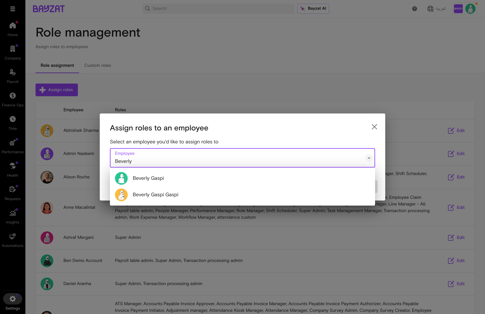
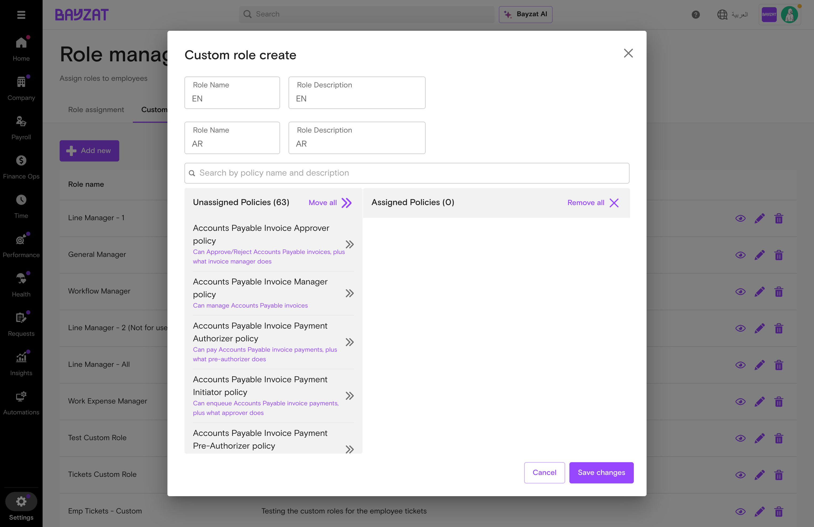
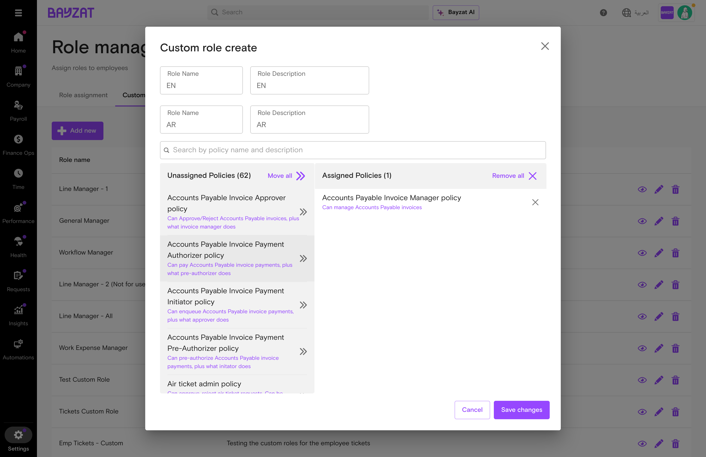
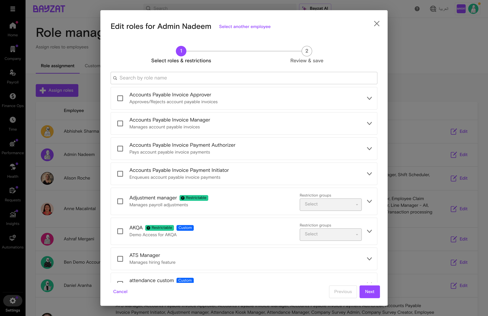
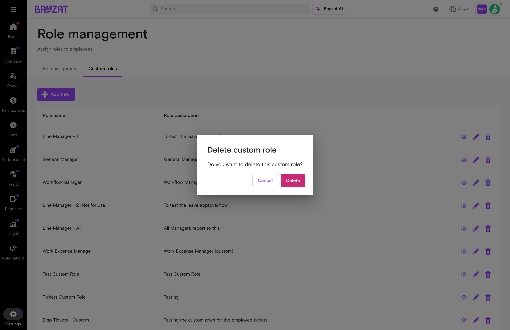

# Role Management

Control platform access by assigning roles and permissions to employees

📖 Quick Navigation

<a href="#feature-overview" class="nav-card">✨Feature Overview</a> <a href="#product-foundation" class="nav-card">🏗️Product Foundation</a> <a href="#user-journey" class="nav-card">🗺️User Journey</a> <a href="#feature-discovery" class="nav-card">🔍Feature Discovery</a> <a href="#setup-process" class="nav-card">⚙️Setup Process</a> <a href="#feature-usage" class="nav-card">📋Feature Usage</a> <a href="#troubleshooting" class="nav-card">🔧Troubleshooting</a> <a href="#support-resources" class="nav-card">💬Support Resources</a>

<figure>

<figcaption>Role Management interface in Bayzat HR platform</figcaption>
</figure>

## What is Role Management?

### Overview

Role Management is Bayzat's centralized access control system that governs what employees can see and do within the platform. It operates on two primary entities: **Role Assignments** (mapping employees to roles) and **Custom Roles** (role definitions with permissions).

### Key Benefits

- Assign system and custom roles to employees with flexible multi-role support
- Create custom roles with granular policy-based permissions tailored to your organization
- Leverage roles across workflows for intelligent routing and automated decision-making
- Manage restrictable roles with department, office, or group-level access controls

### Who Uses This Feature?

| User Role | What They Do | Value Proposition |
|----|----|----|
| **Super Admins** | Full control over all role assignments and custom role creation | Design permission structures that match your organization exactly—ensuring people have the access they need without over-provisioning sensitive capabilities |
| **People Managers** | May have delegated permissions to assign roles within their scope | Manage team access independently within defined boundaries—enabling faster onboarding without waiting for central IT approval |
| **HR Administrators** | Manage role assignments as part of employee onboarding and access governance | Grant appropriate access from day one as part of the onboarding workflow—ensuring new hires are productive immediately with the right permissions |

## Product Foundation Overview

### How Role Management Fits

Role Management is Bayzat's **centralized access control system** that governs what employees can see and do within the platform. It provides 40+ system roles and the ability to create custom roles with 60+ granular policies.

**Mental model:** Define role (system or custom) → Assign policies/permissions → Assign employees to role → Optionally restrict to departments/offices → Employees gain access based on combined role permissions.

Properly configured roles ensure employees have appropriate access from day one while maintaining security boundaries across the organization.

### Key Decisions Before Setup

Answer these questions before configuring roles:

- **Which system roles meet your needs?** — Review 40+ built-in roles before creating custom ones
- **Do you need custom roles?** — Create custom roles when system roles don't match specific job functions
- **Should roles be restricted?** — Use restriction groups to limit role scope to specific departments or offices
- **How will roles integrate with workflows?** — Plan role-based routing for approvals and notifications

### Related Features

- **Employee Records** — Foundation for all role assignments; employees must exist before roles can be assigned
- **Bayzat Workflows** — Roles serve as criteria filters and action routing targets for automation
- **Approval Flows** — Approver roles are configured in Role Management
- **All HR Modules** — Payroll, Time Off, Attendance, Performance respect role permissions

### Prerequisites & Requirements

| Requirement | Description | Status |
|----|----|----|
| Platform Access | Super Admin or People Manager role required | Required |
| Employee Records | Employees must exist in the system before roles can be assigned | Required |
| Organizational Hierarchy | Line manager relationships for workflow routing | Recommended |

## Complete User Journey Guide

### End-to-End Journey: Role Management

From access review through workflow integration.

1

#### Access Role Management

Settings → Role Management

<a href="#feature-discovery" class="phase-link">See navigation →</a>

2

#### Review Current Roles

Role assignment tab

<a href="#feature-usage" class="phase-link">See assignments →</a>

3

#### Assign Roles

Assign Roles → Map employees

<a href="#setup-process" class="phase-link">See assignment →</a>

4

#### Create Custom Roles

Custom Roles tab → New role

<a href="#setup-process" class="phase-link">See creation →</a>

5

#### Configure Restrictions

Set restriction groups

<a href="#setup-process" class="phase-link">See restrictions →</a>

6

#### Use in Workflows

Criteria filtering & routing

<a href="#feature-usage" class="phase-link">See workflows →</a>

## Feature Discovery

### How to Access

Role Management is accessed through the Settings menu and provides two main tabs for managing role assignments and custom role definitions.

Settings → Role Management

### Navigation Structure

1

#### Role Assignment Tab

View and manage all employee role assignments. Shows employee names with their assigned roles in a searchable table.

2

#### Custom Roles Tab

Create and manage organization-specific roles with custom policy combinations. Custom roles appear with a "Custom" badge.

<figure>

<figcaption>Role Assignment tab showing employees and their assigned roles</figcaption>
</figure>

## Setup Process

### Initial Configuration

Before employees can effectively use the platform, administrators must assign appropriate roles based on job responsibilities and access requirements.

1

#### Navigate to Role Management

Go to Settings → Role Management. You will see two tabs: Role assignment and Custom roles.

2

#### Review Available System Roles

Familiarize yourself with the 40+ built-in roles. Hover over the information icon next to each role to see specific permissions.

3

#### Plan Role Assignments

Map job responsibilities to required Bayzat permissions. Identify employees who need administrative, managerial, or specialized access.

### Common System Roles

| Role | Description | Typical Users |
|----|----|----|
| **Super Admin** | Full platform access and configuration capabilities | IT Administrators, HR Directors |
| **People Manager** | Comprehensive employee data access and management | HR Managers |
| **Line Manager** | Access to direct reports' information and approvals | Team Leads, Department Heads |
| **Payroll Manager** | Payroll processing and configuration | Payroll Staff |
| **Time Off Manager** | Time-off policy management and approvals | HR Coordinators |
| **Invoice Approver** | Approve invoices in accounts payable | Finance Managers |

**Best Practice:** Apply the principle of least privilege - assign only the roles necessary for each employee's job function. Combine multiple roles when employees have varied responsibilities.

## Feature Usage

### Assigning Roles to Employees

Follow these steps to assign roles to employees in your organization.

1

#### Click Assign Roles

On the Role assignment tab, click the "Assign roles" button in the top-right corner.

<figure>

<figcaption>Assign roles dialog - selecting an employee</figcaption>
</figure>

2

#### Select Employee

Use the searchable dropdown to find and select the employee. You can search by name or employee ID.

<figure>

<figcaption>Searching for an employee in the assignment dialog</figcaption>
</figure>

3

#### Select Roles

Check the boxes next to the roles you want to assign. Multiple roles can be assigned to the same employee.

<figure>

<figcaption>Selecting roles to assign - multiple roles can be selected</figcaption>
</figure>

4

#### Configure Restrictions (If Applicable)

For restrictable roles, configure restriction groups to limit access to specific departments, offices, or employee segments.

5

#### Review and Save

Review the selected roles and click Save. The employee immediately gains access to features permitted by their assigned roles.

<figure>

<figcaption>Review step before saving role assignments</figcaption>
</figure>

### Creating Custom Roles

When standard system roles don't meet your organization's needs, create custom roles with tailored permission sets.

1

#### Navigate to Custom Roles Tab

Click on the "Custom roles" tab to view existing custom roles and access the creation interface.

<figure>

<figcaption>Custom roles tab showing existing role definitions</figcaption>
</figure>

2

#### Click Add New

Click the "Add new" button to open the custom role creation dialog.

3

#### Enter Role Details

Provide the role name in English and Arabic. Add a clear description explaining the role's purpose.

<figure>

<figcaption>Custom role creation dialog with name and policy selection</figcaption>
</figure>

4

#### Select Policies

Choose from 60+ available policies to define the role's permissions. Search for policies by name and select multiple as needed.

<figure>

<figcaption>Adding policies to define custom role permissions</figcaption>
</figure>

5

#### Save Custom Role

Click Save. The new custom role appears in the Custom roles table with a "Custom" badge and is immediately available for assignment.

### Editing Role Assignments

Modify existing role assignments when employee responsibilities change.

1

#### Find the Employee

In the Role assignment tab, locate the employee whose roles you want to modify.

2

#### Click Edit

Click on the employee row or the edit button to open the role assignment dialog.

<figure>

<figcaption>Edit dialog showing current role assignments</figcaption>
</figure>

3

#### Modify Roles

Check or uncheck roles to add or remove them. The changes take effect immediately upon saving.

<figure>

<figcaption>Adding a new role to an existing employee</figcaption>
</figure>

### Deleting Role Assignments

Remove roles from employees or delete custom roles that are no longer needed.

<figure>

<figcaption>Confirmation dialog when deleting a custom role</figcaption>
</figure>

**Warning:** Deleting a custom role will remove it from all employees who have it assigned. Ensure you've reviewed which employees will be affected before confirming deletion.

## Workflow Integration

### How Roles Work in Workflows

Roles are extensively used in Bayzat Workflows for intelligent filtering and routing. Understanding this integration helps you design effective automated processes.

Access: Automations (left sidebar) → Workflows

### Roles as Criteria Filters

Use employee roles as conditions to determine which workflow executions apply to specific employees.

<figure>

<figcaption>Employee roles available as workflow criteria data points</figcaption>
</figure>

| Data Point | Available Operations |
|----|----|
| **Employee → roles** | contains all, does not contain all, contains any, does not contain any, is empty, is not empty |

<figure>

<figcaption>All 40+ roles available for filtering in workflow criteria</figcaption>
</figure>

### Role-Based Action Routing

Route workflow actions to employees based on their roles.

| Action                | Role Usage                                          |
|-----------------------|-----------------------------------------------------|
| **Send Email**        | Recipients can be all employees with specific roles |
| **Create Task**       | Assignees can be role-based for automatic routing   |
| **Send Notification** | Target notifications to role holders                |

<figure>

<figcaption>Selecting role-based recipients for workflow emails</figcaption>
</figure>

### Line Manager Routing

The special variable `Employee → direct reports to` enables Line Manager routing for hierarchical approvals and escalations.

<figure>

<figcaption>Using "direct reports to" variable for Line Manager routing</figcaption>
</figure>

**Tip:** Use Line Manager routing for approval workflows, performance reviews, and escalation notifications to ensure requests reach the appropriate supervisor automatically.

### Workflow Examples

#### Example: Route Approvals to Finance Approvers

**Scenario:** When an expense request exceeds a threshold, notify all employees with the "Invoice Approver" role.

- **Trigger:** Expense request submitted
- **Condition:** Amount \> 5000
- **Action:** Send Email to "Invoice Approver" role

#### Example: Filter by Employee Role

**Scenario:** Only execute workflow for employees who have the "People Manager" role.

- **Trigger:** Monthly schedule
- **Criteria:** Employee → roles contains any: People Manager
- **Action:** Send reminder email for team reviews

## Business Rules & Limitations

### Core Business Rules

| Rule | Description | Impact |
|----|----|----|
| Multi-role support | Employees can have multiple roles simultaneously | Permissions are cumulative across all assigned roles |
| Immediate effect | Role changes take effect immediately upon saving | No system restart or re-login required |
| Custom role policies | Custom roles combine multiple policies | 60+ policies available for granular control |
| Restriction groups | Some roles support access restrictions | Limit access to specific employee segments |

### System Constraints

- System roles cannot be modified or deleted - only custom roles can be edited
- Employees must exist in the system before roles can be assigned
- Custom roles require both English and Arabic names
- Deleting a custom role removes it from all assigned employees
- Role Management is not available as a workflow trigger (no triggers found)

### Permission Hierarchy

**Note:** When an employee has multiple roles, permissions are additive. The employee receives the combined permissions of all assigned roles. There is no permission denial - if any role grants access, the employee has that access.

## Troubleshooting & Edge Cases

### Common Issues

| Issue | Cause | Resolution |
|----|----|----|
| Employee can't access a feature | Missing required role | Assign appropriate role with feature access |
| Can't find employee in selector | Employee not yet added to system | Add employee record first via People module |
| Custom role not appearing | Role may be inactive or deleted | Check Custom roles tab for status |
| Restriction groups not working | Role may not support restrictions | Check if role is marked as "Restrictable" |
| Can't delete custom role | Role may be assigned to employees | Remove role from all employees first |

### Edge Cases

- **Employee leaves organization:** Role assignments remain until explicitly removed. Consider auditing roles during offboarding.
- **Conflicting permissions:** Since permissions are additive, conflicts don't occur - the most permissive access applies.
- **Role audit:** Regularly review role assignments, especially after organizational restructures or promotions.

**Security Reminder:** Always apply the principle of least privilege. Assign only the roles necessary for job functions and regularly audit role assignments to maintain security.

## Support Resources

### Frequently Asked Questions

How do I assign multiple roles to one employee?

When assigning roles, simply check multiple role boxes in the role selection step. All selected roles will be assigned to the employee.

What's the difference between system and custom roles?

System roles are pre-built by Bayzat with fixed permissions. Custom roles are created by your organization by combining policies from 60+ available options.

How do I know what permissions a role grants?

Hover over the information icon next to any role name to see a tooltip listing the specific permissions and actions that role grants.

Can I use roles in workflow automation?

Yes! Use "Employee → roles" as criteria to filter workflows by role, and select roles as recipients for email, task, and notification actions.

What are restrictable roles?

Restrictable roles can be limited to specific employee segments using restriction groups. This allows a role to only have access to certain departments, offices, or custom groups.

### Getting Help

- Contact your HR Administrator for role assignment questions
- Bayzat Support Team - Available for technical issues and feature questions
- Knowledge Base - Access additional articles and guides
- In-app Help - Contextual help available within the Bayzat platform

## Glossary of Terms

| Term | Definition |
|----|----|
| **Role** | A collection of permissions that determine what a user can see and do in the platform. |
| **System Role** | Pre-built roles provided by Bayzat with fixed permission sets (e.g., Super Admin, Line Manager). |
| **Custom Role** | Organization-created roles with permissions defined by selecting from available policies. |
| **Policy** | A specific permission or capability that can be added to custom roles (60+ available). |
| **Role Assignment** | The mapping of one or more roles to an employee. |
| **Restrictable Role** | A role that supports restriction groups to limit access to specific employee segments. |
| **Restriction Group** | A defined segment of employees (by department, office, or custom criteria) used to limit role scope. |
| **Line Manager** | The employee's direct supervisor, used for hierarchical routing in workflows. |
| **Direct Reports To** | A workflow variable representing the employee's line manager relationship. |
| **Multi-role Support** | The ability to assign multiple roles to a single employee with cumulative permissions. |

Generated by Bayzat Documentation System

Last updated: 2026-01-16
