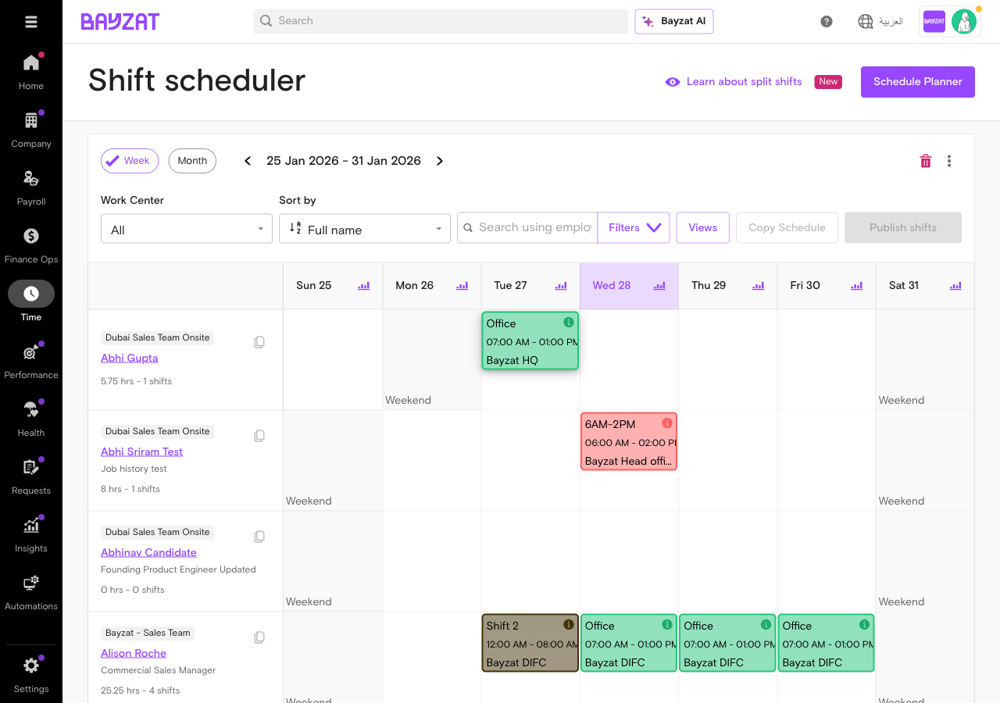

## What is Split Shifts?

### Overview

Split Shifts enables HR teams and managers to schedule employees across non-continuous work periods within a single day. Access this feature through the Shift Scheduler calendar interface where you can create, edit, and manage split shift assignments for employees across different work centers.

**Important:** Split Shifts is not a separate module or menu item. It is a capability within the Shift Scheduler that allows you to assign **up to 2 shifts per employee per day**. When you create two shifts for the same employee on the same day, you are using the Split Shifts feature.

### How Split Shifts Work

Creating a split shift is simply assigning two separate shifts to one employee on the same day:

1.  **Navigate to Shift Scheduler:** Time → Shifts → Shift scheduler
2.  **Select a work center** with non-overlapping work timings configured
3.  **Create first shift:** Click a calendar cell, select the employee, configure timing (e.g., Office 07:00 AM - 01:00 PM)
4.  **Create second shift:** Click the empty space below the first shift card for the same employee and date, configure second timing (e.g., 2PM - 6PM 02:00 PM - 06:00 PM)
5.  **Publish both shifts:** Select work center and click "Publish shifts"

**Example Scenario:** A retail employee needs to work the morning rush (7AM-1PM), take a 1-hour break, then return for the afternoon shift (2PM-6PM). Create two separate shifts on the same day using non-overlapping work timings - this IS the split shift.

**Key behaviors when using split shifts:**

- Employees check in/out separately for each shift
- Each shift tracks its own attendance (late arrival, early departure, breaks)
- Fixed deductions are **halved** when an employee has 2 shifts (to avoid duplicate penalties)
- Cannot add a second shift if the day is marked as "Day Off"
- The system prevents overlapping shifts — if the selected work timing overlaps with the existing shift, a warning appears and Save buttons are disabled

<figure class="screenshot-container">

<figcaption>Split shift example — two shifts (Office 07:00 AM - 01:00 PM and 2PM - 6PM 02:00 PM - 06:00 PM) assigned to the same employee on the same date, with combined metrics showing "9.75 hrs - 2 shifts"</figcaption>
</figure>

Create shifts by clicking calendar cells, manage existing shifts through context menus, and track employee hours and shift counts in real-time. Use filters to view schedules by work center, employee, or time period. For the full shift scheduling interface guide, see **[Shift Scheduling](https://mashapajfhp.github.io/user-guides/shift-scheduling/v1/shift-scheduling-user-guide.html)**.

### Key Benefits

- Schedule employees across multiple non-continuous time blocks in a single day
- Track total hours and shift counts automatically as shifts are created or modified
- Prevent scheduling conflicts with locked edit protection for shifts with attendance records
- Publish schedules to specific work centers or copy configurations across periods
- Trigger automated workflows when shifts are created, updated, or deleted

### Strategic Context

#### 🎯 What Split Shifts Solves

Organizations with complex operational patterns need to schedule employees across broken or non-continuous work periods that standard single-block shifts cannot accommodate.

- Replaces manual spreadsheet tracking of split schedules
- Standardizes scheduling for retail, hospitality, and healthcare operations
- Enables flexible staffing for peak-hour coverage patterns

#### 💰 Why It Matters

Split shift scheduling is foundational for organizations that require operational flexibility beyond standard continuous work blocks.

- Prerequisite for accurate attendance tracking across multiple work periods
- Drives payroll calculations for employees with non-continuous schedules
- Controls labor cost allocation across different operational time windows

#### 🏗️ How It Connects

Split Shifts is a transactional scheduling feature that creates time-bound employee assignments.

- Assigned to individual employees through calendar interface
- Referenced by attendance records and payroll calculations
- Impacts work center staffing levels and operational capacity planning

### Who Uses This Feature?

| User Role | What They Do | Value Proposition |
|----|----|----|
| **HR Administrators** | Create and configure split shift schedules across work centers and manage scheduling policies | Eliminates manual schedule coordination and replaces spreadsheet-based shift tracking with automated calendar management |
| **Shift Schedulers** | Create daily/weekly shift assignments, manage employee availability, and handle schedule changes | Streamlines shift creation workflow with calendar-based interface and real-time conflict detection |
| **Department Managers** | Schedule employees for split shifts, publish schedules, and track team coverage | Reduces scheduling conflicts and enables real-time visibility into staffing levels across operational periods |
| **Payroll Administrators** | Verify shift hours and ensure accurate time tracking for payroll processing | Automates hour calculations for non-continuous work periods and prevents payroll discrepancies from manual entry |
| **Employees** | View assigned shift schedules, check work timings, and track personal hours | Provides clear visibility into upcoming shifts and work expectations through self-service schedule access |

## Product Foundation Overview

### How Split Shifts Fits

Split Shifts is a transactional scheduling feature that creates time-bound employee work assignments. Each shift is a discrete record linking an employee to a work timing, office location, and work center for a specific date.

**Mental model:** Shift Schedule (assignment) → Created for Employee → Links Work Timing + Office + Work Center → Generates Attendance Record → Calculates Hours

One shift affects one employee for one date. Changes to published shifts do not affect past attendance records. Shifts with existing attendance records are locked from editing to preserve data integrity.

### Key Decisions Before Setup

Answer these questions before creating Split Shifts:

- **Which work centers require split shift scheduling?** — Identify operational units with non-continuous staffing needs
- **Which employees should be assigned to split shifts?** — Determine staff members whose roles require non-continuous work periods based on operational demands
- **What work timings will be used for split periods?** — Ensure work timing configurations exist for each shift block
- **Which office locations apply to each split shift?** — Verify office assignments match operational requirements for each shift block
- **How will split shift schedules be published and communicated?** — Determine approval workflow and employee notification process for non-continuous work periods

### Related Features

- **[Work Timings](https://mashapajfhp.github.io/user-guides/work-timings/v1/work-timings-user-guide.html)** — Defines the start and end times assigned to each shift period. You need at least two non-overlapping work timing templates to create split shifts.
- **[Shift Scheduling](https://mashapajfhp.github.io/user-guides/shift-scheduling/v1/shift-scheduling-user-guide.html)** — Provides the calendar interface for creating and managing all shift types including split shifts. The Shift Scheduler is where you actually create split shifts.
- **Work Centers** — Organizes employees into operational units for shift scheduling and capacity planning
- **Attendance Tracking** — Records check-in/check-out data against published shift schedules for payroll processing
- **Workflow Automation** — Triggers notifications or actions when shifts are created, updated, or deleted

### Prerequisites & Requirements

| Requirement | Description | Status |
|----|----|----|
| Non-Overlapping Work Timings | At least **two** [work timing](https://mashapajfhp.github.io/user-guides/work-timings/v1/work-timings-user-guide.html) configurations with non-overlapping time ranges must exist (e.g., "Office 07:00 AM - 01:00 PM" and "2PM - 6PM 02:00 PM - 06:00 PM") | Required |
| Work Centers | Work center must be configured with both work timings available to enable split shift creation | Required |
| Office Locations | Office records must exist to link shifts to physical work locations | Required |
| Employee Records | Active employees must be assigned to work centers before scheduling shifts | Required |
| Workflow Configuration | Optional automation triggers for shift lifecycle events | Optional |

## Complete User Journey Guide

A split shift = two separate shifts for one employee on the same day. Follow these steps:

1

#### Access Shift Scheduler

Time → Shifts → Shift scheduler

<a href="#feature-entry-points" class="phase-link">See navigation →</a>

2

#### Create First Shift

Click cell → Configure morning/first period

<a href="#core-tasks" class="phase-link">See create steps →</a>

3

#### Create Second Shift

Same employee, same day → Configure evening/second period

<a href="#core-tasks" class="phase-link">See create steps →</a>

4

#### Verify & Publish

Review both shifts → Select work center → Publish

<a href="#core-tasks" class="phase-link">See publish steps →</a>

5

#### Manage Shifts

Click either shift → Edit or delete individually

<a href="#core-tasks" class="phase-link">See manage steps →</a>

## Feature Discovery

### How to Access Split Shifts

**No Separate Entry Point:** Split Shifts does not have its own menu item or dedicated page. The feature is integrated directly into the Shift Scheduler. To use split shifts, you simply create two shifts for the same employee on the same day.

Access the Shift Scheduler through the Time module:

Time → Shifts → Shift scheduler

**To learn about the feature:** Click the "Learn about split shifts" button (marked with "New" badge) in the Shift scheduler header. This opens a modal explaining split shift rules and behaviors.

<figure class="screenshot-container">

<figcaption>Shift Scheduler calendar interface — select a work center with non-overlapping work timings to enable split shift creation</figcaption>
</figure>

Key actions available from this screen:

- Click "Learn about split shifts" to view feature guidance
- Switch between Week and Month views using the toggle
- Filter by work center to focus on specific locations
- Search employees by ID, name, or title
- Click calendar cells to create new shifts
- Click existing shift cards to edit or delete
- Use "Copy Schedule" to duplicate shift patterns
- Click "Publish shifts" to make schedules visible to employees

For the full Shift Scheduler interface guide, see **[Shift Scheduling](https://mashapajfhp.github.io/user-guides/shift-scheduling/v1/shift-scheduling-user-guide.html)**.

### Navigation Paths

Multiple entry points provide access to shift scheduling:

- **Primary Path:** Time → Shifts → Shift scheduler (main scheduler interface)
- **Schedule Planner:** Click "Schedule Planner" button for advanced planning view
- **Employee Profile:** Access individual employee schedules from their profile page

## Initial Setup

### Prerequisites

Before creating split shifts, ensure these configurations are complete:

- **Work Centers:** Define organizational locations where employees work
- **Work Timings:** Create timing schedules with start/end times and break rules
- **Office Locations:** Set up physical office locations for shift assignments
- **Employee Records:** Ensure employees are active in the system

### First-Time Configuration Steps

<figure class="screenshot-container">

<figcaption>Schedule shift dialog showing required fields for shift creation</figcaption>
</figure>

1.  Navigate to Time → Shifts → Shift scheduler
2.  Select work center from dropdown (required for copy and publish actions)
3.  Choose calendar view: Week or Month
4.  Click on an employee's calendar cell to open the Schedule shift dialog
5.  Select work timing from dropdown (defines shift hours and break rules)
6.  Select office location from dropdown
7.  Add optional notes for shift-specific instructions
8.  Click "Save & Publish" to create and immediately publish the shift

<figure class="screenshot-container">

<figcaption>Shift successfully created with updated employee metrics displayed</figcaption>
</figure>

After creation, the shift card appears on the calendar showing timing and office details, and employee metrics update to reflect total hours and shift count.

### Understanding the Calendar Interface

- **Employee Rows:** Each row represents one employee with their assigned shifts
- **Shift Cards:** Display work timing, office location, and shift duration
- **Employee Metrics:** Show total hours and shift count for the selected period
- **Calendar Cells:** Click empty cells to create shifts, click shift cards to edit or delete

### Publishing Shifts

Shifts must be published to become visible to employees and enable attendance tracking.

- Select a specific work center from the dropdown
- Click "Publish shifts" button in the toolbar
- Published shifts activate attendance tracking for assigned employees

**Note:** Copy Schedule and Publish shifts buttons require a specific work center to be selected. They are disabled when viewing all work centers.

## Key Tasks

### Task: Create a Split Shift (Two Shifts for One Employee)

**A split shift means assigning two separate shifts to the same employee on the same day.** This is how you schedule employees with non-continuous work periods (e.g., morning and afternoon shifts with a break in between).

#### Prerequisites

Before creating a split shift, ensure:
- You have at least two [work timing](https://mashapajfhp.github.io/user-guides/work-timings/v1/work-timings-user-guide.html) templates with **non-overlapping time ranges** (e.g., "Office 07:00 AM - 01:00 PM" and "2PM - 6PM 02:00 PM - 06:00 PM")
- Both work timings are available in the target work center
- The target date has no existing day off, day off with check-in allowed, or approved leave

#### Step-by-Step: Create Split Shift

1.  **Navigate to Shift Scheduler:** Time → Shifts → Shift scheduler
2.  **Select a work center** that has non-overlapping work timings configured:

<figure class="screenshot-container">

<figcaption>Select a work center with multiple non-overlapping work timings available</figcaption>
</figure>

3.  **Create the first shift:**
    - Click the calendar cell for the target date and employee
    - Select Work Timing for first period (e.g., "Office 07:00 AM - 01:00 PM")
    - Select Office location
    - Click **Save as draft** or **Save & Publish**

<figure class="screenshot-container">

<figcaption>Schedule shift dialog for the first shift — selecting "Office" work timing (07:00 AM - 01:00 PM) at Bayzat DIFC</figcaption>
</figure>

<figure class="screenshot-container">

<figcaption>First shift saved — the morning shift appears in the employee's calendar row</figcaption>
</figure>

4.  **Create the second shift (same employee, same day):**
    - **Important:** Click in the empty space **below** the existing shift card (not on the card itself)
    - The "Schedule shift" dialog opens with the same employee and date pre-selected
    - Select Work Timing for second period (e.g., "2PM - 6PM 02:00 PM - 06:00 PM")
    - Select Office location (can be same or different)
    - Click **Save as draft** or **Save & Publish**

<figure class="screenshot-container">

<figcaption>Schedule shift dialog for the second shift — selecting "2PM - 6PM" work timing (02:00 PM - 06:00 PM) for the same employee and date</figcaption>
</figure>

5.  **Verify:** Both shift cards now appear stacked in the same cell. Employee metrics show combined hours.

<figure class="screenshot-container">

<figcaption>Split shift complete — both shifts visible in the grid, employee metrics show "9.75 hrs - 2 shifts", and the Publish button updates to "Publish shifts (2)"</figcaption>
</figure>

#### Split Shift Constraints

| Constraint | Description |
|----|----|
| **Maximum 2 shifts per day** | You cannot add a third shift for the same employee on the same date |
| **Non-overlapping times required** | If the selected work timing overlaps with the existing shift, the system displays *"There is an overlapping shift on the same day"* and disables Save buttons |
| **No day off conflicts** | Cannot create a split shift on a date that is marked as Day Off or Day Off with check-in allowed |
| **No leave conflicts** | Cannot schedule during half-day leave or approved leave |
| **No overlap with adjacent days** | Shifts cannot overlap with previous day or next day shifts (relevant for overnight shifts) |
| **No overtime with multiple shifts** | Cannot add extra hours (T&P adjustments) if an employee has multiple published shifts on the same day |
| **Independent attendance tracking** | Each shift tracks late arrival, early departure, and absence separately |
| **Deduction halving** | When 2 shifts exist on the same day, fixed deduction amounts are automatically divided by 2 (e.g., 5% late deduction becomes 2.5% per shift) |
| **No "All" in Schedule Planner** | The "All" option is not available when creating split shifts in Schedule Planner; you must select specific employees |

**Clicking on shift cards:** When you click directly on an existing shift card, a context menu appears with options to **Edit shift**, **Reassign shift**, or **Delete shift**. There is no "Add shift" option in this menu. To add a second shift, you must click in the empty space below the shift card within the calendar cell.

### Task: Schedule Employee Shifts

Create and publish work schedules for employees across different work centers and time periods.

#### Subtask: Access Shift Scheduler

<figure class="screenshot-container">

<figcaption>Shift Scheduler weekly view — select a work center and navigate to the target week before creating shifts</figcaption>
</figure>

- Navigate to Time → Shifts → Shift scheduler
- Select Week or Month view from tabs
- Filter by Work Center if managing multiple locations
- Use Search to find specific employees by ID, name, or title

#### Subtask: Create New Shift

<figure class="screenshot-container">

<figcaption>Schedule shift dialog for creating new employee shifts</figcaption>
</figure>

- Click on calendar cell for target employee and date
- Select Work Timing from dropdown (defines shift hours)
- Select Office location from dropdown
- Add optional notes for shift context
- Click Save & Publish

<figure class="screenshot-container">

<figcaption>Success confirmation showing shift created and employee metrics updated</figcaption>
</figure>

Employee metrics update immediately, showing total hours and shift count.

#### Subtask: View Shift Details

<figure class="screenshot-container">

<figcaption>Shift detail view showing work center, employee, timing, and office information</figcaption>
</figure>

- Click on any shift card in the calendar
- Review work center, employee name, date, work timing, office, and notes
- Note: Shifts with attendance records cannot be edited (data integrity protection)

### Task: Modify Existing Shifts

Update shift details or remove scheduled shifts before attendance is recorded.

#### Subtask: Edit Shift

<figure class="screenshot-container">

<figcaption>Edit shift dialog showing modifiable fields for published shifts</figcaption>
</figure>

- Click on shift card
- Select Edit shift from context menu
- Modify Work Timing, Office, or Notes as needed
- Click Edit & Publish

<figure class="screenshot-container">

<figcaption>Confirmation message showing shift edited and published successfully</figcaption>
</figure>

Calendar reflects changes immediately. Employee metrics recalculate based on new timing.

**⚠️ Editing Restriction:** Shifts cannot be edited once employee has checked in or been marked absent. This protects attendance record integrity.

#### Subtask: Delete Shift

<figure class="screenshot-container">

<figcaption>Delete confirmation dialog showing employee, office, and date details</figcaption>
</figure>

- Click on shift card
- Select Delete shift from context menu
- Confirm deletion in dialog (action cannot be undone)

<figure class="screenshot-container">

<figcaption>Shift scheduler view after successful deletion showing updated employee schedules</figcaption>
</figure>

Employee metrics update to reflect removed shift hours and count.

### Task: Manage Bulk Schedules

Copy and publish schedules across work centers or time periods.

#### Subtask: Copy Schedule

- Select specific Work Center from filter dropdown (not "All work centers")
- Click Copy Schedule button in toolbar
- Configure source and target periods in dialog
- Review and confirm schedule duplication

**Note:** Copy Schedule and Publish shifts buttons are only enabled when a specific work center is selected. They are disabled when viewing all work centers.

#### Subtask: Publish Shifts

- Select specific Work Center from filter dropdown
- Click Publish shifts button in toolbar
- Confirm publication to make schedules visible to employees

### Task: Monitor Schedule Metrics

Track employee scheduling coverage and hours allocation.

#### Subtask: Review Employee Metrics

- View hours and shift count displayed below each employee name
- Format: "X hrs - Y shifts" (e.g., "5.75 hrs - 1 shifts")
- Metrics update automatically when shifts are created, edited, or deleted
- Use metrics to ensure balanced workload distribution

#### Subtask: Use Filters and Views

- Click Filters button to access advanced filtering options
- Click Views button to save and apply custom view configurations
- Use Sort by dropdown to organize employee list
- Switch between Week and Month views for different planning horizons

## Workflow Integration

### Automation Triggers

Split Shifts supports workflow automation through Bayzat Attendance triggers.

Automations → Workflows → + Create workflow

<figure class="screenshot-container">

<figcaption>Available workflow triggers for shift events in Bayzat Attendance</figcaption>
</figure>

#### Available Triggers

- **Employee shift is created** — Fires when a new shift is scheduled for an employee
- **Employee shift is updated** — Fires when shift details (timing, office, notes) are modified
- **Employee shift is deleted** — Fires when a scheduled shift is removed

#### Use Cases

- Send notifications to employees when shifts are published
- Alert managers when shifts are modified or deleted
- Trigger integrations with external scheduling or communication systems
- Create audit logs for shift changes

**Note:** Split Shifts provides triggers only. No workflow actions are currently available for this feature. Use triggers to initiate workflows that connect to other systems or send notifications.

## Business Rules & Limitations

### Shift Scheduling Rules

- **Work Center Dependency:** Shifts must be assigned to a specific work center. Multi-center operations cannot be scheduled in a single shift.
- **Work Timing Requirement:** Each shift requires a pre-configured work timing template. Custom timings cannot be created during shift assignment.
- **Office Assignment:** Every shift must specify a physical office location from configured options.
- **Calendar Constraints:** Shifts can only be scheduled for future or current dates. Historical shift creation is not supported.

### Edit and Delete Constraints

**⚠️ Attendance Lock:** Shifts cannot be edited or deleted once an employee has checked in or been marked absent. This prevents data integrity issues with attendance records.

**Workaround:** Delete attendance records first, then modify the shift. Use caution as this affects payroll calculations.

- **Published Shifts:** Once published, shifts become visible to employees and trigger notifications. Unpublishing is not supported.
- **Deletion Confirmation:** All shift deletions require explicit confirmation. This action cannot be undone.

### Bulk Operations

| Operation | Requirement | Limitation |
|----|----|----|
| Copy Schedule | Specific work center selected | Cannot copy across different work centers |
| Publish Shifts | Specific work center selected | Bulk publish only works within single work center |
| Reassign Shift | Specific work center selected | Context menu option disabled for multi-center views |

### Calendar View Limitations

- **Weekly View:** Shows 7-day rolling window. Cannot customize date range.
- **Monthly View:** Displays calendar month. Partial weeks at month boundaries show full week.
- **Employee Metrics:** Hours and shift counts update in real-time but reflect only scheduled shifts, not actual attendance.
- **Filter Scope:** Work center filter affects all operations. Switching centers clears current context.

### Navigation & Access

**No Direct Entry Point:** Split Shifts does not have a dedicated menu item or separate module in the Bayzat navigation. The feature is integrated into the Shift Scheduler and accessed via **Time → Shifts → Shift scheduler**.

To learn about split shift capabilities, click the **"Learn about split shifts"** button in the Shift scheduler header. This opens an informational modal explaining the feature.

- **Feature Discovery:** New users may not immediately recognize that Split Shifts functionality exists within Shift Scheduler.
- **No Separate URL:** There is no direct URL path to a "Split Shifts" page - all functionality lives within the Shift scheduler interface.
- **Contextual Help:** The "Learn about split shifts" button with "New" badge provides in-app guidance for the feature.

### Known Product Gaps

**Note:** Split shift creation from the Shift cell context menu is not yet supported — you must click in empty calendar space below existing shift cards to add a second shift. *(OS-299)*

## Troubleshooting & Edge Cases

### Common Issues

| Issue | Cause | Resolution |
|----|----|----|
| Cannot edit shift | Employee has attendance record (check-in or absent) | Delete attendance record first, then edit shift. Verify with payroll before proceeding. |
| Copy Schedule button disabled | Work center filter set to "All" | Select specific work center from dropdown to enable copy functionality. |
| Publish shifts button grayed out | No specific work center selected | Filter to single work center before bulk publishing shifts. |
| Reassign option unavailable | Context menu disabled for multi-center view | Filter to specific work center to enable shift reassignment. |
| Employee metrics not updating | Shift not published or page cache | Refresh page. Verify shift status is published. |
| Shift not visible to employee | Shift created but not published | Use Publish shifts button or Save & Publish when creating individual shifts. |
| Save buttons disabled when adding second shift | Selected work timing overlaps with existing shift | Choose a work timing that does not overlap with the first shift. The warning "There is an overlapping shift on the same day" indicates the conflict. Valid split shifts require non-overlapping time periods. |
| Cannot find where to click for second shift | Clicking on shift card shows edit menu only | Click in the empty space **below** the existing shift card in the calendar cell. Do not click directly on the shift card. |

### Edge Cases

- **Overnight Shifts:** Shifts spanning midnight require work timing template configured for overnight hours. Calendar displays shift on start date.
- **Overlapping Shifts:** System prevents saving shifts that overlap in time. When creating a second shift, if the selected work timing overlaps with an existing shift, a warning message "There is an overlapping shift on the same day" appears and Save buttons are disabled. Ensure shift times do not overlap (e.g., first shift 6AM-12PM, second shift 2PM-8PM).
- **Deleted Work Timings:** Shifts using deleted work timing templates display error. Reassign affected shifts before deleting templates.
- **Office Changes:** If office location is removed from system, existing shifts retain reference but cannot be edited.
- **Work Center Reassignment:** Moving employees between work centers does not automatically transfer scheduled shifts.
- **Timezone Considerations:** All shift times display in organization's configured timezone. Multi-timezone operations require manual coordination.

### Data Integrity Scenarios

**⚠️ Attendance Lock Behavior:** Once attendance is recorded, the shift becomes immutable. This prevents retroactive changes that would create payroll discrepancies.

**Impact:** Corrections require attendance deletion, which triggers recalculation of all dependent records (overtime, deductions, approvals).

- **Bulk Deletion:** No bulk delete option exists. Each shift requires individual deletion confirmation.
- **Copy Schedule Scope:** Copied schedules include only shift assignments, not employee-specific adjustments or notes.
- **Filter Persistence:** Work center filter resets on page refresh. Bookmark URLs do not preserve filter state.

## FAQs & Support

### Frequently Asked Questions

Can I schedule split shifts with breaks between work periods?

Yes. Create two separate shifts for the same employee on the same day using non-overlapping [work timings](https://mashapajfhp.github.io/user-guides/work-timings/v1/work-timings-user-guide.html) (e.g., "Office 07:00 AM - 01:00 PM" and "2PM - 6PM 02:00 PM - 06:00 PM"). The break between shifts is the gap between the end of the first shift and the start of the second. See the [Create a Split Shift](#core-tasks) task for step-by-step instructions.

Why can't I edit a shift I just created?

If the employee has already checked in or been marked absent, the shift becomes locked to preserve attendance data integrity. Delete the attendance record first if changes are required.

How do I schedule the same shift pattern for multiple employees?

Create the first shift, then use Copy Schedule (requires specific work center selected). Select target week and employees to replicate the pattern.

What happens if I delete a published shift?

The shift is removed from the schedule immediately. Employees lose visibility and any associated attendance records must be handled separately. This action cannot be undone.

Can I schedule shifts across different offices in one operation?

No. Each shift must specify a single office. For employees working multiple locations, create separate shifts for each office assignment.

Why don't employee hours update after creating a shift?

Verify the shift is published. Metrics display scheduled hours only, not actual attendance. Refresh the page if metrics appear stale.

How far in advance can I schedule shifts?

No system-enforced limit exists. However, scheduling too far ahead may require adjustments as work timing templates or office configurations change.

What does the "Absent after" rule in work timings mean for shifts?

This rule determines when an employee is automatically marked absent if they haven't checked in. It applies to all shifts using that work timing template.

### Getting Help

- **In-App Guidance:** Click "Learn about split shifts" in the Shift Scheduler header for feature overview and quick tips.
- **Related Guides:** See [Shift Scheduling](https://mashapajfhp.github.io/user-guides/shift-scheduling/v1/shift-scheduling-user-guide.html) for the full scheduler interface and [Work Timings](https://mashapajfhp.github.io/user-guides/work-timings/v1/work-timings-user-guide.html) for configuring the time templates used in split shifts.
- **Support Portal:** Submit tickets for technical issues, data discrepancies, or feature requests through the Bayzat support portal.
- **Training Resources:** Access video tutorials and best practices guides in the Bayzat Help Center under Attendance → Shift Scheduling.

## Glossary

| Term | Definition |
|----|----|
| **Absent After** | The time threshold in a work timing template after which an employee is automatically marked absent if no check-in is recorded. |
| **Attendance Lock** | A system constraint that prevents editing or deleting shifts once attendance (check-in or absent status) has been recorded. |
| **Calendar Grid** | The visual schedule interface showing employee rows and date columns with shift assignments displayed as cards. |
| **Copy Schedule** | A bulk operation that replicates shift patterns from one time period to another within the same work center. |
| **Office** | A physical location configured in the system where employees perform work, required for each shift assignment. |
| **Publish Shifts** | The action that makes scheduled shifts visible to employees and triggers related notifications. |
| **Schedule Planner** | The interface for creating, viewing, and managing employee shift assignments across calendar views. |
| **Shift Card** | A visual representation of a scheduled shift in the calendar grid, displaying timing, office, and quick action icons. |
| **Split Shift** | A work schedule with non-continuous periods separated by breaks longer than standard meal breaks, requiring multiple shift entries. |
| **Work Center** | An organizational unit grouping employees for scheduling purposes, required for bulk operations and filtering. |
| **Work Timing** | A pre-configured template defining start time, end time, and attendance rules applied to shifts. |
| **Workflow Trigger** | An automated event fired when shifts are created, updated, or deleted, enabling integration with other systems or notification workflows. |

