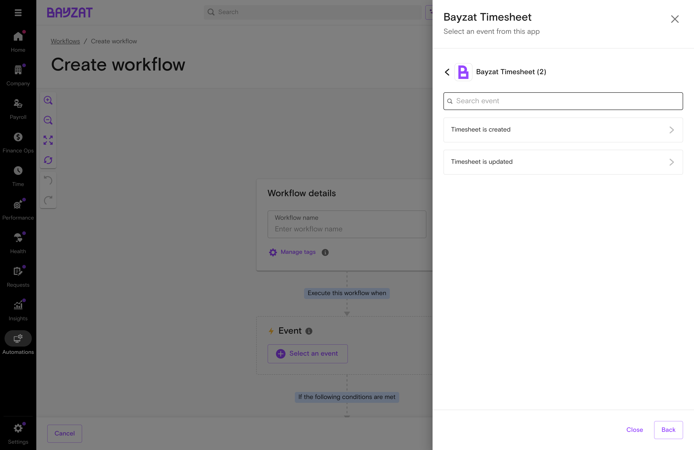

## What is Timesheets?

### Overview

Timesheets captures employee work hours for multiple purposes: client billing, productivity tracking, and accountability monitoring. Timesheets works as a standalone feature—no shifts, attendance tracking, or payroll integration required. Access it through the Time menu to manage time entries, project allocations, and work tracking.

<figure class="screenshot-container">

<figcaption>Timesheets main interface showing time entries and adjustment requests</figcaption>
</figure>

Review submitted timesheets, approve time entries, and track employee work hours from this central hub.

### Key Benefits

- Eliminate manual timesheet spreadsheets and reduce data entry errors
- Track billable hours by project or client for accurate invoicing
- Monitor employee productivity and time allocation
- Ensure accountability with approval workflows and audit trails
- Generate time reports for billing, productivity analysis, or compliance

### Strategic Context

#### 🎯 What Timesheets Solves

Eliminates manual time tracking processes that create billing errors, productivity gaps, and compliance risks.

- Replaces paper timesheets and Excel spreadsheets
- Standardizes time entry and approval workflows
- Enables accurate project time tracking and reporting

#### 💰 Why It Matters

Timesheets serves multiple business purposes depending on organizational needs.

- **Client Billing:** Track billable hours for accurate client invoicing
- **Productivity:** Monitor employee work patterns and output
- **Accountability:** Ensure work hours are logged and verifiable
- **Payroll (Optional):** Can feed into payroll if configured

#### 🏗️ How It Connects

Timesheets is transactional data that flows from employees through approvers to various outputs.

- Employees submit time entries by project, client, or task
- Managers review and approve submitted timesheets
- Data can be exported for billing, reports, or optionally payroll

### Who Uses This Feature?

| User Role | What They Do | Value Proposition |
|----|----|----|
| **HR Administrators** | Configure timesheet settings, manage adjustment requests, and oversee approval workflows | Centralized time management replaces manual follow-ups and spreadsheet consolidation |
| **Line Managers** | Review and approve employee timesheets, overtime requests, and pay adjustments | Streamlined approval process eliminates email chains and paper forms |
| **Payroll Administrators** | Extract approved timesheet data for payroll processing and verify time calculations | Automated data integration eliminates manual payroll data entry and reconciliation |
| **Employees** | Submit timesheets, request overtime approval, and track time entry status | Self-service time entry replaces paper timesheets and manual submission processes |

## Product Foundation Overview

### How Timesheets Fits

Timesheets is transactional data that records actual hours worked by employees. Organizations use timesheets for different purposes:

- **Client Billing:** Track billable hours by project/client for invoicing
- **Productivity Tracking:** Monitor how employees allocate time across tasks
- **Accountability:** Ensure employees log and account for their work hours
- **Payroll Integration (Optional):** Feed approved hours into salary calculations

**Important:** Timesheets can be used independently of payroll. Many organizations use timesheets purely for client billing or productivity monitoring without any impact on employee pay.

Changes to timesheet rules impact all future submissions but do not retroactively modify approved records.

### Key Decisions Before Setup

Answer these questions before configuring Timesheets:

- **What is the primary purpose?** — Client billing, productivity tracking, accountability, or a combination
- **Who approves timesheets?** — Define approval hierarchy (line managers, department heads, or HR admins)
- **What projects/clients need tracking?** — Set up project or client categories for time allocation
- **What reporting is needed?** — Determine what time reports and exports are required

### Related Features

- **Work Timings (Optional)** — Can integrate with shift schedules if attendance validation is needed
- **Attendance Rules (Optional)** — Can apply attendance policies to timesheets if tracking attendance
- **Payroll (Optional)** — Can consume approved timesheet data for salary calculations if configured
- **Overtime Policies (Optional)** — Can determine overtime eligibility if tracking overtime
- **Leave Management (Optional)** — Can integrate with leave records if attendance tracking is enabled

### Prerequisites & Requirements

| Requirement | Description | Status |
|----|----|----|
| Work Timings Configuration | Define shift schedules and work hours (only required if integrating with attendance tracking) | Optional |
| Employee Profiles | Active employee records with assigned work timings and line managers | Required |
| Approval Hierarchy | Configured line manager assignments for timesheet approval routing | Required |
| Overtime Policies | Define overtime rules (only if tracking overtime for payroll purposes) | Optional |
| Payroll Integration | Configure payroll module to consume timesheet data for salary calculations (only if using timesheets for payroll purposes) | Optional |

## Complete User Journey Guide

### End-to-End Journey: Managing Timesheets

Set up, create, submit, and approve timesheets for the organization.

1

#### Accessing Timesheets

Navigate to the Timesheets module from the main menu.

<a href="#feature-entry-points" class="phase-link">See details →</a>

2

#### Initial Setup

Configure projects, clients, and approval workflows for the organization.

<a href="#initial-setup" class="phase-link">See details →</a>

3

#### Creating Timesheets

Employees log time entries against projects, clients, or tasks.

<a href="#core-tasks" class="phase-link">See details →</a>

4

#### Requesting Approval (If Required)

Employees create a Timesheet Approval ticket via Requests → My tickets. Managers approve via Requests → Employee tickets.

<a href="#core-tasks" class="phase-link">See details →</a>

5

#### Reporting

Generate reports for billing, productivity, or compliance needs.

<a href="#troubleshooting-edge-cases" class="phase-link">See details →</a>

## Feature Discovery

### How to Access

Timesheets is accessed through the Time menu in the main navigation sidebar. There are two different views depending on your role:

### Admin / Manager Path

Time → Employee timesheets

Admins and managers access the Employee timesheets page to view all employees' timesheet data, manage projects/clients, and download reports.

<figure class="screenshot-container">

<figcaption>Employee Timesheets page - Overview tab showing summary and employee breakdown</figcaption>
</figure>

#### Available Tabs

- **Overview:** Summary cards (Number of employees, Total projects, Total clients, Total timesheet hours) and employee breakdown table
- **Billables:** View total billable and non-billable hours per employee

#### Available Actions

- **Download:** Export timesheet data
- **3-dot menu (⋮):** Add Project, Add Client options
- **Full breakdown:** Click to view detailed timesheet entries for each employee
- **Filters:** Filter by date range, employee name, or ID

<figure class="screenshot-container">

<figcaption>Billables tab showing billable vs non-billable hours per employee</figcaption>
</figure>

**Note:** Admins/Managers cannot create timesheet entries for employees. They can only view, download, and manage projects/clients. Employees must create their own timesheet entries.

### Employee Path

Time → My timesheet

Employees access My timesheet to add, edit, and delete their own timesheet entries.

<figure class="screenshot-container">

<figcaption>My timesheet page where employees add and manage their time entries</figcaption>
</figure>

#### Available Actions

- **Add timesheet task:** Create new timesheet entry with task name, project, start/end time, billable status
- **Edit:** Modify existing timesheet entries (via 3-dot menu on each row)
- **Delete:** Remove timesheet entries (via 3-dot menu on each row)
- **Date range:** Navigate between dates to view/add entries for different days

**Note:** Timesheet entries save immediately. There is no "Submit for Approval" button on this page.

### Timesheet Approval (Separate Workflow)

**⚠️ Important: Approval Options are NOT in the Timesheets Menu**

The Timesheets section does **NOT** have approve or reject functionality. Timesheet entries save immediately without requiring approval.

**If approval is required:**

- **Employees:** Create a "Timesheet Approval" ticket via **Requests → My tickets**
- **Managers:** Approve tickets via **Requests → Employee tickets**

## Setup Process

### Prerequisites

Before using Timesheets, ensure the following are configured:

- Projects or clients are defined (if using for billing)
- Task categories are configured (if using for productivity tracking)
- Line manager hierarchies are established
- Overtime and time adjustment policies are set

### Initial Configuration

The Timesheets main page has two tabs:

- **Overview:** Shows number of employees, total projects, total clients, and total timesheet hours
- **Billables:** Shows total billable hours and total non-billable hours per employee

<figure class="screenshot-container">

<figcaption>Timesheets Overview tab showing employee count, projects, clients, and total hours</figcaption>
</figure>

#### Adding Projects and Clients

To configure projects and clients for time tracking:

1.  Navigate to Time → Timesheets
2.  Click the 3-dot menu (⋮) in the top right corner
3.  Select "Add projects" or "Add clients"
4.  This navigates to Settings → Company where you can manage projects and clients

<figure class="screenshot-container">

<figcaption>Projects configuration page in Settings → Company</figcaption>
</figure>

#### Permission Toggles for Projects and Clients

In Settings → Company, you'll find important toggle settings that control who can create new projects and clients:

| Toggle Setting | When ON | When OFF |
|----|----|----|
| **Allow all users to add new projects** | Any employee can create new projects while logging timesheet entries. Useful for flexible teams where project work is dynamic. | Only administrators can create projects. Employees must select from the pre-defined project list when logging time. Best for organizations requiring strict project control. |
| **Allow all users to add new clients** | Any employee can add new clients when creating timesheet entries. Suitable for sales teams or consultants who frequently onboard new clients. | Only administrators can create clients. Employees choose from existing clients only. Recommended for organizations with established client lists. |

**Recommendation:** For most organizations, keep these toggles OFF to maintain data consistency and prevent duplicate or misspelled project/client entries. Enable them only if the workflow requires employees to frequently add new projects or clients on the fly.

### Understanding the Billables Tab

<figure class="screenshot-container">

<figcaption>Billables tab displaying total billable and non-billable hours per employee</figcaption>
</figure>

The Billables tab provides a summary view of:

- **Total billable hours:** Time entries marked as billable for client invoicing
- **Total non-billable hours:** Internal or administrative time not billed to clients

Use this tab to quickly review employee time allocation between billable and non-billable work.

### User Access Setup

Grant appropriate permissions:

- Line managers: View direct reports' timesheets; approve Timesheet Approval tickets via Requests → Employee tickets
- Super admins: Full access to all timesheet functions and employee ticket approvals
- Employees: Add/edit/delete their own timesheet entries; create Timesheet Approval tickets if approval is required

**Prerequisite:** For approval routing to work correctly, employees must have a Line Manager assigned in their profile. Without a Line Manager, approval tickets may auto-approve.

**Note:** Admin intervention in timesheet creation or modification is currently limited. Employees must create and edit their own time entries.

## Key Tasks

### Employee Creating Timesheets

Employees create their own timesheet entries through the "My timesheet" section.

#### How to Create a Timesheet Entry

1.  Navigate to **Time → My timesheet**
2.  Click the **"Add timesheet task"** button (purple button, top right)
3.  Fill in the required fields (see below)
4.  Click **Save** to add the entry

<figure class="screenshot-container">

<figcaption>Add timesheet task dialog showing all available fields</figcaption>
</figure>

#### Fields When Creating a Timesheet Entry

| Field | Required | Description |
|----|----|----|
| **Timesheet task** | Yes | A description of the work performed. Enter a clear, descriptive name for the task (e.g., "Client meeting preparation", "Project documentation review"). |
| **Project** | Yes | The project this time is being logged against. Select from the dropdown of available projects. Projects are set up by admins and may be linked to clients for billing purposes. |
| **Task start** | Yes | The time you started working on this task. Select from the time picker (e.g., 09:00 AM). |
| **Task end** | Yes | The time you finished working on this task. Select from the time picker (e.g., 11:00 AM). Duration is calculated automatically. |
| **Billable** | Yes | Whether this time should be billed to a client. Toggle ON for billable work (client projects), OFF for non-billable work (internal tasks, admin work). |

**Note:** Timesheet entries save immediately when you click Save. There is no "Submit for Approval" step on this page. If the organization requires approval, employees must separately create a Timesheet Approval ticket via Requests → My tickets.

### Employee Timesheet Dashboard

After creating entries, employees can view and manage all their timesheet tasks from the My timesheet dashboard.

#### Accessing the Dashboard

Navigate to **Time → My timesheet** to view your timesheet entries.

<figure class="screenshot-container">

<figcaption>My timesheet dashboard showing all timesheet entries for the selected date range</figcaption>
</figure>

From the dashboard, employees can add new entries using the "Add timesheet task" button, edit or delete existing entries via the 3-dot menu (⋮), and navigate between dates using the date picker or "Today" button.

### Admin/Manager - Viewing Employee Timesheets

Admins and managers can view all employees' timesheet data through the Employee Timesheets page.

#### Accessing the Employee Timesheets Page

Navigate to **Time → Employee timesheets** to access the admin view.

<figure class="screenshot-container">

<figcaption>Employee Timesheets page - Overview tab showing summary cards and employee breakdown</figcaption>
</figure>

#### Page Layout

The Employee Timesheets page has two tabs:

- **Overview:** Displays summary cards (Number of employees, Total projects, Total clients, Total timesheet hours) at the top, followed by an employee breakdown table showing each employee's projects, tasks, and hours logged.
- **Billables:** Billable vs non-billable hours per employee

Click **"Full breakdown →"** next to any employee to view their detailed timesheet entries (individual tasks, times, and projects).

**Admin Limitation:** Admins can only view employee timesheet data. They cannot create, edit, or delete timesheet entries on behalf of employees. Employees must manage their own entries via **Time → My timesheet**.

### Admin/Manager - Billables Tab

The Billables tab shows total billable and non-billable hours per employee, useful for client invoicing and profitability analysis.

<figure class="screenshot-container">

<figcaption>Billables tab displaying total billable and non-billable hours per employee</figcaption>
</figure>

### Employee - Requesting Timesheet Approval (If Required)

If the organization requires manager approval for timesheets, employees must create a separate Timesheet Approval ticket.

**⚠️ Important: Approval is NOT in the Timesheets Menu**

Creating a timesheet entry does NOT automatically request approval. These are two separate actions.

#### How to Request Approval

1.  Navigate to **Requests → My tickets**
2.  Click **"Create ticket"**
3.  Select category: **Project Approval - Timesheets**
4.  Select ticket type: **Timesheet Approval**
5.  Fill in the required fields:
    - Name of the Project
    - Number of Hours Worked
    - Start Date
    - End Date
6.  Click **Submit**

<figure class="screenshot-container">

<figcaption>Timesheet Approval ticket showing pending status and assigned approver (Line Manager)</figcaption>
</figure>

**Prerequisite:** For approval routing to work correctly, you must have a Line Manager assigned in your employee profile. Without a Line Manager, tickets may auto-approve immediately.

### Admin/Manager - Approving Timesheet Tickets

Managers approve timesheet approval requests through the Employee Tickets section, NOT through the Timesheets menu.

**⚠️ Important: Approval is NOT in the Timesheets Menu**

Timesheet approvals are handled via **Requests → Employee tickets**. There are no approve/reject options in the Time → Timesheets section.

#### How to Access Pending Approvals

1.  Navigate to **Requests → Employee tickets**
2.  The page shows all employee tickets with tabs for **Pending**, **Approved**, and **Rejected**
3.  Use the **Filters** button to filter by "Ticket type: Timesheet Approval"

<figure class="screenshot-container">

<figcaption>Employee Tickets page showing pending approval requests with Approve/Reject buttons</figcaption>
</figure>

#### Filtering for Timesheet Approvals

1.  Click the **Filters** button
2.  In the **Ticket type** dropdown, select **Timesheet Approval**
3.  Click **Filter** to apply

<figure class="screenshot-container">

<figcaption>Filtered view showing only Timesheet Approval tickets pending approval</figcaption>
</figure>

#### Viewing Ticket Details

Click on a ticket row or the Ticket ID to view full details:

<figure class="screenshot-container">

<figcaption>Timesheet Approval ticket details showing ticket info, project details, and activity timeline</figcaption>
</figure>

#### How to Approve or Reject

**⚠️ Important: Only Designated Approvers Can Action Tickets**

The Approve and Reject buttons are **only visible to designated approvers** of that specific ticket. Being an admin does not automatically grant approval rights—if a user is not assigned as an approver for a ticket, they will not see the Approve/Reject buttons and cannot action the ticket.

If you are an assigned approver, you can approve or reject tickets in two ways:

| Method | How to Do It |
|----|----|
| **From the list view** | Click the **Approve** (green) or **Reject** (outline) button in the Actions column directly from the ticket list. |
| **From ticket details** | Click on the ticket to view details, review the information, then use the approve/reject options in the ticket detail view. |

**Prerequisite for Approval Routing:** For tickets to route to the correct approver, employees must have a **Line Manager** assigned in their profile. Without a Line Manager, tickets may auto-approve immediately without human review.

**Note:** Approving a Timesheet Approval ticket does NOT modify the employee's actual timesheet entries. It only approves the request ticket. Timesheet entries save immediately when created and remain unchanged by the approval process.

## Workflow Integration

### Timesheet Workflow Automation

Bayzat supports **Workflow Automation** for timesheets via **Automations → Workflows**. This allows you to trigger automated actions when timesheet events occur.

#### Available Timesheet Events

The **Bayzat Timesheet** application provides two workflow events:

| Event | Description |
|----|----|
| **Timesheet is created** | Triggers when an employee creates a new timesheet entry |
| **Timesheet is updated** | Triggers when an existing timesheet entry is modified |

<figure class="screenshot-container">

<figcaption>Available Bayzat Timesheet events in workflow builder</figcaption>
</figure>

#### Workflow Criteria (Filters)

You can filter when workflows trigger using criteria. Available Timesheet criteria fields:

| Category | Available Fields |
|----|----|
| **Timesheet Fields** | Activity, Billable, Date, Description, Duration, Ends at, Project, Starts at, Timesheet ID |
| **Employee Fields** | Department, Location, Employment Type, Job Title, Line Manager, and 50+ additional employee attributes |

**Available Operations:**

- is equal to
- is not equal to
- exists
- does not exist
- is in (multiple values)
- is not in (multiple values)

**Tip:** Multiple criteria can be combined using AND logic. Use "Execute when ALL criteria(s) match" for complex filtering.

#### Available Workflow Actions

When a timesheet event triggers, you can execute actions from 22+ applications:

| Category          | Applications                                       |
|-------------------|----------------------------------------------------|
| **Notifications** | Email, Slack, Mobile Notification, Microsoft Teams |
| **Bayzat Apps**   | Bayzat HR, Bayzat Payroll, Bayzat Benefit          |
| **Integrations**  | Google Calendar, Google Sheets, Zoho, and more     |

<figure class="screenshot-container">

<figcaption>Available action applications for timesheet workflows</figcaption>
</figure>

#### Practical Use Cases

Here are common workflow automation scenarios for timesheets:

| Use Case | Event | Criteria | Action |
|----|----|----|----|
| **Notify manager of overtime** | Timesheet is created | Duration \> 8 hours | Send email to Line Manager |
| **Billable hours tracking** | Timesheet is created | Project = "Client Project" AND Billable = Yes | Send Slack message to \#billing channel |
| **Timesheet modification audit** | Timesheet is updated | Any timesheet | Log change to audit trail |

#### Creating a Timesheet Workflow

1.  Navigate to **Automations → Workflows**
2.  Click **Create from scratch**
3.  Select **Bayzat Timesheet** as the application
4.  Choose your event: "Timesheet is created" or "Timesheet is updated"
5.  Add criteria to filter which timesheets trigger the workflow
6.  Configure your action (Email, Slack, etc.)
7.  Save and activate the workflow

**Note:** Timesheet workflows operate on timesheet entries only. They are separate from Approval Flows which handle ticket routing. Use workflows for notifications and integrations; use Approval Flows for ticket approval routing.

## Business Rules & Limitations

### Known Limitations

| Limitation | Impact | Workaround |
|----|----|----|
| **Admins cannot create or edit employee timesheets** | Admins can only view timesheet data. They cannot create, edit, or delete entries on behalf of employees. | Employees must manage their own timesheet entries via Time → My timesheet. |
| **No "Submit for Approval" button on timesheets** | Timesheet entries save immediately without triggering any approval workflow. | If approval is required, employees must separately create a Timesheet Approval ticket via Requests → My tickets. |
| **Timesheets and Approval tickets are separate systems** | There is no automatic link between timesheet entries and approval tickets. Approving a ticket does not modify the timesheet. | Employees must manually enter project name and hours in both the timesheet and the approval ticket. |
| **Only designated approvers can action tickets** | Even users with admin roles cannot approve or reject tickets unless they are designated as an approver for that specific ticket. | Ensure approval flows are configured correctly in Automations → Approval flows. |
| **Line Manager required for approval routing** | Without a Line Manager assigned to an employee, Timesheet Approval tickets will auto-approve immediately without human review. | Assign Line Managers to all employees via Company → Employees → Job Details. |

### Multi-Day Time Entries

Time entries that span across midnight require special handling.

**⚠️ Limitation:** The system cannot handle time entries spanning multiple days (e.g., starting at 10 PM and ending at 2 AM the next day).

#### Workaround: Split the Entry

Create two separate timesheet entries:

1.  **Entry 1:** Start time to 11:59 PM on Day 1
2.  **Entry 2:** 12:00 AM to end time on Day 2

Example: Working from 10:00 PM to 2:00 AM

- Entry 1: 10:00 PM – 11:59 PM (Day 1)
- Entry 2: 12:00 AM – 2:00 AM (Day 2)

## FAQs & Support

### Frequently Asked Questions

How do I handle time entries that span midnight?

Split the entry into two separate timesheet entries: one for the hours before midnight and one for the hours after midnight.

Can admins create or edit employee timesheets directly?

No, admins cannot directly create or modify employee timesheets. Employees must manage their own timesheet entries via Time → My timesheet.

Where do I approve or reject timesheet approval tickets?

Timesheet approval tickets are approved via **Requests → Employee tickets**, NOT in the Timesheets menu. Navigate to Employee tickets, filter by "Timesheet Approval" ticket type, and use the Approve/Reject buttons in the Actions column. You must be a designated approver to see these buttons.

Why is my timesheet approval ticket auto-approving immediately?

Tickets auto-approve when the employee does not have a Line Manager assigned in their profile. To fix this, go to **Company → Employees**, click on the employee's profile, go to Job Details, and assign a Line Manager. Future tickets will then route to the assigned approver.

Does creating a timesheet entry automatically request approval?

No. Timesheet entries save immediately without triggering any approval. If approval is required, employees must separately create a Timesheet Approval ticket via Requests → My tickets.

### Getting Help

- Contact Bayzat Support for assistance with timesheet issues
- For approval workflow configuration, navigate to Automations → Approval flows

## Glossary

| Term | Definition |
|----|----|
| **Timesheet Entry** | Record of hours worked by an employee for a specific task, including project, start/end time, and billable status |
| **Timesheet Approval Ticket** | A request ticket created by employees to seek manager approval for their logged timesheet hours |
| **Line Manager** | Direct supervisor responsible for approving employee Timesheet Approval tickets |
| **Billable Hours** | Time entries marked as billable, typically used for client invoicing |
| **Non-Billable Hours** | Time entries for internal or administrative work not billed to clients |
| **Designated Approver** | User assigned to approve a specific ticket; only designated approvers can see Approve/Reject buttons |

