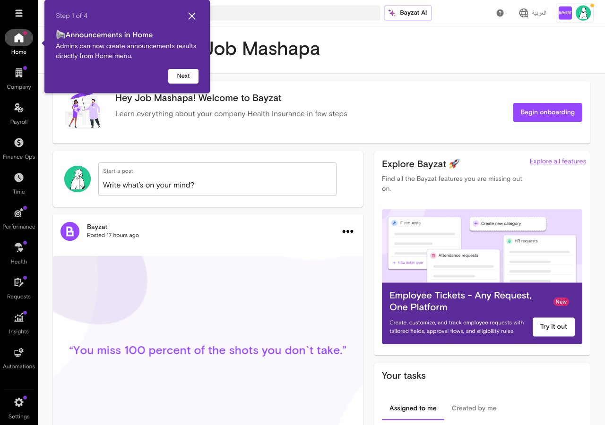
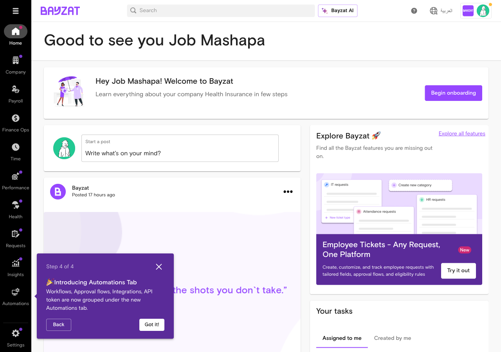
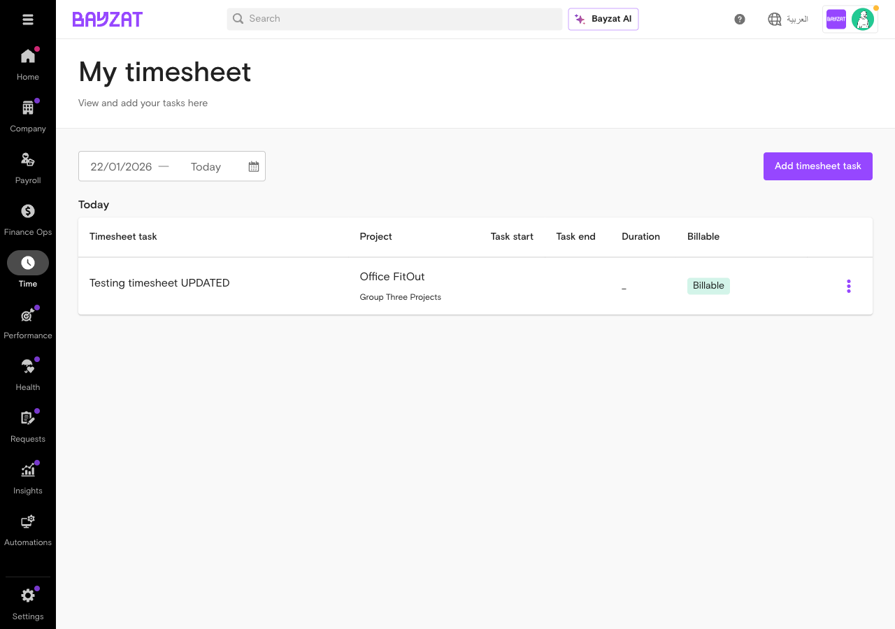
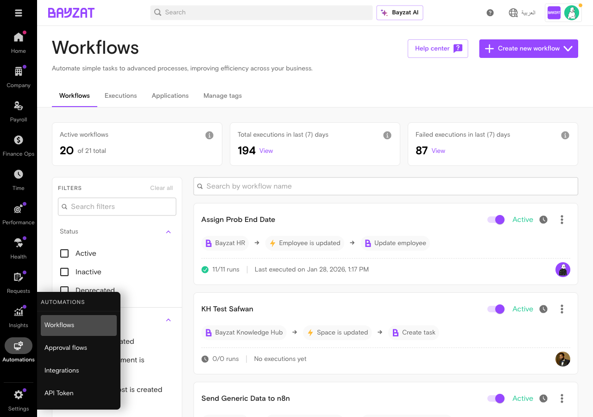

# Validation Report: timesheets

**Generated**: 2026-01-28T21:48:43Z
**Run ID**: 21456322673

## Result

```json
{
  "error": "Could not extract valid JSON from output",
  "raw_length": 1635,
  "json_blocks_found": 0,
  "hint": "The Claude output may not have included a properly formatted JSON result",
  "payload_context": {
    "what_to_watch_out_for": [
      {
        "issue": "Lack of intuitive navigation and filtering in admin panel for time and pay adjustment requests.",
        "limitation": "Users face difficulty locating specific action logs and timestamps; no bulk deletion or mass management of adjustment requests; inability to handle time entries spanning multiple days; lack of filtering by line manager; no configurable approval routing; no admin intervention in timesheet creation/modification; limited UI features for editing and filtering.",
        "workaround": "Manual backend processing required for bulk deletions; employees must manually split shifts spanning midnight; rely on manual follow-ups for approvals and notifications.",
        "jira_reference": "TSSD-3451, TSSD-2086, TSSD-2851, TSSD-4285, TSSD-4398, TSSD-2592, TSSD-3455, TSSD-4949, AV-8967, OS-2033, AV-2350, AV-2343, AV-7730, AV-2200",
        "severity": "High"
      }
    ],
    "what_to_do": [
      {
        "task": "Record and submit timesheets for approval including task creation, time logging, and billable classification.",
        "steps": [
          "Open Bayzat Work Life Platform or Bayzat App and navigate to Timesheets.",
          "Create new tasks for the upcoming period and assign to projects/clients.",
          "Enter task details including descriptions and time spent per activity.",
          "Mark tasks as billable or non-billable as applicable.",
          "Review daily or weekly timesheet entries.",
          "Submit timesheet for approval.",
          "Line manager accesses team timesheet view, reviews entries, and approves or requests changes.",
          "Generate reports for productivity and billability analysis."
        ],
        "expected_outcome": "Timesheets are accurately recorded, submitted, and approved with productivity and compliance metrics tracked. Reports generated reflect billable and non-billable hours by project/client.",
        "source_articles": [
          "14309538480913",
          "23311932155537"
        ]
      }
    ],
    "feature_info": {
      "feature_name": "timesheets",
      "feature_slug": "timesheets",
      "next_version": "v1"
    },
    "detected_integrations": {
      "has_workflows": true,
      "workflow_evidence": "Timesheets submitted for approval and reviewed by line managers; system tracks productivity and compliance metrics; Jira ticket TSSD-3455 indicates lack of configurable approval routing mechanism, implying workflow integration is relevant.",
      "has_approval_flow": true,
      "approval_evidence": "Timesheets require submission for approval and line manager review per PRD; Jira ticket TSSD-3455 highlights lack of hierarchical approval routing; PRD and Zendesk mention submission and approval steps."
    },
    "limitations_count": 1,
    "tasks_count": 1
  },
  "what_to_watch_out_for": [
    {
      "issue": "Lack of intuitive navigation and filtering in admin panel for time and pay adjustment requests.",
      "limitation": "Users face difficulty locating specific action logs and timestamps; no bulk deletion or mass management of adjustment requests; inability to handle time entries spanning multiple days; lack of filtering by line manager; no configurable approval routing; no admin intervention in timesheet creation/modification; limited UI features for editing and filtering.",
      "workaround": "Manual backend processing required for bulk deletions; employees must manually split shifts spanning midnight; rely on manual follow-ups for approvals and notifications.",
      "jira_reference": "TSSD-3451, TSSD-2086, TSSD-2851, TSSD-4285, TSSD-4398, TSSD-2592, TSSD-3455, TSSD-4949, AV-8967, OS-2033, AV-2350, AV-2343, AV-7730, AV-2200",
      "severity": "High"
    }
  ],
  "what_to_do": [
    {
      "task": "Record and submit timesheets for approval including task creation, time logging, and billable classification.",
      "steps": [
        "Open Bayzat Work Life Platform or Bayzat App and navigate to Timesheets.",
        "Create new tasks for the upcoming period and assign to projects/clients.",
        "Enter task details including descriptions and time spent per activity.",
        "Mark tasks as billable or non-billable as applicable.",
        "Review daily or weekly timesheet entries.",
        "Submit timesheet for approval.",
        "Line manager accesses team timesheet view, reviews entries, and approves or requests changes.",
        "Generate reports for productivity and billability analysis."
      ],
      "expected_outcome": "Timesheets are accurately recorded, submitted, and approved with productivity and compliance metrics tracked. Reports generated reflect billable and non-billable hours by project/client.",
      "source_articles": [
        "14309538480913",
        "23311932155537"
      ]
    }
  ]
}```

## Screenshots

### 01 login page 2026 01 28T21 37 30 370Z


### 02 after login 2026 01 28T21 38 38 466Z



### 03 dashboard tour dismissed 2026 01 28T21 39 57 346Z



### 04 time menu opened 2026 01 28T21 41 00 337Z


### 05 time menu reopened 2026 01 28T21 42 08 103Z


### 06 timesheets page loaded 2026 01 28T21 42 33 985Z


### 07 timesheet breakdown view 2026 01 28T21 43 30 506Z


### 08 back to timesheets overview 2026 01 28T21 44 22 520Z


### 09 my timesheet view 2026 01 28T21 45 14 142Z


### 10 my timesheet page 2026 01 28T21 45 31 533Z


### 11 add timesheet task dialog 2026 01 28T21 45 56 738Z


### 12 final my timesheet view 2026 01 28T21 46 21 243Z



### 13 workflows page 2026 01 28T21 46 47 350Z



### 14 approval flows page 2026 01 28T21 47 10 058Z


**Total screenshots captured**: 14
