

# Bayzat Workflows

Automate HR processes with event-driven workflows across your organization

📖 Quick Navigation

<a href="#feature-overview" class="nav-card">✨Feature Overview</a> <a href="#product-foundation" class="nav-card">🏗️Product Foundation</a> <a href="#user-journey" class="nav-card">🗺️User Journey</a> <a href="#feature-discovery" class="nav-card">🔍Feature Discovery</a> <a href="#setup-process" class="nav-card">⚙️Setup Process</a> <a href="#feature-usage" class="nav-card">📋Feature Usage</a> <a href="#troubleshooting" class="nav-card">🔧Troubleshooting</a> <a href="#support-resources" class="nav-card">💬Support Resources</a>

<figure>

<figcaption>Bayzat Workflows management interface with workflow list and status indicators</figcaption>
</figure>

## What is Bayzat Workflows?

### Overview

Bayzat Workflows is a powerful automation engine that connects events across your HR platform to automated actions. When something happens in your organization—an employee joins, a leave request is submitted, a probation period ends—Workflows can automatically trigger notifications, create tasks, update records, or send messages to your team.

### Key Benefits

- Eliminate manual, repetitive HR tasks with intelligent automation
- Connect 60+ event triggers across 13+ Bayzat applications
- Execute actions across 20+ integrations including Email, Slack, and Google Calendar
- Track workflow performance with comprehensive execution logs

### Who Uses This Feature?

| User Role | What They Do | Value Proposition |
|----|----|----|
| **HR Administrators** | Set up organization-wide automation for onboarding, offboarding, and employee lifecycle events | Ensure every new hire receives the right welcome emails, access requests, and training assignments automatically—eliminating dropped tasks and inconsistent onboarding experiences |
| **Payroll Managers** | Automate notifications for salary changes, payroll cycle events, and financial approvals | Keep stakeholders informed of critical payroll events in real-time—rather than manually sending reminders or chasing approvals before deadlines |
| **Department Managers** | Receive automated alerts about team changes, leave requests, and important milestones | Stay informed about your team without constantly checking dashboards—getting the right information pushed to you at the right time |
| **System Administrators** | Configure integrations with external tools like Slack, email systems, and task management platforms | Connect Bayzat to your existing tech stack once and let automations flow—without building custom integrations or maintaining middleware |

## Product Foundation Overview

### How Workflows Fits

Bayzat Workflows is a **powerful automation engine** that connects events across your HR platform to automated actions. With 60+ trigger events across 13+ applications and 20+ action integrations, it eliminates manual, repetitive HR tasks.

**Mental model:** Event occurs (trigger) → System checks conditions → If conditions match → Execute configured actions (email, Slack, task, calendar, etc.) → Log execution for audit.

Properly configured workflows ensure consistent onboarding experiences, timely notifications, and automated task creation without manual intervention.

### Key Decisions Before Setup

Answer these questions before configuring workflows:

- **What events should trigger automation?** — Choose from HR (employee created, updated), Payroll (salary changes), Timeoff (leave requests), or webhooks
- **Who needs to be notified?** — Determine if notifications go to the employee, their manager, HR, or specific roles
- **What conditions should filter execution?** — Consider department, employment type, or custom field criteria
- **Which integrations are needed?** — Email is built-in; Slack and Google Calendar require integration setup

### Related Features

- **Role Management** — Roles serve as criteria filters and action routing targets
- **Employee Records** — Workflows trigger on employee lifecycle events
- **Payroll** — Salary events can trigger notifications and adjustments
- **Time Off** — Leave request events available as triggers
- **Employee Tickets** — Ticket creation and status changes as triggers

### Prerequisites & Requirements

| Requirement | Description | Status |
|----|----|----|
| Administrative Access | Admin-level permissions required to create and manage workflows | Required |
| Configured HR Data | Employee profiles, departments, and organizational structure | Required |
| Email System | Work email addresses configured for employees | Required |
| Slack Workspace | Admin access to generate webhook URLs for Slack integration | Optional |

<figure>

<figcaption>Available trigger applications including Bayzat HR, Payroll, Timeoff, and external webhooks</figcaption>
</figure>

### Available Trigger Applications

| Application | Event Examples |
|----|----|
| **Bayzat HR** | Employee created, updated, hire date, probation end, work week changes |
| **Bayzat Payroll** | Salary created, salary updated |
| **Bayzat Timeoff** | Leave request updated |
| **Bayzat Employee Ticket** | Ticket created, ticket status updated |
| **Incoming Integration** | External webhook triggers from third-party systems |

<figure>

<figcaption>Bayzat HR application showing 20 available trigger events</figcaption>
</figure>

### Available Action Applications

<figure>

<figcaption>20+ action applications available for workflow automation</figcaption>
</figure>

| Application | Action Types |
|----|----|
| **Email** | Send customized email notifications to employees, managers, or custom recipients |
| **Slack** | Send messages to Slack channels via webhook integration |
| **Google Calendar** | Create calendar events automatically |
| **Bayzat Task** | Create tasks assigned to specific employees or roles |
| **Bayzat Payroll** | Create pay adjustment requests (additions or deductions) |
| **Mobile Notification** | Send push notifications to the Bayzat mobile app |

<figure>
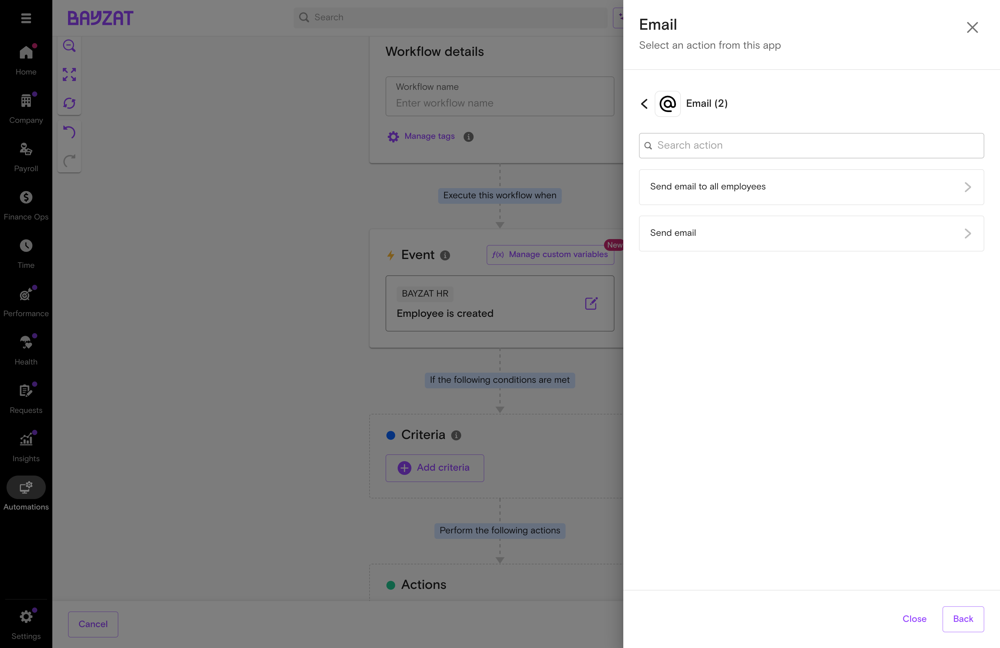
<figcaption>Email action configuration showing notification options</figcaption>
</figure>

<figure>
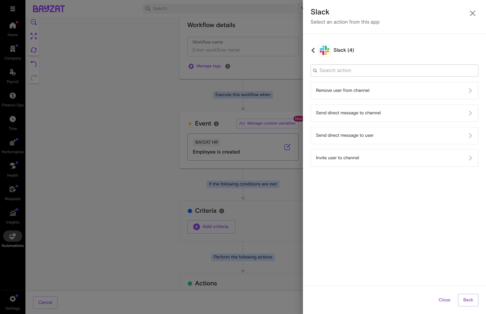
<figcaption>Slack integration with 4 available messaging actions</figcaption>
</figure>

## Complete User Journey Guide

### End-to-End Journey: Bayzat Workflows

From workflow creation through automated execution.

1

#### Access Workflows

Automations → Workflows

<a href="#feature-discovery" class="phase-link">See navigation →</a>

2

#### Create Workflow

Create workflow → From scratch or template

<a href="#setup-process" class="phase-link">See creation →</a>

3

#### Configure Trigger

Select application and event

<a href="#setup-process" class="phase-link">See triggers →</a>

4

#### Add Conditions

Optional criteria filters

<a href="#setup-process" class="phase-link">See conditions →</a>

5

#### Add Actions

Configure workflow actions

<a href="#setup-process" class="phase-link">See actions →</a>

6

#### Activate

Save and activate workflow

<a href="#feature-usage" class="phase-link">See activation →</a>

## Feature Discovery

### How to Access

Workflows is accessed through the Automations section in the main navigation. From here you can view all workflows, create new ones, and monitor execution history.

### Navigation Path

Automations (left sidebar) → Workflows

<figure>
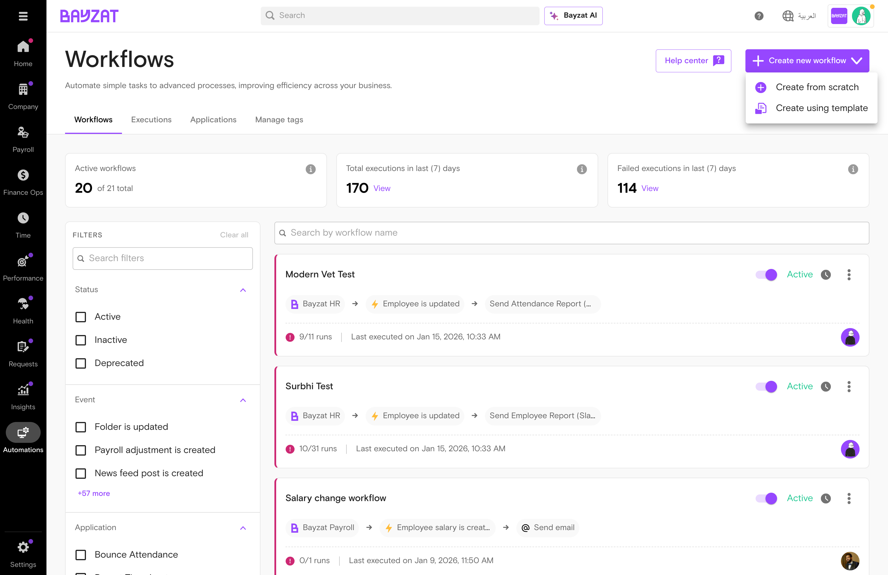
<figcaption>Create workflow options: start from scratch or use a template</figcaption>
</figure>

1

#### View All Workflows

The main Workflows page displays all configured workflows with their status (Active/Inactive), trigger type, and last execution time.

2

#### Create New Workflow

Click the purple "Create workflow" button. Choose "Create from scratch" for custom workflows or "Start from template" to use pre-built configurations.

3

#### Manage Applications

Access the Applications tab to view and configure available trigger sources and action destinations.

<figure>

<figcaption>Applications page displaying available integrations and their status</figcaption>
</figure>

## Using Workflow Templates

### Pre-Built Templates

Bayzat provides ready-to-use workflow templates for common HR automation scenarios. Templates can be customized after selection.

<figure>
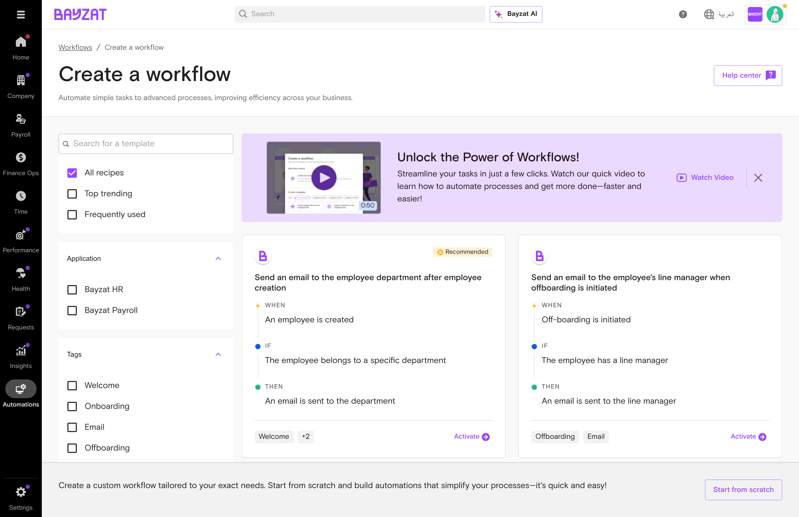
<figcaption>Template library with pre-built workflows for common HR scenarios</figcaption>
</figure>

### Available Templates

- **Welcome Email:** Automatically send welcome emails to new employees on their hire date
- **Probation Reminder:** Notify managers before employee probation periods end
- **Leave Request Notification:** Alert managers when team members submit leave requests
- **Air Tickets Auto Encashment:** Generate encashment requests for air ticket allowances
- **Birthday Notification:** Send birthday greetings to employees

**Tip:** Start with templates to understand workflow structure, then create custom workflows for your specific needs.

## Creating a Workflow

### Step-by-Step Guide

Follow these steps to create a new workflow from scratch.

1

#### Start Creation

Click "Create workflow" → "Create from scratch". Enter a descriptive name for your workflow.

<figure>
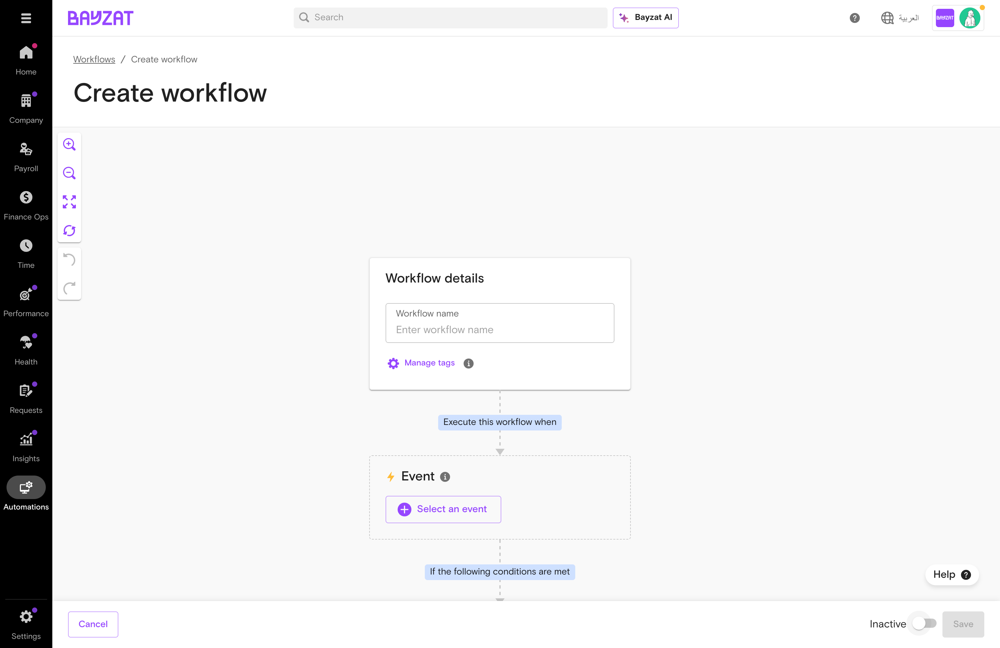
<figcaption>Workflow creation form with name input and trigger/action configuration</figcaption>
</figure>

2

#### Select Trigger Application

Click on the trigger section and select the application that will fire the event. Options include Bayzat HR, Payroll, Timeoff, Employee Ticket, and Incoming Integration.

<figure>
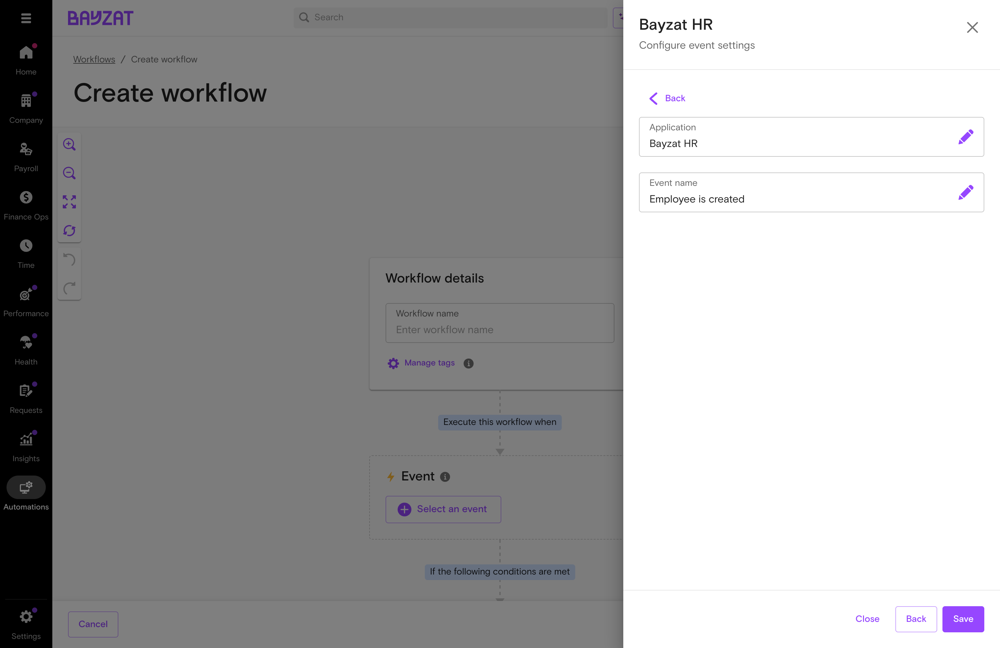
<figcaption>Selecting a trigger application for the workflow</figcaption>
</figure>

3

#### Choose Trigger Event

Select the specific event that will start the workflow. Each application has multiple events to choose from.

4

#### Configure Trigger Conditions

Optionally add conditions to filter when the workflow runs. For example, trigger only for specific departments or employee types.

<figure>

<figcaption>Completed trigger configuration with event and conditions</figcaption>
</figure>

5

#### Add Action

Select an action application (Email, Slack, Task, etc.) and configure the action details. You can add multiple actions to a single workflow.

6

#### Save and Activate

Click Save to create the workflow. Toggle the status to Active to enable the automation.

<figure>

<figcaption>Final workflow configuration ready to save</figcaption>
</figure>

**Account Limits:** Demo and trial accounts may have workflow creation limits. If you see an error about reaching the maximum number of workflows, contact your account manager.

<figure>

<figcaption>Error message when workflow creation limit is reached</figcaption>
</figure>

## Managing Workflows

### Viewing Workflow Details

Click on any workflow to view its complete configuration, execution history, and activity log.

<figure>
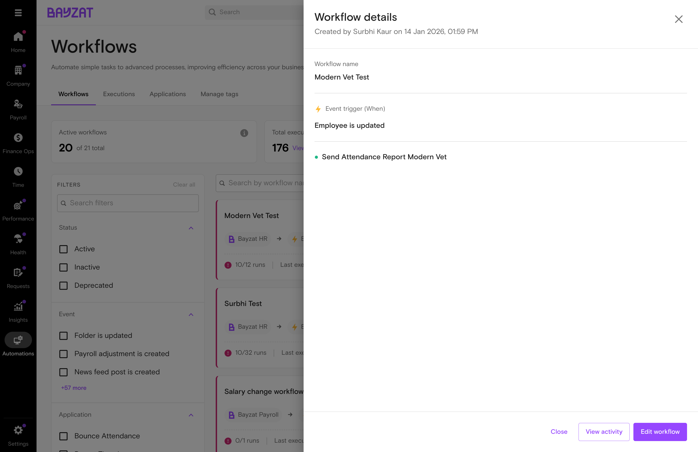
<figcaption>Workflow details showing trigger, conditions, and actions configuration</figcaption>
</figure>

### Workflow Activity

The activity tab shows a timeline of all workflow executions, including successful runs, failures, and in-progress executions.

<figure>

<figcaption>Activity timeline showing workflow execution history</figcaption>
</figure>

### Execution Details

Click on any execution to see detailed information about what happened, including trigger data, action results, and any errors.

<figure>
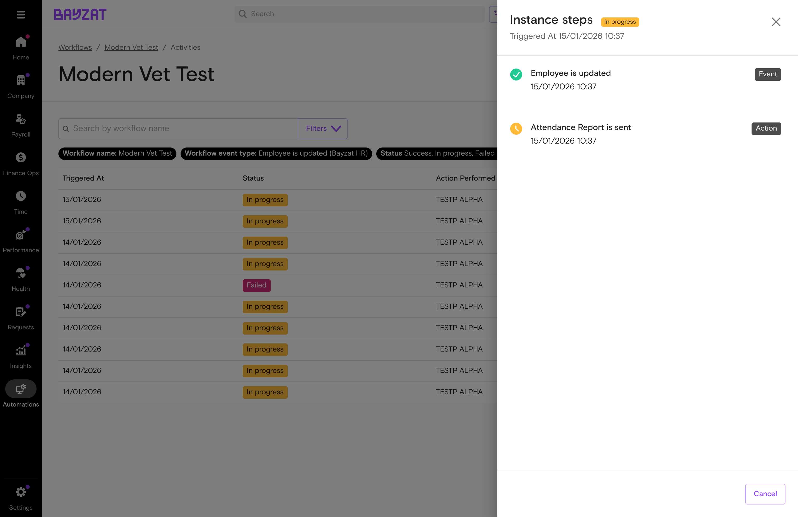
<figcaption>Detailed view of a single workflow execution with action results</figcaption>
</figure>

### Workflow Actions Menu

Use the three-dot menu on any workflow to access quick actions.

<figure>
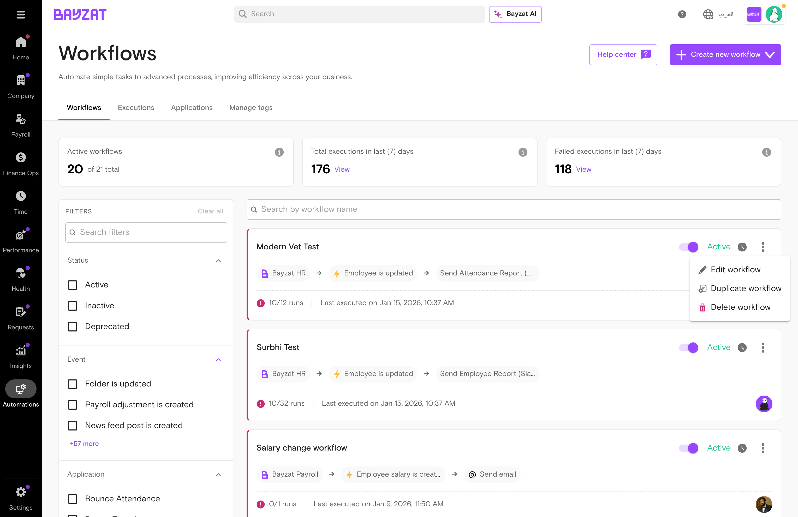
<figcaption>Action menu with Edit, Duplicate, Deactivate, and Delete options</figcaption>
</figure>

| Action | Description |
|----|----|
| **Edit** | Modify workflow name, triggers, conditions, and actions |
| **Duplicate** | Create a copy of the workflow with a new name |
| **Activate/Deactivate** | Toggle workflow status without deleting |
| **Delete** | Permanently remove the workflow |

## Editing Workflows

### Modifying an Existing Workflow

To edit a workflow, click the three-dot menu and select Edit, or click directly on the workflow to open the details panel.

<figure>
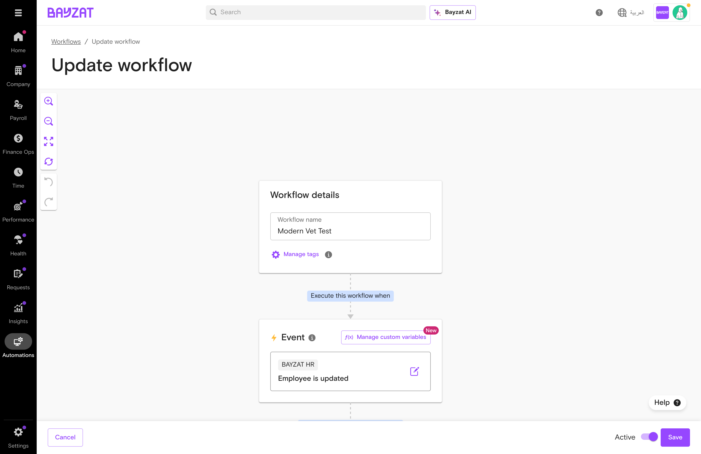
<figcaption>Editing workflow configuration</figcaption>
</figure>

1

#### Make Changes

Update the workflow name, trigger configuration, conditions, or actions as needed.

<figure>

<figcaption>Modifying the workflow name</figcaption>
</figure>

2

#### Save Changes

Click Save to apply your changes. The workflow will continue using the updated configuration for future executions.

<figure>

<figcaption>Workflow name updated and ready to save</figcaption>
</figure>

<figure>

<figcaption>Workflow successfully updated</figcaption>
</figure>

**Note:** Changes to active workflows take effect immediately for future trigger events. Executions already in progress will complete with the original configuration.

## Deactivating and Deleting Workflows

### Deactivating a Workflow

Deactivation pauses a workflow without deleting it. This is useful for temporarily stopping automation or troubleshooting issues.

<figure>

<figcaption>Workflow shown in deactivated state with Inactive badge</figcaption>
</figure>

1

#### Toggle Status

Use the status toggle on the workflow card or select "Deactivate" from the action menu. The workflow will stop executing but remain visible in your list.

2

#### Reactivate When Ready

Toggle the status back to Active to resume automation. The workflow will start executing again for new trigger events.

### Deleting a Workflow

Deletion permanently removes a workflow and its execution history. This action cannot be undone.

**Caution:** Deleting a workflow removes all execution history. Consider deactivating instead if you may need the workflow again.

## Monitoring Executions

### Execution Overview

The Executions tab provides a centralized view of all workflow activity across your organization.

<figure>
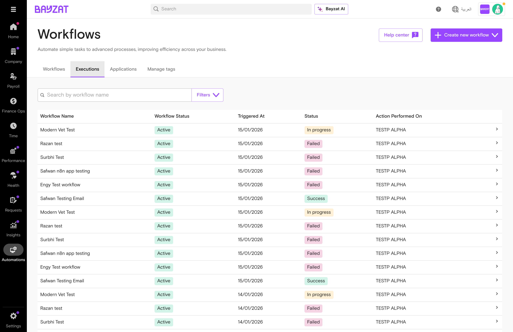
<figcaption>Executions tab showing workflow run history with status indicators</figcaption>
</figure>

### Execution Statuses

| Status | Meaning | Action |
|----|----|----|
| Success | Workflow completed all actions successfully | No action needed |
| In Progress | Workflow is currently executing | Wait for completion |
| Failed | One or more actions failed to execute | Review error details |
| Skipped | Conditions not met, workflow did not run | Verify conditions if unexpected |

## Managing Tags

### Organizing Workflows with Tags

Use tags to categorize and filter workflows. Tags help organize workflows by department, purpose, or any custom classification.

<figure>

<figcaption>Tag management interface for organizing workflows</figcaption>
</figure>

1

#### Create Tags

Click "Manage tags" to create new tags. Enter a tag name and optional color.

2

#### Apply Tags to Workflows

When creating or editing a workflow, select applicable tags from the dropdown.

3

#### Filter by Tags

Use the tag filter on the main Workflows page to view workflows with specific tags.

## Using Variables in Workflows

### What Are Variables?

Variables allow you to insert dynamic data from trigger events into your workflow actions. When a workflow runs, variables are automatically replaced with actual values from the triggering event—such as an employee's name, email, department, or hire date.

<figure>

<figcaption>Workflow builder with the "Manage custom variables" button for accessing variable functions</figcaption>
</figure>

### Two Types of Variables

#### Workflow Variables

Data fields automatically available from the trigger event. For example, when an employee is created, you can access their name, email, department, hire date, and all other employee attributes.

#### Custom Variables

Calculated values created using built-in functions. Combine, transform, or look up data to create new values that aren't directly available from the trigger.

### Using Workflow Variables

Workflow variables are inserted directly into action fields like email subjects, message bodies, and notification content. Click the "Insert Variables" or f(x) button to see available variables.

<figure>
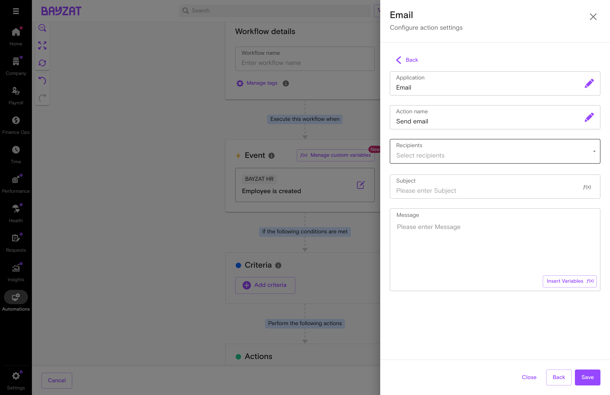
<figcaption>Email action configuration with Insert Variables buttons for Subject and Message fields</figcaption>
</figure>

1

#### Click Insert Variables

In any action field that supports variables, click the "Insert Variables" button (shows f(x) icon) to open the variable selector.

<figure>
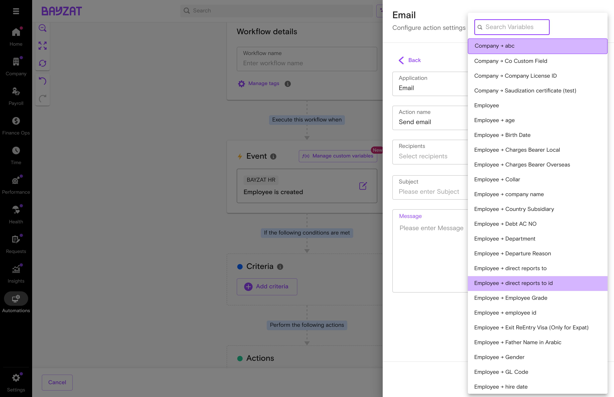
<figcaption>Variable selector showing available Company and Employee data fields from the trigger event</figcaption>
</figure>

2

#### Select a Variable

Choose from the list of available variables. Variables are organized by data source (Company, Employee, etc.). Use the search box to quickly find specific variables.

3

#### Variable Appears as Tag

Selected variables appear as purple tags in the field. When the workflow executes, these tags are replaced with actual values from the triggering event.

<figure>

<figcaption>Employee name variable inserted in the email message, shown as a purple tag</figcaption>
</figure>

### Available Workflow Variables

The variables available depend on the trigger event selected. For example, an "Employee is created" trigger provides access to all employee fields:

| Category | Example Variables |
|----|----|
| **Employee Identity** | name, employee id, identifier, personal email, work email, mobile number |
| **Employee Details** | Birth Date, Gender, Nationality, Marital Status, Name in Arabic |
| **Organization** | company name, Department, position, office, direct reports to |
| **Employment** | hire date, probation end date, status, Employee Grade |
| **Company** | Company License ID, custom company fields |

### Creating Custom Variables with Functions

Custom variables let you transform and calculate new values using built-in functions. Access custom variables by clicking "Manage custom variables" in the Event section.

<figure>

<figcaption>Custom Variables dialog for creating calculated variables</figcaption>
</figure>

### Function Categories

Bayzat provides over 100 functions organized into six categories for creating custom variables:

<figure>

<figcaption>Six function categories: Mathematics, Lookup, Text, Date &amp; Time, Logic, and Operator</figcaption>
</figure>

| Category | Functions | Purpose |
|----|----|----|
| **Mathematics** | 21 functions | Calculations, rounding, percentages, and arithmetic operations |
| **Lookup** | 21 functions | Find data from Bayzat domains (employees, departments, offices, etc.) |
| **Text** | 17 functions | Concatenate, format, trim, and manipulate text strings |
| **Date & Time** | 27 functions | Date calculations, formatting, and time zone conversions |
| **Logic** | 8 functions | IF conditions, AND/OR logic, and conditional values |
| **Operator** | 17 functions | Comparisons, equality checks, and value testing |

### Text Functions

Text functions are commonly used to combine employee data or format strings:

<figure>

<figcaption>Text manipulation functions including CONCAT, UPPER, LOWER, TRIM, and more</figcaption>
</figure>

| Function      | Description                    | Example Use                 |
|---------------|--------------------------------|-----------------------------|
| **CONCAT**    | Combine two strings            | CONCAT(FirstName, LastName) |
| **UPPER**     | Convert to uppercase           | UPPER(department)           |
| **LOWER**     | Convert to lowercase           | LOWER(email)                |
| **PROPER**    | Capitalize each word           | PROPER(name)                |
| **TRIM**      | Remove leading/trailing spaces | TRIM(input)                 |
| **TEXT_JOIN** | Join multiple strings          | TEXT_JOIN(", ", list)       |

### Lookup Functions

Lookup functions retrieve data from other Bayzat records based on identifiers:

<figure>

<figcaption>Lookup functions for retrieving data from Bayzat domains</figcaption>
</figure>

| Function                    | Description                                  |
|-----------------------------|----------------------------------------------|
| **DEPARTMENT_BY_NAME**      | Find department details by department name   |
| **EMPLOYEE_BY_EXTERNAL_ID** | Look up employee by their external system ID |
| **OFFICE_BY_NAME**          | Find office details by office name           |
| **COUNTRY_BY_ID**           | Get country information by country ID        |
| **CURRENCY_BY_ID**          | Get currency details by currency ID          |

### Creating a Custom Variable

Follow these steps to create a custom variable using functions:

1

#### Open Custom Variables

Click "Manage custom variables" next to your trigger event to open the Custom Variables dialog.

2

#### Add Custom Variable

Click "Add custom variable" to start creating a new variable.

3

#### Select a Function

Choose a function category, then select the specific function you want to use.

<figure>

<figcaption>Configuring the CONCAT function with documentation and parameter fields</figcaption>
</figure>

4

#### Configure Function Parameters

Enter values or insert workflow variables into the function parameters. Click the f(x) button to insert variables from the trigger event.

<figure>

<figcaption>Selecting workflow variables to use in function parameters</figcaption>
</figure>

5

#### Name and Save

Give your custom variable a descriptive name and click "Add Variable" to save it. The variable will be available in your workflow actions.

<figure>
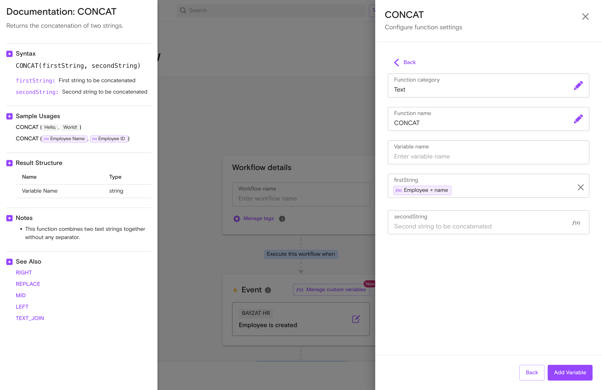
<figcaption>Employee name variable inserted into the CONCAT function parameter</figcaption>
</figure>

**Tip:** Use descriptive names for custom variables like "FullEmployeeName" or "FormattedHireDate" to make them easy to identify when building workflow actions.

### Variable Best Practices

- **Test with sample data:** Before activating, verify variables display correctly in test executions
- **Handle missing values:** Consider what happens if a variable is empty (e.g., employee without a mobile number)
- **Use meaningful names:** Name custom variables clearly so their purpose is obvious
- **Document complex logic:** Add notes to workflows that use multiple custom variables
- **Avoid circular references:** Don't create custom variables that reference each other

## Custom Variables Deep Dive

### Mastering Custom Variables

Custom variables are one of the most powerful features in Bayzat Workflows. They allow you to transform, calculate, and look up data to create values that aren't directly available from trigger events. This section provides a comprehensive guide to help you master custom variables.

<figure>
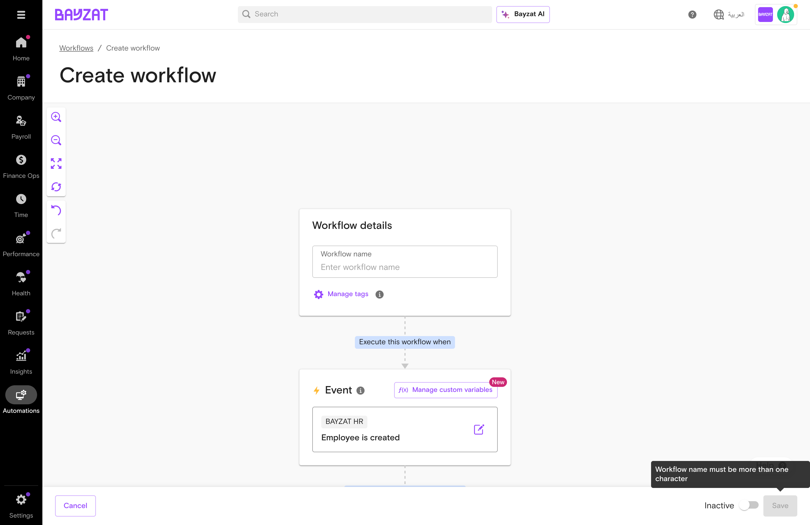
<figcaption>The "Manage custom variables" button appears after selecting a trigger event</figcaption>
</figure>

### Accessing Custom Variables

To create custom variables, you must first configure a trigger for your workflow. Once a trigger is selected, the "Manage custom variables" button appears next to the Event section.

1

#### Select Your Trigger

Choose an application and event that will trigger your workflow. Custom variables are available after the trigger is configured.

<figure>

<figcaption>Select the application that will trigger your workflow</figcaption>
</figure>

<figure>
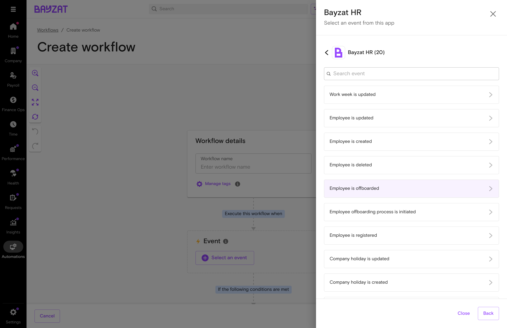
<figcaption>Bayzat HR offers 20 different trigger events for employee lifecycle automation</figcaption>
</figure>

2

#### Click Manage Custom Variables

After selecting your trigger, click the "Manage custom variables" button to open the Custom Variables dialog.

<figure>
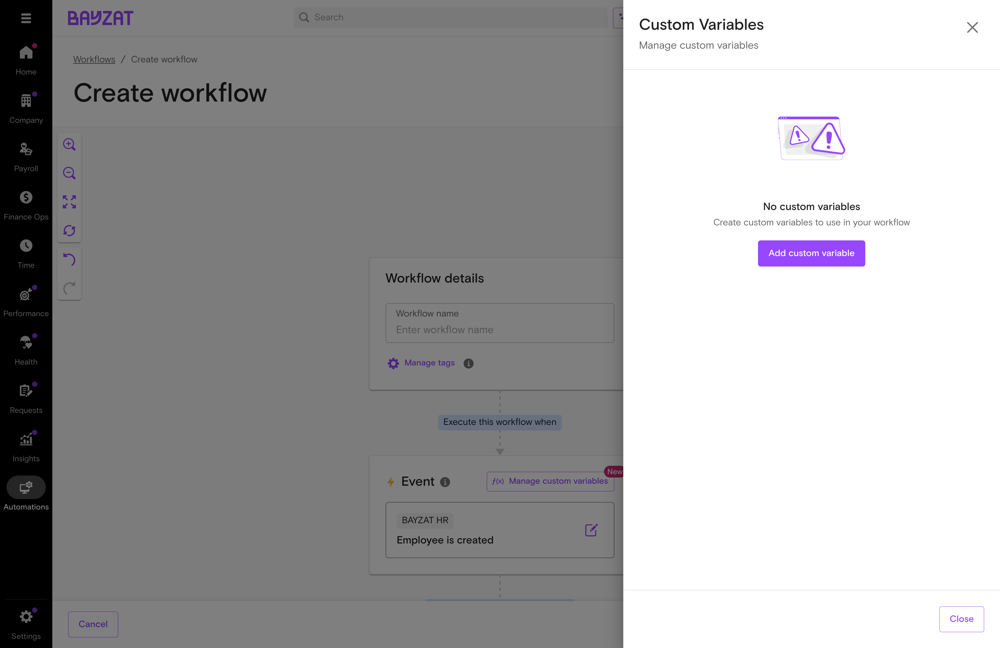
<figcaption>The Custom Variables dialog when no variables have been created yet</figcaption>
</figure>

### Complete Function Reference

Bayzat provides **111 built-in functions** organized into six categories. Each function has detailed documentation including syntax, examples, and notes.

<figure>
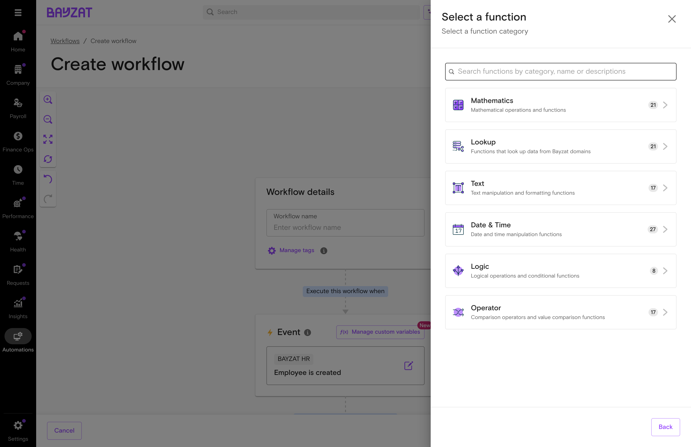
<figcaption>All 111 functions are organized into 6 categories with a search feature</figcaption>
</figure>

#### Mathematics Functions (21 functions)

Perform calculations, rounding, and arithmetic operations on numeric values.

<figure>
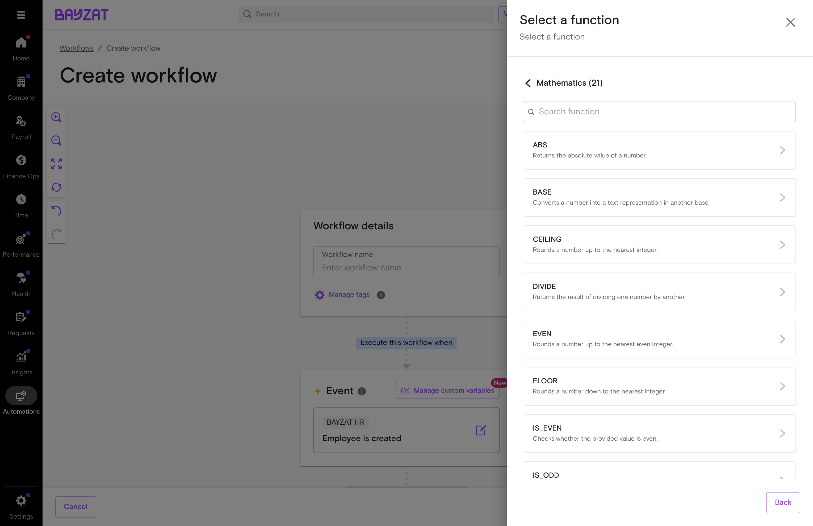
<figcaption>21 mathematics functions for numerical calculations</figcaption>
</figure>

| Function | Description | Example Use Case |
|----|----|----|
| **ABS** | Returns absolute value | Convert negative values to positive |
| **ADD** | Add two numbers | Calculate total allowances |
| **SUBTRACT** | Subtract one number from another | Calculate remaining leave days |
| **MULTIPLY** | Multiply two numbers | Calculate overtime pay (hours × rate) |
| **DIVIDE** | Divide one number by another | Calculate daily rate from monthly salary |
| **ROUND** | Round to specified decimal places | Round calculated amounts to 2 decimals |
| **FLOOR** | Round down to nearest integer | Calculate complete months of service |
| **CEILING** | Round up to nearest integer | Round up partial days for accruals |
| **MOD** | Return remainder after division | Calculate odd/even employee numbers |
| **PERCENTAGE** | Calculate percentage of a value | Calculate bonus as percentage of salary |

<figure>

<figcaption>MULTIPLY function showing syntax, sample usages, and result structure</figcaption>
</figure>

#### Lookup Functions (21 functions)

Retrieve data from Bayzat domains including employees, departments, offices, and more. Lookup functions are essential for cross-referencing data.

<figure>

<figcaption>21 lookup functions for retrieving data from Bayzat domains</figcaption>
</figure>

| Function | Description | Returns |
|----|----|----|
| **DEPARTMENT_BY_ID** | Get department by ID | Department name, manager, parent |
| **DEPARTMENT_BY_NAME** | Find department by name | Department details object |
| **EMPLOYEE_BY_ID** | Get employee by Bayzat ID | Full employee record |
| **EMPLOYEE_BY_EXTERNAL_ID** | Find employee by external system ID | Full employee record |
| **OFFICE_BY_NAME** | Find office by name | Office details |
| **COUNTRY_BY_ID** | Get country information | Country name, code |
| **CURRENCY_BY_ID** | Get currency details | Currency name, symbol, code |
| **SALARY_COMPONENT_BY_ID** | Get salary component details | Component name, type |
| **LEAVE_TYPE_BY_ID** | Get leave type details | Leave type name, policy |
| **TIMEOFF_BALANCE** | Get employee leave balance | Available leave days |

**Data Table Feature:** Lookup functions include a Data Table that shows all valid values from your company data. This helps you understand what values are available and ensures accuracy.

<figure>
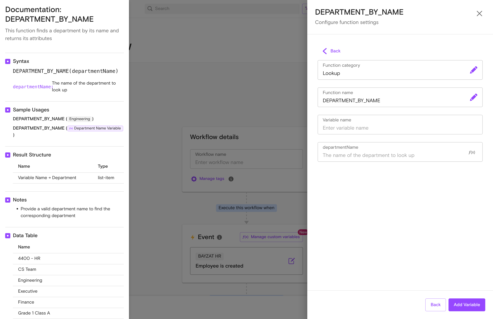
<figcaption>DEPARTMENT_BY_NAME function showing the Data Table with company departments</figcaption>
</figure>

#### Text Functions (17 functions)

Manipulate and format text strings. Essential for creating readable messages and combining data.

<figure>

<figcaption>17 text functions for string manipulation</figcaption>
</figure>

| Function | Description | Example |
|----|----|----|
| **CLEAN** | Remove non-printable characters | Clean imported text data |
| **CONCAT** | Join two strings | CONCAT("Hello ", name) → "Hello John" |
| **FIND** | Find position of substring | Locate "@" in email address |
| **LEFT** | Extract characters from start | Get first name initials |
| **RIGHT** | Extract characters from end | Get last 4 digits of ID |
| **LEN** | Count characters in string | Validate field length |
| **LOWER** | Convert to lowercase | Standardize email addresses |
| **UPPER** | Convert to uppercase | Format department codes |
| **PROPER** | Capitalize first letter of each word | Format employee names |
| **TRIM** | Remove leading/trailing spaces | Clean user input |
| **TEXT_JOIN** | Join multiple values with delimiter | Create comma-separated lists |
| **SUBSTITUTE** | Replace text within string | Update outdated terms |

#### Date & Time Functions (27 functions)

The largest category with 27 functions for date calculations, formatting, and time zone handling.

<figure>

<figcaption>27 date and time functions for temporal calculations</figcaption>
</figure>

| Function | Description | Use Case |
|----|----|----|
| **DATE** | Create date from components | Build specific dates |
| **DATE_ADD** | Add days/months/years to date | Calculate probation end date |
| **DATE_DIFF** | Calculate days between dates | Calculate tenure in days |
| **DATE_FORMAT** | Format date for display | Format as "January 15, 2026" |
| **YEAR** | Extract year from date | Get hire year |
| **MONTH** | Extract month from date | Identify birth month |
| **DAY** | Extract day from date | Get day of month |
| **WEEKDAY** | Get day of week (1-7) | Check if weekend |
| **TODAY** | Get current date | Compare with hire date |
| **NOW** | Get current date and time | Timestamp for logging |
| **WORKDAYS** | Calculate working days between dates | Calculate business days |
| **EOMONTH** | Get end of month date | Calculate payroll cutoff |

#### Logic Functions (8 functions)

Create conditional logic and decision-based calculations.

<figure>

<figcaption>8 logic functions for conditional calculations</figcaption>
</figure>

| Function | Description | Example |
|----|----|----|
| **AND** | Returns true if all conditions true | Check multiple criteria |
| **OR** | Returns true if any condition true | Check alternative conditions |
| **NOT** | Reverses boolean value | Negate a condition |
| **IF_DATE** | Conditional based on date comparison | Different message before/after date |
| **IF_NUMBER** | Conditional based on numeric comparison | Different action based on salary range |
| **IF_TEXT** | Conditional based on text comparison | Different message by department |
| **IF_BOOLEAN** | Conditional based on true/false | Check if employee is active |
| **SWITCH** | Multiple condition matching | Map status codes to labels |

#### Operator Functions (17 functions)

Compare values and test conditions. Essential for building workflow conditions.

<figure>

<figcaption>17 operator functions for comparisons and testing</figcaption>
</figure>

| Function         | Description                      | Returns       |
|------------------|----------------------------------|---------------|
| **EQ_NUMBER**    | Check if numbers are equal       | TRUE or FALSE |
| **EQ_TEXT**      | Check if texts are equal         | TRUE or FALSE |
| **EQ_DATE**      | Check if dates are equal         | TRUE or FALSE |
| **GT_NUMBER**    | Check if first number is greater | TRUE or FALSE |
| **GT_DATE**      | Check if first date is later     | TRUE or FALSE |
| **LT_NUMBER**    | Check if first number is less    | TRUE or FALSE |
| **LT_DATE**      | Check if first date is earlier   | TRUE or FALSE |
| **IS_EMPTY**     | Check if value is empty          | TRUE or FALSE |
| **IS_NOT_EMPTY** | Check if value has content       | TRUE or FALSE |
| **CONTAINS**     | Check if text contains substring | TRUE or FALSE |

### Step-by-Step: Creating Your First Custom Variable

Let's walk through creating a custom variable that calculates an employee's age multiplied by 2 (a simple example to demonstrate the concept).

1

#### Open the Custom Variables Dialog

After configuring your trigger, click "Manage custom variables" to open the dialog.

2

#### Click "Add custom variable"

This opens the function selection panel where you can browse or search for functions.

<figure>

<figcaption>Browse function categories or use the search box to find specific functions</figcaption>
</figure>

3

#### Select a Function

For this example, select "Mathematics" category, then choose the "MULTIPLY" function.

4

#### Review Function Documentation

The function configuration panel shows complete documentation including syntax, sample usages, result structure, and notes.

5

#### Configure Parameters

Enter values or click the f(x) button to insert workflow variables. For MULTIPLY, you need two parameters.

<figure>

<figcaption>Click f(x) to see available workflow variables from the trigger event</figcaption>
</figure>

6

#### Insert Variables as Parameters

Select a variable like "Employee → age" to insert it. Variables appear as purple tags.

<figure>

<figcaption>The "Employee → age" variable inserted into the MULTIPLY function parameter</figcaption>
</figure>

7

#### Name and Save

Give your custom variable a descriptive name and click "Add Variable" to save it.

**Pro Tip:** Use the search box at the top of the function categories to quickly find functions. For example, searching "date" will show all date-related functions across categories.

## Use Case Identification Guide

### How to Identify Workflow Opportunities

This guide helps you identify automation opportunities by understanding the trigger events available and matching them to your business needs.

**Key Principle:** If you find yourself thinking "I wish the system would automatically do X when Y happens," that's a workflow opportunity. The trigger is "Y happens" and the action is "do X."

### Available Trigger Applications

Bayzat Workflows supports **13 applications** as trigger sources, with over 61 unique events across them.

<figure>

<figcaption>13 applications available as workflow trigger sources</figcaption>
</figure>

### Bayzat Payroll Triggers (10 Events)

Automate notifications and processes around salary and payroll changes.

<figure>
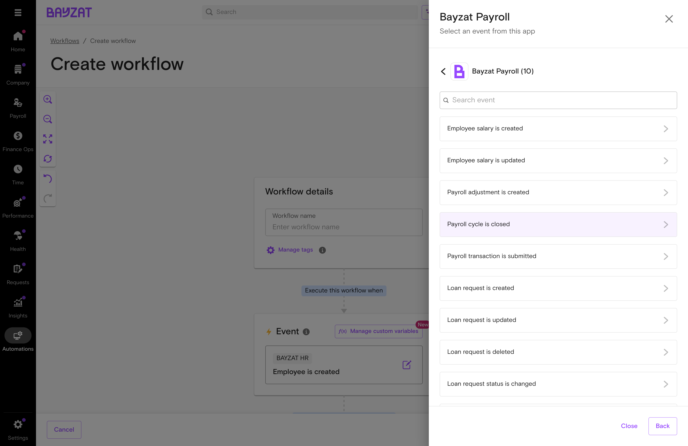
<figcaption>10 payroll-related trigger events</figcaption>
</figure>

| Event | When It Fires | Automation Opportunity |
|----|----|----|
| **Salary is created** | New salary record added for employee | Send welcome package with compensation details |
| **Salary is updated** | Existing salary modified | Notify employee and update records |
| **Loan is created** | New employee loan added | Generate acknowledgment and repayment schedule |
| **Loan is updated** | Loan terms modified | Notify employee of changes |
| **Pay adjustment created** | Bonus, deduction, or allowance added | Approval notification to finance |
| **Pay adjustment updated** | Adjustment modified | Update tracking and notify stakeholders |
| **Payroll cycle runs** | Monthly/weekly payroll processed | Send payslip availability notifications |
| **EOS calculation** | End of service benefits calculated | Notify HR and finance for review |

#### Example Use Cases for Payroll

- Automatically notify managers when team member salaries change
- Send congratulations email when salary increases are processed
- Alert finance team when large pay adjustments are created
- Create tasks for payroll review when EOS is calculated
- Notify employees when their loan payments are processed

### Bayzat Timeoff Triggers (3 Events)

Streamline leave management and keep managers informed.

<figure>
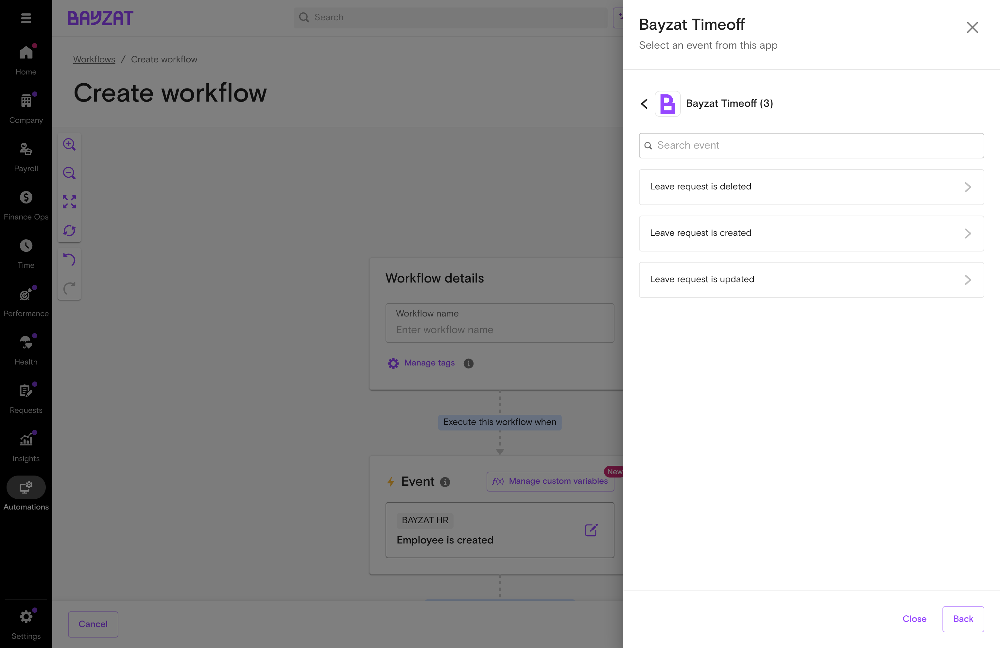
<figcaption>3 timeoff-related trigger events</figcaption>
</figure>

| Event | When It Fires | Automation Opportunity |
|----|----|----|
| **Leave request is created** | Employee submits new leave request | Immediate notification to manager |
| **Leave request is updated** | Request status changes (approved/rejected) | Notify employee and update calendar |
| **Leave balance changes** | Available leave days modified | Notify employee of balance update |

#### Example Use Cases for Timeoff

- Send push notification to managers for pending leave approvals
- Create calendar events when leave is approved
- Notify HR when emergency leave is requested
- Alert employees when their leave balance falls below threshold
- Send reminder to complete handover when leave is approaching

### Bayzat Attendance Triggers (6 Events)

Monitor attendance patterns and shift assignments.

<figure>
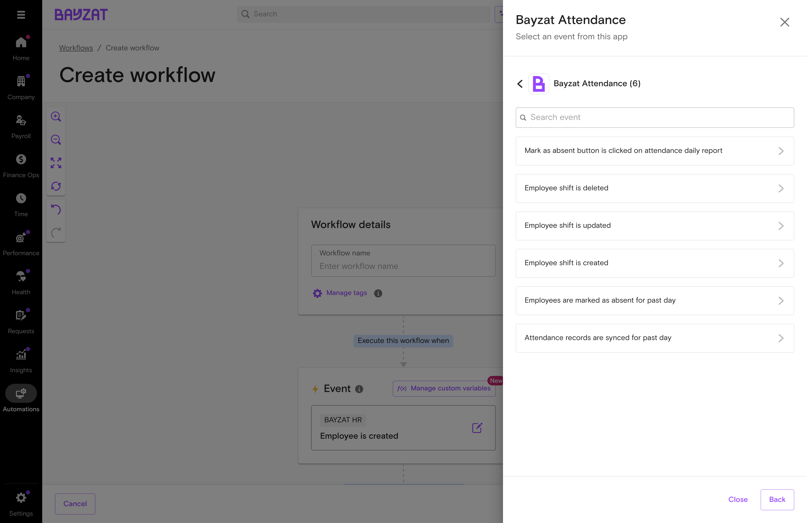
<figcaption>6 attendance-related trigger events</figcaption>
</figure>

| Event | When It Fires | Automation Opportunity |
|----|----|----|
| **Shift is created** | New shift schedule assigned | Notify employee of their schedule |
| **Shift is updated** | Shift timing or assignment changed | Alert employee of schedule change |
| **Attendance recorded** | Employee clocks in/out | Log attendance for reporting |
| **Late arrival detected** | Employee arrives after shift start | Notify manager of tardiness |
| **Early departure detected** | Employee leaves before shift end | Alert HR for follow-up |
| **Absence detected** | Employee missing without leave | Escalate to manager immediately |

#### Example Use Cases for Attendance

- Send automatic reminder when shift starts in 30 minutes
- Alert managers when employees are absent without notice
- Create tasks for HR to follow up on attendance issues
- Notify employees when their shifts are modified
- Generate weekly attendance summary for department heads

### Decision Framework: Is This a Workflow Candidate?

Use this checklist to determine if a process can be automated with Bayzat Workflows:

| Question | If Yes | If No |
|----|----|----|
| Does this process start when something specific happens? | Good candidate - identify the trigger event | May need scheduled reports instead |
| Is the action consistent every time? | Perfect for automation | Consider if conditions can handle variations |
| Does it involve notifying someone? | Email/Slack/Push notification actions | Consider other action types |
| Does it happen frequently? | High ROI for automation | Still valuable for consistency |
| Is timing critical? | Workflows execute immediately | Automation ensures nothing is missed |
| Are there multiple stakeholders? | Add multiple actions to one workflow | Single notification still valuable |

### Common Automation Patterns

#### Pattern 1: Lifecycle Notifications

**When:** Key employee milestones occur

**Triggers:** Hire date, probation end, work anniversary, birthday

**Actions:** Send congratulations, remind managers, create celebration tasks

#### Pattern 2: Approval Alerts

**When:** Items need manager attention

**Triggers:** Leave request created, expense submitted, ticket created

**Actions:** Push notification to approver, email with details, Slack message

#### Pattern 3: Compliance Reminders

**When:** Deadlines are approaching

**Triggers:** Visa expiry, contract end, certification renewal

**Actions:** Email reminders at intervals, create HR tasks, notify employee

#### Pattern 4: Data Synchronization

**When:** Information needs to flow to other systems

**Triggers:** Employee created/updated, salary changed, department changed

**Actions:** Webhook to external systems, create calendar events, update tasks

#### Pattern 5: Exception Handling

**When:** Something unexpected happens

**Triggers:** Late arrival, absence, failed approval, error detected

**Actions:** Alert managers, escalate to HR, create investigation tasks

### Getting Started: Your First 5 Workflows

If you're new to Bayzat Workflows, start with these high-value, low-complexity automations:

1.  **New Employee Welcome:** Trigger: Employee hire date → Action: Send welcome email
2.  **Leave Request Alert:** Trigger: Leave request created → Action: Push notification to manager
3.  **Birthday Celebration:** Trigger: Employee birthday → Action: Send birthday greeting
4.  **Probation Reminder:** Trigger: Probation end date (7 days before) → Action: Email to manager and HR
5.  **Salary Change Notification:** Trigger: Salary updated → Action: Email confirmation to employee

**Start Simple:** Begin with single-action workflows to understand how they work. Add complexity (conditions, custom variables, multiple actions) as you become more comfortable with the system.

## Real-World Workflow Examples

### Common Automation Scenarios

The following examples demonstrate practical workflow implementations:

#### Example 1: New Employee Welcome Email

**Scenario:** Automatically send a welcome email to new employees on their hire date.

|               |                                                        |
|---------------|--------------------------------------------------------|
| **Trigger**   | Bayzat HR → Employee hire date                         |
| **Condition** | None (fires for all new hires)                         |
| **Action**    | Email → Send welcome email with onboarding information |

#### Example 2: Manager Notification for Leave Requests

**Scenario:** Notify managers when team members submit leave requests.

|  |  |
|----|----|
| **Trigger** | Bayzat Timeoff → Leave request updated |
| **Condition** | Status = Pending |
| **Action** | Mobile Notification → Send push notification to line manager |

#### Example 3: Probation End Reminder

**Scenario:** Remind HR and managers before employee probation periods end.

|               |                                              |
|---------------|----------------------------------------------|
| **Trigger**   | Bayzat HR → Employee probation end date      |
| **Condition** | Days before = 7                              |
| **Action**    | Email → Send reminder to HR and line manager |

#### Example 4: Ticket Approval to Payroll

**Scenario:** Automatically create payroll adjustments when expense tickets are approved.

|               |                                                |
|---------------|------------------------------------------------|
| **Trigger**   | Bayzat Employee Ticket → Ticket status updated |
| **Condition** | Status = Approved                              |
| **Action**    | Bayzat Payroll → Create pay adjustment request |

## Business Rules & Limitations

### Core Business Rules

| Rule | Description | Impact |
|----|----|----|
| Admin access required | Only administrators can create and manage workflows | Request access from system admin |
| Account workflow limits | Demo/trial accounts may have maximum workflow counts | Contact account manager for upgrades |
| Trigger-action mapping | Each workflow requires one trigger and at least one action | Cannot save workflow without both |
| Immediate effect | Active workflows execute immediately when triggered | Test in inactive state first |

### System Constraints

- Workflows execute in real-time when trigger events occur
- Slack integration requires webhook URL configuration in your Slack workspace
- Email actions require employees to have valid email addresses configured
- Payroll actions require the Payroll module to be active
- Deleted workflows cannot be recovered

## Troubleshooting & Edge Cases

### Common Issues

| Issue | Cause | Resolution |
|----|----|----|
| Workflow not executing | Workflow is inactive or conditions not met | Verify status is Active and check conditions |
| Cannot create workflow | Account limit reached | Delete unused workflows or contact support |
| Email not received | Invalid email address or spam filter | Verify employee email, check spam folder |
| Slack message failed | Invalid webhook URL or channel permissions | Regenerate webhook URL in Slack admin |
| Action shows failed | Missing required data or integration error | Check execution details for error message |

### Known Limitations

**No Undo for Executions:** Once a workflow executes, actions cannot be reversed automatically. For example, sent emails cannot be recalled.

**Sequential Actions:** Actions in a workflow execute in sequence. If one action fails, subsequent actions may not execute.

### Edge Cases

- **Duplicate triggers:** If an employee record is updated multiple times quickly, the workflow may execute multiple times
- **Circular workflows:** Avoid creating workflows that trigger each other in loops
- **Historical data:** Workflows only trigger on new events, not historical data

## Support Resources

### Frequently Asked Questions

How do I test a workflow before activating?

Create the workflow in inactive state, review the configuration, then manually trigger a test event in a non-production context. Activate once confirmed working.

Can I have multiple triggers for one workflow?

No, each workflow has exactly one trigger. To respond to multiple events, create separate workflows with the same actions.

How do I connect Slack to workflows?

Generate an Incoming Webhook URL in your Slack workspace settings, then configure it in the Slack action when creating your workflow.

Why is my workflow showing as failed?

Click on the failed execution to see detailed error information. Common causes include missing employee data, invalid email addresses, or integration configuration issues.

Can I schedule workflows to run at specific times?

Workflows are event-driven, not time-based. However, some triggers like "hire date" or "probation end" can be configured to fire a certain number of days before/after the date.

### Getting Help

- Contact your System Administrator for workflow configuration support
- Bayzat Support Team - Available for technical issues and integration help
- Knowledge Base - Access additional articles and workflow examples
- In-app Help - Contextual help available within the Bayzat platform

## Glossary of Terms

| Term | Definition |
|----|----|
| **Workflow** | An automated sequence that executes actions when triggered by specific events. |
| **Trigger** | The event that starts a workflow execution (e.g., employee created, leave request submitted). |
| **Action** | What the workflow does when triggered (e.g., send email, create task, post to Slack). |
| **Condition** | Optional criteria that filter when a workflow executes based on data values. |
| **Execution** | A single run of a workflow from trigger to action completion. |
| **Active Status** | Workflow is enabled and will execute when triggered. |
| **Inactive Status** | Workflow is paused and will not execute even when trigger events occur. |
| **Webhook** | A URL endpoint that receives data from external systems to trigger workflows. |
| **Template** | Pre-built workflow configuration that can be customized for your organization. |
| **Tag** | A label used to categorize and filter workflows for easier management. |
| **Variable** | Data fields automatically sourced from trigger events (e.g., employee name, department) that can be dynamically inserted into workflow actions. |
| **Custom Variable** | User-created calculated values that utilize built-in functions to transform or combine data from trigger variables. |
| **Variable Tag** | Purple indicators in the action editor representing dynamic data placeholders that will be replaced with actual values at execution time. |
| **Function** | Built-in operations for manipulating, calculating, or transforming data within workflows. Functions are used to create custom variables. |
| **Mathematics Functions** | Functions for numerical calculations including ADD, SUBTRACT, MULTIPLY, DIVIDE, ROUND, and more (21 total functions). |
| **Lookup Functions** | Functions for cross-referencing data such as EMPLOYEE_BY_ID, DEPARTMENT_BY_NAME, and MANAGER_OF (21 total functions). |
| **Text Functions** | Functions for string manipulation including CONCAT, UPPER, LOWER, TRIM, and SUBSTRING (17 total functions). |
| **Date & Time Functions** | Functions for temporal calculations including DATE_DIFF, DATE_FORMAT, ADD_DAYS, and NOW (27 total functions). |
| **Logic Functions** | Functions for conditional operations including IF_TEXT, IF_NUMBER, SWITCH, and AND/OR logic (8 total functions). |
| **Operator Functions** | Functions for comparison checks including EQ_NUMBER, GT_DATE, IS_EMPTY, and CONTAINS (17 total functions). |

Generated by Bayzat Documentation System

Last updated: 2026-01-15
